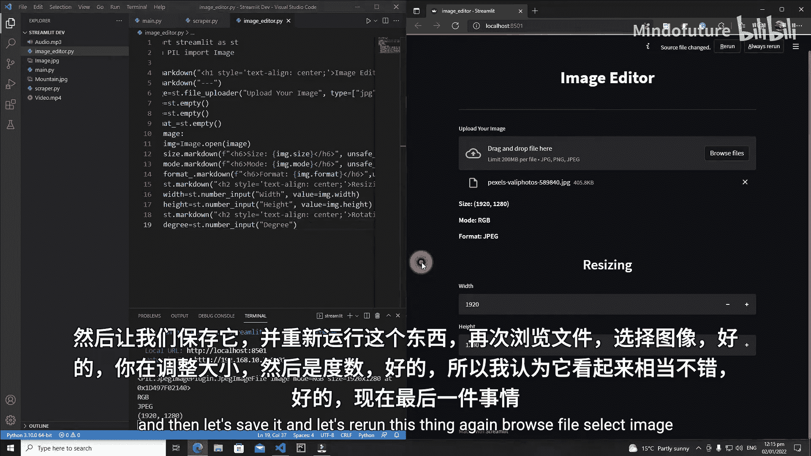
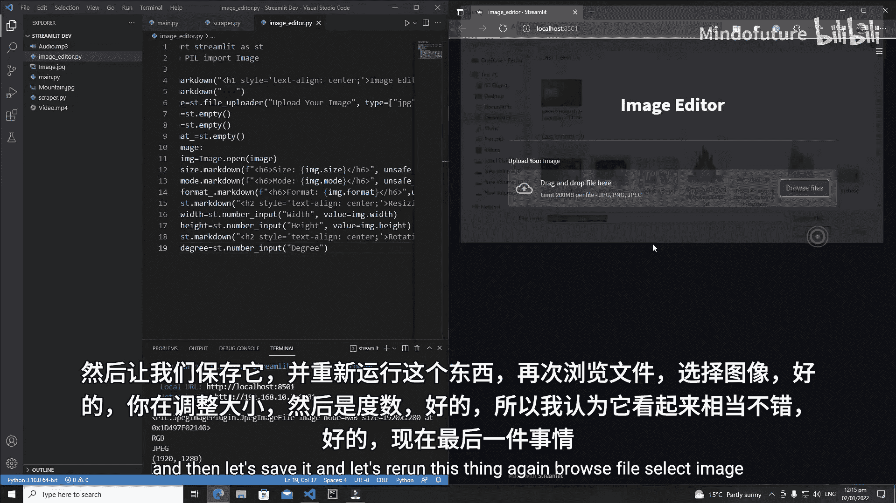
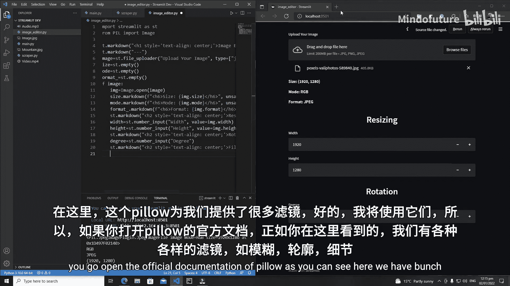
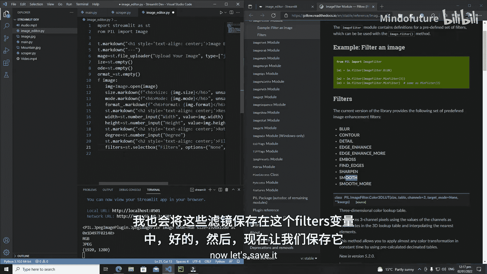
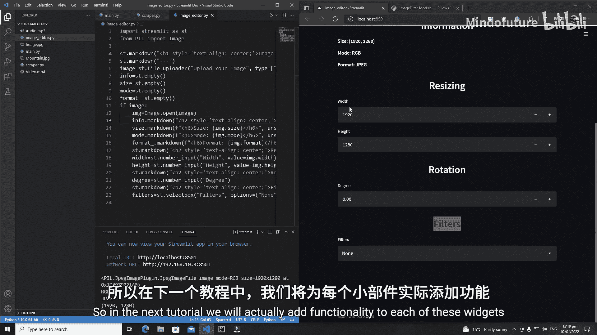

# 023：Streamlit 图像编辑器 - 添加控件

在本节课中，我们将为图像编辑器添加调整大小、旋转和滤镜功能。我们将学习如何使用 Streamlit 的输入控件来获取用户参数，并准备好在后续课程中应用这些参数。

## 概述

我们将分步构建图像编辑器的用户界面。首先，我们会添加一个用于调整图像大小的区域，允许用户输入新的宽度和高度。接着，我们会添加一个用于旋转图像的区域。最后，我们将添加一个滤镜选择器，让用户可以为图像应用不同的视觉效果。

## 添加调整大小控件

上一节我们完成了图像上传和显示的基础功能。本节中，我们来看看如何让用户调整图像尺寸。

首先，我们使用 Markdown 添加一个标题，并将其居中显示。

```python
st.markdown("<h2 style='text-align: center;'>Resizing</h2>", unsafe_allow_html=True)
```

接下来，我们需要让用户输入新的宽度和高度。我们将使用 `st.number_input` 控件来获取数值。

以下是创建宽度和高度输入框的代码：

```python
width = st.number_input("Width")
height = st.number_input("Height")
```

保存并运行后，界面会显示两个输入框，但初始值为0。为了提供更好的用户体验，我们希望输入框的初始值显示为当前上传图像的原始尺寸。

我们可以使用 Pillow 库来获取图像的原始宽度和高度，并将其设置为输入框的默认值。

```python
# 假设 img 是已打开的 Pillow 图像对象
width = st.number_input("Width", value=img.width)
height = st.number_input("Height", value=img.height)
```

现在，当用户上传图像后，宽度和高度输入框会自动填充该图像的原始尺寸，用户可以通过加减按钮来调整数值。

## 添加旋转控件

完成了尺寸调整功能后，现在我们来添加图像旋转功能。

我们同样先添加一个居中的标题。



```python
st.markdown("<h2 style='text-align: center;'>Rotation</h2>", unsafe_allow_html=True)
```

然后，添加一个数字输入框，让用户输入旋转角度（以度为单位）。

```python
degree = st.number_input("Degrees")
```

这样，用户界面就拥有了一个用于输入旋转角度的控件。

## 添加滤镜控件





最后，我们为编辑器添加滤镜功能。Pillow 库提供了多种内置的图像滤镜，如模糊、轮廓、细节增强等。

首先，添加滤镜部分的标题。

```python
st.markdown("<h2 style='text-align: center;'>Filters</h2>", unsafe_allow_html=True)
```

接着，我们使用 `st.selectbox` 控件创建一个下拉选择框，列出可用的滤镜选项。

```python
filters = st.selectbox("Filters", options=["None", "Blur", "Detail", "Emboss", "Smooth"])
```

这里我们提供了“无”、模糊、细节、浮雕和平滑几种滤镜选项。用户可以从下拉列表中选择他们想要应用的滤镜。

## 优化界面布局

在添加了所有控件后，界面可能显得有些拥挤。为了提升可读性，我们可以在最上方添加一个“信息”标题，并使用 `st.empty()` 创建一个占位符来更好地组织内容区域。

```python
info = st.empty()
info.markdown("<h2 style='text-align: center;'>Information</h2>", unsafe_allow_html=True)
# 之后的其他控件代码放在这里
```



这样，界面结构就变得更加清晰：顶部是信息区，下方依次是调整大小、旋转和滤镜控件。

## 总结

本节课中我们一起学习了如何扩展 Streamlit 图像编辑器的用户界面。我们成功添加了三个核心功能区域：
1.  **调整大小**：使用 `st.number_input` 获取目标宽度和高度，并智能地以原图尺寸作为默认值。
2.  **旋转**：添加了用于输入旋转角度的控件。
3.  **滤镜**：利用 `st.selectbox` 提供了多种图像滤镜选项供用户选择。



目前，这些控件已经就绪并显示在界面上。在下一节课中，我们将为这些控件添加实际的图像处理逻辑，使用户的输入能够真正改变所显示的图像。