# 024：Streamlit 图像编辑器

在本节课中，我们将为之前创建的图像编辑器界面中的各个控件添加实际功能。我们将实现图像的大小调整、旋转以及滤镜应用，并最终在应用中展示处理后的图像。

## 概述

我们将创建一个“提交”按钮，当用户点击它时，程序会读取所有控件的当前值（宽度、高度、旋转角度、滤镜），对上传的图像依次应用这些操作，并将最终结果显示在网页上。

## 实现提交按钮与图像处理

上一节我们创建了用于调整图像宽度、高度、旋转角度和滤镜的下拉菜单。本节中，我们来看看如何将这些设置应用到图像上。

首先，我们需要创建一个“提交”按钮。当用户点击此按钮时，程序将开始处理图像。

以下是创建按钮并检查其点击状态的代码：

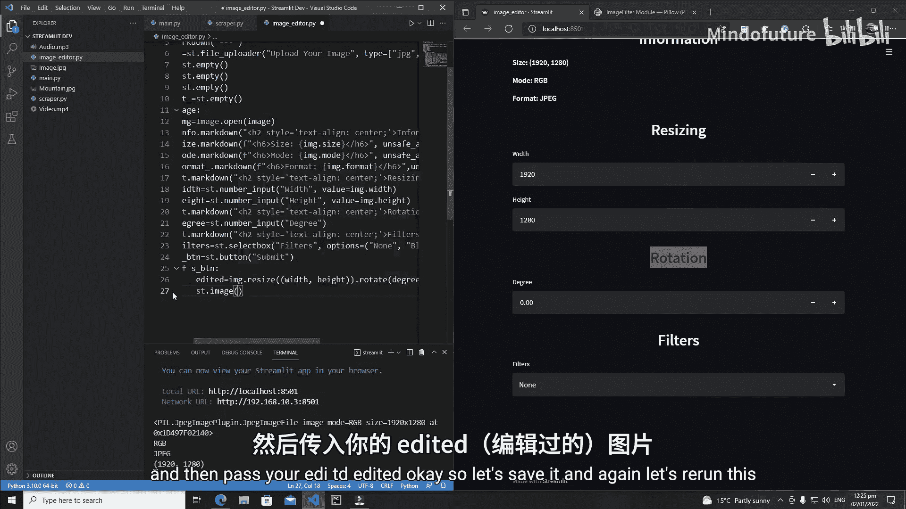

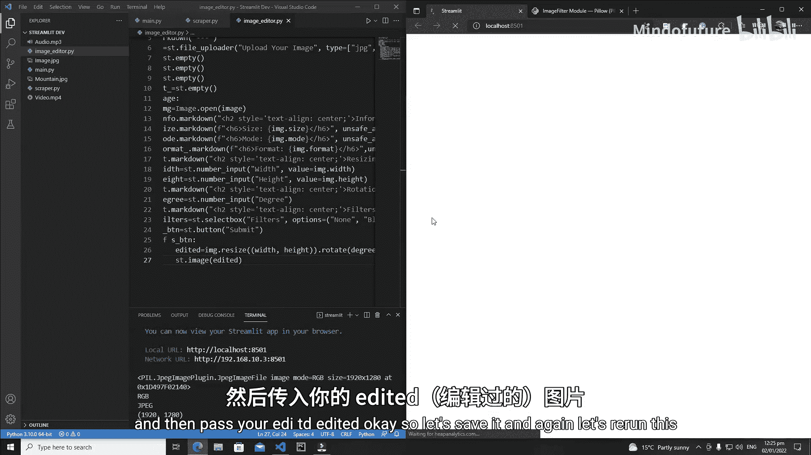

```python
s_b = st.button('Submit')
```

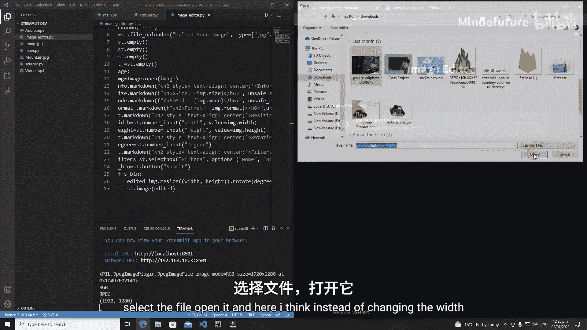

接下来，我们需要在按钮被点击后执行图像处理逻辑。我们将使用 `Pillow` 库来操作图像。

```python
if s_b:
    # 处理图像
```

在 `if` 语句内部，我们将首先应用图像的尺寸调整和旋转操作。

```python
    edited = image.resize((width, height)).rotate(degree)
```

这行代码做了两件事：
1.  `image.resize((width, height))`：将图像调整为指定的宽度和高度。
2.  `.rotate(degree)`：将图像旋转指定的角度。

处理完成后，我们使用 `st.image()` 函数来显示编辑后的图像。

```python
    st.image(edited)
```

现在，运行程序并上传一张图片。调整旋转角度为180度，然后点击“提交”按钮，可以看到图像成功旋转。

## 添加滤镜功能

图像的基本调整功能已经实现。现在，我们来为下拉菜单中的滤镜选项添加功能。

我们需要检查用户是否选择了滤镜。如果选择了“无”，则不应用任何滤镜；否则，根据选择应用对应的滤镜。

首先，需要从 `PIL` 库中导入滤镜模块。

```python
from PIL.ImageFilter import *
```

然后，在处理逻辑中，在应用尺寸和旋转之后，添加滤镜判断逻辑。

```python
    # 初始化 filtered_image 为仅经过尺寸和旋转处理的图像
    filtered_image = edited

    # 检查并应用滤镜
    if filters != 'None':
        if filters == 'Blur':
            filtered_image = edited.filter(BLUR)
        elif filters == 'Detail':
            filtered_image = edited.filter(DETAIL)
        elif filters == 'Smooth':
            filtered_image = edited.filter(SMOOTH)
        # 可以根据需要添加更多滤镜条件
```

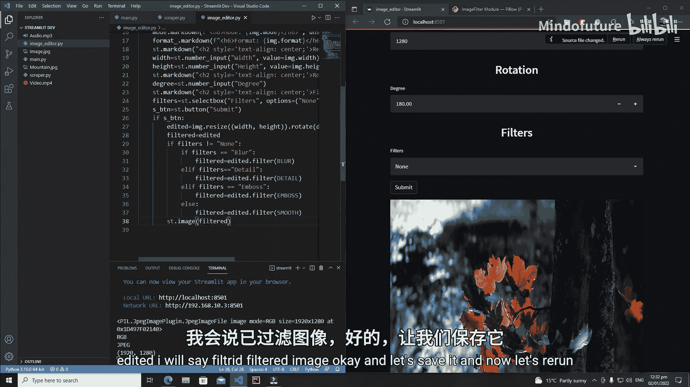

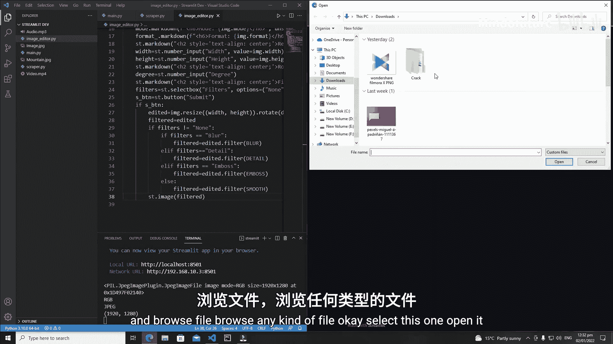

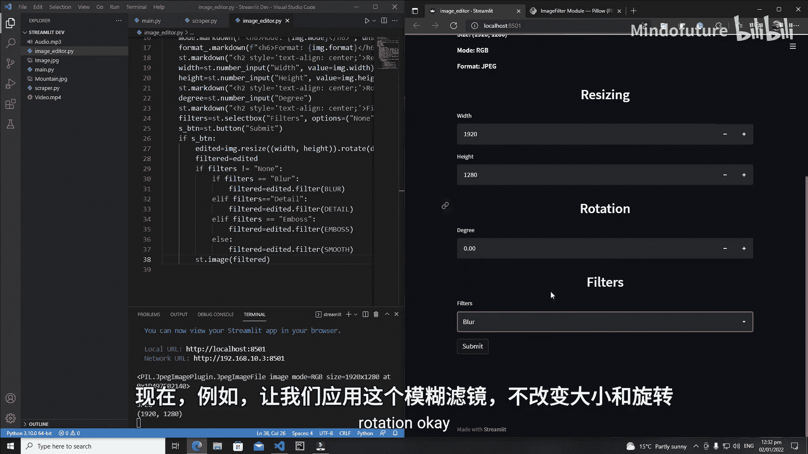

最后，我们不再显示 `edited` 图像，而是显示应用了所有效果（包括滤镜）的 `filtered_image`。

```python
    st.image(filtered_image)
```

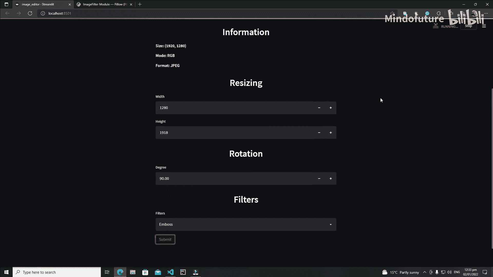

保存并重新运行程序。上传一张图片，选择“模糊”滤镜，然后点击“提交”。可以看到图像变得模糊了。尝试组合使用不同的旋转角度、尺寸和滤镜，观察最终效果。

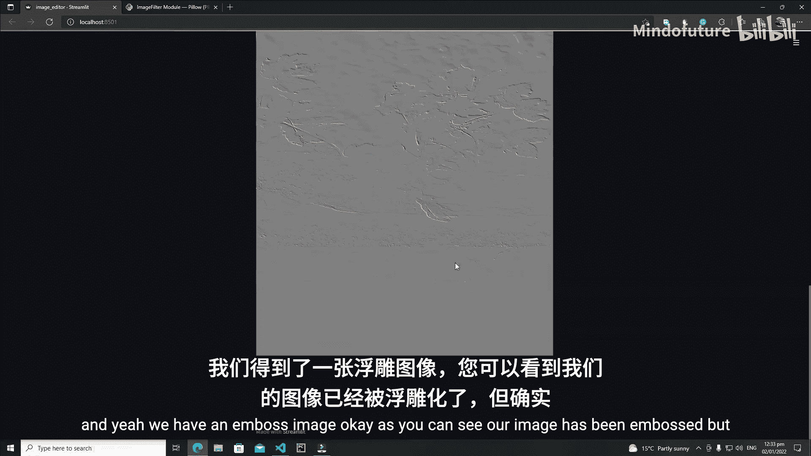

## 总结

本节课中我们一起学习了如何为 Streamlit 图像编辑器添加核心功能。我们实现了通过一个提交按钮来触发处理流程，该流程会：
1.  读取用户设置的宽度、高度和旋转角度。
2.  使用 `Pillow` 库的 `resize` 和 `rotate` 方法对图像进行基本编辑。
3.  根据下拉菜单的选择，使用 `filter` 方法为图像应用不同的滤镜效果（如模糊、细节增强、平滑）。
4.  最终使用 `st.image()` 将处理后的图像展示在网页上。

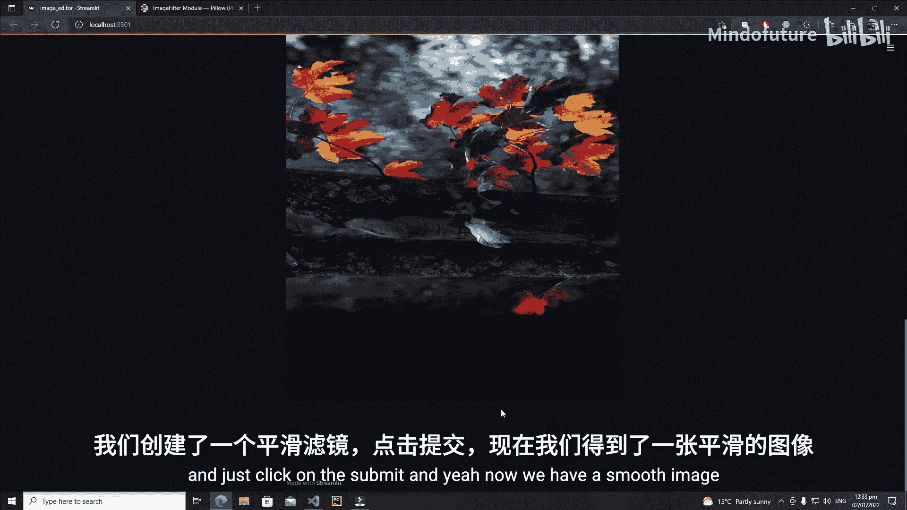

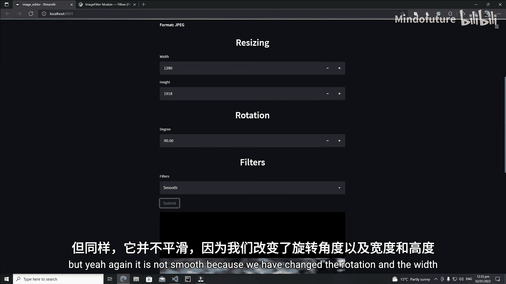

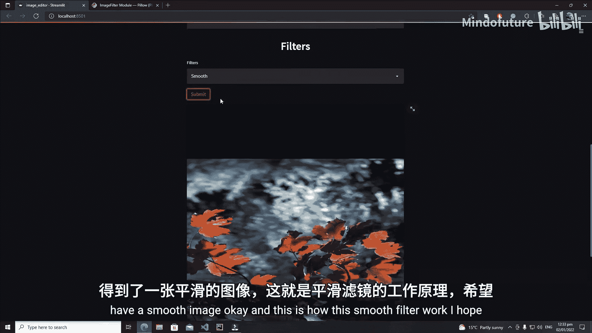

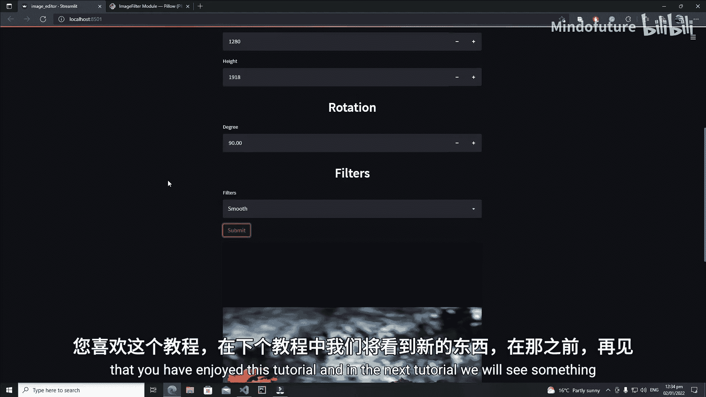

现在，你已经拥有了一个功能完整的简易图像编辑工具。在接下来的课程中，我们将探索 Streamlit 的更多组件和功能。