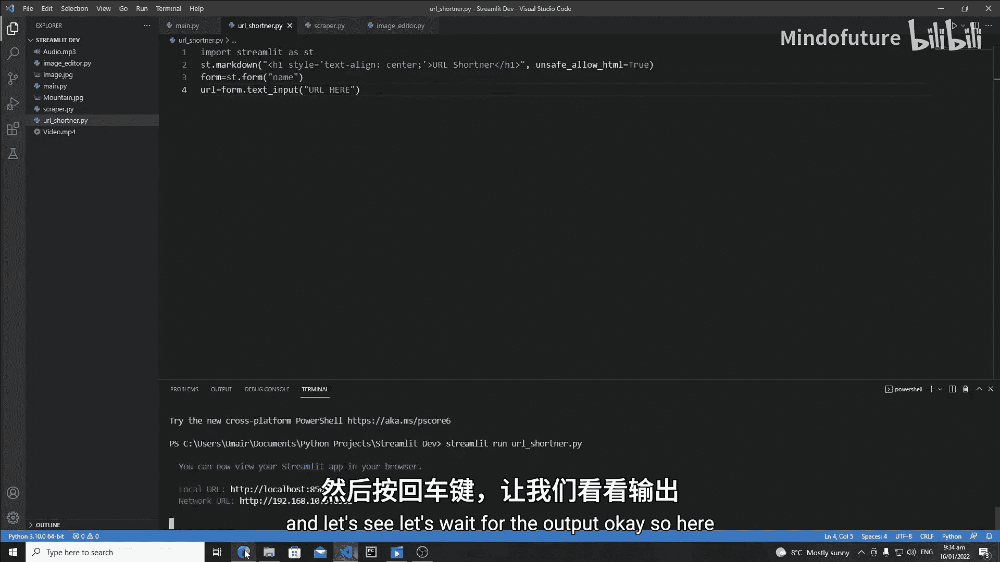
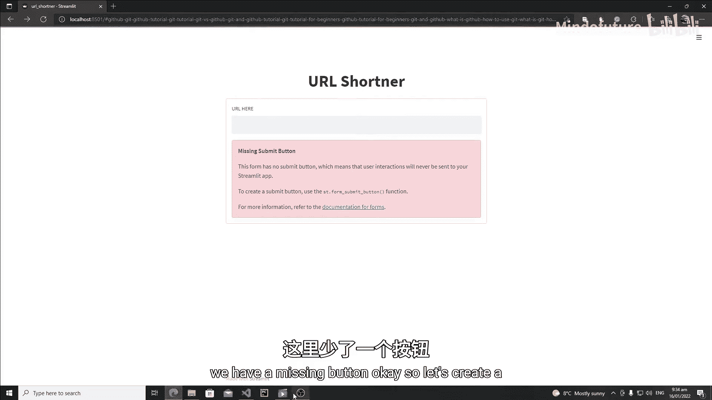
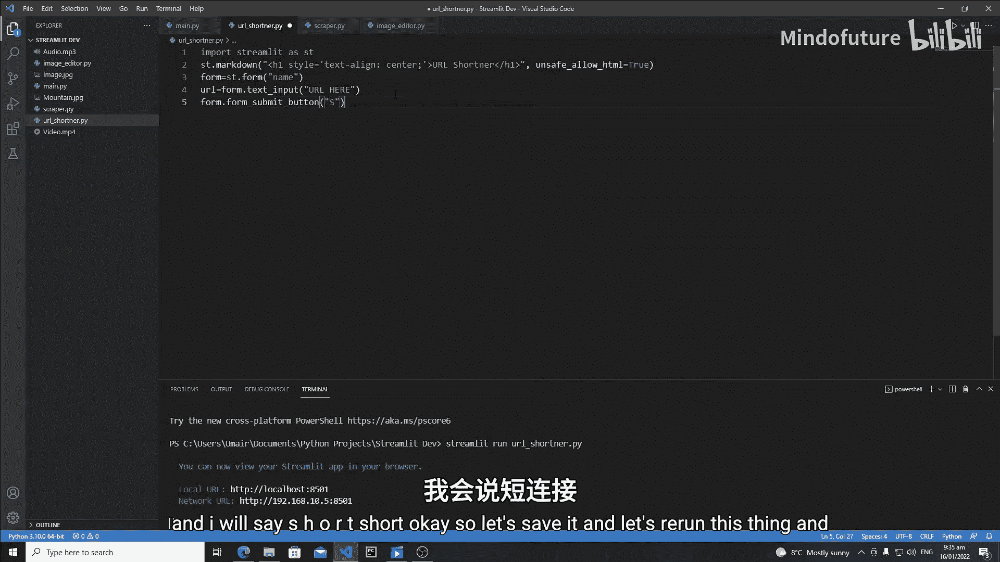
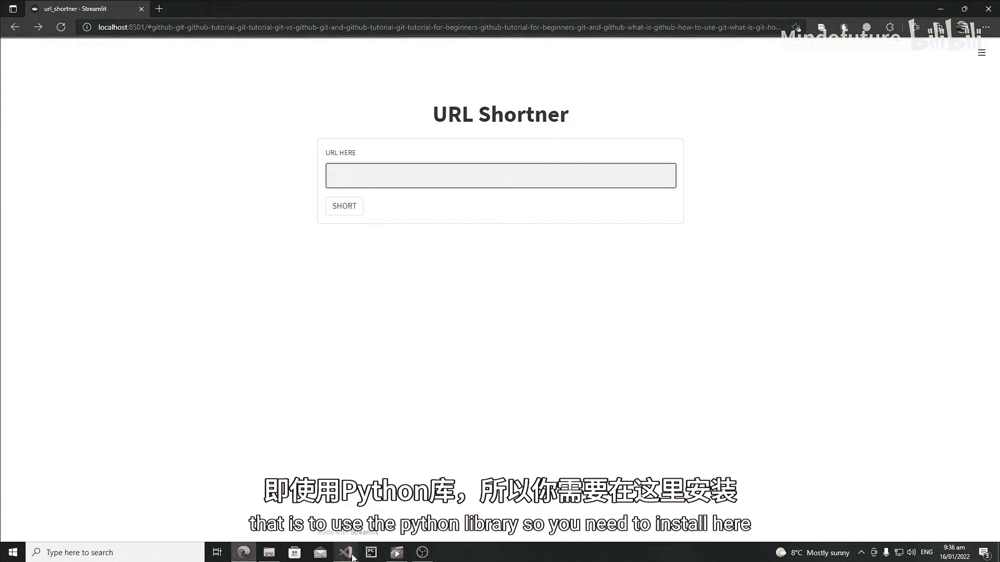
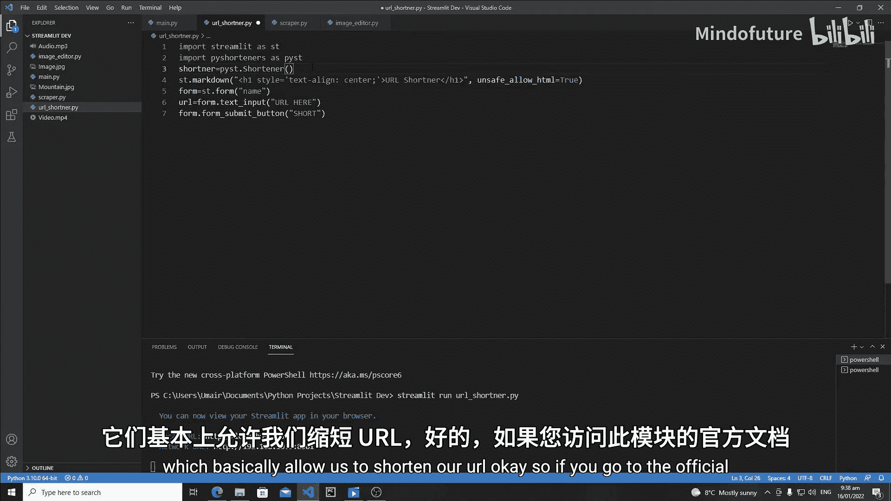
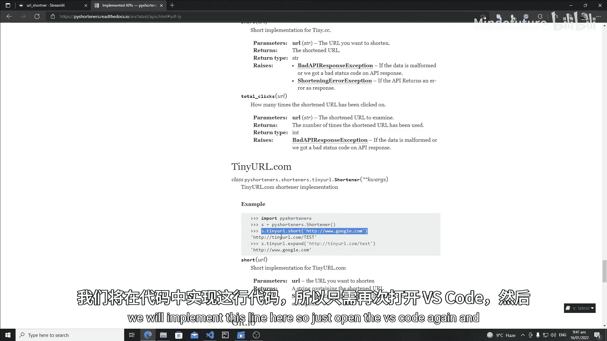
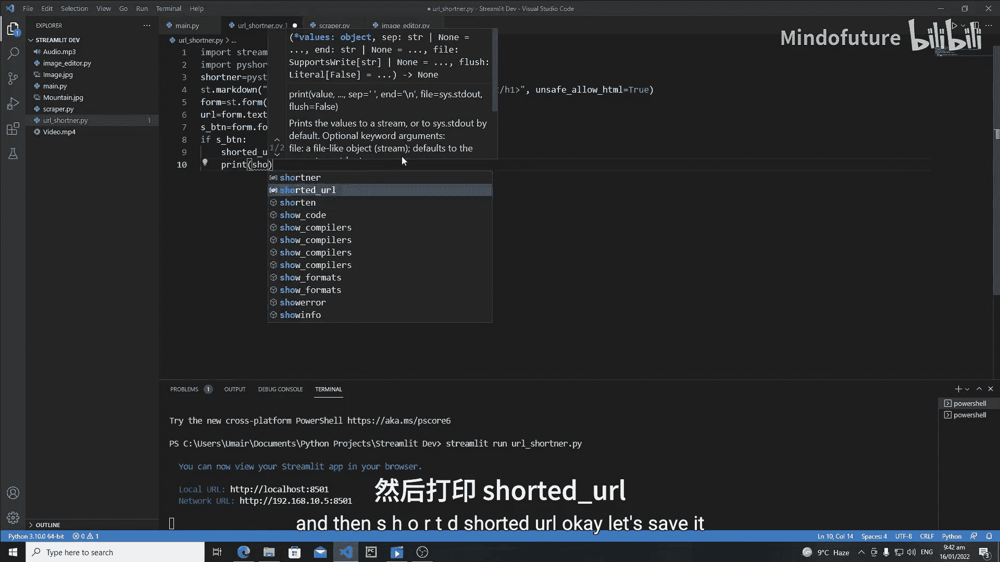
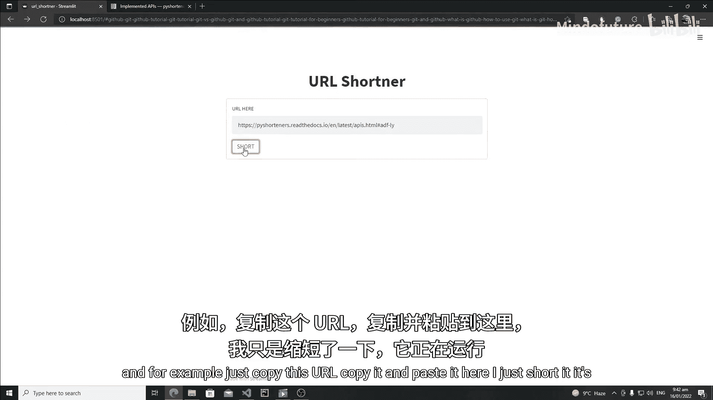
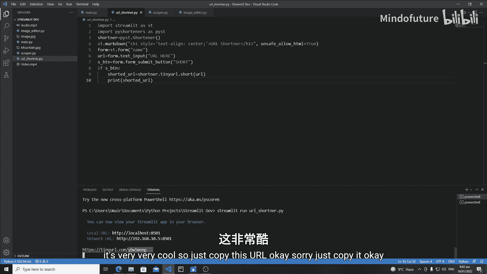
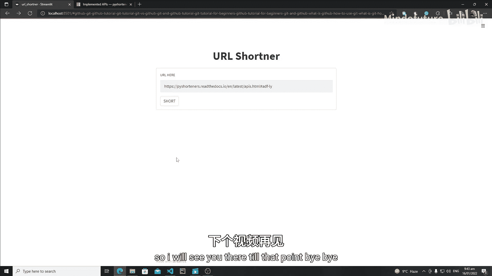

# 025：使用 Streamlit 构建 URL 缩短器

在本教程中，我们将学习如何使用 Python 的 Streamlit 库来创建一个 URL 缩短器应用程序。我们将从搭建基础界面开始，并集成一个第三方库来实现 URL 缩短功能。

## 创建项目文件与导入库

首先，我们需要创建一个新的 Python 文件。将其命名为 `url_shortener.py`。

接下来，在文件的开头导入 Streamlit 库，我们通常使用 `st` 作为其别名。

```python
import streamlit as st
```

## 构建基础用户界面



上一节我们导入了必要的库，本节中我们来看看如何构建应用的基础界面。





我们将首先创建一个居中对齐的标题。

```python
st.markdown("<h1 style='text-align: center;'>URL Shortener</h1>", unsafe_allow_html=True)
```

接下来，我们需要创建一个表单来接收用户输入的 URL。我们将使用 Streamlit 的 `st.form` 方法。



以下是创建表单和输入框的步骤：
1.  使用 `st.form` 创建一个表单对象。
2.  在表单内添加一个文本输入框，用于接收用户输入的 URL。
3.  在表单内添加一个提交按钮。

```python
with st.form("url_form"):
    url = st.text_input("Enter URL Here")
    submit_button = st.form_submit_button("Shorten")
```

运行 `streamlit run url_shortener.py` 命令，你将看到一个带有输入框和按钮的简单界面。

## 集成 URL 缩短功能

现在界面已经就绪，我们需要实现 URL 缩短的核心逻辑。为此，我们将使用一个名为 `pyshorteners` 的 Python 库。



首先，在终端中安装这个库：

```bash
pip install pyshorteners
```

安装完成后，在代码文件顶部导入该库：

```python
import pyshorteners as ps
```

`pyshorteners` 库中的 `Shortener` 类提供了多种缩短服务。我们将使用不需要 API 密钥的 TinyURL 服务。



在表单的提交逻辑中，我们实例化 `Shortener` 类并调用其 `tinyurl.short` 方法来缩短 URL。

```python
if submit_button:
    shortener = ps.Shortener()
    shortened_url = shortener.tinyurl.short(url)
    print(shortened_url)
```



此时，当用户输入 URL 并点击提交后，缩短后的链接会打印在终端中。你可以复制该链接到浏览器中测试，确认其可以正确跳转到原始网站。





## 总结

本节课中我们一起学习了使用 Streamlit 创建 URL 缩短器应用的基础步骤。我们首先搭建了包含标题、输入框和按钮的用户界面，然后通过集成 `pyshorteners` 库实现了 URL 缩短的核心功能。目前，缩短后的链接会输出在终端。



在下一节课中，我们将改进这个应用，把缩短后的链接直接显示在网页上，并添加一个“复制到剪贴板”的按钮，以提升用户体验。