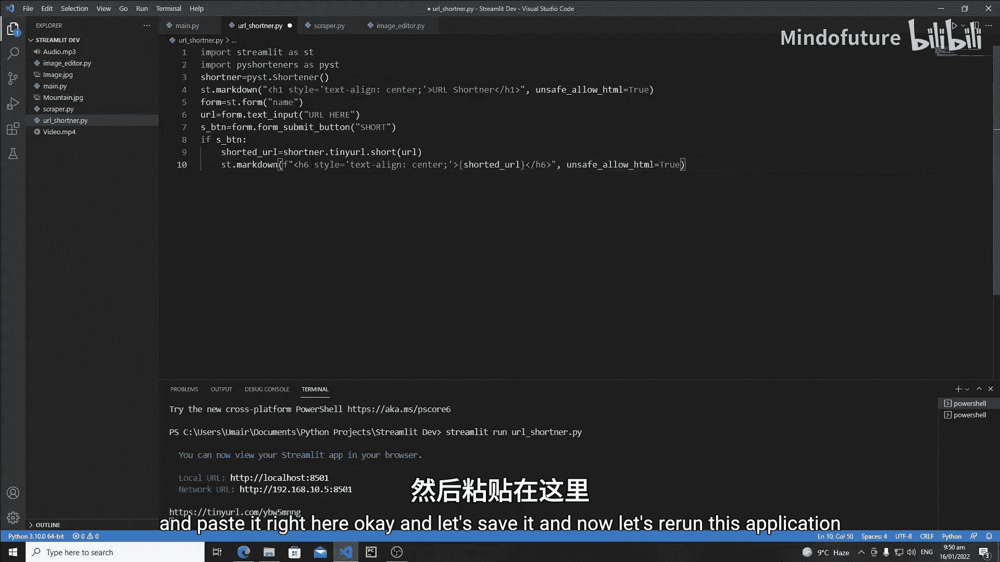
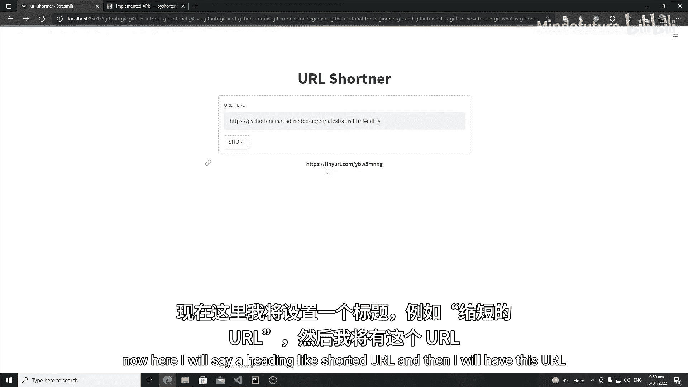
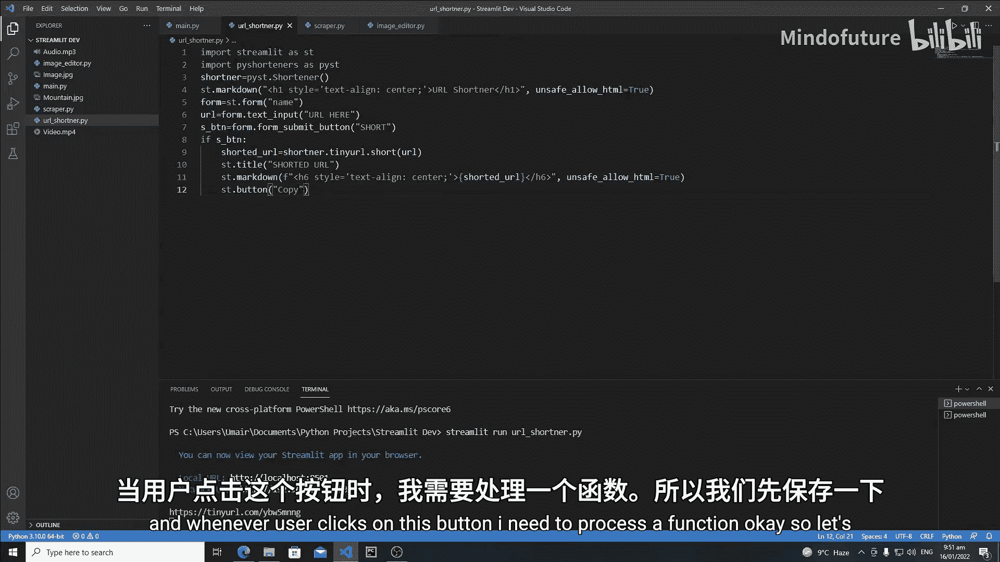
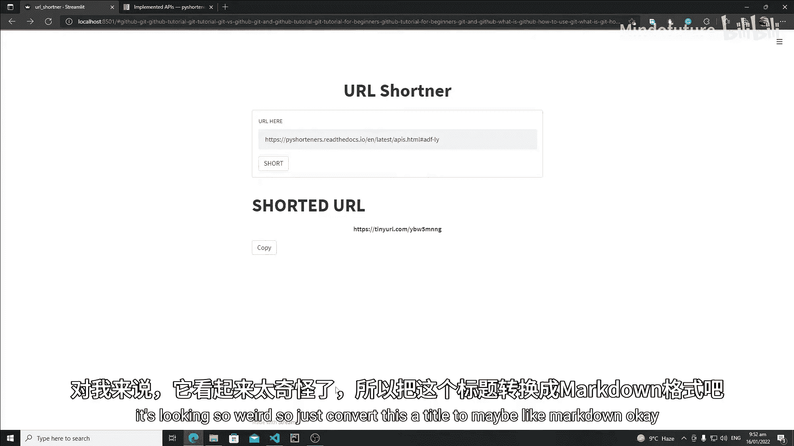
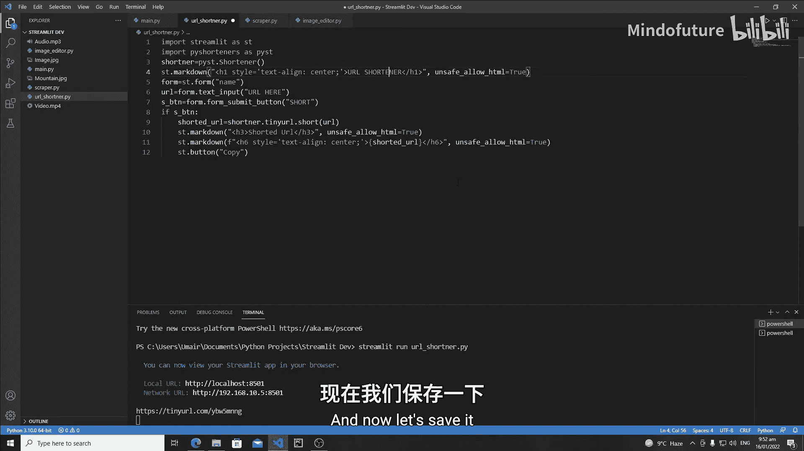
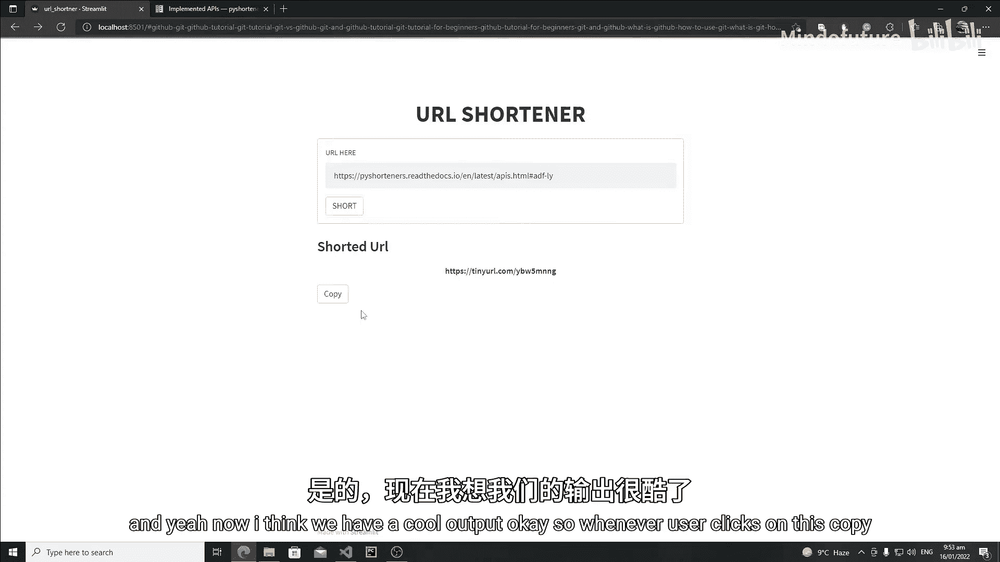
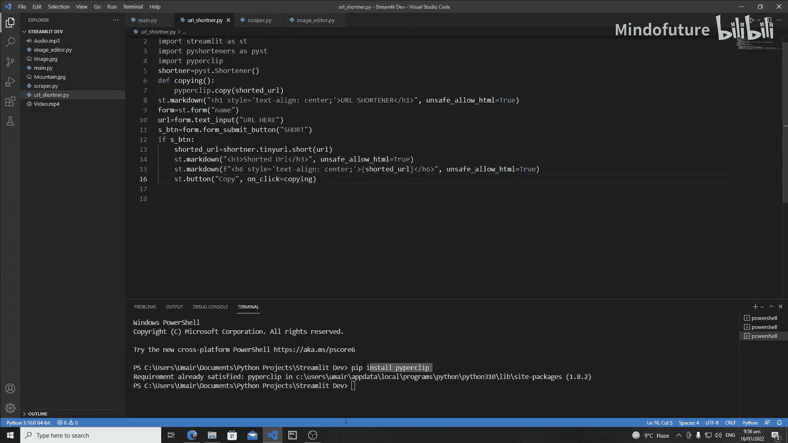
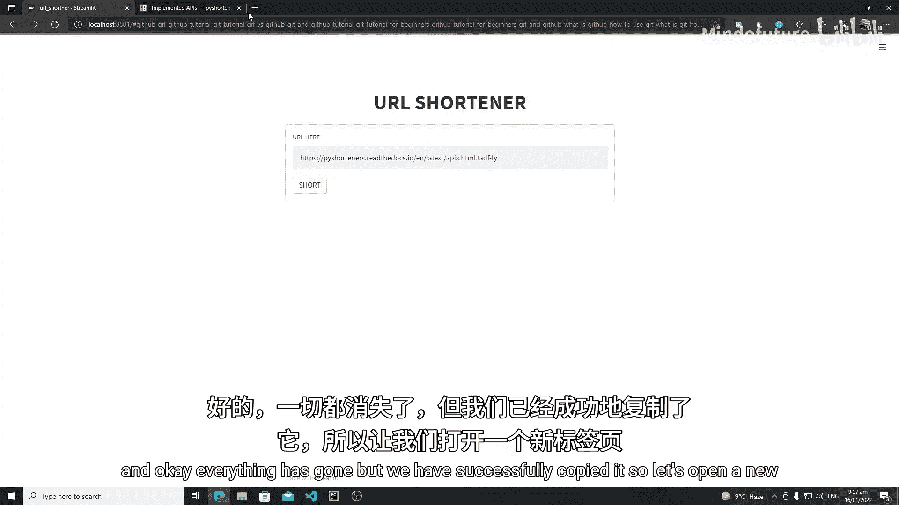
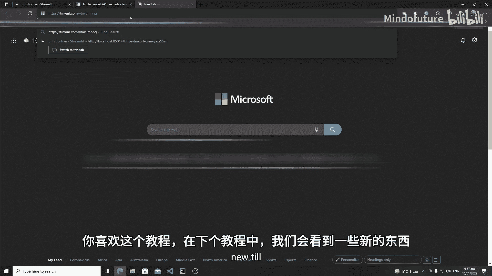

# 026：创建复制按钮与剪贴板操作 🚀

在本节课中，我们将继续开发URL短链接生成器应用。我们将学习两个核心功能：首先，在界面上显示生成的短链接；其次，创建一个复制按钮，以便用户一键将短链接复制到系统剪贴板。

---

## 在界面上显示短链接

上一节我们完成了短链接的生成逻辑，本节我们来看看如何将其优雅地展示给用户。我们将使用Streamlit的`st.markdown`组件，并应用HTML标签进行样式控制。



以下是实现步骤：

1.  移除用于调试的`print`语句。
2.  使用`st.markdown`来渲染短链接。
3.  在`st.markdown`中，我们使用HTML的`<h6>`标签来定义标题样式，并通过`unsafe_allow_html=True`参数允许渲染HTML。
4.  将生成的短链接变量（例如`shortened_url`）嵌入到HTML字符串中。

核心代码如下：

```python
st.markdown(f'<h6 style="...">短链接: {shortened_url}</h6>', unsafe_allow_html=True)
```



运行应用后，输入一个长链接并点击缩短，生成的短链接就会以设定好的样式显示在页面上。



---

## 添加复制按钮



成功显示短链接后，下一步是让用户可以方便地复制它。我们将在短链接下方添加一个按钮。

以下是实现步骤：



1.  在显示短链接的代码上方，可以添加一个标题（例如使用`st.title`或`st.markdown`的`<h3>`标签）来明确区域。
2.  使用`st.button`创建一个按钮，按钮文本设为“复制”。
3.  为了获得更好的视觉效果，可以将标题的标签从`<h6>`调整为`<h3>`，并优化布局。

调整后的界面代码结构如下：

```python
st.markdown('### 短链接生成器')
st.markdown(f'<h6 style="...">{shortened_url}</h6>', unsafe_allow_html=True)
copy_button = st.button('复制')
```



---

## 实现复制到剪贴板功能

现在，我们需要让复制按钮真正起作用。这里有一个关键点需要注意：如果我们的按钮位于一个`st.form`表单内，Streamlit的默认执行流程可能会阻止复制逻辑的触发。

为了解决这个问题，我们将使用按钮的`on_click`属性。这个属性允许我们在Streamlit重新运行整个脚本之前，就执行指定的函数。

以下是实现步骤：

1.  **安装库**：我们将使用Python的`pyperclip`库来操作系统剪贴板。在终端中运行安装命令：
    ```bash
    pip install pyperclip
    ```
    安装后，需要重启VS Code或你的开发环境。

2.  **导入库**：在Python脚本顶部导入`pyperclip`。
    ```python
    import pyperclip
    ```

3.  **创建复制函数**：定义一个函数，其功能是利用`pyperclip.copy()`方法将短链接字符串复制到剪贴板。
    ```python
    def copy_to_clipboard():
        pyperclip.copy(shortened_url)
    ```

4.  **绑定按钮与函数**：在创建按钮时，使用`on_click`参数直接关联上面定义的函数。这样，用户点击按钮时，复制函数会立即执行。
    ```python
    st.button('复制', on_click=copy_to_clipboard)
    ```

完成以上步骤后，运行应用。生成短链接后，点击“复制”按钮，然后尝试在任何文本编辑器（如记事本或浏览器地址栏）中粘贴（Ctrl+V），即可看到短链接已被成功复制。

---

## 总结







本节课中我们一起学习了如何完善Streamlit应用的交互功能。我们首先将后台生成的短链接展示在前端页面上，然后重点实现了“一键复制”功能。通过使用`pyperclip`库和按钮的`on_click`属性，我们巧妙地绕过了Streamlit表单可能带来的执行顺序问题，确保了复制操作的即时性和可靠性。现在，我们的URL短链接生成器已经具备了完整可用的核心流程。