# 027：音频转文本转换器Web应用开发概述 🎤➡️📝

在本节课中，我们将学习如何使用 Python 的 Streamlit 库来开发一个音频转文本的转换器 Web 应用。在正式开始编码之前，我们需要先规划好整个应用的开发流程。

## 应用开发流程概述

开发此应用需要遵循六个核心步骤。以下是每个步骤的简要说明。

### 第一步：用户上传音频文件

首先，我们需要让用户上传音频文件。我们将使用 Streamlit 的 `file_uploader` 小部件来实现这个功能。

### 第二步：分割音频文件

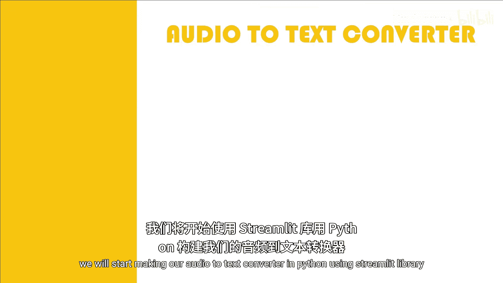

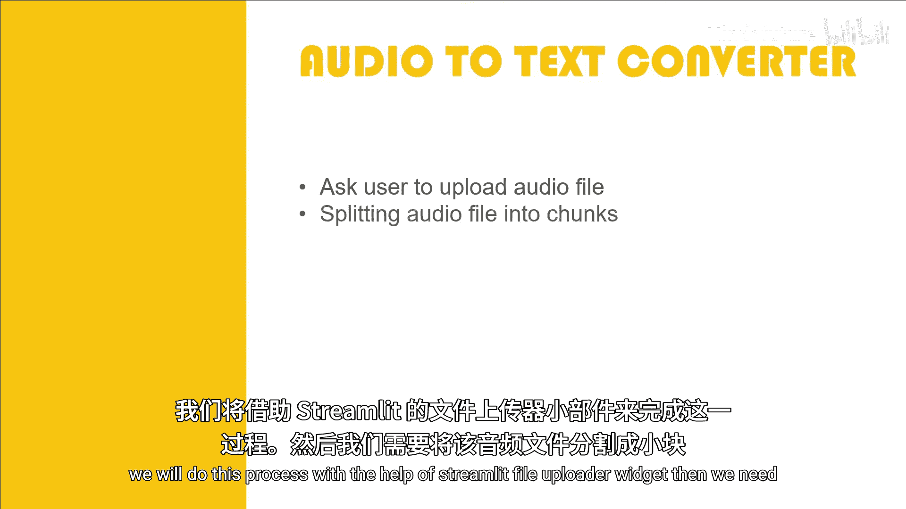

由于我们将使用 Google 的翻译服务（或类似的外部API）来将音频转换为文本，而这类服务通常对上传的音频文件有长度限制（例如，不超过一分钟），因此我们需要将用户上传的大音频文件分割成多个小片段。

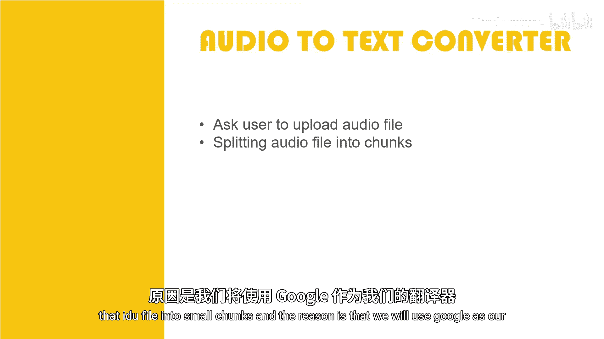

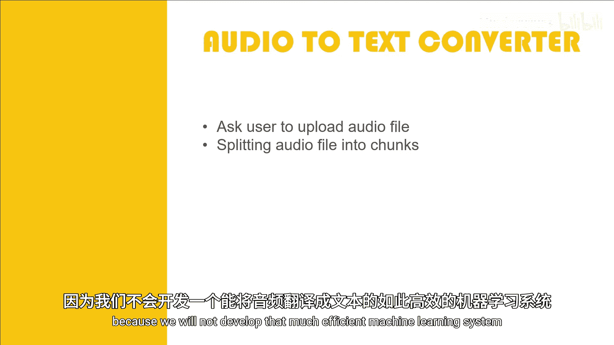

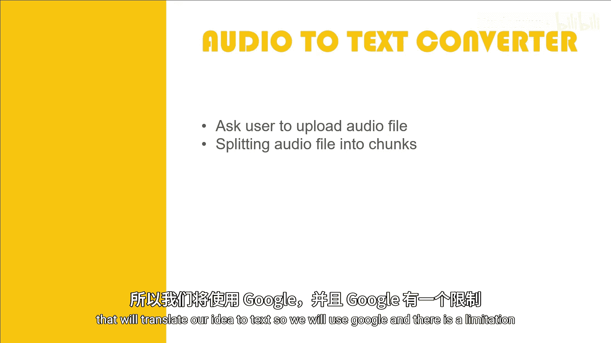

### 第三步：导出音频片段

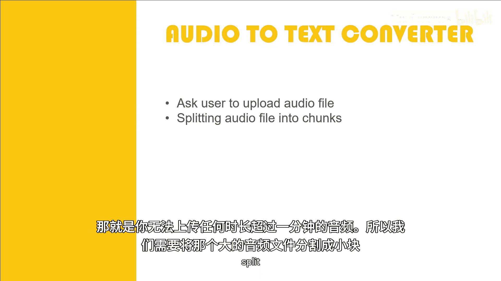

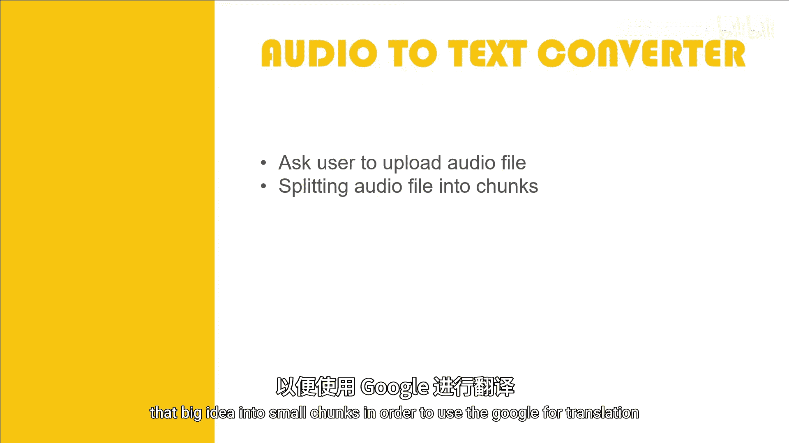

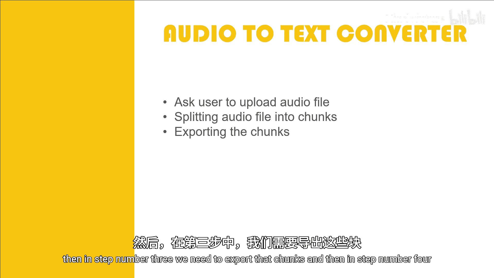

分割完成后，我们需要将这些音频片段导出为独立的文件。这一步是为后续处理做准备。

### 第四步：重新打开音频片段

在第三步导出后，我们需要在第四步重新打开这些音频片段文件作为处理源。你可能会疑惑为何要先导出再重新打开，这个疑问我们会在后续的实际开发环节中解答。

### 第五步：调用翻译服务

接下来，我们将这些分割好的小音频片段逐一发送给 Google（或其他服务）进行语音识别和翻译，以获取对应的文本。

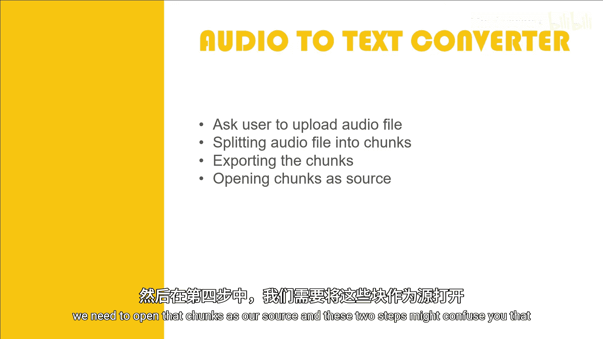

### 第六步：显示转换结果

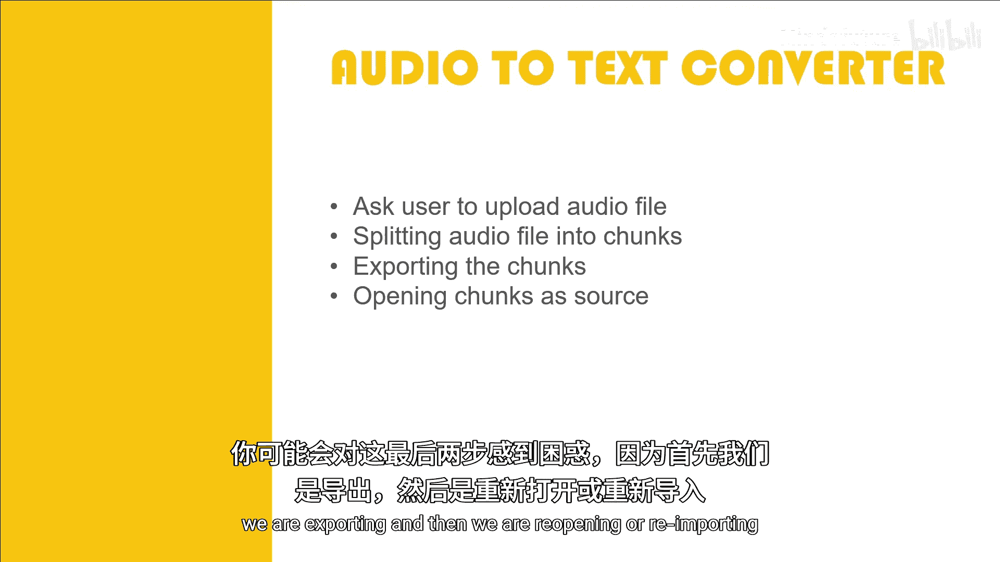

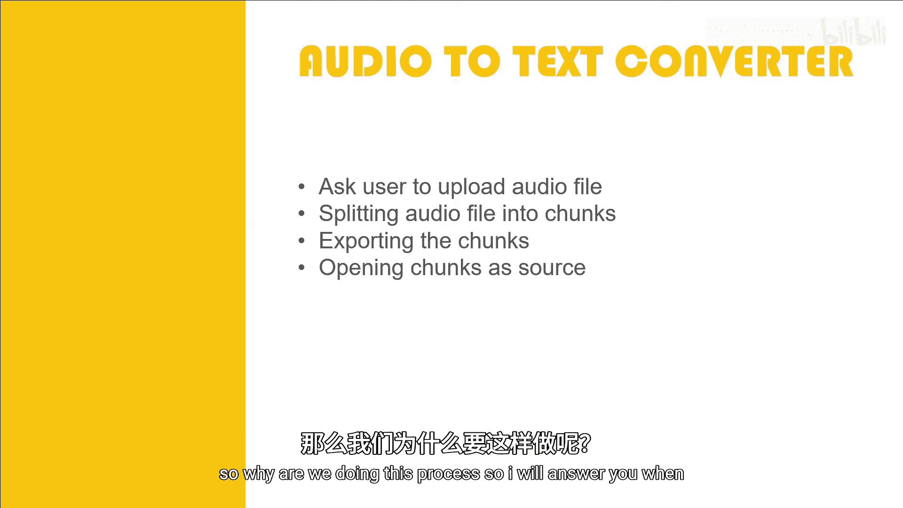

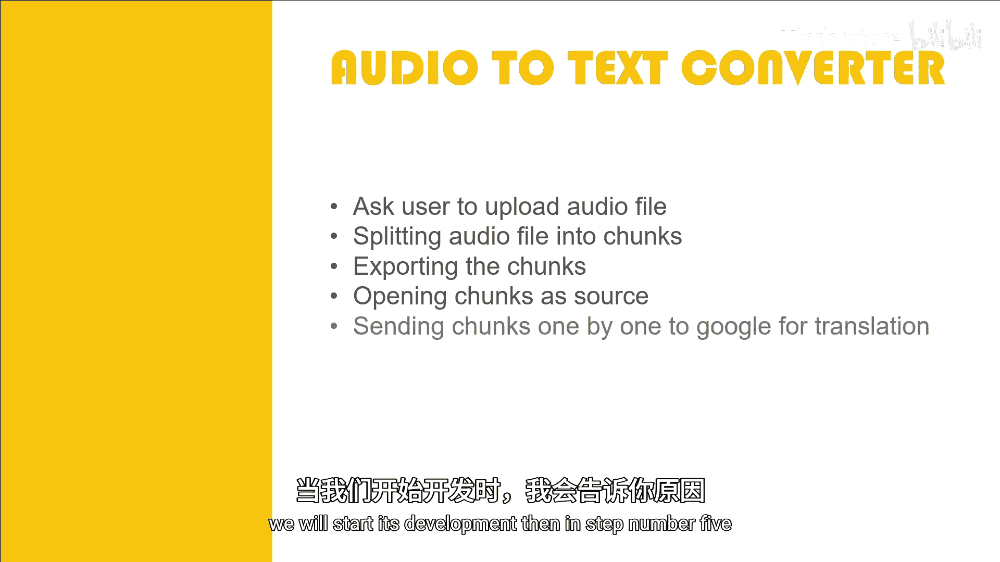

最后，我们需要将转换得到的文本结果显示在应用的界面上，供用户查看和复制。

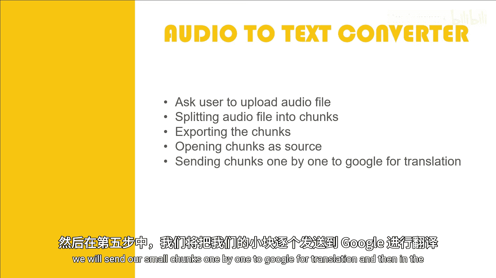

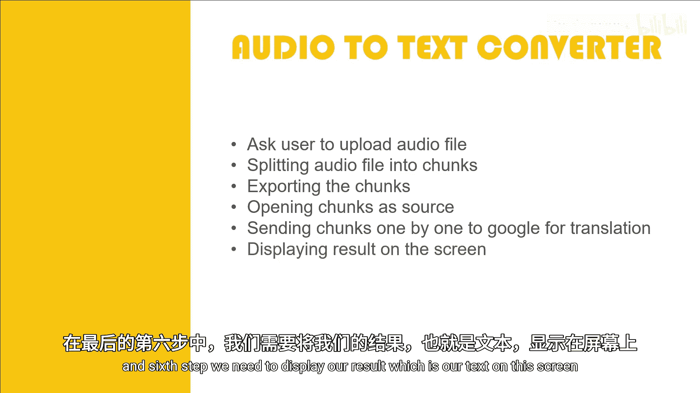

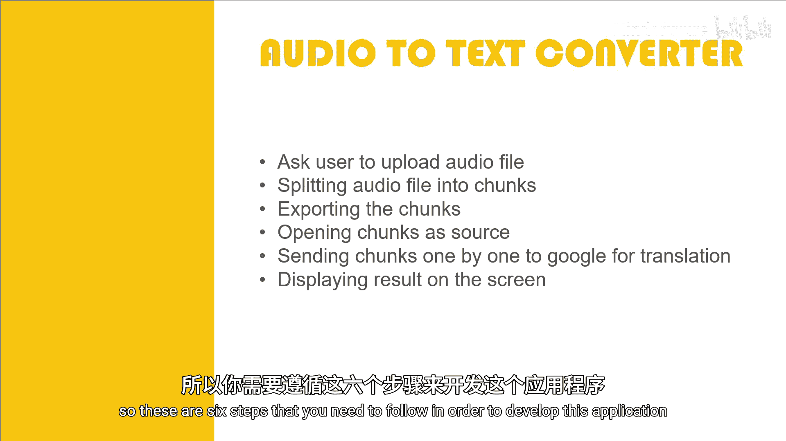

## 总结

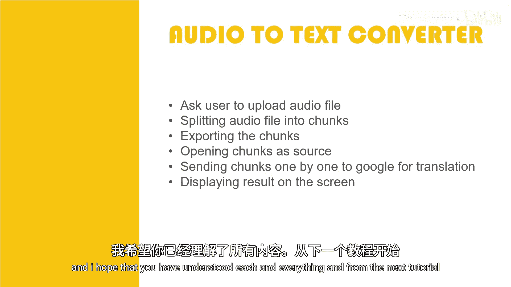

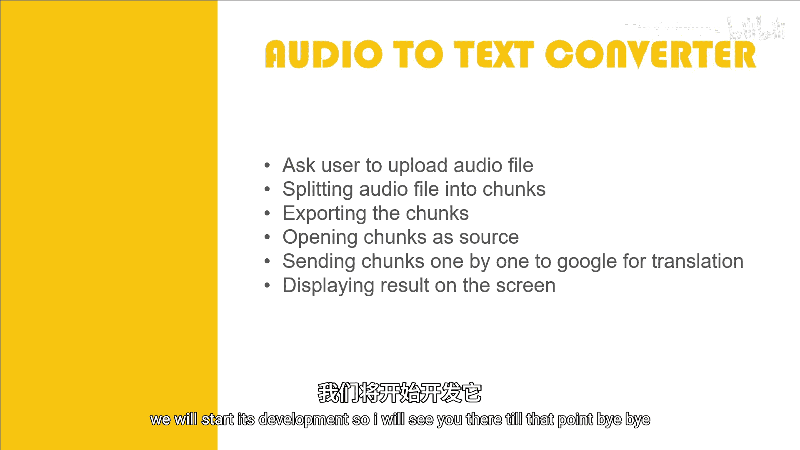

本节课我们一起规划了构建音频转文本转换器 Web 应用的六个关键步骤：**上传文件**、**分割音频**、**导出片段**、**重新打开**、**调用服务**和**显示结果**。从下一节课开始，我们将进入实际的代码开发阶段，逐步实现这些功能。