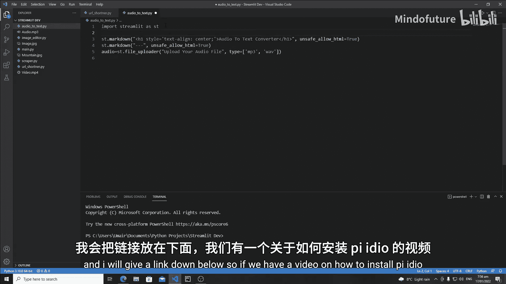
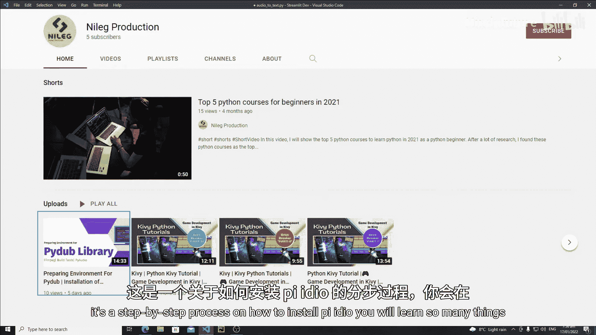
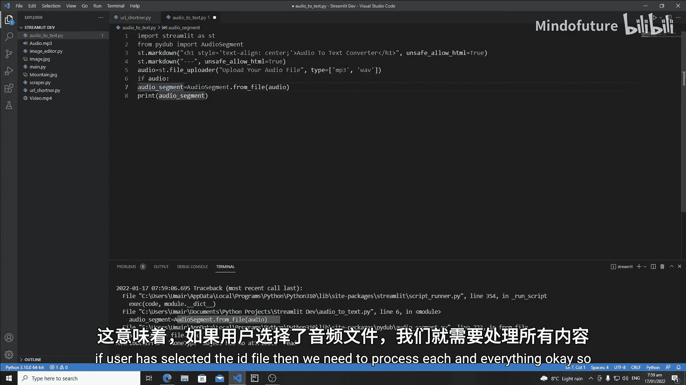
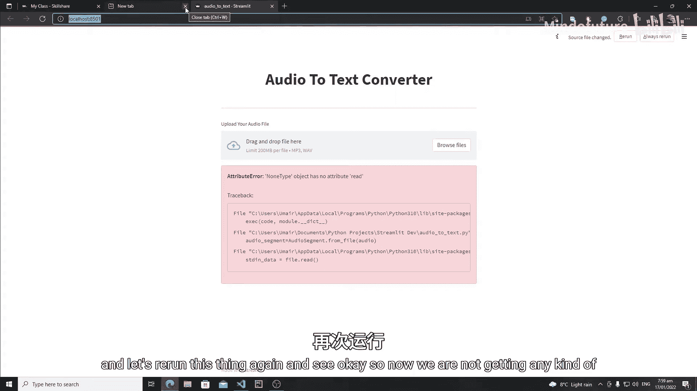
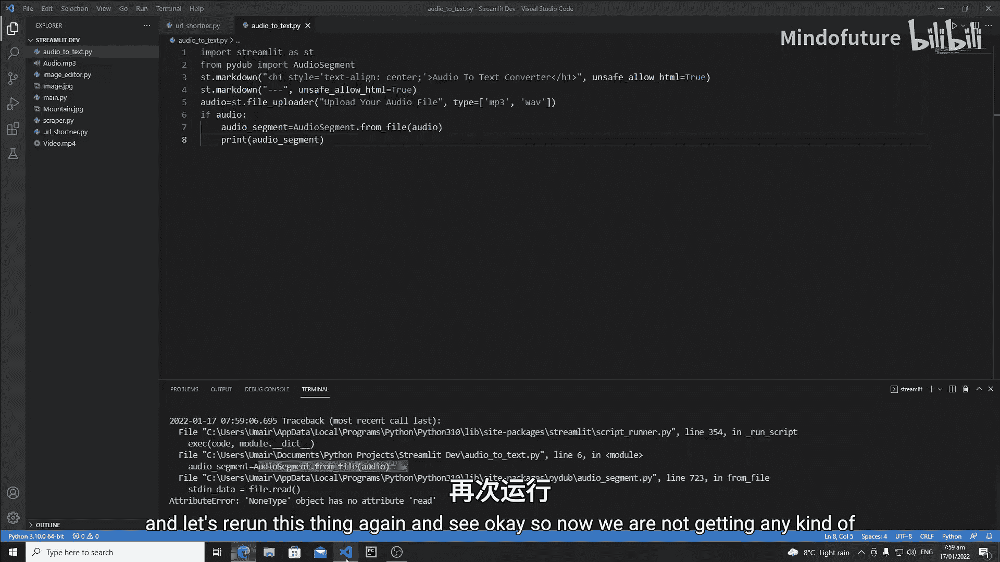
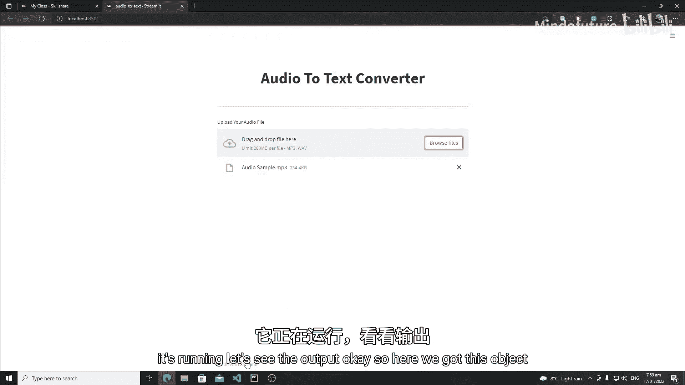
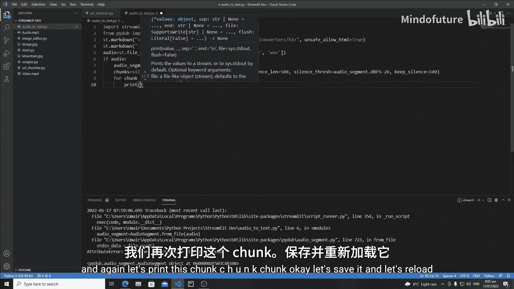
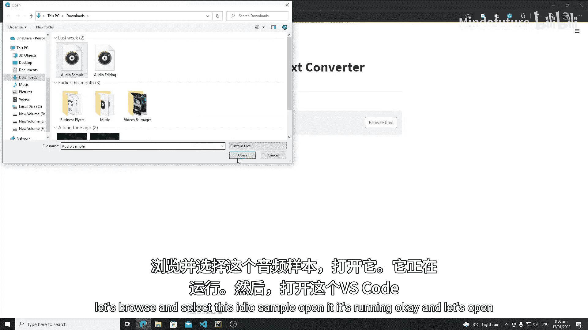
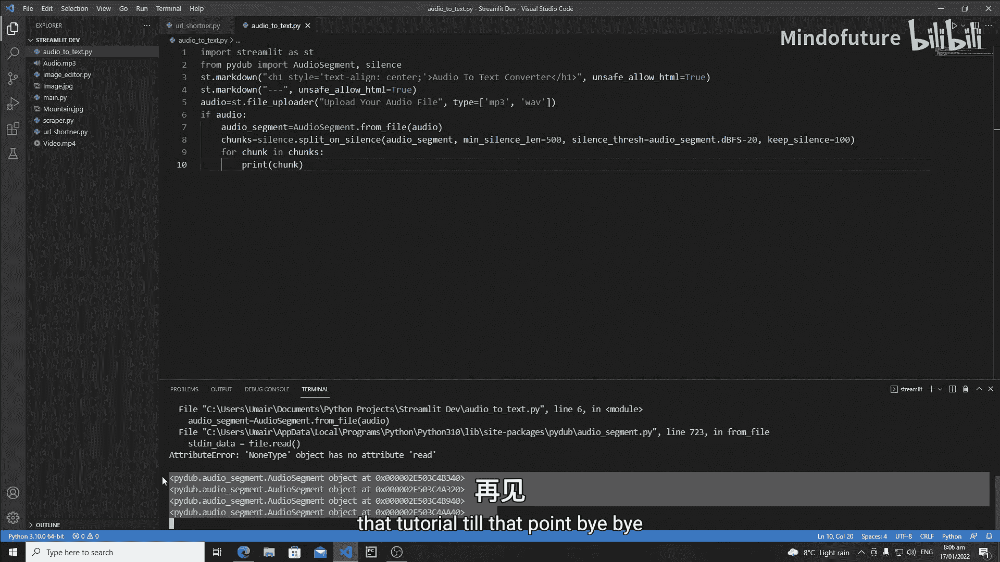

# 028：Streamlit 音频转文本转换器Web应用

在本节课中，我们将开始使用 Python 的 Streamlit 库开发一个音频转文本转换器应用。我们将学习如何上传音频文件，并使用 `pydub` 库将其分割成基于静默的音频片段，为后续的文本转换做准备。

## 概述

我们将创建一个名为 `audio_to_text.py` 的 Streamlit 应用。核心步骤包括：
1.  创建文件上传组件。
2.  使用 `pydub` 库加载音频文件。
3.  基于静默检测将长音频分割成多个短片段。

## 第一步：创建应用框架与文件上传器

首先，我们需要导入 Streamlit 并设置应用的基本界面，包括标题和文件上传组件。





```python
import streamlit as st

# 设置应用标题
st.title("音频转文本转换器")
st.markdown("---")

# 创建文件上传组件
uploaded_audio = st.file_uploader("上传您的音频文件", type=['mp3', 'wav'])
```

## 第二步：导入并加载音频文件





为了处理音频，我们需要使用 `pydub` 库。在导入之前，请确保已按照相关教程正确安装 `pydub` 及其依赖（如 `ffmpeg`）。

```python
from pydub import AudioSegment





# 检查用户是否已上传文件
if uploaded_audio is not None:
    # 将上传的文件转换为 AudioSegment 对象
    audio_segment = AudioSegment.from_file(uploaded_audio)
    # 打印音频对象以确认加载成功
    print(audio_segment)
```

## 第三步：基于静默分割音频

直接转换长音频可能遇到限制（例如，免费API通常有长度限制）。因此，我们将音频基于静默分割成多个片段，这比随机分割更能保证语义的完整性。

以下是分割音频的核心代码：

```python
from pydub.silence import split_on_silence

# 基于静默分割音频
chunks = split_on_silence(
    audio_segment,
    min_silence_len=500,          # 静默至少持续500毫秒（0.5秒）才被视为分割点
    silence_thresh=audio_segment.dBFS - 20, # 静默阈值：比音频平均音量低20分贝
    keep_silence=100              # 在每个分割出的片段首尾保留100毫秒静默
)

# 遍历并打印每个音频片段
for i, chunk in enumerate(chunks):
    print(f"Chunk {i}: {chunk}")
```

**参数解释**：
*   **`min_silence_len`**：定义被视为“静默”并用于分割的最小持续时间（毫秒）。
*   **`silence_thresh`**：定义静默的音量阈值。`audio_segment.dBFS - 20` 表示比音频平均音量低20分贝的声音被视为静默。
*   **`keep_silence`**：在每个分割出的音频块开头和结尾保留的静默时长（毫秒），使转换后的语音听起来更自然。

## 总结



本节课中，我们一起学习了构建音频转文本转换器应用的前半部分。我们成功创建了一个 Streamlit 应用界面，实现了音频文件的上传功能，并利用 `pydub` 库的 `split_on_silence` 方法，智能地将长音频文件按静默处分割成了多个短片段。





在下一节课中，我们将继续开发，学习如何将这些音频片段导出为临时文件，并使用语音识别库（如 Google Speech Recognition）将它们逐一转换为文本，最终完成整个音频转文本的流程。