# 029：Streamlit 音频转文本转换器Web应用 🎙️➡️📝

## 概述

在本节课中，我们将继续开发音频转文本转换器应用。我们已经完成了前两个步骤，现在将从第三步开始，学习如何将音频分割成块并导出，然后使用Google的语音识别服务将音频转换为文本。

---

## 步骤三：导出音频块

上一节我们介绍了如何将大音频文件分割成块。本节中我们来看看如何将这些音频块导出为独立的文件。

我们需要为每个音频块指定一个唯一的输出文件名，以便区分它们。我们将使用循环的索引作为文件名的一部分。

以下是实现此步骤的代码修改：

```python
# 使用enumerate函数遍历音频块，同时获取索引和块数据
for idx, chunk in enumerate(chunks):
    # 导出音频块，文件名为索引号，格式为wav
    chunk.export(f"{idx}.wav", format="wav")
```

*   **`enumerate(chunks)`**：这个函数允许我们在遍历`chunks`列表时，同时获取每个元素的索引（`idx`）和值（`chunk`）。
*   **`chunk.export(...)`**：这是导出音频块的方法。
*   **`f"{idx}.wav"`**：这是输出的文件名。`idx`是索引（如0, 1, 2），`.wav`是文件扩展名。
*   **`format="wav"`**：指定导出音频的格式为WAV。

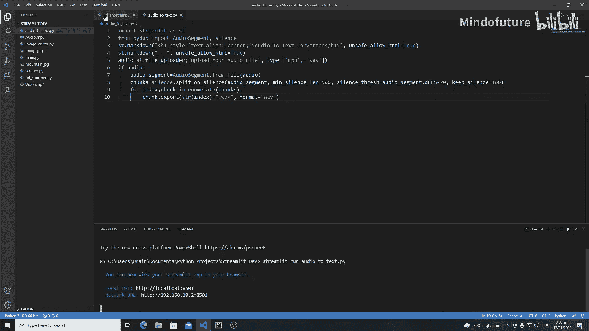

运行应用后，你会在项目目录中看到导出的音频文件（例如 `0.wav`, `1.wav`）。

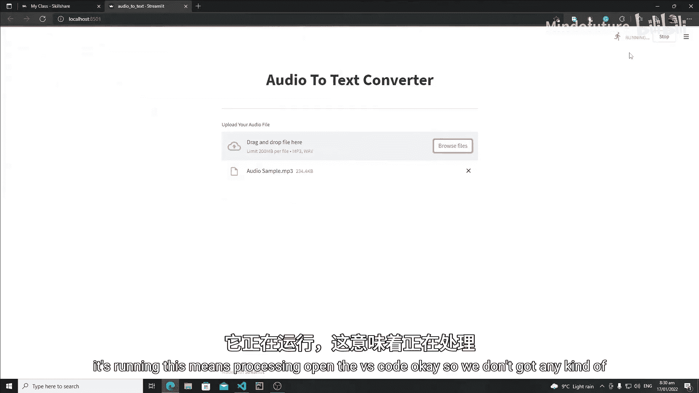

---

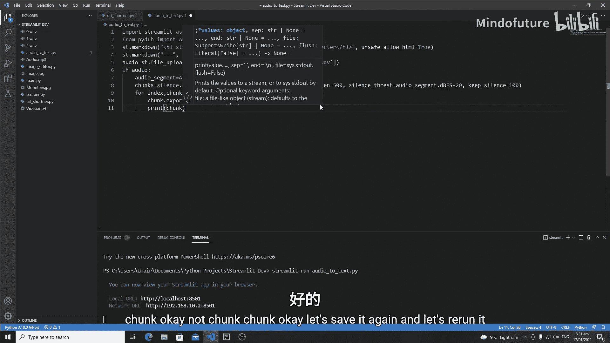

## 步骤四：导入语音识别库并打开音频源

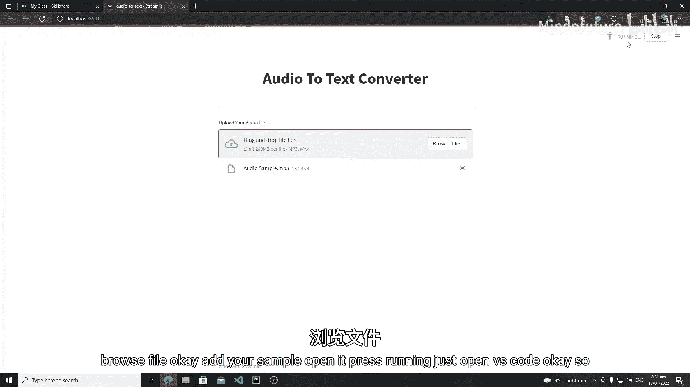

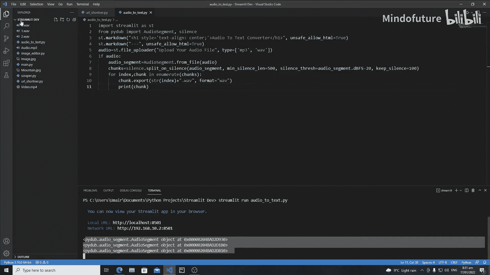

现在我们已经有了独立的音频文件，下一步是将它们转换为文本。我们将使用Python的`speech_recognition`库，它可以帮助我们调用Google的语音识别服务。

首先，确保你已经安装了这个库。如果没有，请在终端中运行以下命令：

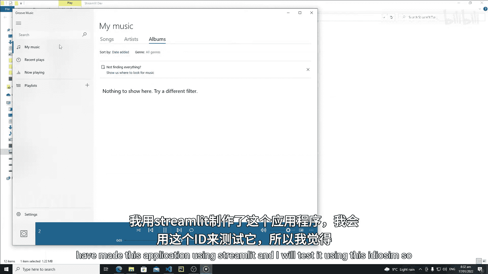

```bash
pip install SpeechRecognition
```

安装完成后，在代码中导入该库，并准备打开我们导出的音频文件作为识别源。

以下是相关代码：

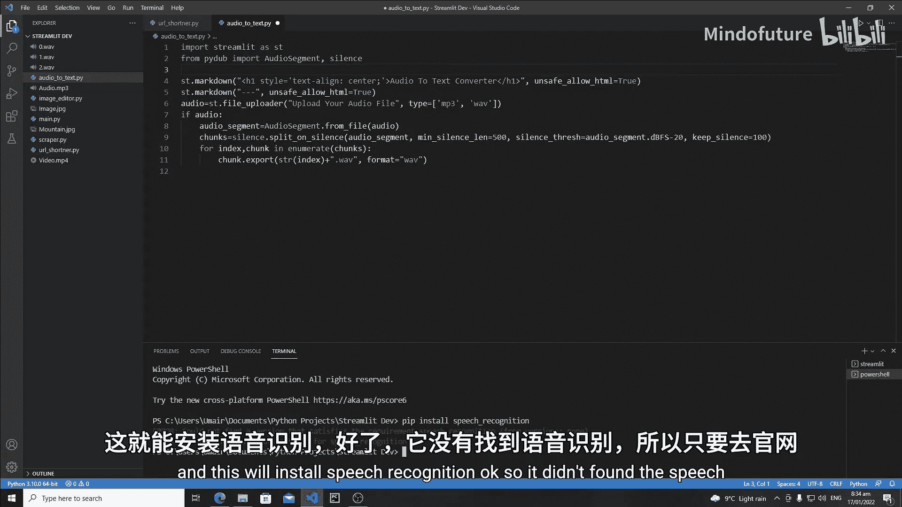

```python
import speech_recognition as sr

# ...（之前的代码）...

for idx, chunk in enumerate(chunks):
    chunk.export(f"{idx}.wav", format="wav")
    
    # 打开导出的音频文件作为识别源
    with sr.AudioFile(f"{idx}.wav") as source:
        # 后续识别代码将写在这里
        pass
```

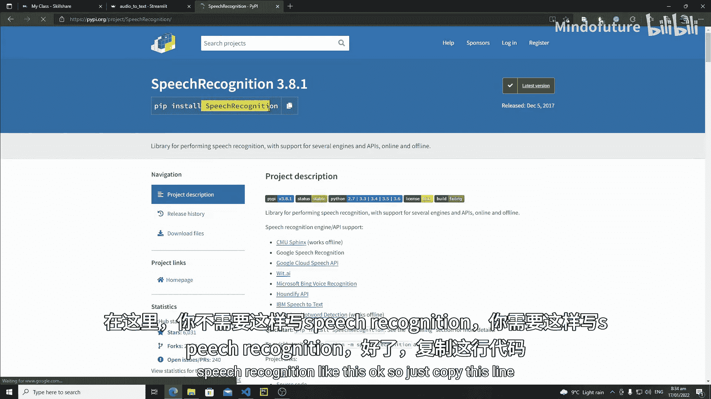

*   **`import speech_recognition as sr`**：导入语音识别库，并使用简称`sr`以便后续调用。
*   **`with sr.AudioFile(f"{idx}.wav") as source:`**：使用`with`语句打开音频文件。`sr.AudioFile()`用于创建一个音频文件对象，`as source`将这个对象赋值给变量`source`。`with`语句能确保文件在使用后被正确关闭。

---

## 步骤五：录制音频并发送至Google识别

我们已经打开了音频源，接下来需要录制音频内容，然后将其发送到Google的语音识别引擎进行转换。

以下是实现此功能的步骤和代码：

1.  **创建识别器对象**：这是`speech_recognition`库的核心类，用于处理识别操作。
2.  **录制音频**：从打开的音频源中录制音频数据。
3.  **调用识别服务**：将录制的音频发送给Google识别。这里我们使用免费的`recognize_google()`方法，但它有大约一分钟的长度限制。
4.  **错误处理**：使用`try...except`块来捕获和处理识别过程中可能出现的错误（例如网络问题、音频不清晰等）。

以下是整合后的代码：

```python
import speech_recognition as sr

# 创建识别器实例
recognizer = sr.Recognizer()

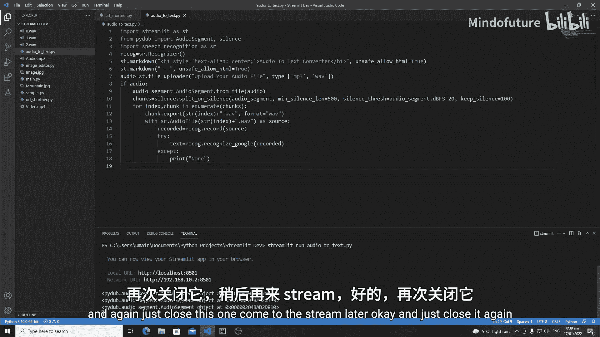

for idx, chunk in enumerate(chunks):
    chunk.export(f"{idx}.wav", format="wav")
    
    with sr.AudioFile(f"{idx}.wav") as source:
        # 从源中录制音频
        recorded_audio = recognizer.record(source)
        
        try:
            # 尝试使用Google的免费服务识别音频
            text = recognizer.recognize_google(recorded_audio)
            print(text)  # 打印识别出的文本
        except sr.UnknownValueError:
            # 如果Google无法理解音频内容
            print("Google Speech Recognition could not understand the audio.")
        except sr.RequestError:
            # 如果无法连接到Google服务
            print("Could not request results from Google Speech Recognition service.")
```

*   **`recognizer = sr.Recognizer()`**：实例化一个识别器对象。
*   **`recorded_audio = recognizer.record(source)`**：从`source`（即我们打开的音频文件）中录制音频。
*   **`recognizer.recognize_google(recorded_audio)`**：调用Google的语音识别API，将`recorded_audio`数据发送出去，并返回识别出的文本。
*   **`try: ... except: ...`**：这是异常处理结构。`try`块中的代码会被尝试执行。如果发生`sr.UnknownValueError`（音频无法识别）或`sr.RequestError`（请求失败），程序将不会崩溃，而是执行`except`块中的代码，打印出相应的错误信息。

运行应用并上传音频文件后，你将在终端或控制台中看到转换后的文本输出。

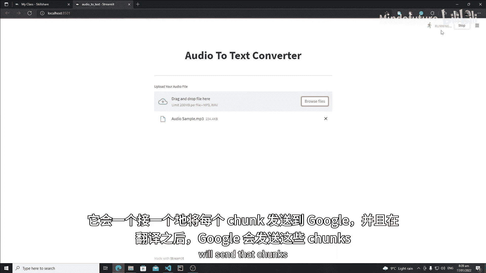

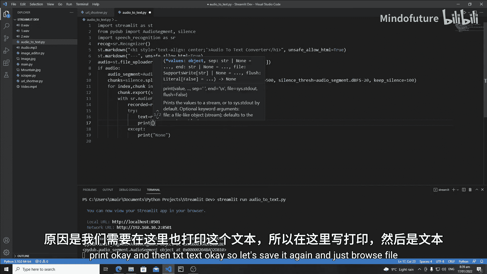

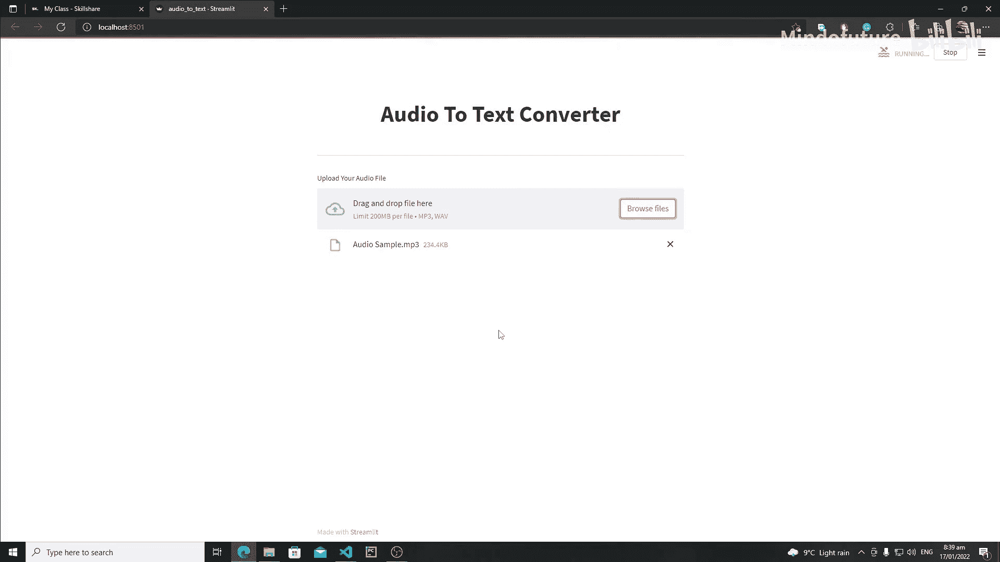

---

## 总结

本节课中我们一起学习了音频转文本应用的核心后端逻辑：
1.  **导出音频块**：将分割后的音频块保存为独立的WAV文件，并为它们命名。
2.  **设置识别环境**：导入`speech_recognition`库，并学习如何打开音频文件作为识别源。
3.  **执行语音识别**：创建识别器，录制音频，并通过`recognize_google()`函数将其发送到Google服务获取文本结果，同时使用`try...except`进行健壮的错误处理。

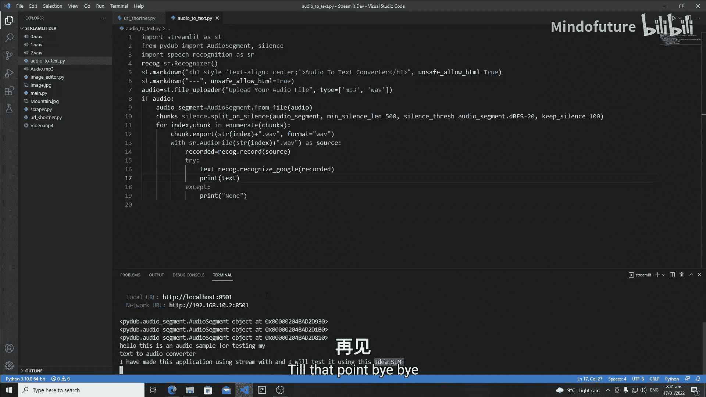

目前，识别结果输出在控制台。在下一节课中，我们将把这些结果显示在Streamlit Web应用的界面上，让整个应用更加完整和用户友好。