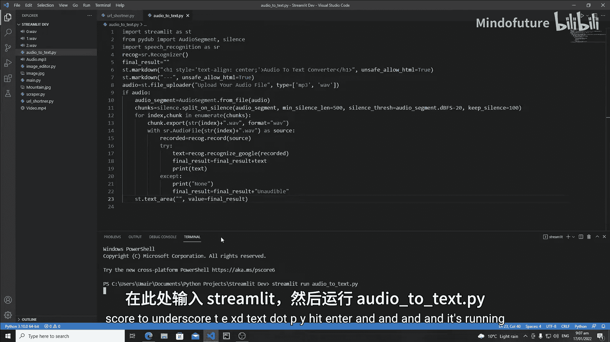
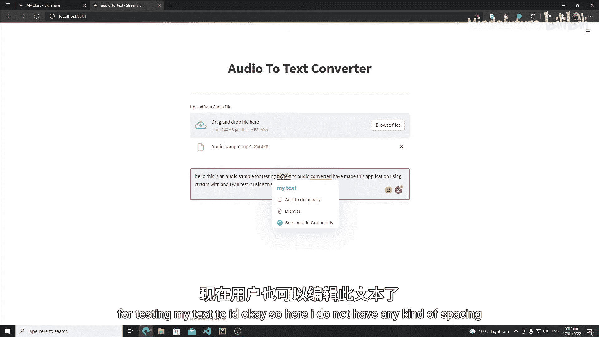
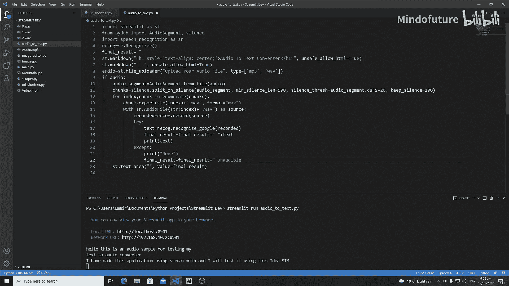
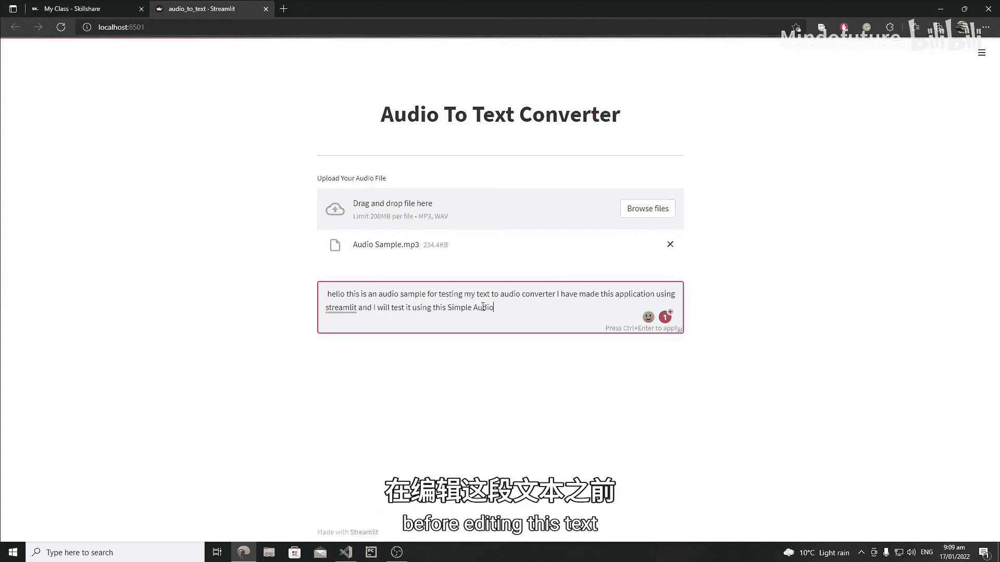
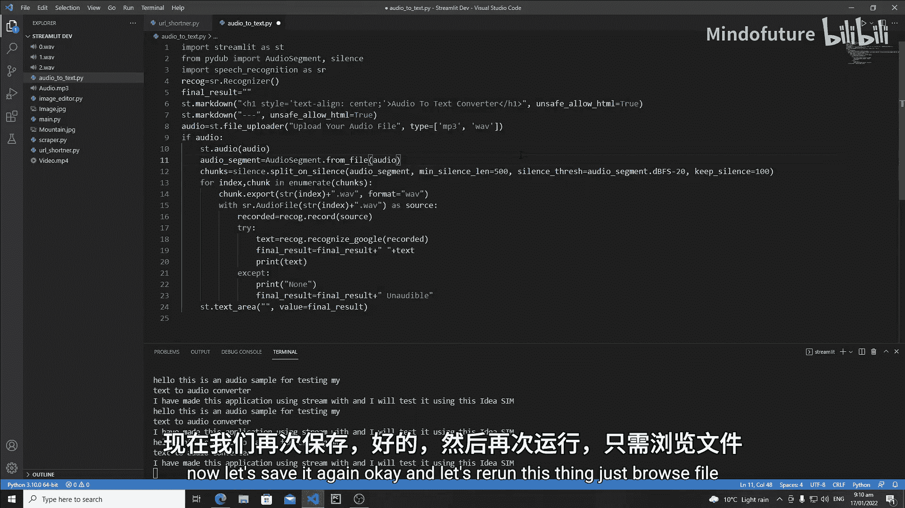
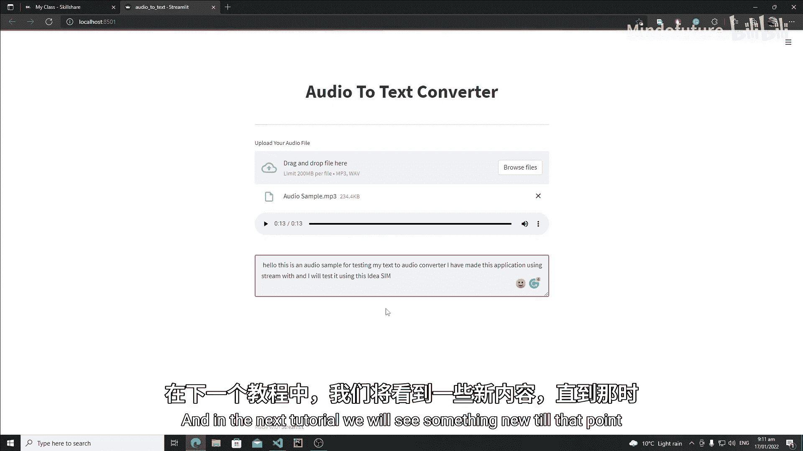

# 030：Streamlit 音频转文本转换器Web应用

## 概述
在本节课中，我们将继续开发音频转文本应用。上一节我们实现了音频文件的分块处理和语音识别，本节我们将学习如何在Streamlit Web应用中展示并优化识别结果。核心目标是让用户可以**查看和编辑**识别出的文本，并**播放原始音频**进行对照。

---

## 在Streamlit中展示可编辑的文本结果

上一节我们注意到，Google语音识别的结果并非100%准确。因此，与其以不可编辑的格式显示文本，不如将其放入一个可编辑的组件中。这样用户可以方便地修正识别错误。

为了实现这个功能，我们将使用 `st.text_area` 组件，因为它适合输入和显示大段文本。我们将把所有识别出的文本块合并成一个完整的字符串，然后一次性显示在这个文本区域中。

以下是实现步骤：

1.  首先，在代码中创建一个空字符串变量，用于累积最终的识别结果。
    ```python
    final_result = ""
    ```
2.  在遍历处理每个音频块的循环中，将每个块的识别文本追加到这个字符串中。
    ```python
    for chunk in chunks:
        # ... 识别代码 ...
        text = recognizer.recognize_google(audio_chunk)
        final_result = final_result + text + " "
        # 如果遇到无法识别的内容，可以添加标记
        # final_result = final_result + "[无法识别] "
    ```
3.  **重要**：`st.text_area` 组件必须创建在 `for` 循环**之外**。如果放在循环内部，会根据音频块的数量创建多个独立的文本输入框，这不是我们想要的效果。
4.  循环结束后，使用 `final_result` 变量来设置 `st.text_area` 的初始值。
    ```python
    st.text_area("识别文本", value=final_result, height=300)
    ```

---



## 添加音频播放器组件

为了让用户在编辑文本前能对照原始音频进行检查，我们还需要在应用中添加一个音频播放器。这非常简单，只需使用Streamlit的 `st.audio` 组件。

你只需要将上传的音频文件对象传递给这个组件即可：





```python
st.audio(uploaded_file)
```

添加这个组件后，用户界面将同时包含音频播放器和可编辑的文本区域，用户体验将更加完整。

---



## 最终应用效果与总结



按照上述步骤完成代码后，重新运行应用。现在，用户的操作流程是：
1.  上传一个音频文件。
2.  应用自动处理并显示识别出的文本在一个可编辑的文本框内。
3.  用户可以通过上方的音频播放器收听原始录音。
4.  根据听到的内容，用户可以直接在文本框中修改识别不准确的部分。
5.  编辑完成后，用户可以方便地复制最终文本，用于其他地方。

本节课中，我们一起学习了如何优化Streamlit应用的输出界面。我们通过 `st.text_area` 实现了文本的可编辑展示，并通过 `st.audio` 添加了音频播放功能，从而构建了一个用户友好、功能实用的音频转文本转换器Web应用。



在接下来的教程中，我们将探索Streamlit的更多新功能。