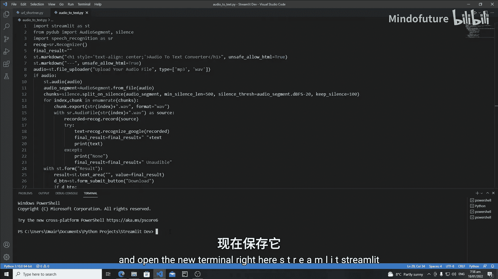
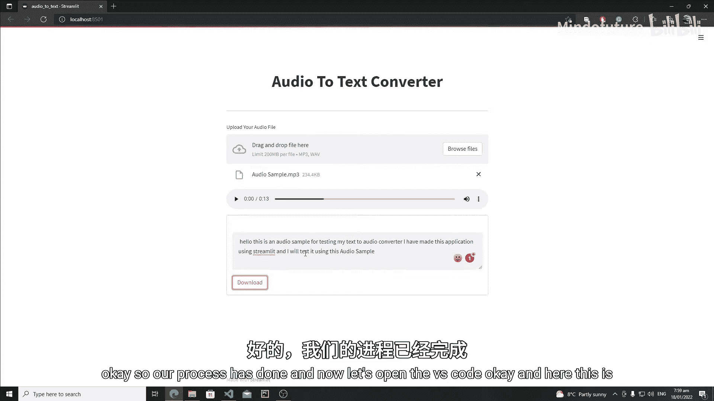
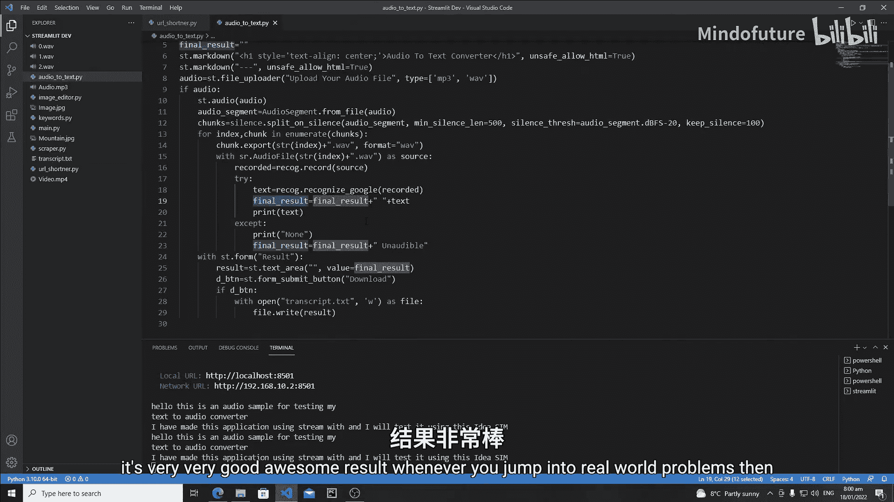
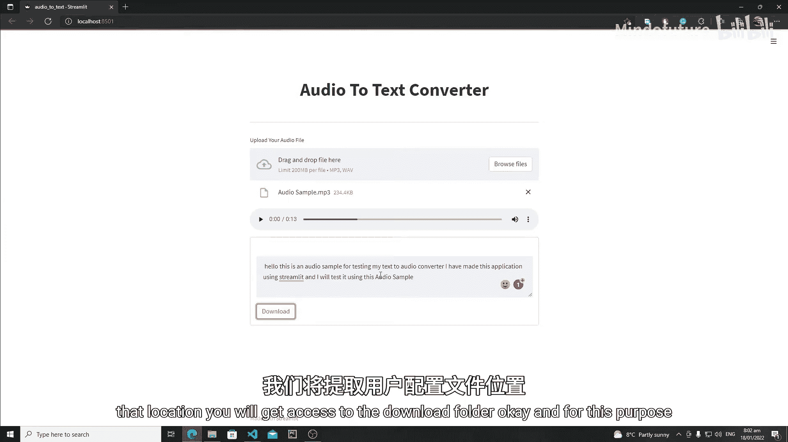
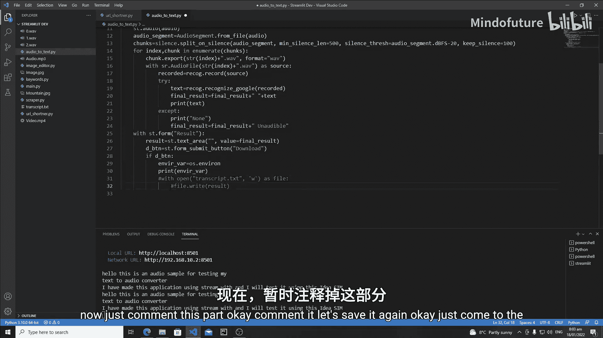
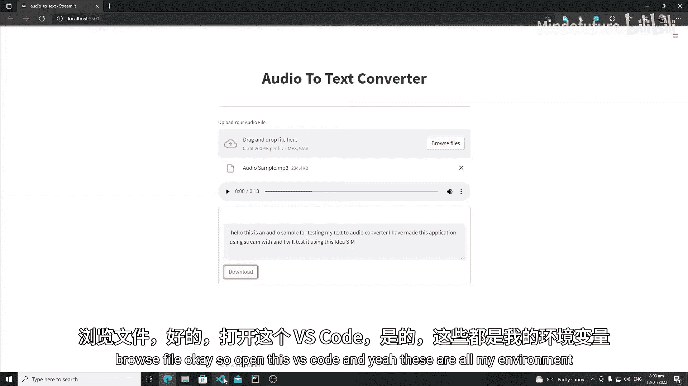
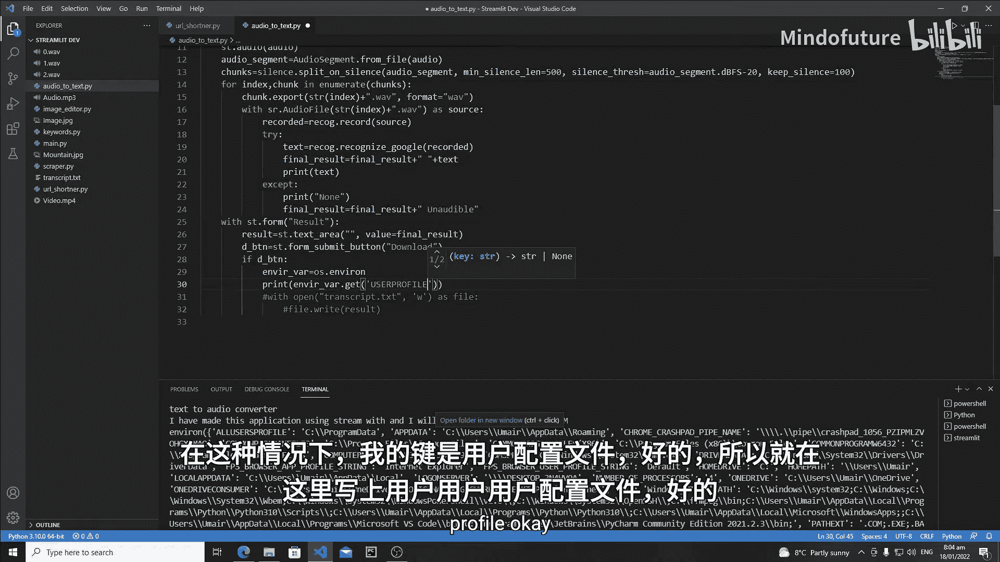
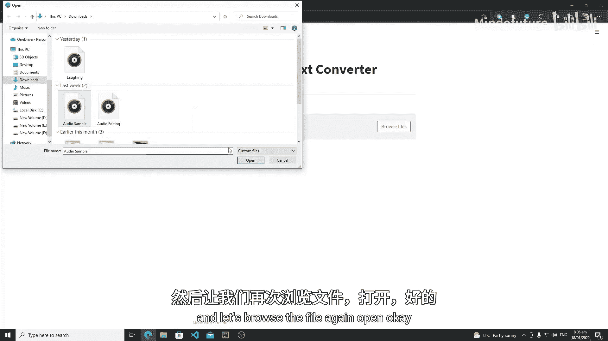
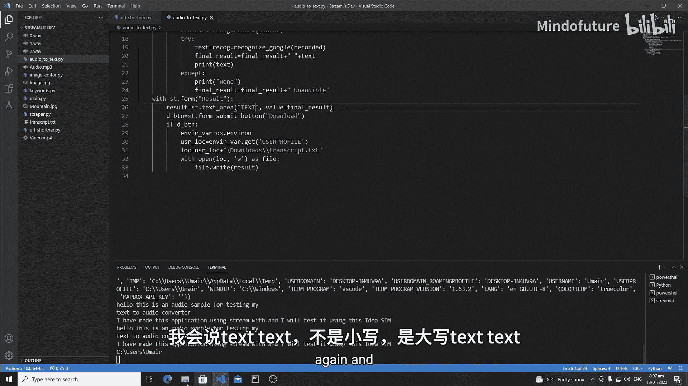
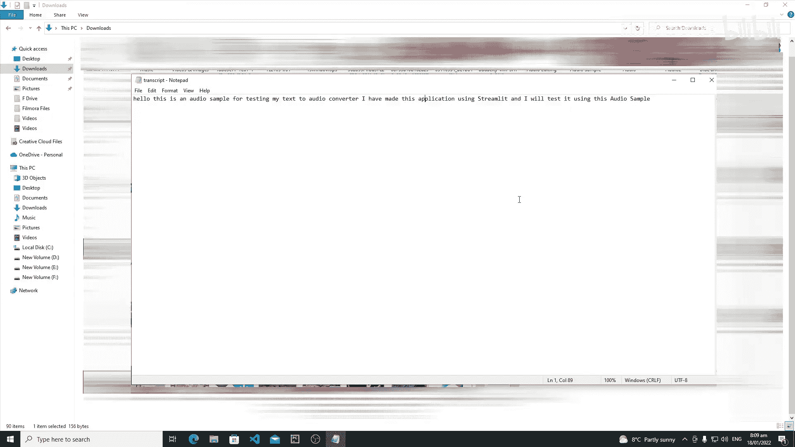

# 031：Streamlit 音频转文本转换器Web应用 - 添加下载功能

在本节课中，我们将修改我们的音频转文本转换器，并为其添加更多功能，例如下载翻译后的文件。我们将学习如何在表单中创建文本区域和下载按钮，以及如何将用户修改后的文本内容保存到其系统的下载文件夹中。

## 概述

上一节我们完成了音频转文本的核心功能。本节中，我们来看看如何让用户能够下载转换后的文本。我们将创建一个表单，内含一个可编辑的文本区域和一个下载按钮。当用户点击下载按钮时，程序会将文本区域中的内容保存为一个 `.txt` 文件，并自动保存到用户的下载文件夹中。

## 创建表单与下载按钮

首先，我们需要在应用中创建一个表单，用于容纳文本区域和下载按钮。

以下是创建表单和按钮的代码：



```python
with st.form(key='download_form'):
    text_area = st.text_area("编辑转换后的文本", value=final_result, height=300)
    download_btn = st.form_submit_button("📥 下载文本文件")
```

在这段代码中：
*   `st.form` 创建了一个表单容器，`key` 参数用于标识这个表单。
*   `st.text_area` 在表单内创建了一个文本编辑区域，其初始值 `value` 被设置为之前转换得到的 `final_result`。
*   `st.form_submit_button` 创建了一个表单提交按钮，其文本标签为“下载文本文件”。

## 处理下载逻辑





当用户点击下载按钮时，我们需要将文本区域中的内容写入一个文件。我们计划将文件保存到用户的“下载”文件夹中，以确保跨用户系统的兼容性。

以下是处理下载的核心逻辑：



```python
if download_btn:
    # 获取用户“下载”文件夹的路径
    user_profile = os.environ.get('USERPROFILE')
    downloads_path = os.path.join(user_profile, 'Downloads')
    file_path = os.path.join(downloads_path, 'transcript.txt')

    # 将文本内容写入文件
    with open(file_path, 'w', encoding='utf-8') as file:
        file.write(text_area)
    st.success(f"文件已成功下载至：{file_path}")
```

这段代码的执行步骤如下：
1.  **检查按钮状态**：`if download_btn:` 判断下载按钮是否被点击。
2.  **获取下载路径**：
    *   通过 `os.environ.get('USERPROFILE')` 获取当前用户的配置文件路径（例如 `C:\Users\YourName`）。
    *   使用 `os.path.join` 将“Downloads”文件夹名拼接上去，得到完整的下载文件夹路径。
    *   再次使用 `os.path.join` 指定要创建的文件名 `transcript.txt`。
3.  **写入文件**：
    *   `with open(file_path, 'w', encoding='utf-8') as file:` 以写入模式（`'w'`）和UTF-8编码打开（或创建）文件。`'w'` 模式会覆盖已存在的同名文件。
    *   `file.write(text_area)` 将文本区域 `text_area` 中的内容写入文件。
4.  **提示用户**：`st.success` 显示一条成功消息，告知用户文件保存的位置。



## 代码整合与运行

将上述代码整合到你的Streamlit应用中。完整的核心部分结构如下：







```python
import streamlit as st
import os
# ... 其他导入（如语音识别库）

# 音频上传和处理部分（之前的代码）
# ...

# 显示转换结果和下载表单
if final_result:
    st.subheader("转换结果")
    st.text(final_result)

    with st.form(key='download_form'):
        edited_text = st.text_area("编辑转换后的文本", value=final_result, height=300)
        download_btn = st.form_submit_button("📥 下载文本文件")

        if download_btn:
            user_profile = os.environ.get('USERPROFILE')
            downloads_path = os.path.join(user_profile, 'Downloads')
            file_path = os.path.join(downloads_path, 'transcript.txt')

            with open(file_path, 'w', encoding='utf-8') as file:
                file.write(edited_text)
            st.success(f"文件已成功下载至：{file_path}")
```

运行应用后，流程如下：
1.  上传音频文件并完成转换。
2.  转换结果显示在页面上，同时下方会出现一个文本编辑区域（内容已预填）和一个“下载文本文件”按钮。
3.  用户可以在文本区域中修改文本。
4.  点击“下载文本文件”按钮。
5.  页面提示文件已保存到“下载”文件夹，用户可以在该文件夹中找到 `transcript.txt` 文件。



## 总结



本节课中我们一起学习了如何为Streamlit音频转文本应用添加文件下载功能。我们创建了一个包含可编辑文本区域和下载按钮的表单，并利用Python的 `os` 模块动态获取用户系统的下载文件夹路径，从而实现了将用户修改后的文本内容一键保存到本地。这个功能极大地提升了应用的实用性和用户体验。在接下来的课程中，我们将探索Streamlit的更多高级特性。