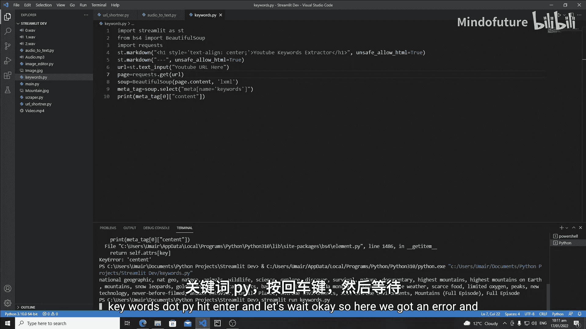
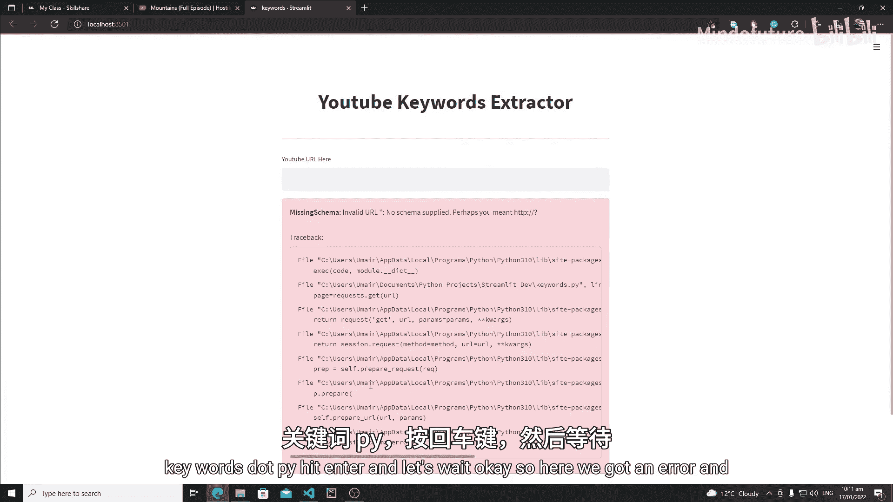
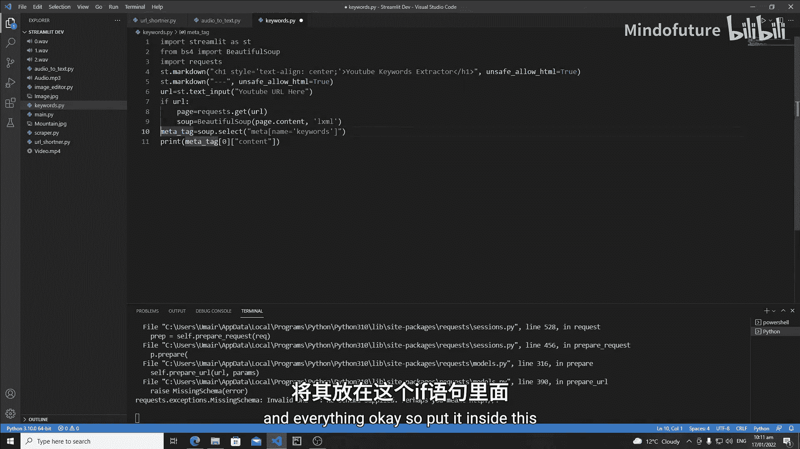
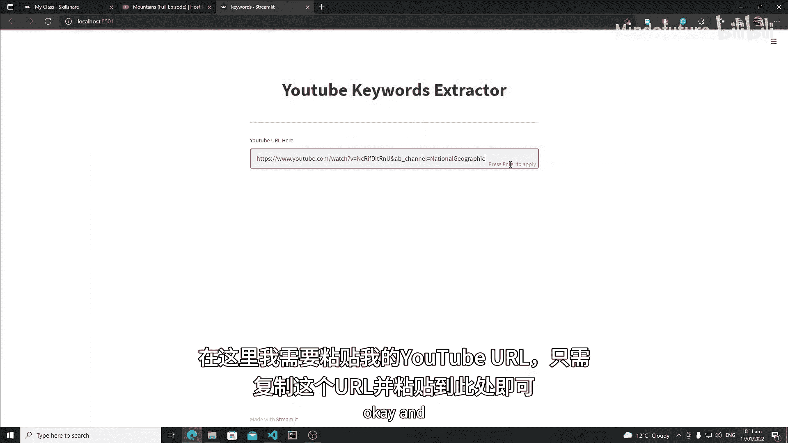
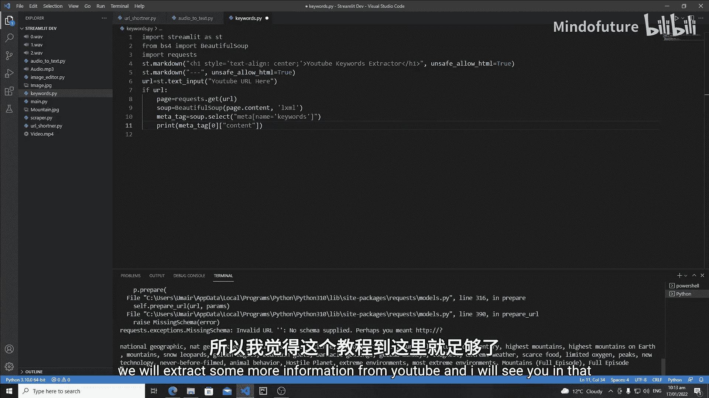

# 032：Streamlit YouTube 关键词提取器 Web 应用

在本教程中，我们将开始使用 Streamlit 制作一个 YouTube 关键词提取器应用程序。

## 理解 YouTube 页面结构

在开始抓取 YouTube 之前，理解 YouTube 的结构以及它在哪里存储视频的隐藏关键词非常重要。让我们开始理解其结构。

你需要右键点击页面，然后点击“检查元素”，这将打开开发者工具界面。虽然这里有很多代码行，但让我们回顾一些 HTML 和 CSS 的概念。

YouTube 关键词实际上是一种元数据。如果你对 HTML 和 CSS 编码有一点了解，就会知道我们总是将元数据放在 `<head>` 标签内。

首先，让我们在 `<head>` 标签内进行研究。关闭 `<body>` 标签，打开 `<head>` 标签。这里有很多 `<script>` 标签。这里有一个 `meta` 数据，但它的属性是 `property`，这不是我们要找的。

这里有一个 `meta` 标签，其 `name` 属性是 `keywords`，这些就是这个视频的所有关键词。这样，我们就获得了访问任何视频的 YouTube 隐藏关键词的途径。

同时，这里还有一个隐藏的描述信息。YouTube 为其网站提供了这个描述：“享受你喜爱的视频和音乐，上传原创内容，并与全世界的朋友、家人和观众分享。” 这是 YouTube 网站的隐藏描述。我们对此不关心，我们只关心这些关键词。

现在，我们将提取这部分内容。请记住，它位于 `<head>` 标签内，并且是一个 `meta` 标签。

## 开始创建抓取器

现在，让我们开始为它创建一个抓取器。打开你的 VS Code，创建一个新文件，命名为 `youtube_keywords.py`。

首先，我们需要导入 Streamlit。

```python
import streamlit as st
```

我们将使用 Beautiful Soup 进行网页抓取。

```python
from bs4 import BeautifulSoup
```

我们还需要导入另一个库：`requests`。

```python
import requests
```

借助 `requests` 库，我们将首先向 YouTube URL 发送 GET 请求，以查看它是否可抓取。复制一个 YouTube 视频的 URL。

在代码中，首先获取页面内容并检查状态码。

```python
page = requests.get('YOUR_YOUTUBE_URL_HERE')
print(page.status_code)
```

运行这段代码，如果输出是 `200`，则表示一切正常，我们成功发送了 GET 请求。

现在回到正题。将页面内容转换为 Beautiful Soup 对象。

```python
soup = BeautifulSoup(page.content, 'lxml')
```

我们已经成功将内容转换为 Beautiful Soup 对象。现在看看如何抓取 YouTube 关键词。

如你所见，页面中有多个 `<meta>` 标签。如何区分它们呢？这些标签没有类引用之类的标识。唯一的区别是每个 `<meta>` 标签有不同的 `name` 或 `property` 属性。

因此，我们可以借助 `name` 属性来区分它们。如果使用 `find` 或 `find_all` 函数，我们需要类引用来区分不同的标签，但这里没有类。我们只有一个解决方案：使用 CSS 选择器。

借助 CSS 选择器，我们可以实际区分每个 `<meta>` 标签。在代码中，我们将使用 `select` 或 `select_all` 函数来进行 CSS 选择。

```python
meta_tag = soup.select('meta[name="keywords"]')
print(meta_tag)
```

运行后，我们得到了输出。这是一个列表，我们需要访问列表的第一个值，也就是包含数据的那个元素。

```python
meta_tag = soup.select('meta[name="keywords"]')[0]
```

现在，我们需要访问这个元素的 `content` 属性值。

```python
keywords = meta_tag['content']
print(keywords)
```

运行后，我们成功提取出了所有关键词。

## 整合到 Streamlit 应用

现在是与 Streamlit 交互的时候了。首先创建一个标题。

```python
st.title('YouTube 关键词提取器')
```

在标题之后，创建一个简单的分隔线，然后创建一个文本输入组件。借助这个组件，我们将从用户那里获取 YouTube 链接。

```python
url = st.text_input('在此输入 YouTube 视频 URL')
```

将用户输入的信息保存在 `url` 变量中。然后，我们需要向这个 URL 发送请求。

我们需要检查用户输入的 URL 是否为空。如果用户输入了 URL，我们再处理所有内容。

```python
if url:
    page = requests.get(url)
    soup = BeautifulSoup(page.content, 'lxml')
    meta_tag = soup.select('meta[name="keywords"]')[0]
    keywords = meta_tag['content']
    st.write(keywords)
```

保存所有内容，然后运行我们的 Streamlit 应用。

```bash
streamlit run youtube_keywords.py
```





在浏览器中打开应用，输入一个 YouTube 视频 URL，然后按回车键。现在，页面上应该会显示提取出的所有关键词。



我们已成功提取出关键词。

## 总结

在本节课中，我们一起学习了如何分析 YouTube 页面的 HTML 结构以定位隐藏的关键词元数据。我们使用了 `requests` 库获取网页内容，并用 `BeautifulSoup` 进行解析。通过 CSS 选择器 `meta[name="keywords"]`，我们精准地找到了存储关键词的标签，并提取出其 `content` 属性的值。最后，我们将整个流程整合进一个 Streamlit 应用，通过文本输入框接收用户输入的 URL，并实时显示提取出的关键词。





在下一教程中，我们将在 Streamlit Web 应用上更好地展示这些关键词，并从 YouTube 提取更多信息。