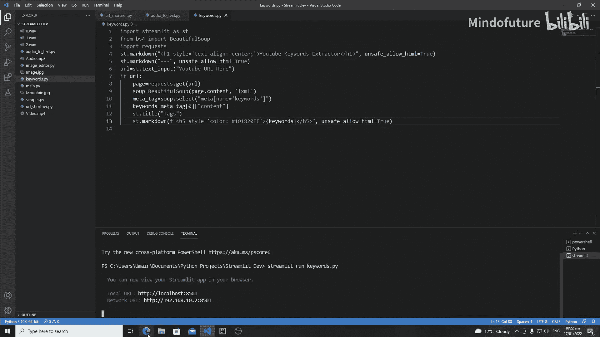
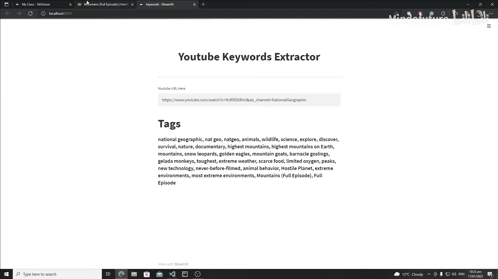
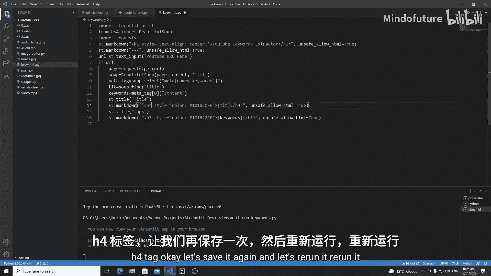
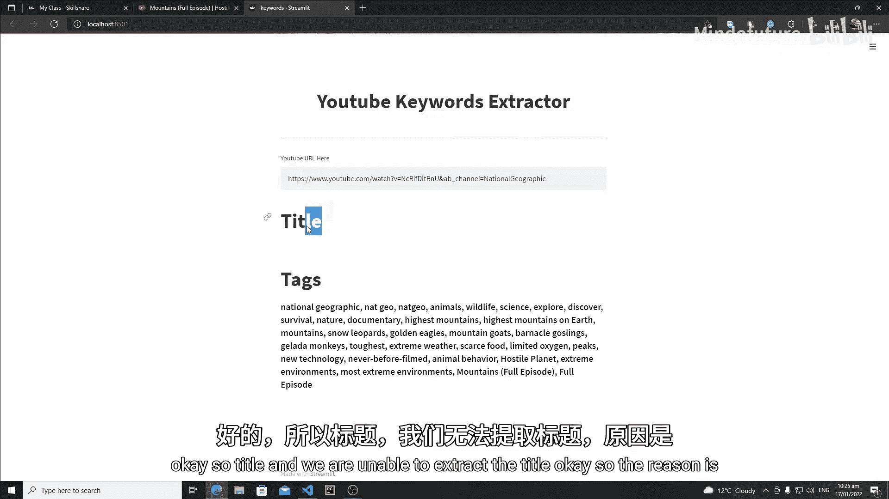
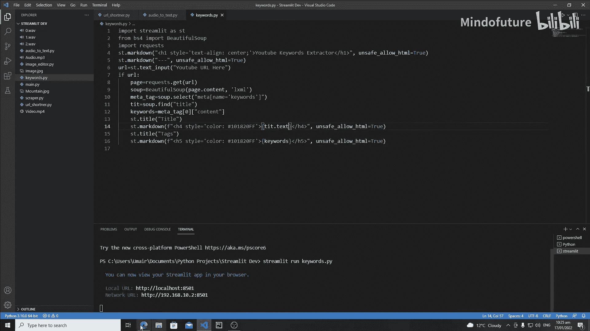
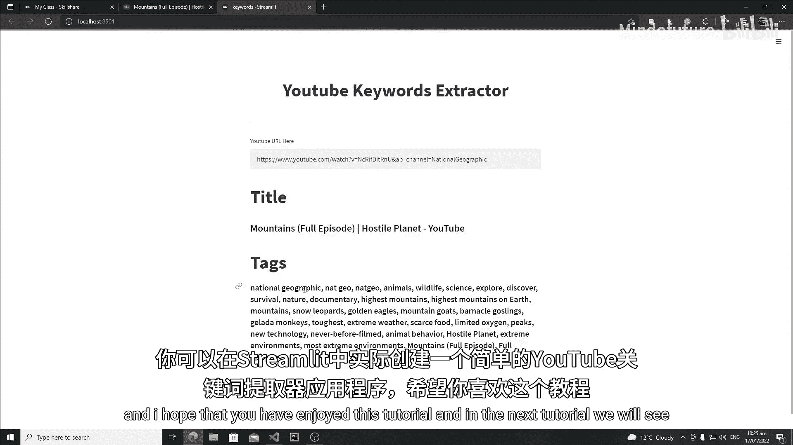

# 033：Streamlit YouTube关键词提取器Web应用

在本节课中，我们将继续开发YouTube关键词提取器应用，学习如何将提取到的关键词和视频标题美观地展示在Streamlit网页应用界面上，而不是仅仅在终端打印。

上一节我们完成了关键词的提取逻辑，本节中我们来看看如何将这些数据呈现在前端。

## 将关键词输出到Streamlit界面

首先，我们需要修改代码，将原本打印到终端的关键词保存到一个变量中，然后在Streamlit应用里显示它们。

以下是实现步骤：

1.  **保存关键词**：将提取到的关键词列表赋值给一个变量，例如 `KEYWORDS`。
2.  **创建标题**：使用 `st.title()` 或 `st.header()` 为关键词区域创建一个标题，例如“Tags”。
3.  **使用Markdown格式化输出**：利用 `st.markdown()` 函数，结合HTML标签（如 `<h5>`）来格式化显示文本。这允许我们自定义样式，比如颜色。
4.  **设置样式**：在HTML标签内使用 `style` 属性来定义颜色等CSS样式。例如，可以使用十六进制颜色代码。
5.  **允许不安全HTML**：由于我们使用了HTML标签，需要在 `st.markdown()` 中设置参数 `unsafe_allow_html=True`。



核心实现代码如下：
```python
# 假设keywords_list是提取到的关键词列表
KEYWORDS = keywords_list

# 为关键词区域创建标题
st.title("Tags")

# 使用Markdown和HTML格式化显示关键词
st.markdown(
    f'<h5 style="color: #FF6B6B;">{KEYWORDS}</h5>',
    unsafe_allow_html=True
)
```

运行应用后，输入一个YouTube视频链接，你将看到提取出的关键词以指定的样式显示在网页上。



## 提取并显示视频标题

除了关键词，视频标题也是一个重要信息。接下来，我们修改代码来一并提取并显示视频标题。

以下是具体操作：



1.  **提取标题**：使用BeautifulSoup查找包含视频标题的HTML元素。通常，标题位于 `<title>` 标签或特定的 `<meta>` 标签中。根据页面结构，找到正确的选择器。
2.  **获取文本内容**：提取到标题元素后，需要使用 `.text` 属性来获取其内部的纯文本字符串。
3.  **在界面上显示**：在关键词上方，先显示视频标题。可以创建一个新的标题（如使用 `st.title()`），然后同样用 `st.markdown()` 来显示标题文本，并可以使用不同的HTML标签（如 `<h4>`）以示区分。

实现此功能的代码修改如下：
```python
# 提取视频标题（假设通过soup对象查找）
title_element = soup.find('title') # 请根据实际页面结构调整选择器
video_title = title_element.text if title_element else "Title not found"

# 显示视频标题
st.title("Video Title")
st.markdown(
    f'<h4 style="color: #4ECDC4;">{video_title}</h4>',
    unsafe_allow_html=True
)





# 显示关键词（之前已实现的代码）
st.title("Tags")
st.markdown(
    f'<h5 style="color: #FF6B6B;">{KEYWORDS}</h5>',
    unsafe_allow_html=True
)
```

完成以上修改后，重新运行应用。现在，当你输入一个YouTube视频URL，应用将首先展示提取到的视频标题，然后在下方面显示所有的关键词。



本节课中我们一起学习了如何将后端提取的数据（视频标题和关键词）优雅地整合到Streamlit前端界面中。我们使用了 `st.markdown()` 配合HTML和CSS来定制显示样式，使得最终的应用界面信息清晰、美观。至此，一个功能完整的简易版YouTube关键词提取器Web应用就构建完成了。在接下来的课程中，我们将探索Streamlit的更多新功能。