# 034：Streamlit 关键词密度检查器 Web 应用

在本教程中，我们将开始使用 Streamlit 制作一个关键词密度检查器应用程序。这个工具对于搜索引擎优化（SEO）非常重要，它能帮助你分析特定关键词在文本段落中出现的频率，从而撰写更符合搜索引擎友好的内容。

## 概述

我们将创建一个 Web 应用，允许用户输入一段文本（段落），然后程序会清理文本、分割成单词，并计算每个单词出现的次数。这是构建关键词密度分析器的核心逻辑。

## 创建项目文件与基础设置

首先，我们需要创建一个 Python 文件。我们将它命名为 `density_checker.py`。

接下来，导入必要的库并设置应用标题。

```python
import streamlit as st
import re

st.title("关键词密度检查器")
st.write("此应用用于检查特定单词在文本行或段落中的密度。")
```

## 获取用户输入

我们需要一个文本区域让用户输入他们想要分析的段落。

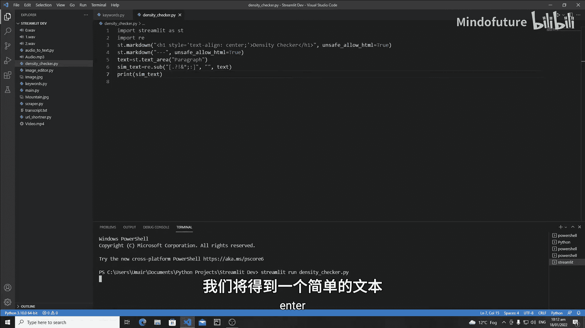

```python
text = st.text_area("请输入段落：", height=150)
```

## 文本预处理

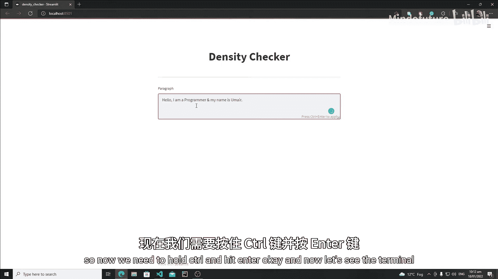

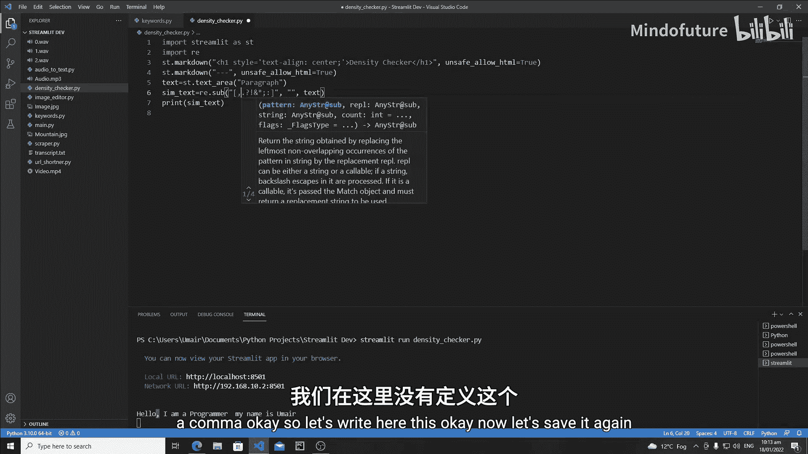

在分析之前，必须清理文本。这包括移除标点符号并将所有字符转换为小写，以确保分析的准确性。

以下是文本预处理的步骤：

1.  **移除特殊字符**：使用正则表达式 `re.sub()` 方法移除句号、问号、感叹号等标点。
2.  **转换为小写**：使用 `.lower()` 方法确保大小写不影响单词计数。
3.  **分割成单词列表**：使用 `.split()` 方法根据空格将文本分割成独立的单词。

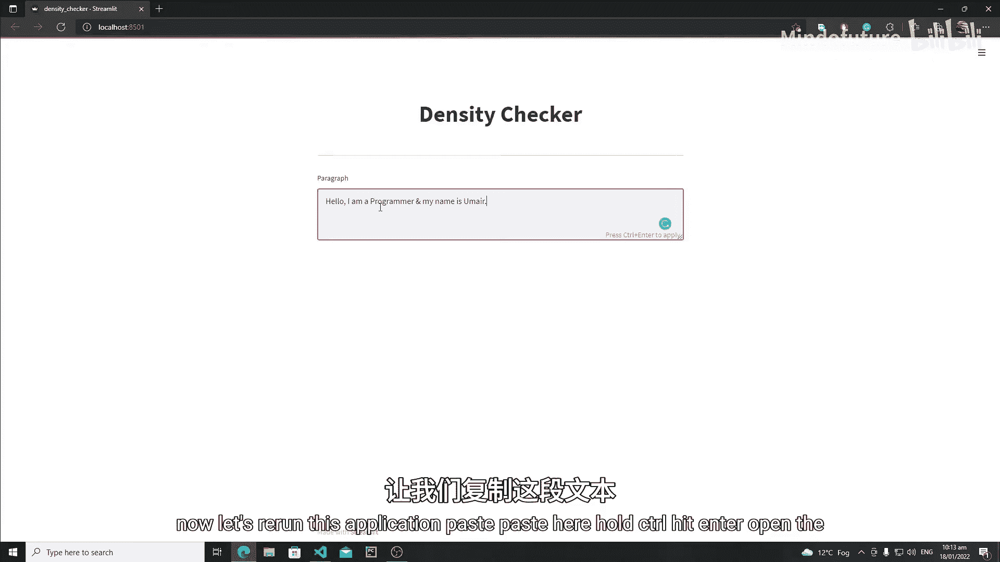

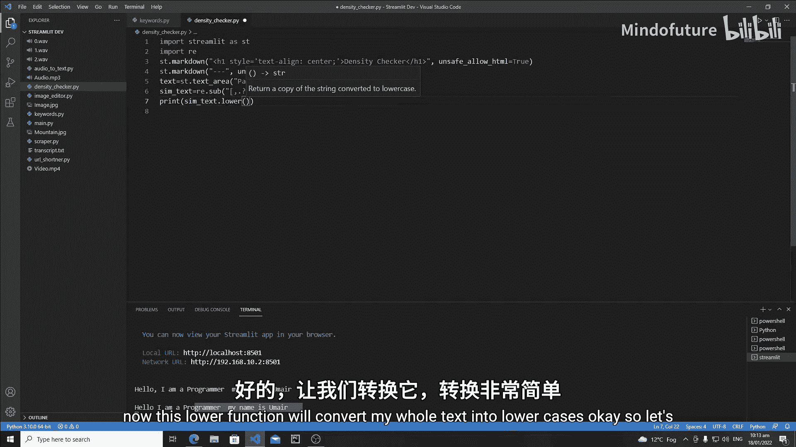

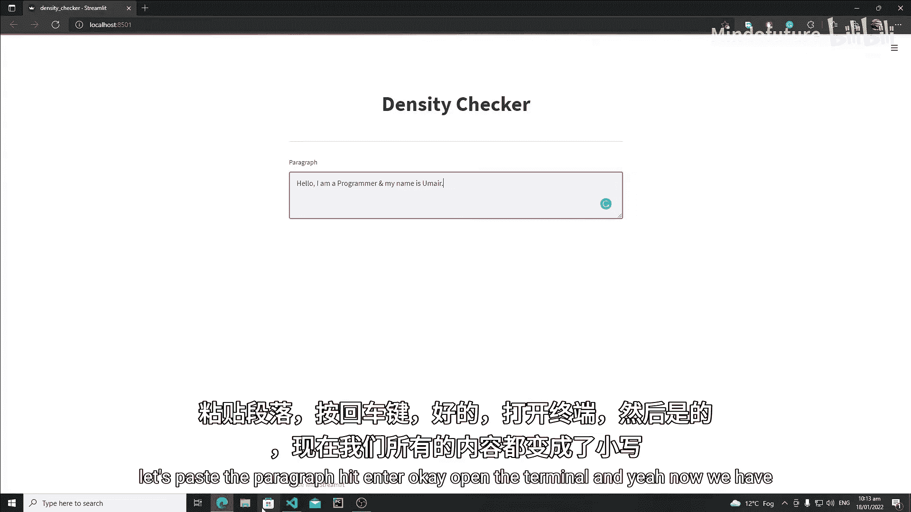

对应的代码如下：

```python
if text:
    # 1. 移除特殊字符
    simple_text = re.sub(r'[.,?!;:\-*]', '', text)
    # 2. 转换为小写
    simple_text = simple_text.lower()
    # 3. 分割成单词列表
    words = simple_text.split()
```

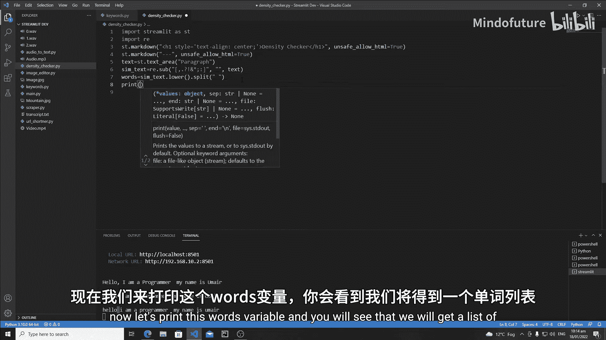

## 构建关键词密度逻辑

文本预处理完成后，下一步是统计每个单词出现的频率。我们将使用一个字典来存储结果，其中键是单词，值是该单词出现的次数。

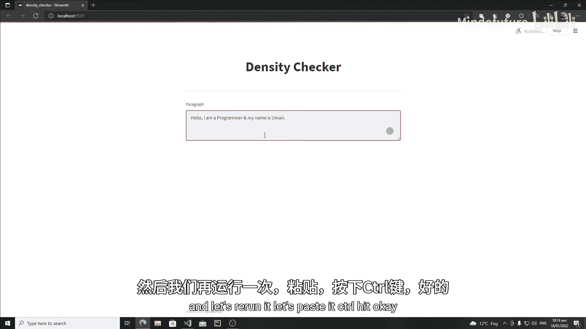

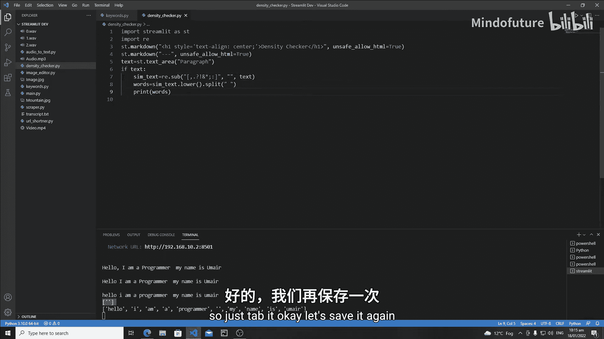

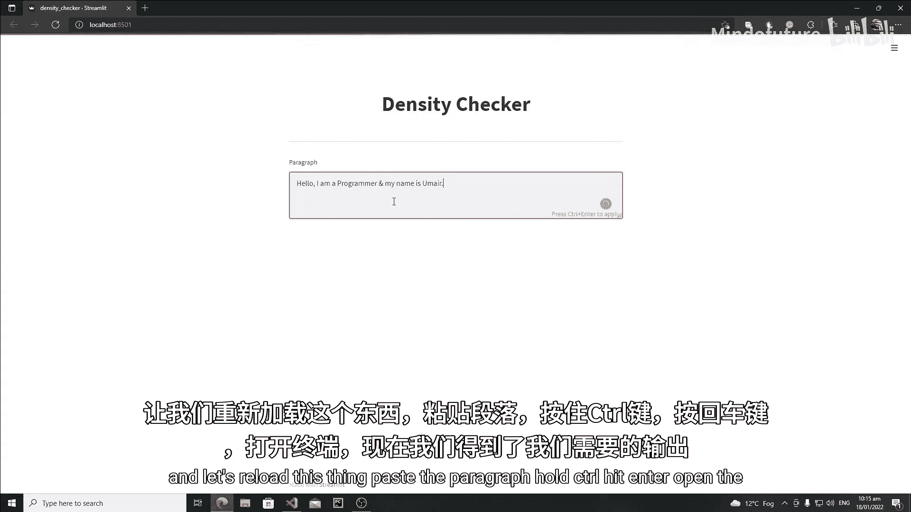

以下是构建字典的逻辑：

1.  遍历分割后的单词列表。
2.  检查当前单词是否已存在于字典中。
3.  如果存在，将其计数值加1。
4.  如果不存在，在字典中创建该单词作为新键，并将其初始值设为1。

```python
    word_dict = {}
    for word in words:
        if word in word_dict:
            word_dict[word] += 1
        else:
            word_dict[word] = 1

    st.write("单词出现频率统计：")
    st.write(word_dict)
```

## 测试应用程序

现在，让我们运行应用程序来测试其功能。

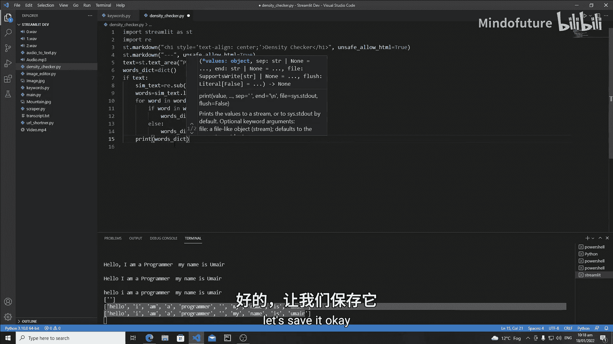

1.  在终端中运行命令：`streamlit run density_checker.py`。
2.  在打开的网页文本框中输入一段文字，例如：“Hello, I am a programmer. I love programming!”。
3.  按下 `Ctrl+Enter`（或在文本框外点击）提交。
4.  应用程序下方将显示一个字典，展示每个单词及其出现的次数。例如：`{'hello': 1, 'i': 2, 'am': 1, 'a': 1, 'programmer': 1, 'love': 1, 'programming': 1}`。

## 总结

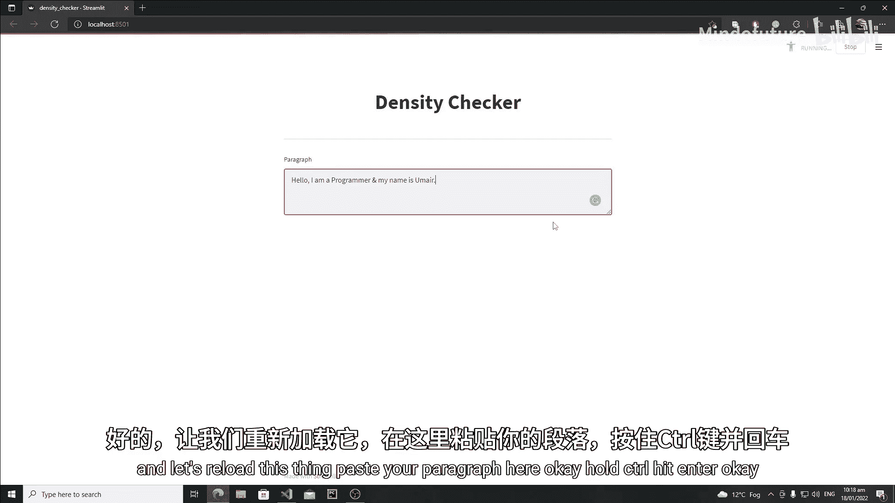

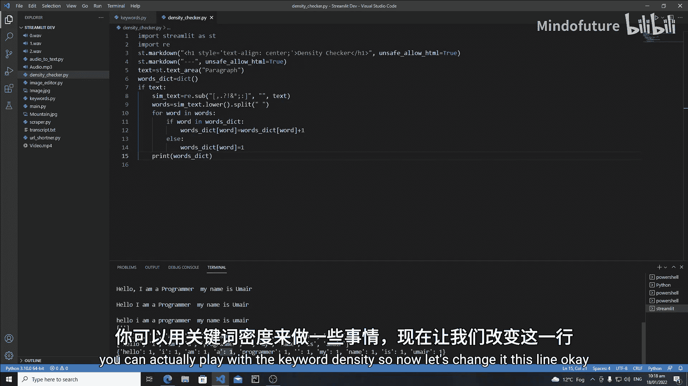

在本节课中，我们一起学习了如何使用 Streamlit 构建一个关键词密度检查器 Web 应用的基础部分。我们完成了以下核心步骤：

*   创建了应用界面并获取用户输入。
*   使用正则表达式和字符串方法对文本进行预处理（清理标点、统一小写、分割单词）。
*   实现了核心逻辑，通过遍历列表和使用字典来统计每个单词的出现频率。

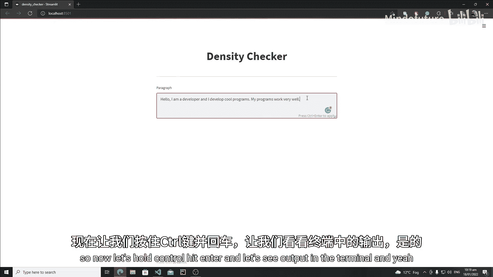

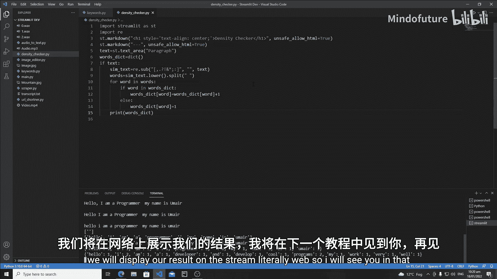

目前，我们的应用可以输出原始的单词频率字典。在下一节课中，我们将在此基础上进行扩展，计算每个单词的出现百分比，并以更美观、直观的格式（如表格或图表）在 Streamlit 网页上展示结果。