# 035：Streamlit 关键词密度检查器 Web 应用

在本节课中，我们将继续开发关键词密度检查器应用。我们将学习如何从字典中提取数据，并使用 Streamlit 的布局功能，将关键词、出现次数和百分比以美观的表格形式展示在网页上。

## 概述

上一节我们构建了一个字典，用于存储每个关键词及其在文本中出现的次数。本节中，我们将把这个字典的内容清晰地展示在 Streamlit 应用界面上。我们将使用多列布局，分别显示关键词、出现次数和计算出的百分比。

## 从字典中提取数据

首先，我们需要从 `word_dictionary` 字典中分别提取出所有的键（关键词）和值（出现次数）。我们将把它们转换为列表格式，以便后续遍历和展示。

以下是提取键和值的代码：

```python
keys = list(word_dictionary.keys())
values = list(word_dictionary.values())
```

*   `word_dictionary.keys()` 返回字典中所有的键。
*   `list()` 函数将其转换为列表。
*   `word_dictionary.values()` 返回字典中所有的值。
*   同样使用 `list()` 函数将其转换为列表。

## 遍历并展示数据

现在我们有了 `keys` 和 `values` 两个列表。我们需要遍历它们，并将每一项内容显示出来。我们将使用一个 `for` 循环，循环次数由列表的长度决定。

以下是遍历和展示数据的初始代码：

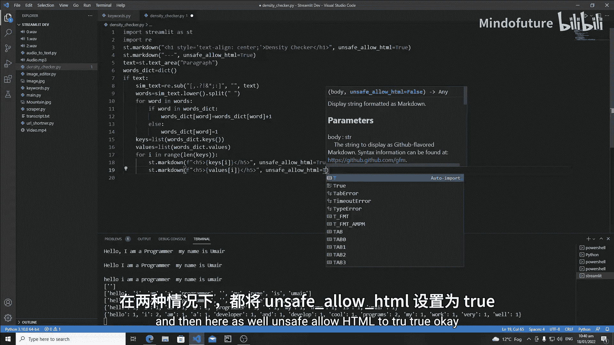

```python
for i in range(len(keys)):
    st.markdown(f"<h5>{keys[i]}</h5>", unsafe_allow_html=True)
    st.markdown(f"<h5>{values[i]}</h5>", unsafe_allow_html=True)
```

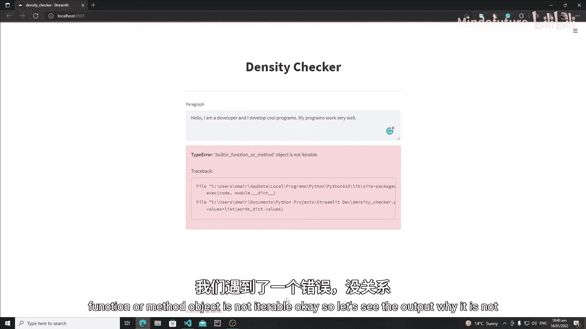

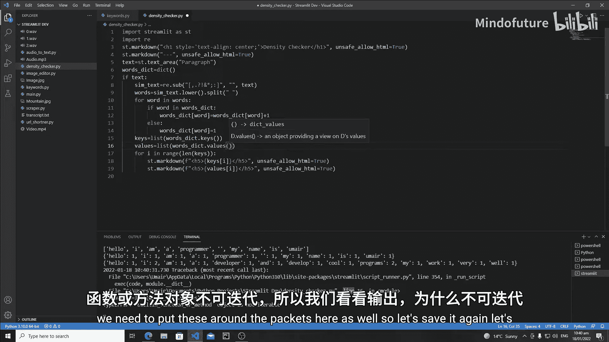

这段代码会依次显示每个关键词及其出现次数，但它们是上下排列的，不够直观。

## 优化布局：使用多列

为了获得更好的视觉效果，我们将使用 Streamlit 的 `columns` 功能创建三列，分别用于显示关键词、出现次数和百分比。

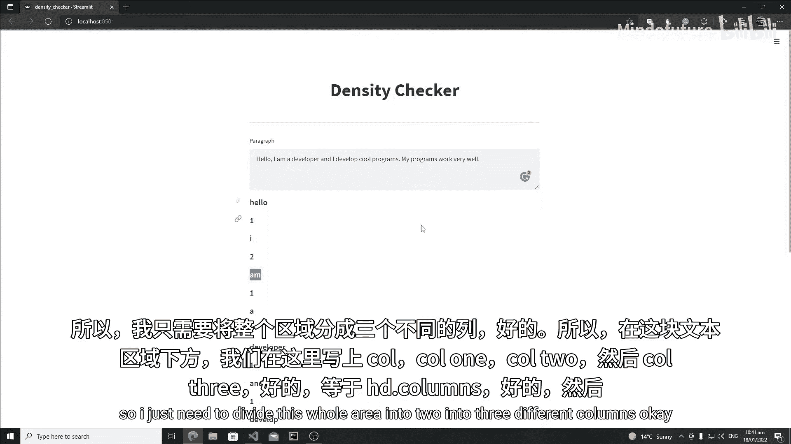

以下是创建三列布局的代码：

```python
col1, col2, col3 = st.columns(3)
```

现在，我们可以在循环内，将内容分别放入对应的列中。同时，我们还需要计算每个关键词出现的百分比。

以下是优化后的循环代码：

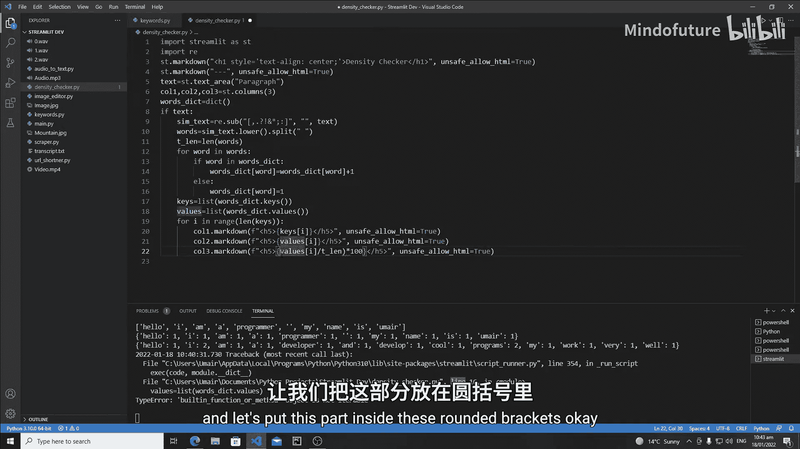

```python
total_length = len(words)  # 计算文本总词数

for i in range(len(keys)):
    with col1:
        st.markdown(f"<h5>{keys[i]}</h5>", unsafe_allow_html=True)
    with col2:
        st.markdown(f"<h5>{values[i]}</h5>", unsafe_allow_html=True)
    with col3:
        percentage = (values[i] / total_length) * 100
        st.markdown(f"<h5>{round(percentage, 2)}%</h5>", unsafe_allow_html=True)
```

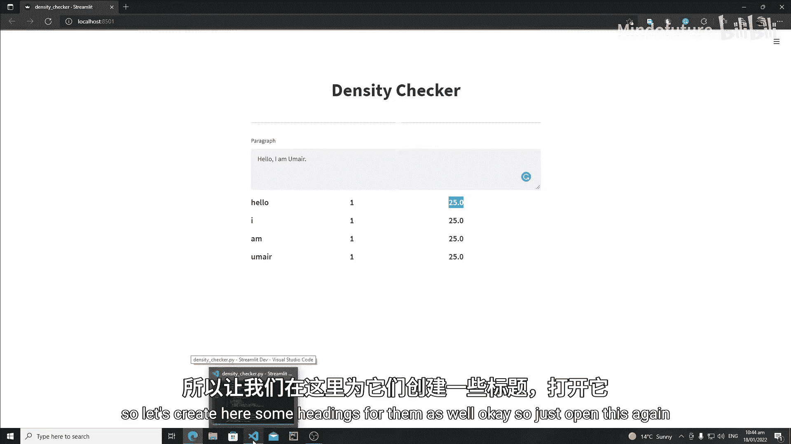

*   `total_length` 是输入文本的总词数。
*   百分比的计算公式为：`(某个词的出现次数 / 总词数) * 100`。
*   `round(percentage, 2)` 将百分比结果四舍五入到小数点后两位，使显示更整洁。

## 添加列标题

为了让表格更清晰，我们还需要为每一列添加一个标题。标题应该添加在循环开始之前。

以下是添加列标题的代码：

```python
with col1:
    st.markdown("<h3 style='text-align: center;'>关键词</h3>", unsafe_allow_html=True)
with col2:
    st.markdown("<h3 style='text-align: center;'>出现次数</h3>", unsafe_allow_html=True)
with col3:
    st.markdown("<h3 style='text-align: center;'>百分比</h3>", unsafe_allow_html=True)
```

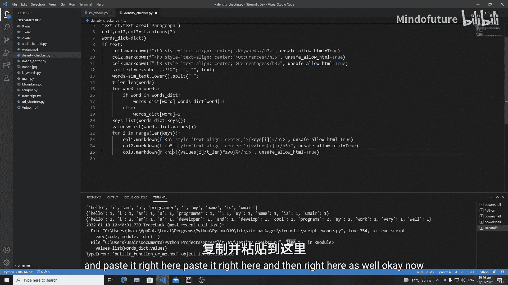

`style='text-align: center;'` 用于将标题文字居中显示。

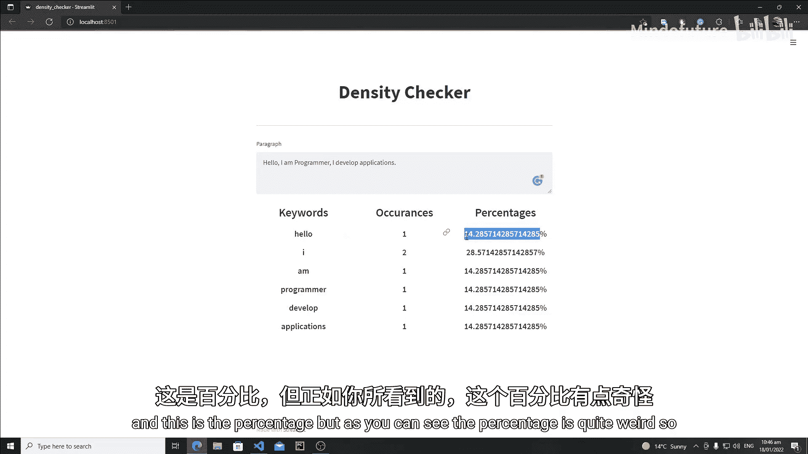

## 最终效果

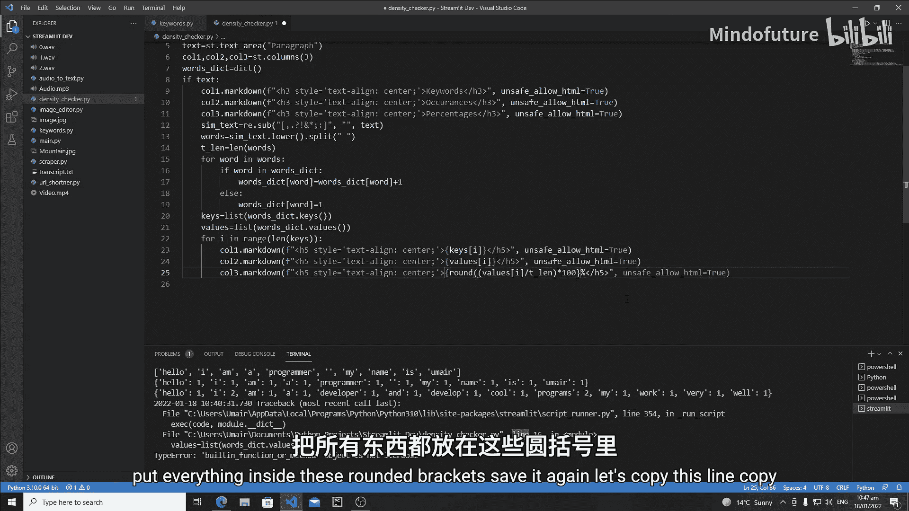

完成以上所有步骤后，运行应用并输入一段文本。你将看到一个清晰的三列表格，展示了每个关键词、它的出现频率以及占总词数的百分比。

## 总结

本节课中，我们一起学习了如何将 Python 字典中的数据有效地展示在 Streamlit 网页应用中。关键步骤包括：
1.  使用 `list(dict.keys())` 和 `list(dict.values())` 从字典提取数据。
2.  使用 `st.columns()` 创建多列布局以组织内容。
3.  在循环中遍历数据，并将每一项放入对应的列容器中。
4.  进行简单的数学计算（如百分比）并格式化输出。
5.  为各列添加标题以提升可读性。

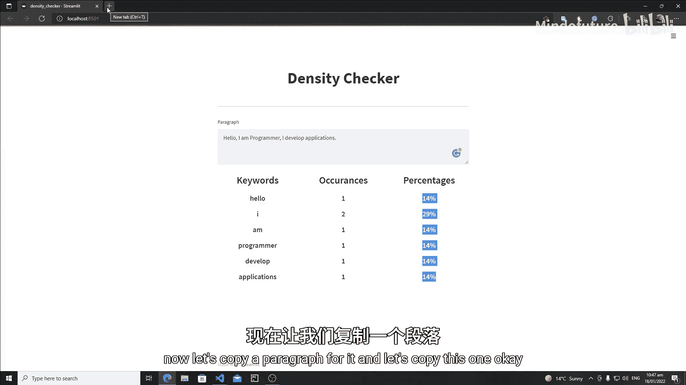

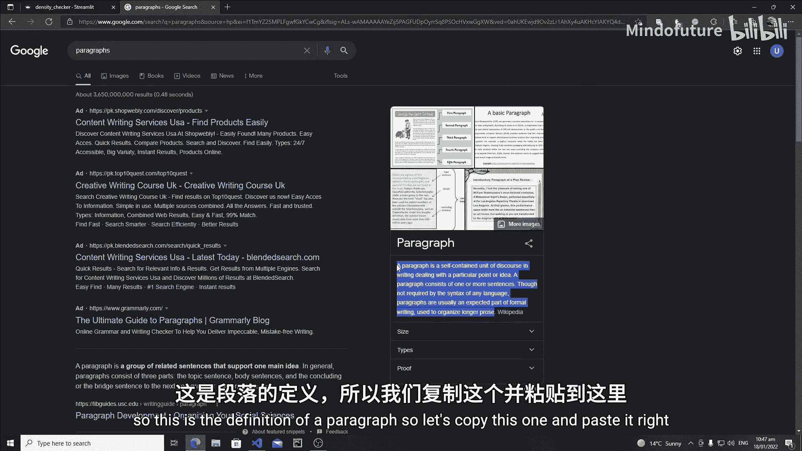

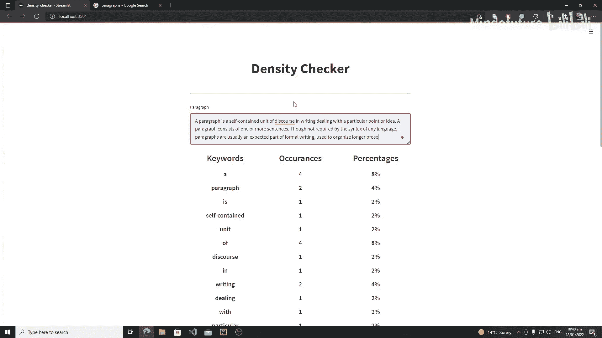

通过本节的实践，你已经掌握了使用 Streamlit 构建数据展示界面的基本方法。在接下来的教程中，我们将探索 Streamlit 的更多功能。