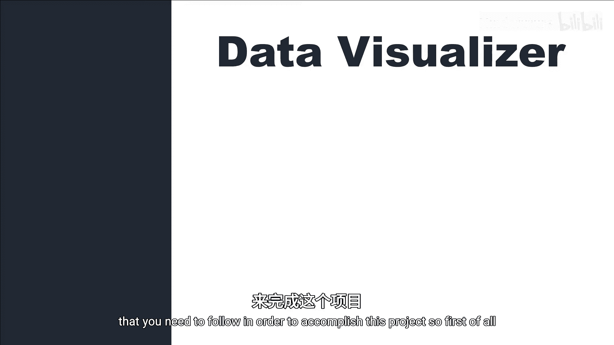
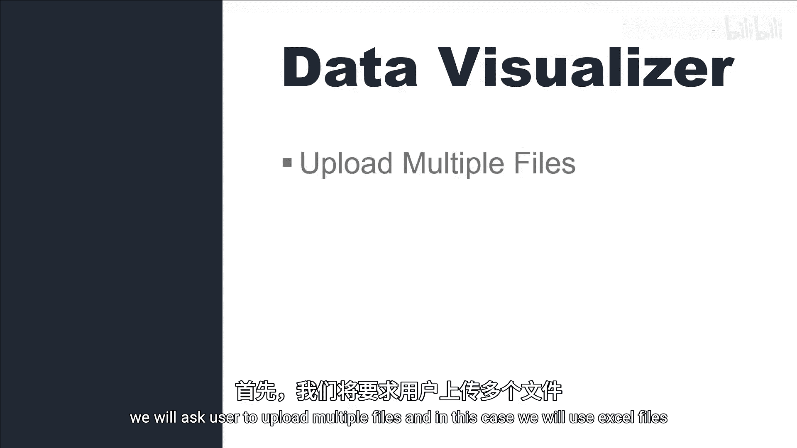
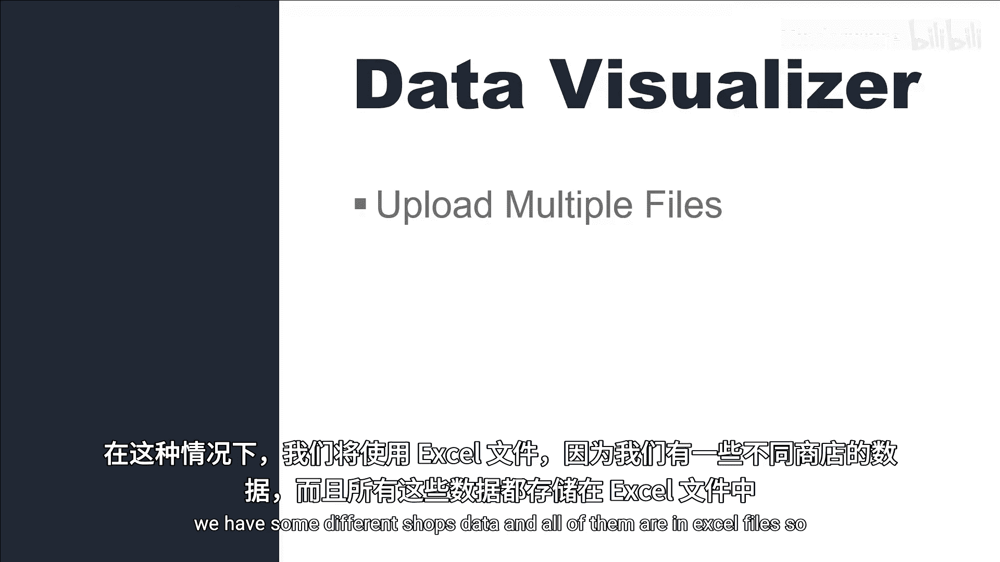
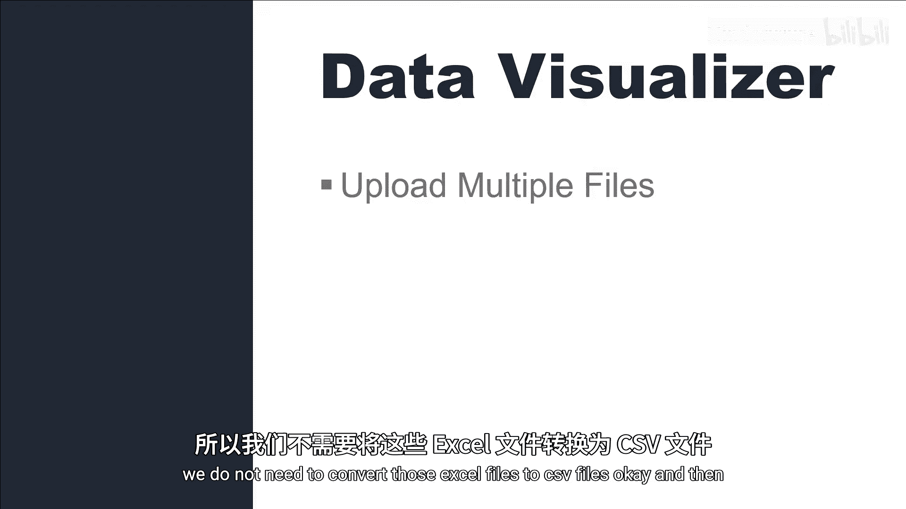
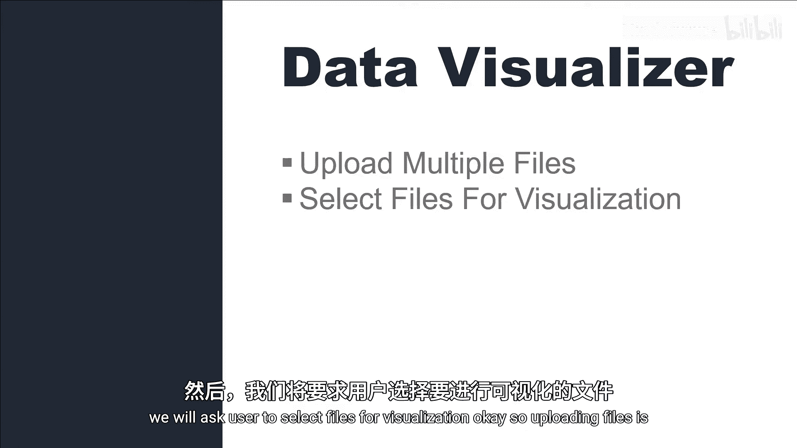
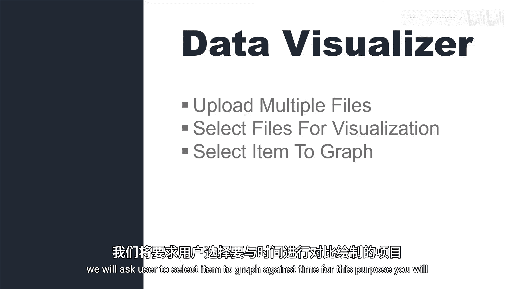
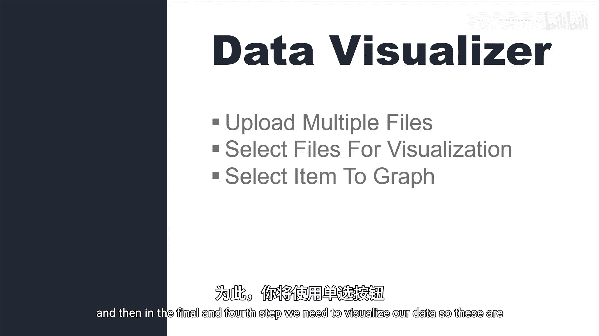
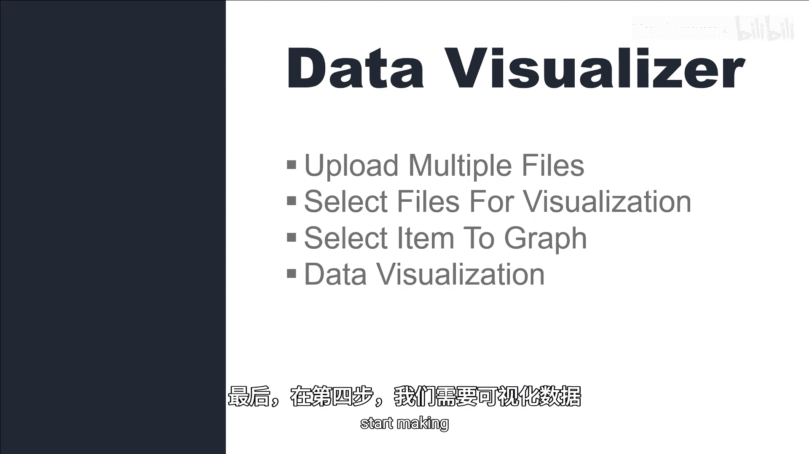

# 036：Streamlit 数据可视化 Web 应用

在本节课中，我们将开始制作一个数据可视化应用。我们将学习如何构建一个允许用户上传、选择并可视化Excel数据的完整流程。

## 项目概述与步骤

要完成这个项目，我们需要遵循四个核心步骤。首先，用户需要上传多个Excel文件。接着，用户从已上传的文件中选择需要可视化的文件。然后，用户通过单选按钮选择要针对时间进行绘制的数据项。最后，我们将根据用户的选择生成可视化图表。

以下是实现此项目的具体步骤列表：

1.  让用户上传多个Excel文件。
2.  让用户从已上传的文件中选择要可视化的文件。
3.  让用户通过单选按钮选择要针对时间进行绘制的数据项。
4.  根据用户的选择，将数据可视化。

在下一节教程中，我们将正式开始编写代码来实现这些功能。

---

---

本节课中，我们一起学习了构建Streamlit数据可视化应用的整体规划和四个关键步骤。从下一节课开始，我们将动手编写代码，逐步实现文件上传、选择、配置和可视化的完整功能。