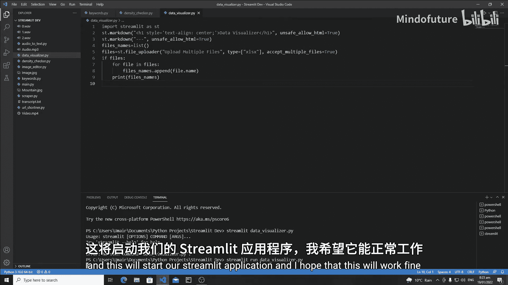
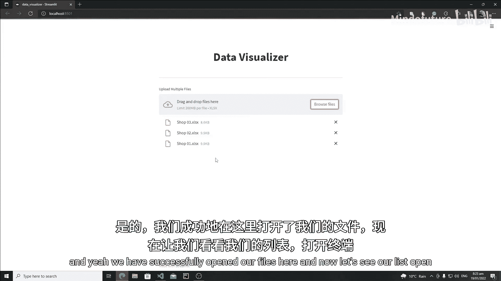
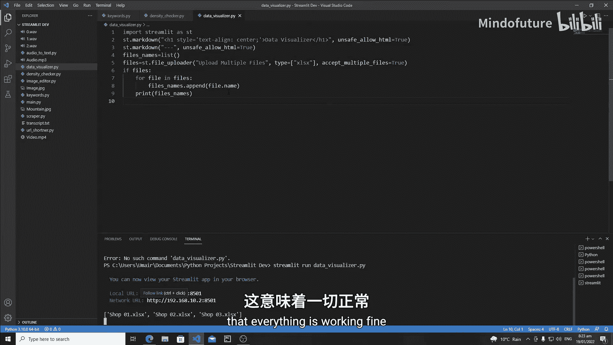
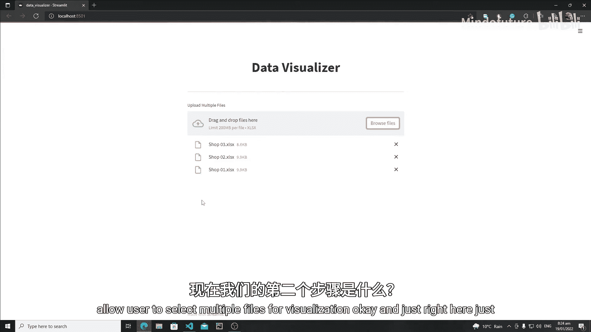
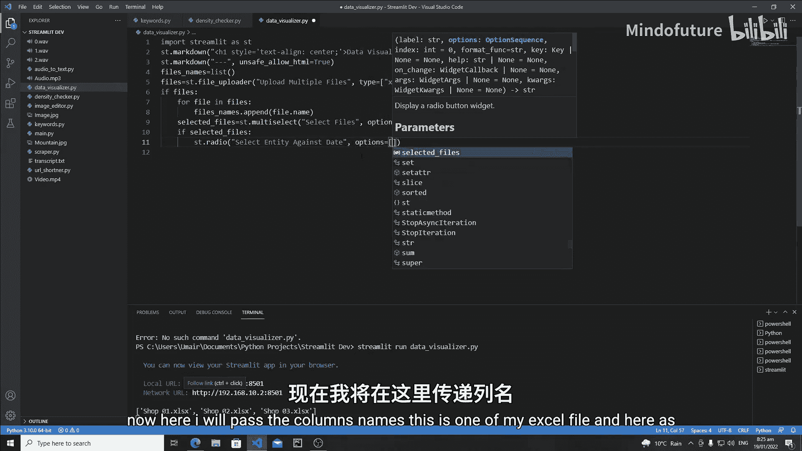
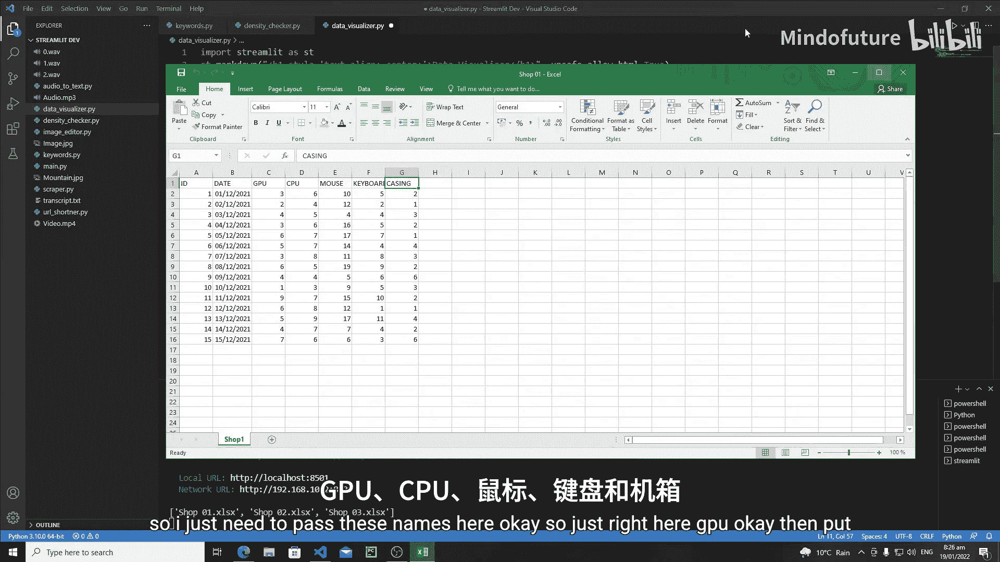
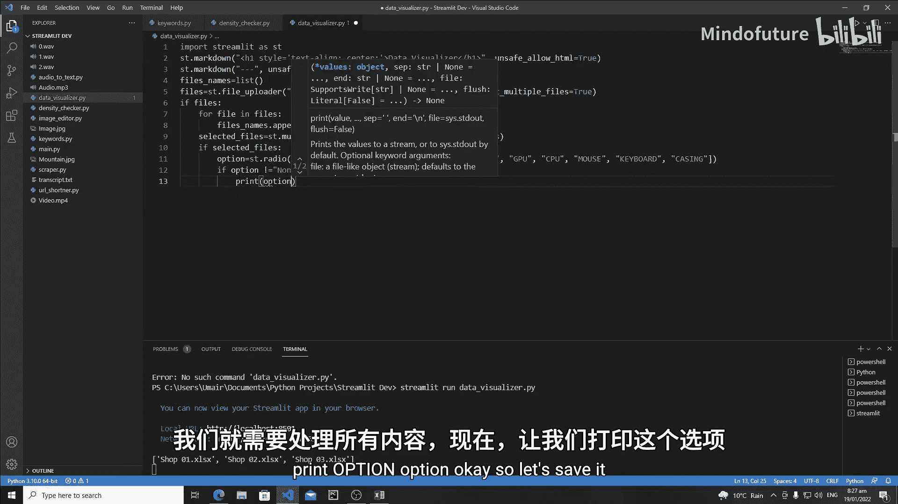
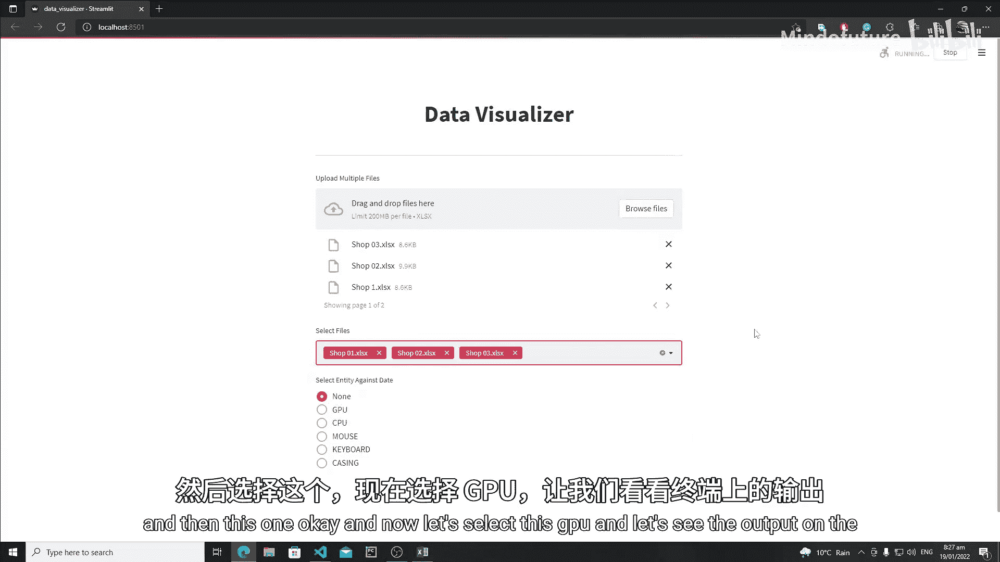
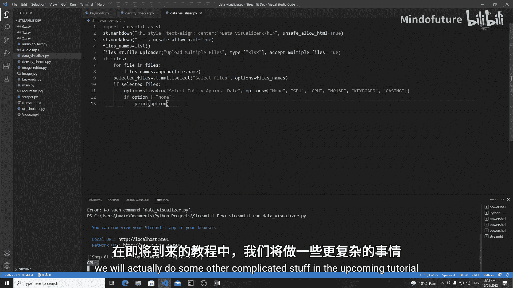

# 037：数据可视化应用 - 文件上传与选择

在本节课中，我们将开始构建一个数据可视化应用。我们将学习如何创建一个文件上传器，允许用户上传多个Excel文件，并提供一个交互式界面让用户选择要分析的文件和数据列。

## 概述

我们将创建一个名为 `data_visualizer.py` 的Python文件。应用的核心功能包括：
1.  使用 `st.file_uploader` 上传多个 `.xlsx` 文件。
2.  使用 `st.multiselect` 让用户从上传的文件中选择一个或多个进行分析。
3.  使用 `st.radio` 让用户选择要针对“债务”数据进行分析的实体（如GPU、CPU等）。

现在，让我们一步步来实现它。

## 创建应用文件与标题

首先，我们需要导入Streamlit库并设置应用的标题。

```python
import streamlit as st

st.title('数据可视化应用')
```

## 创建文件上传器

接下来，我们需要创建一个文件上传部件，允许用户上传多个Excel文件。我们使用 `st.file_uploader` 函数来实现。



以下是创建文件上传器的代码：
```python
uploaded_files = st.file_uploader(
    "上传多个文件",
    type=['xlsx'],
    accept_multiple_files=True
)
```
*   `label`：定义了上传按钮旁显示的文本。
*   `type`：限制了用户只能上传 `.xlsx` 格式的文件。
*   `accept_multiple_files=True`：允许用户一次性选择并上传多个文件。

## 获取上传文件的名称

用户上传文件后，我们需要获取这些文件的名称，以便后续让用户进行选择。我们通过遍历 `uploaded_files` 列表来实现。





以下是获取文件名的逻辑：
```python
file_names = []
if uploaded_files:
    for file in uploaded_files:
        file_names.append(file.name)
    # print(file_names) # 用于调试，在实际应用中可注释掉
```
*   首先检查 `uploaded_files` 是否不为空（即用户已上传文件）。
*   然后遍历每个文件对象，将其 `name` 属性（文件名）添加到一个列表中。



## 创建文件选择部件

上一节我们获取了文件名列表，本节中我们来看看如何让用户选择要分析的具体文件。我们将使用 `st.multiselect` 创建一个多选下拉菜单。

以下是创建多选部件的代码：
```python
selected_files = st.multiselect(
    "选择文件",
    options=file_names
)
```
*   `label`：定义了选择框的标签。
*   `options`：将上一步获取的 `file_names` 列表作为可选项提供给用户。

## 创建数据分析选项

当用户选择了文件后，我们需要进一步询问他们想分析什么数据。这里我们假设每个Excel文件都有“债务”列，以及“GPU”、“CPU”等实体列。我们使用 `st.radio` 创建一个单选按钮组。

以下是创建单选按钮的代码：
```python
if selected_files:
    option = st.radio(
        "选择要对比债务的实体",
        options=['GPU', 'CPU', 'mouse', 'keyboard', 'casing', 'None']
    )
```
*   只有当 `selected_files` 不为空（即用户已选择文件）时，才会显示这个单选按钮。
*   `options` 参数列出了所有可选的实体，以及一个“None”选项，表示不进行特定分析。





## 处理用户选择

最后，我们需要对用户的选择做出响应。当用户没有选择“None”时，我们执行后续的数据处理逻辑（本节课暂不实现，仅打印选项）。



以下是处理选择的代码：
```python
    if option != 'None':
        # 这里将放置后续读取Excel文件和进行数据可视化的代码
        # 本节课暂时只打印出用户的选择
        print(option)
```
*   通过判断 `option` 是否等于 `'None'` 来决定是否进行数据处理。

## 总结

本节课中我们一起学习了构建Streamlit数据可视化应用的基础框架。我们实现了：
1.  使用 `st.file_uploader` 上传多个文件。
2.  使用 `st.multiselect` 让用户选择文件。
3.  使用 `st.radio` 让用户选择要分析的数据维度。
4.  建立了基本的条件逻辑来控制应用流程。





在接下来的教程中，我们将在此基础上，学习如何读取被选中的Excel文件，提取数据，并最终生成图表来完成数据可视化。