# 039：使用 Matplotlib 在 Streamlit 中绘制图表 📈

在本节课中，我们将学习如何在 Streamlit 应用中集成 Matplotlib 库，以创建交互式的数据可视化图表。我们将从安装必要的库开始，逐步构建一个能够实时更新、显示多组数据并具有完整图表元素的折线图应用。

## 概述与准备工作

首先，我们需要确保开发环境中已安装 Matplotlib 和 NumPy 这两个核心库。Matplotlib 是 Python 中强大的绘图库，而 NumPy 则用于高效处理数组数据。

以下是安装命令：
```bash
pip install matplotlib numpy
```

如果在安装 Matplotlib 时遇到错误，提示缺少 Microsoft Visual C++ 构建工具，你需要前往微软官方网站下载并安装这些构建工具。完成安装后，请重启你的代码编辑器（如 VS Code）。

准备工作完成后，我们可以在代码中导入这些库：
```python
import matplotlib.pyplot as plt
import numpy as np
```

## 创建基础图表

上一节我们完成了环境配置，本节中我们来看看如何在 Streamlit 中初始化一个 Matplotlib 图形。

使用 Matplotlib 与 Streamlit 结合时，必须先实例化一个图形对象。这是确保图表能在 Web 应用中正确显示的关键步骤。

```python
fig = plt.figure()  # 实例化一个图形对象
```

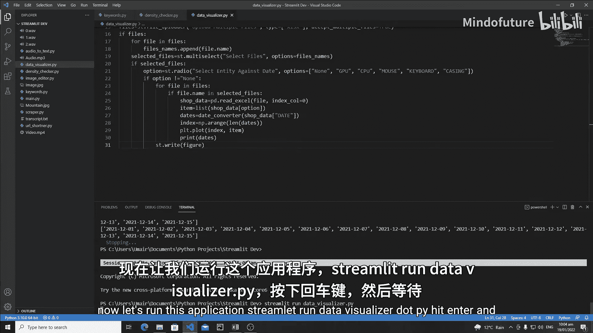

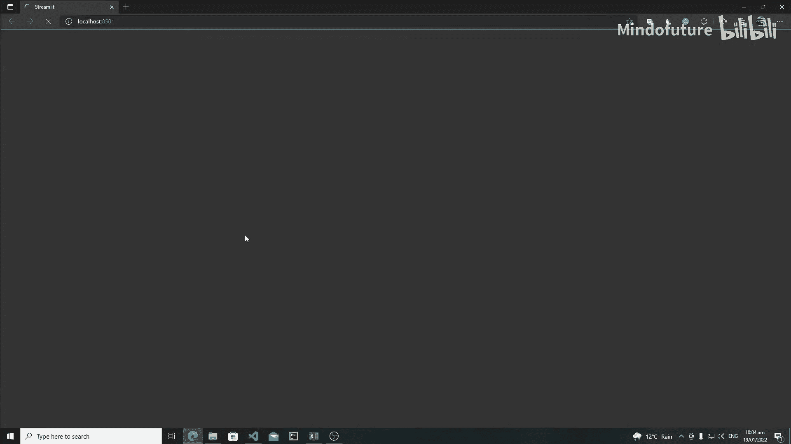

接下来，我们将使用店铺销售数据来绘制图表。假设我们有一个包含日期和销售额的列表。为了更灵活地处理 X 轴（日期），我们首先创建一个与日期列表长度相同的索引数组。

```python
# 假设 dates 是日期列表
idx = np.arange(len(dates))  # 创建一个从0到len(dates)-1的数组
```

然后，我们可以在一个循环中，为每个选中的店铺数据绘制折线。以下是绘制单条折线的核心代码：

```python
# 假设 shop_data 是某个店铺的 DataFrame，option 是选中的商品列名（如‘CPU’）
item_values = shop_data[option].tolist()  # 将指定列的数据转换为列表
plt.plot(idx, item_values)  # 使用索引数组作为X轴，商品数据作为Y轴绘图
```

绘制完成后，需要使用 Streamlit 的 `st.write()` 函数将图形显示在网页上。

```python
st.write(fig)
```

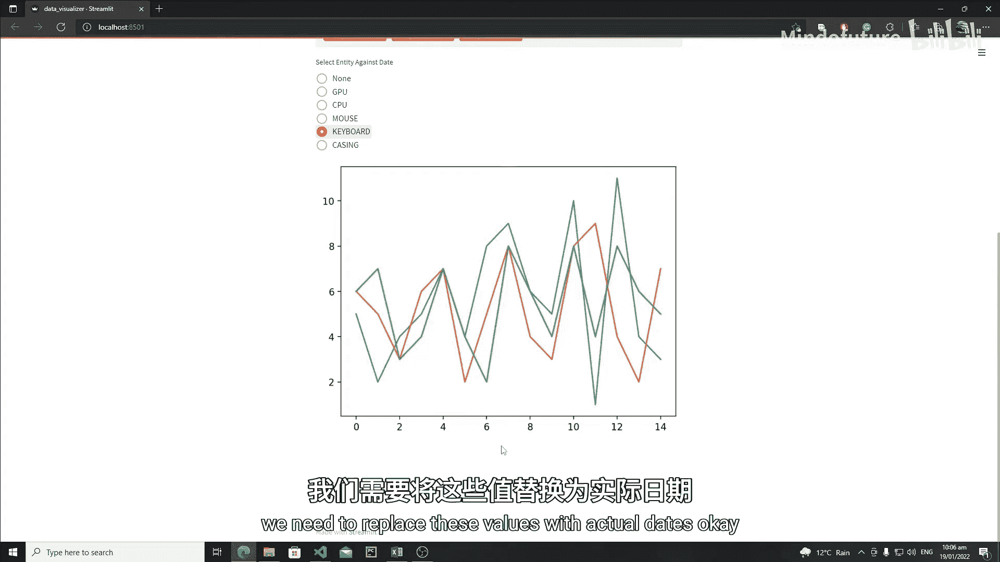

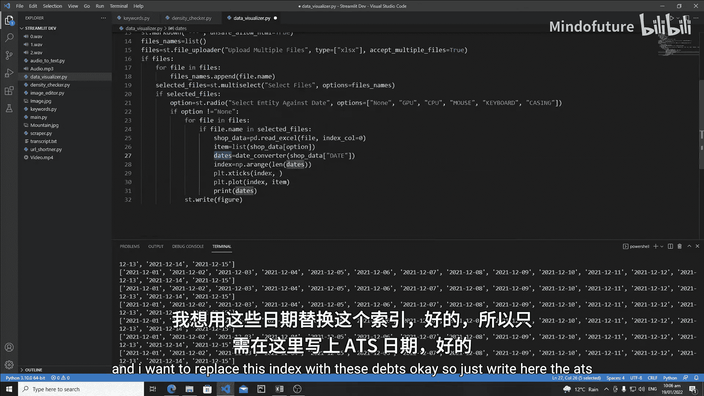

## 优化图表显示

基础图表已经可以工作，但X轴显示的是数字索引而非实际日期，并且图表缺乏必要的标签和样式。本节我们将解决这些问题。

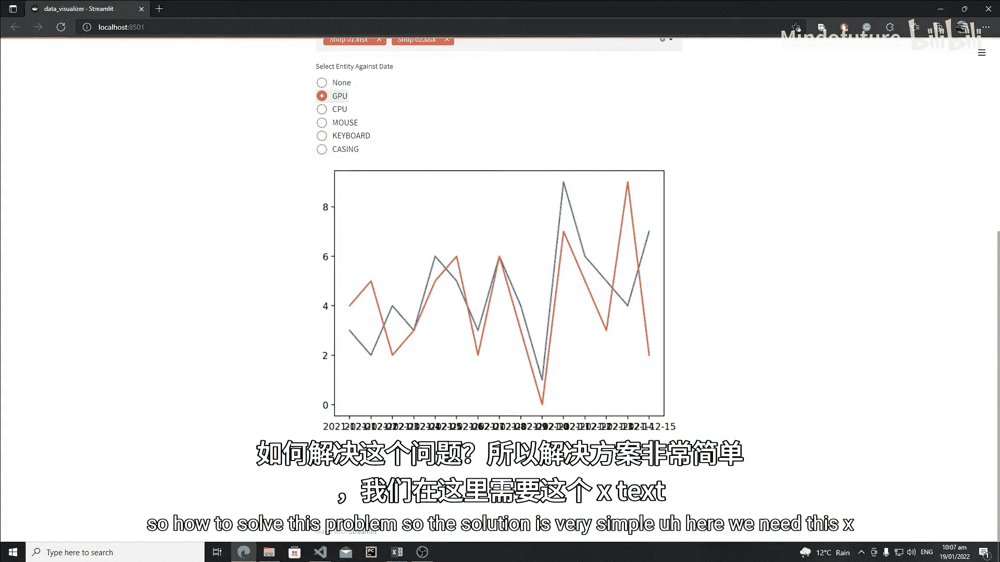

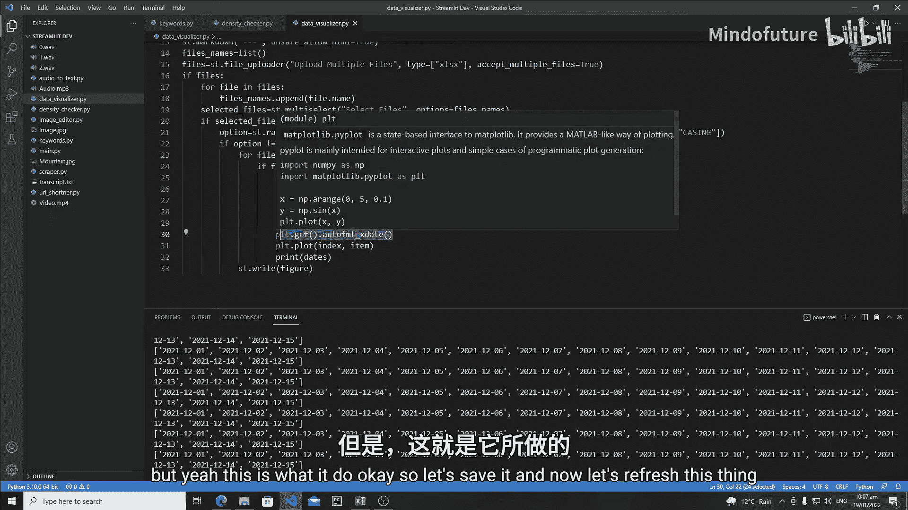

首先，使用 Matplotlib 的 `xticks` 函数将 X 轴的刻度标签替换为实际的日期。为了避免日期标签重叠，我们同时启用自动格式化功能。

以下是优化 X 轴显示的代码：
```python
plt.xticks(idx, dates)  # 用日期列表替换默认的刻度标签
plt.gcf().autofmt_xdate()  # 自动调整日期标签的格式和角度，防止重叠
```

接着，为图表添加标题、坐标轴标签并启用网格，使图表更易读。

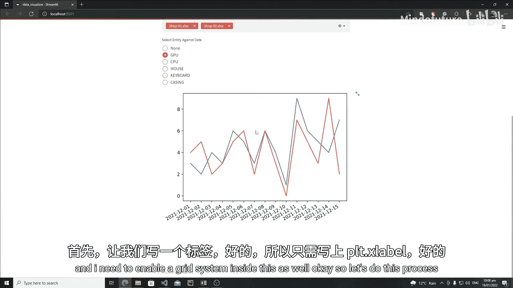

```python
plt.xlabel(‘Date‘)  # 设置X轴标签
plt.ylabel(option)  # 设置Y轴标签，显示当前商品名
plt.title(f‘{option} Chart‘)  # 设置图表标题
plt.grid(True)  # 启用网格
```

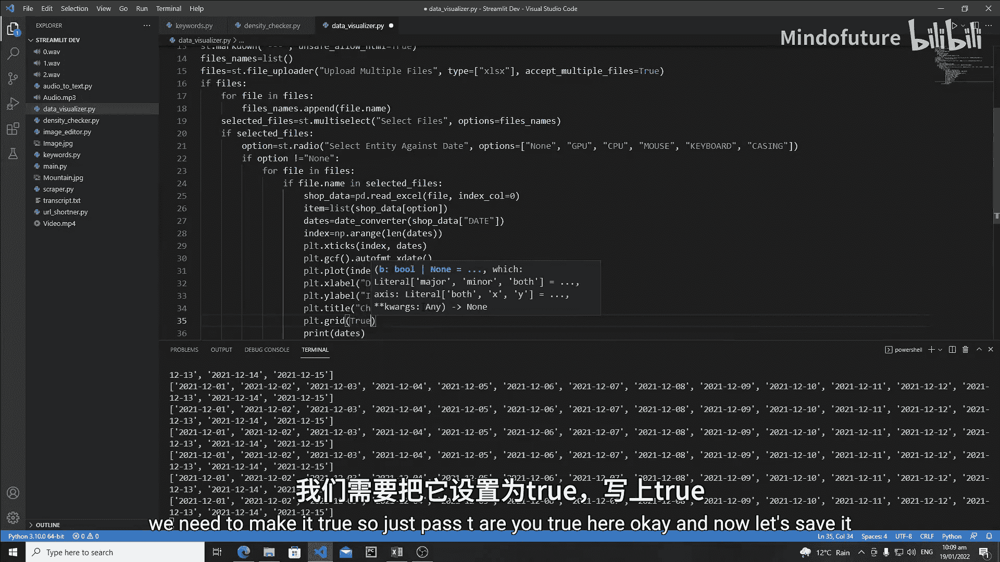

## 增强图表可读性

为了让同时显示的多条折线（代表不同店铺）更容易区分，我们需要为每条线添加图例和标记点。

在 `plt.plot()` 函数中，我们可以为每条线指定一个标签（通常用店铺名）和标记样式。

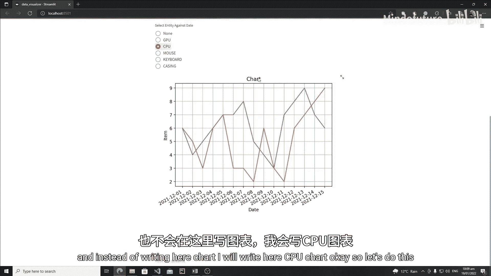

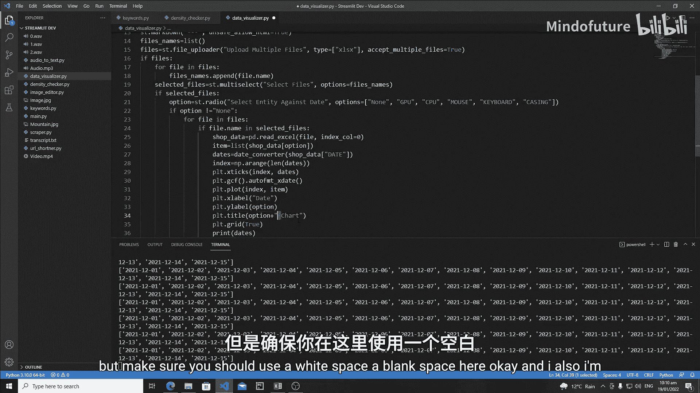

以下是增强图表可读性的步骤：
1.  在绘图时为每条线指定标签和标记。
2.  调用 `plt.legend()` 函数来显示图例。

具体实现代码如下：
```python
# 在循环内部，为每个店铺的数据绘图时
plt.plot(idx, item_values, label=file.name, marker=‘o‘)  # ‘o‘代表圆形标记，label用于图例

# 在循环外部，显示图例
plt.legend()
```

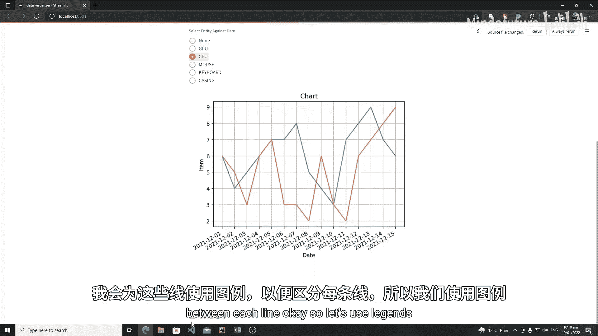

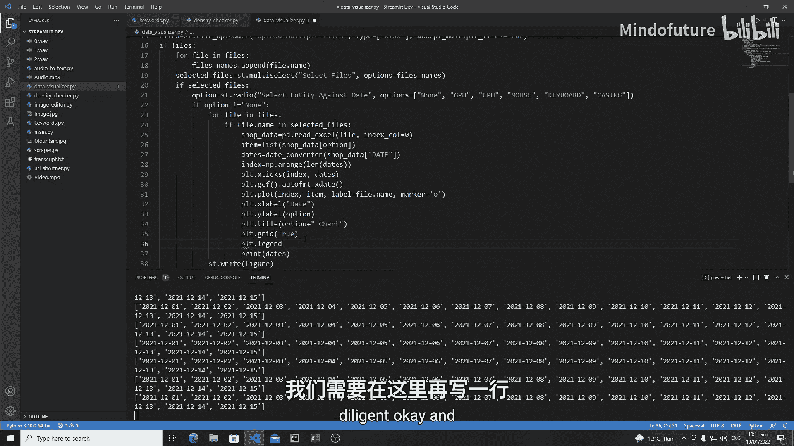

完成以上步骤后，我们的图表将具备完整的元素：清晰的坐标轴标签、带标记点的折线、自动定位的图例以及实时更新的能力。当用户在侧边栏选择不同的商品或店铺时，图表会立即响应并重新绘制。

## 总结

本节课中我们一起学习了如何在 Streamlit 应用中集成 Matplotlib 进行数据可视化。我们从安装库开始，逐步构建了一个交互式折线图应用，并对其进行了多项优化：
*   使用 `plt.figure()` 实例化图形对象。
*   利用 NumPy 数组管理 X 轴数据。
*   通过 `plt.xticks()` 和 `autofmt_xdate()` 优化日期显示。
*   添加了标题、坐标轴标签和网格系统。
*   为多条数据线配置了图例和标记点，并通过 `st.write()` 将最终图表渲染到网页。

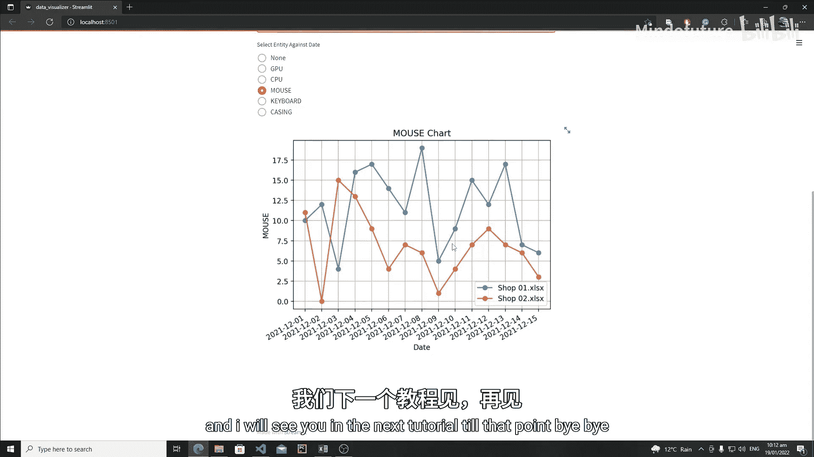

你现在已经掌握了在 Streamlit 中创建基础动态图表的方法。你可以在此基础上尝试添加柱状图等其他图表类型，或结合更多 Python 模块来实现更复杂的实时数据跟踪功能。