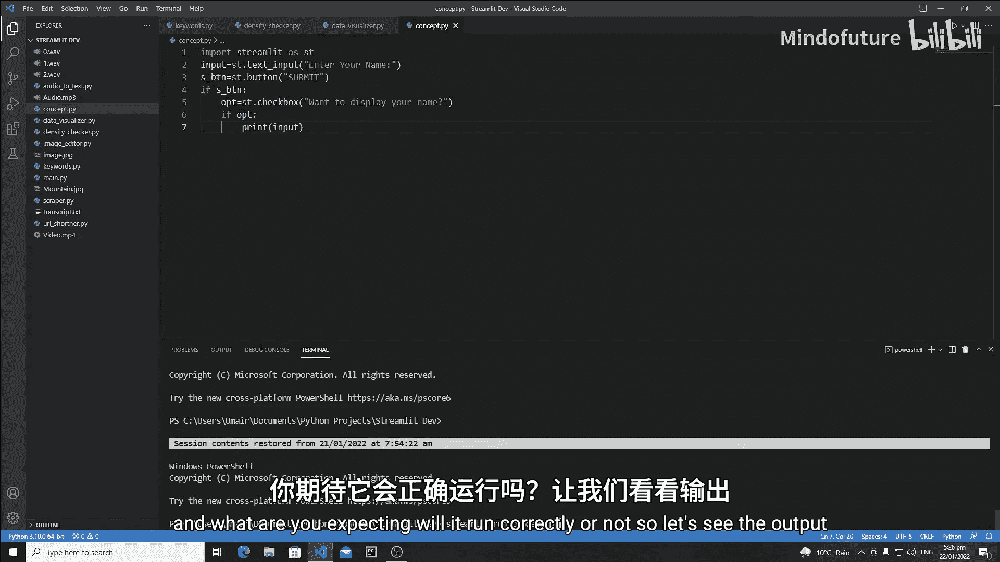
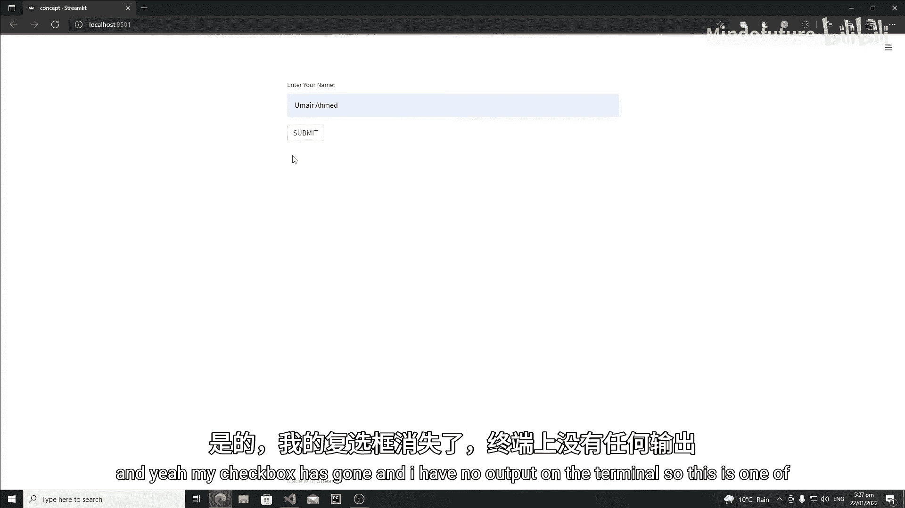
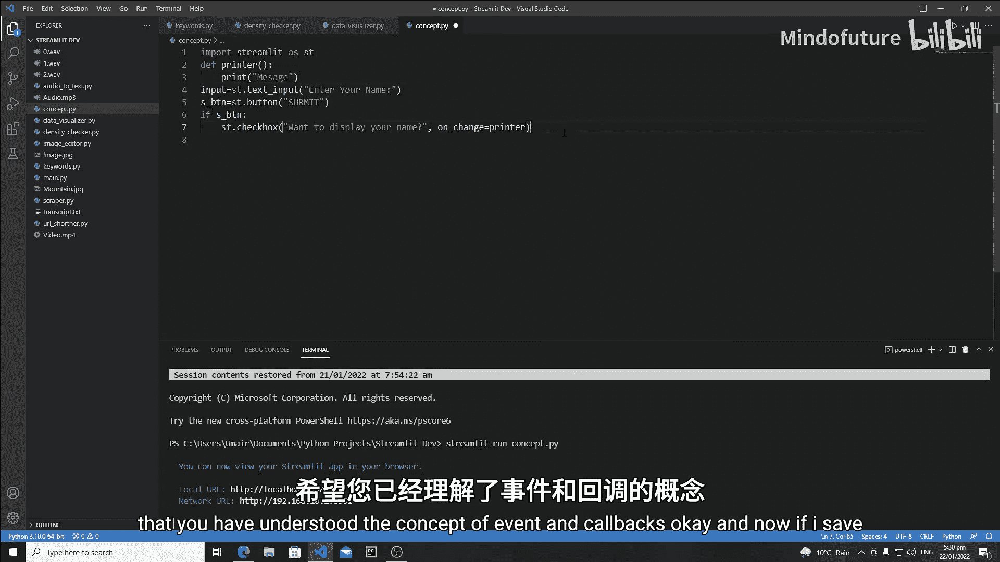
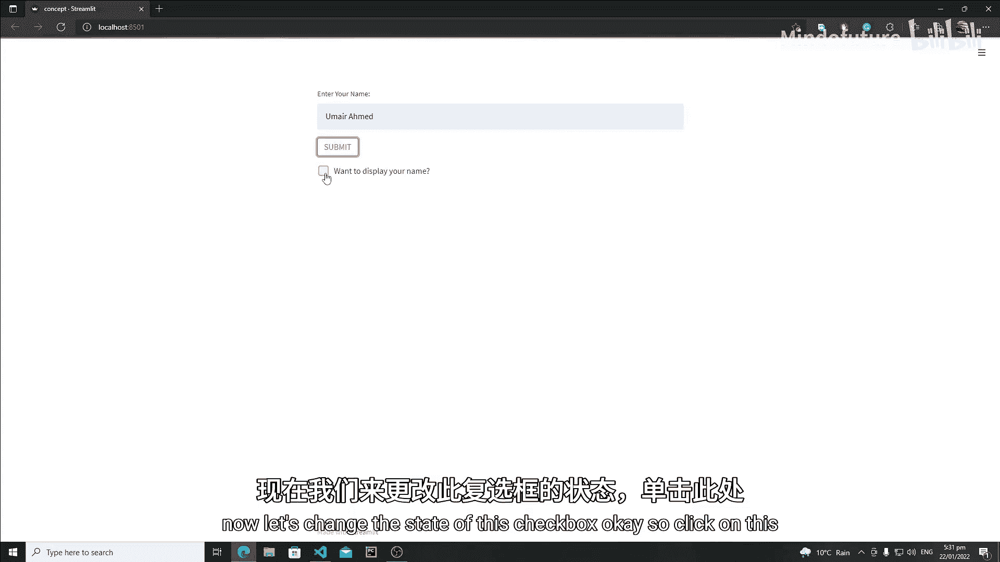
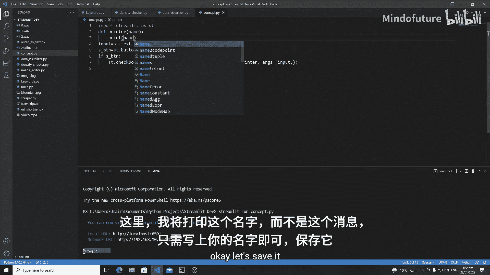
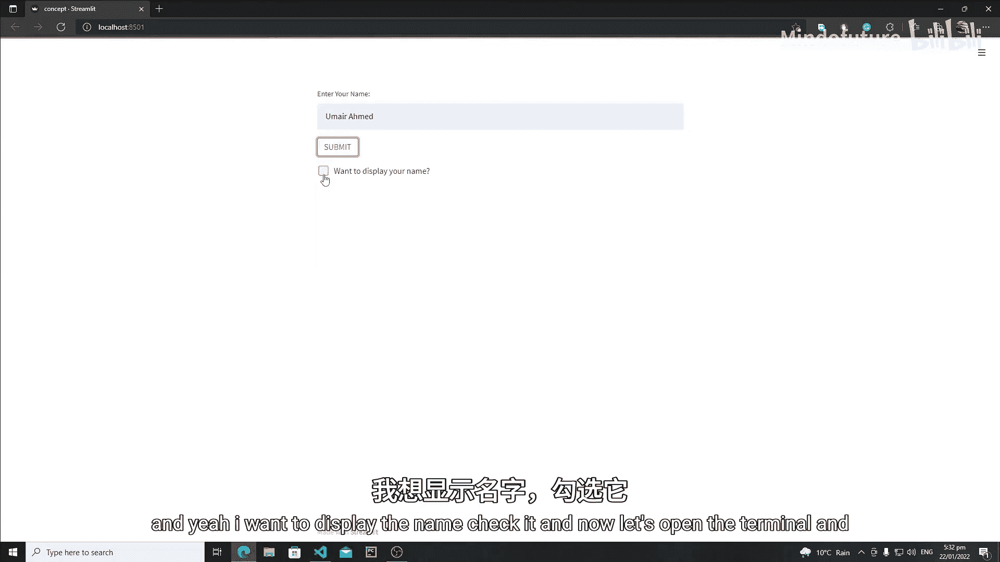
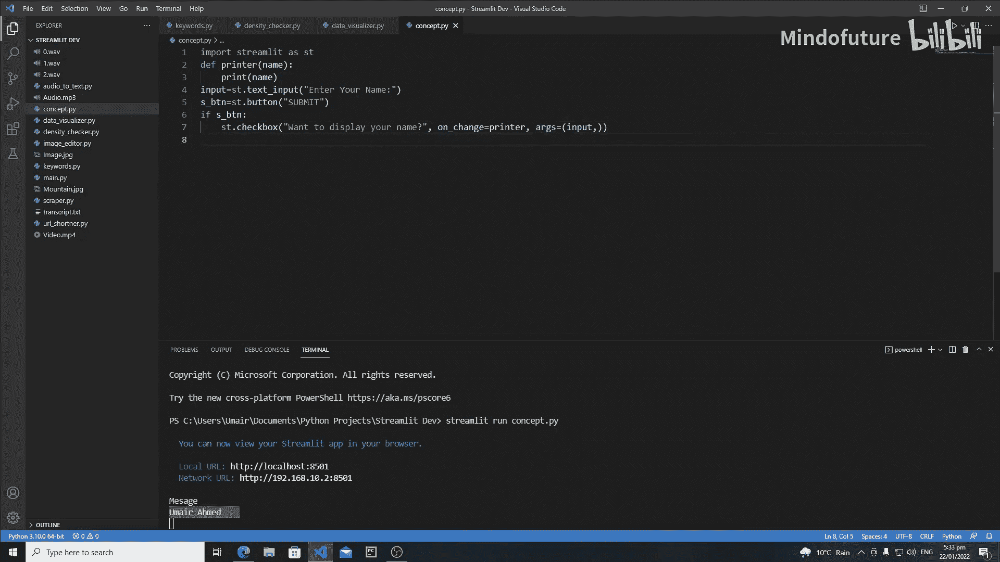

# 040：Streamlit中的回调与属性

在本节课中，我们将学习Streamlit中的概念性编程，这些概念在实际应用场景中非常重要。我们将重点讨论Streamlit的回调机制。回调是在特定事件发生时执行的函数，这些事件可以是按钮点击、单选按钮选项变更或复选框状态改变等。理解回调对于构建交互式应用至关重要。

## 理解问题：为什么复选框不工作？

首先，我们创建一个简单的应用来演示一个常见问题。

```python
import streamlit as st

input_name = st.text_input("Enter your name:")
submit_button = st.button("Submit")

if submit_button:
    option = st.checkbox("Want to display your name?")
    if option:
        print(input_name)
```

运行此应用，输入名字并点击“提交”按钮后，会出现一个复选框。然而，当你勾选复选框时，控制台并不会打印出名字，复选框本身也会消失。

这是因为Streamlit的工作机制：每当用户与交互式小部件（如复选框）交互时，整个脚本都会从头到尾重新运行。当脚本重新执行到 `if submit_button:` 这一行时，由于我们没有再次点击“提交”按钮，条件为假，因此复选框根本不会被创建，后续的打印逻辑也就不会执行。

## 解决方案：使用回调函数



为了解决上述问题，我们需要使用回调函数。回调可以改变Streamlit的执行顺序，在重新运行整个脚本之前，优先执行指定的回调函数。

Streamlit主要提供两种回调：
*   **`on_click`**：用于按钮点击事件。
*   **`on_change`**：用于交互式小部件（如复选框、单选按钮、滑块等）的状态改变事件。

以下是修改后的代码，使用 `on_change` 回调：

```python
import streamlit as st

# 定义回调函数
def printer():
    print("Message from callback!")



input_name = st.text_input("Enter your name:")
submit_button = st.button("Submit")

if submit_button:
    # 为复选框添加 on_change 回调
    option = st.checkbox("Want to display your name?", on_change=printer)
```

现在，当你勾选或取消勾选复选框时，回调函数 `printer` 会被触发，并在控制台打印消息。这是因为在脚本重新运行前，Streamlit会先执行回调函数。

## 向回调函数传递参数

在实际应用中，我们经常需要将一些数据（例如用户输入的名字）传递给回调函数。这可以通过 `args` 参数实现。

以下是向回调函数传递参数的示例：

```python
import streamlit as st

# 定义回调函数，接受一个参数
def printer(name):
    print(name)

input_name = st.text_input("Enter your name:")
submit_button = st.button("Submit")

if submit_button:
    # 使用 args 参数向回调函数传递参数，参数需要以元组形式提供
    option = st.checkbox("Want to display your name?", on_change=printer, args=(input_name,))
```





在这段代码中，我们将 `input_name` 变量作为元组 `(input_name,)` 传递给 `args` 参数。回调函数 `printer` 则定义了一个参数 `name` 来接收这个值。现在，当复选框状态改变时，控制台将打印出用户输入的名字。

**关键点**：`args` 的参数必须是一个元组。即使只有一个参数，也需要写成 `(input_name,)` 的形式，末尾的逗号是必需的。

## 总结

本节课我们一起学习了Streamlit中回调函数的核心概念与应用。

我们首先通过一个实例了解了为什么直接在小部件条件判断中处理逻辑会失败，其根源在于Streamlit响应交互时会重新执行整个脚本。

接着，我们引入了回调函数作为解决方案。回调函数（通过 `on_click` 或 `on_change` 参数指定）允许我们在脚本重新运行前执行特定逻辑，从而正确处理交互事件。

最后，我们学习了如何使用 `args` 参数向回调函数传递必要的数据，这使得回调函数能够访问和应用运行时的状态信息。







掌握回调机制是构建复杂、响应式Streamlit应用的基础。