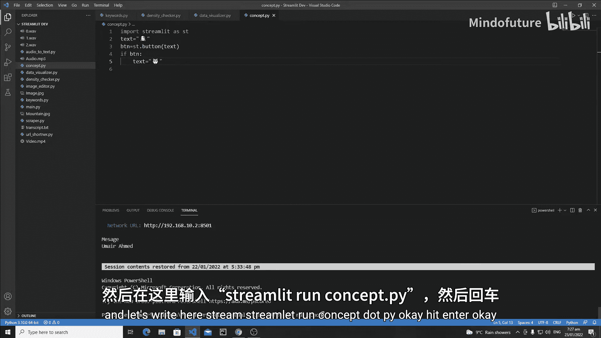
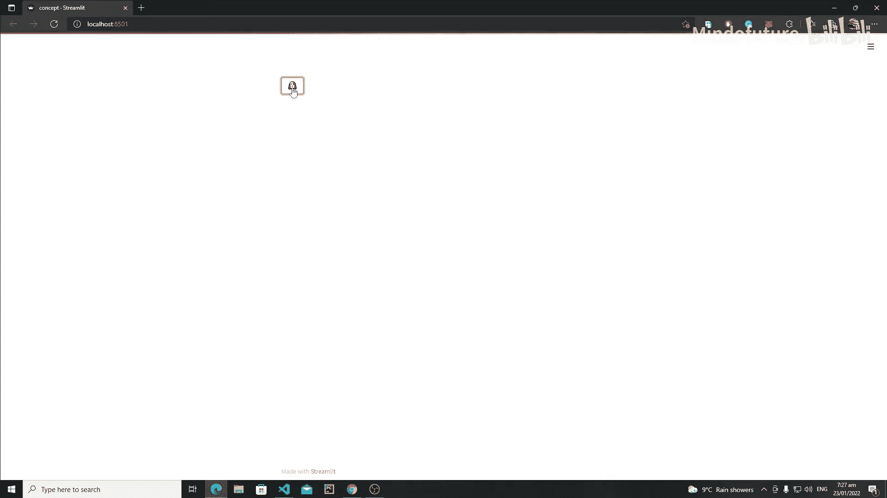
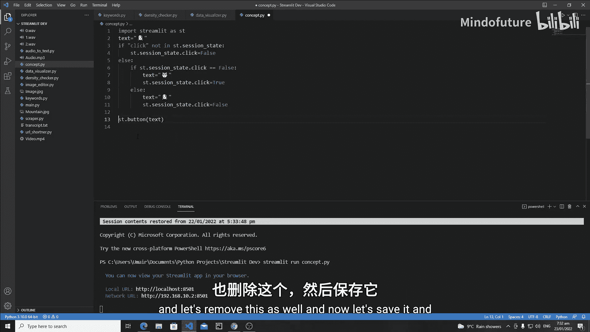
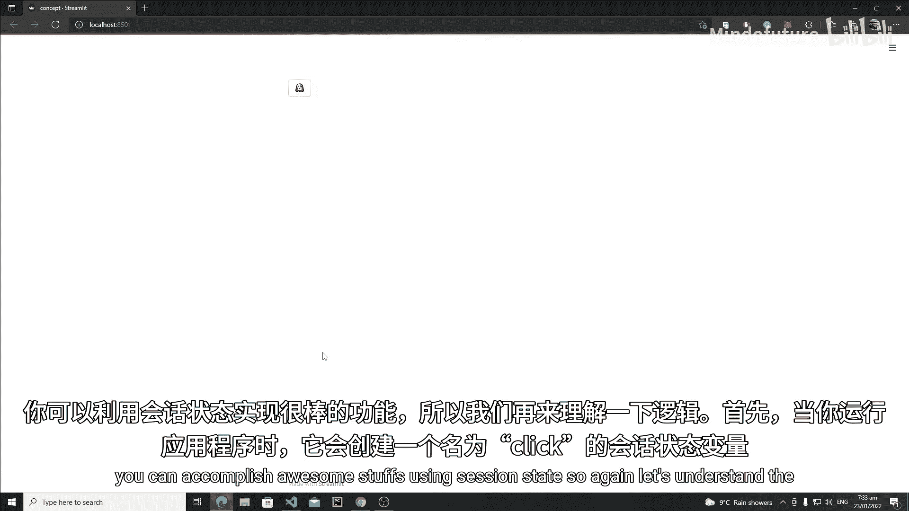
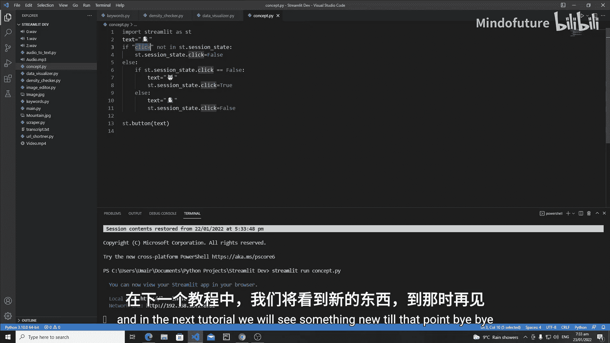

# 041：Session States详解 🧠

在本节课中，我们将要学习Streamlit中一个至关重要的概念——Session State。它是在用户会话间共享和保存变量数据的关键工具。

## 概述

Session State是Streamlit中用于在不同次运行（reruns）之间为每个用户保存变量状态的方法。当您刷新浏览器或与应用交互时，它能够防止数据丢失，从而极大地简化开发工作。

## 一个简单的例子：切换按钮文本

为了理解Session State的工作原理，我们先创建一个简单的程序。这个程序包含一个按钮，点击按钮时，按钮上显示的文本（一个表情符号）会在🐶和🐱之间切换。

首先，我们尝试不使用Session State的写法：



```python
import streamlit as st

text = "🐶"  # 初始文本为狗表情
button = st.button(text)  # 创建一个按钮

if button:
    text = "🐱"  # 当按钮被点击时，尝试将文本改为猫表情
```

运行这段代码，点击按钮，你会发现没有任何变化。这是因为每次与Streamlit应用交互（如点击按钮）时，整个脚本都会从头到尾重新执行。重新执行时，变量`text`又被重置为初始值`"🐶"`，然后才渲染页面，所以我们永远看不到`"🐱"`。



上一节我们介绍了不使用Session State时遇到的问题，本节中我们来看看如何使用Session State来解决它。

## 使用Session State解决问题

Session State允许我们在应用重新运行后保留变量的值。使用它通常需要两个步骤：
1.  **初始化**Session State变量。
2.  **检查并更新**Session State变量，执行业务逻辑。

以下是修改后的代码：

```python
import streamlit as st

# 第一步：初始化Session State变量
if 'clicked' not in st.session_state:
    # 如果‘clicked’变量不存在于session_state中，则创建它，初始值为False
    st.session_state.clicked = False

# 根据Session State中的值决定按钮的初始文本
if st.session_state.clicked:
    text = "🐱"
else:
    text = "🐶"

# 创建按钮
button = st.button(text)

# 第二步：检查并更新Session State
if button:
    # 当按钮被点击时，切换‘clicked’的状态
    if st.session_state.clicked == False:
        st.session_state.clicked = True  # 切换到猫
    else:
        st.session_state.clicked = False  # 切换回狗

    # 重要：使用st.rerun()来触发脚本重新运行，以更新按钮文本
    st.rerun()
```

**代码逻辑解析：**
1.  应用首次运行时，`st.session_state`中没有`‘clicked’`键，因此将其创建并设为`False`。按钮文本初始化为`“🐶”`。
2.  用户点击按钮，`button`变为`True`，进入`if button:`代码块。
3.  检查`st.session_state.clicked`的值。首次点击时它为`False`，所以将其改为`True`。
4.  调用`st.rerun()`强制Streamlit重新运行整个脚本。
5.  脚本重新运行时，因为`st.session_state.clicked`已经存在且值为`True`，所以按钮文本被设置为`“🐱”`。
6.  再次点击按钮，`st.session_state.clicked`从`True`变回`False`，重新运行后按钮文本变回`“🐶”`。

通过这种方式，按钮的状态得以在多次应用重新运行间保留。

## 核心方法与概念

以下是使用Session State时的一些关键点：

*   **访问与赋值**：可以使用`st.session_state.key_name`或`st.session_state[‘key_name’]`来访问和设置变量。
*   **检查存在性**：使用`if ‘key_name’ not in st.session_state:`来初始化变量，避免覆盖已存在的值。
*   **触发更新**：更改Session State的值后，通常需要调用`st.rerun()`来让应用响应新的状态。





## 总结



本节课中我们一起学习了Streamlit的Session State。我们了解到，由于Streamlit应用在交互时会重新执行脚本，普通变量无法保持状态。Session State提供了一种在用户会话期间持久化存储数据的机制。通过初始化、检查并更新Session State变量，我们可以构建出能够记住用户操作和数据的交互式应用。这是开发复杂Streamlit应用的基础。