# 042：Streamlit缓存机制详解 🚀

在本节课中，我们将要学习Streamlit中一个至关重要的性能优化工具——缓存机制。缓存能够显著提升应用的运行效率，尤其是在处理复杂计算或数据加载时。

## 什么是缓存？

缓存是一种技术，它存储给定资源的副本，并在请求时将其返回，以实现更快的功能执行。在Streamlit中，缓存机制允许你存储函数的计算结果。当函数再次被调用时，如果输入参数没有变化，Streamlit会直接返回缓存的结果，而不是重新执行整个函数。这对于执行时间较长的函数（例如数据处理、模型训练）非常有用。

## 一个简单的例子

为了理解缓存的工作原理，我们先创建一个没有缓存的函数作为对比。

以下是一个模拟耗时操作的函数：

```python
import time
import streamlit as st

def printer(message):
    # 模拟一个耗时3秒的操作
    time.sleep(3)
    return message

st.write(printer(“Hello, Streamlit Cache!”))
```

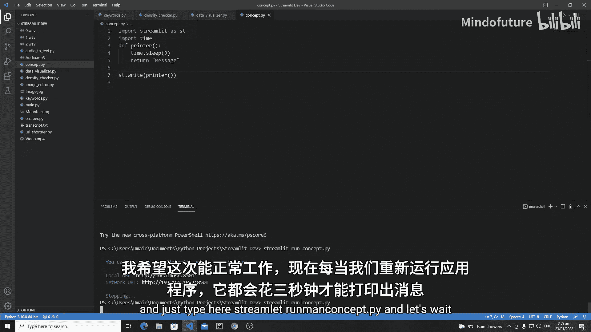

每次运行这个应用，你都需要等待3秒钟才能看到输出信息。在开发或用户交互频繁时，这种延迟会严重影响体验。

## 使用`@st.cache`装饰器

现在，我们来看看如何使用Streamlit的缓存功能来优化上述函数。只需在函数定义前添加`@st.cache`装饰器即可。

```python
import time
import streamlit as st

@st.cache  # 添加缓存装饰器
def printer(message):
    time.sleep(3)
    return message

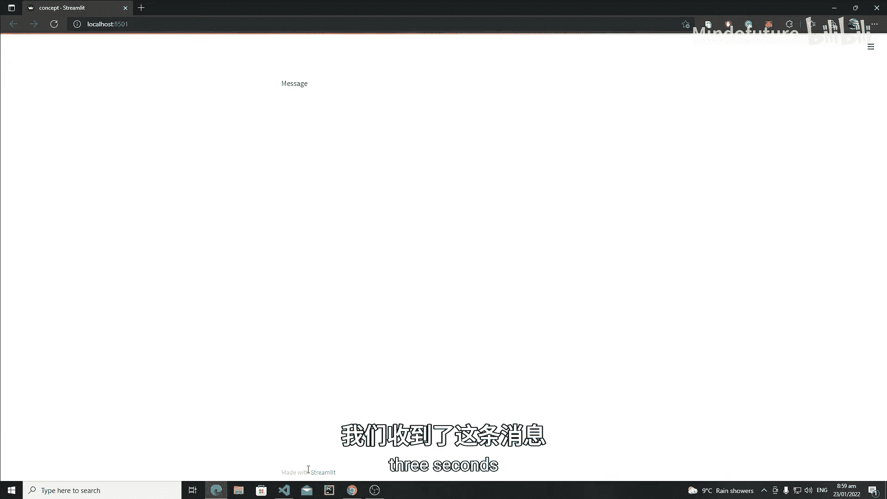

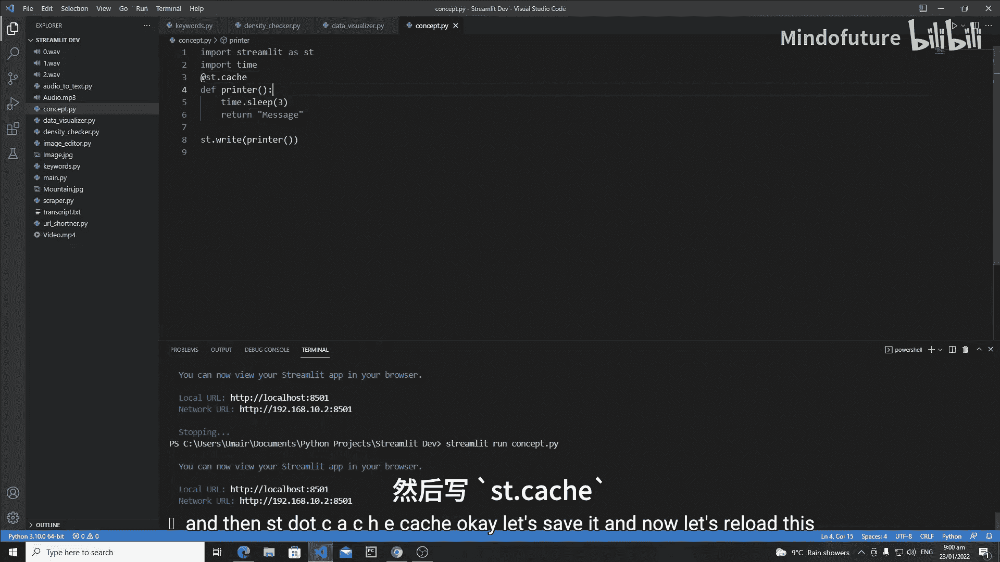

st.write(printer(“Hello, Streamlit Cache!”))
```

添加装饰器后，第一次运行函数时，它仍然需要3秒来执行并返回结果。但Streamlit会将该结果与当前的函数名和输入参数（`message`）一起存储起来。

**关键点**：当你第二次、第三次或更多次地运行应用（或触发函数调用）时，如果输入的`message`参数没有改变，Streamlit将不会执行函数体内的代码（即不会等待3秒），而是直接返回之前缓存的结果。这极大地提升了响应速度。

## 缓存的管理与验证

你可能会好奇如何验证缓存是否生效，或者如何清除缓存。

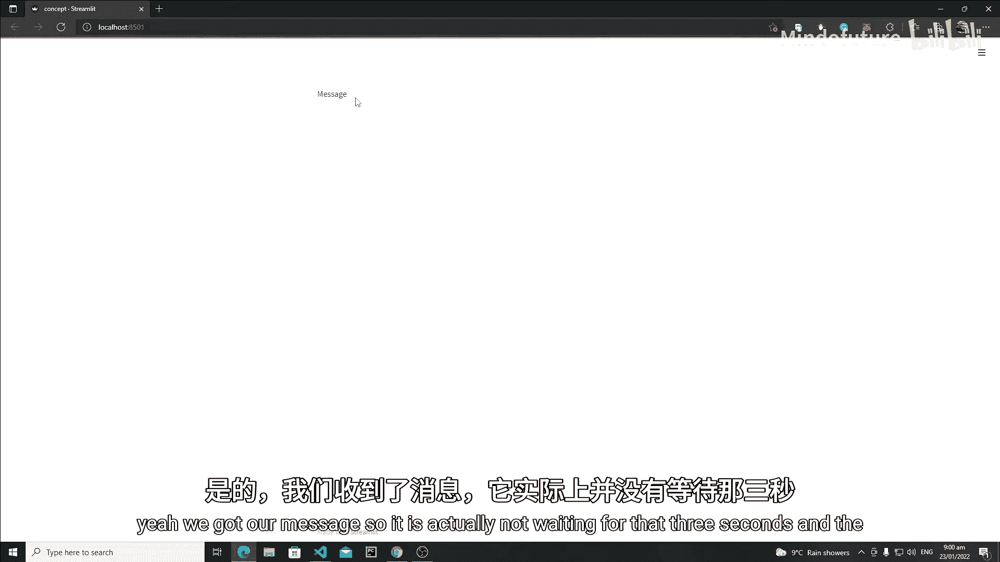

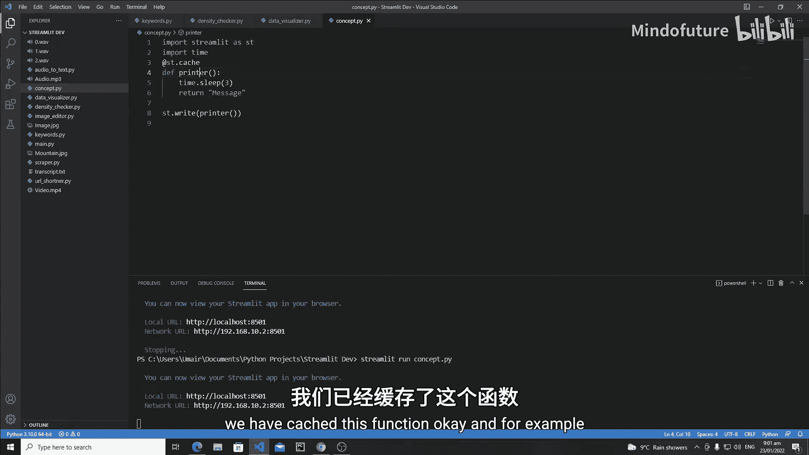

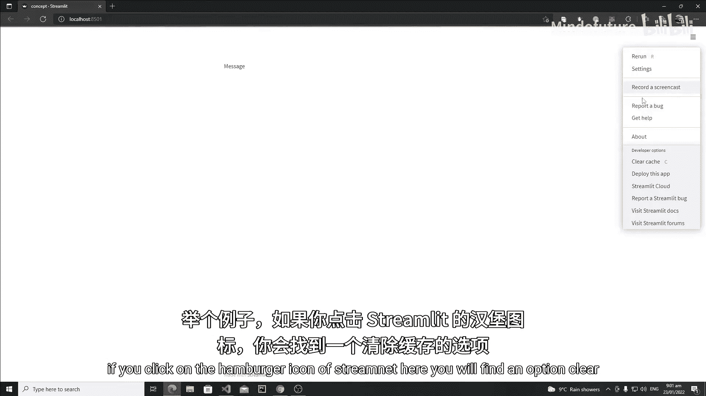

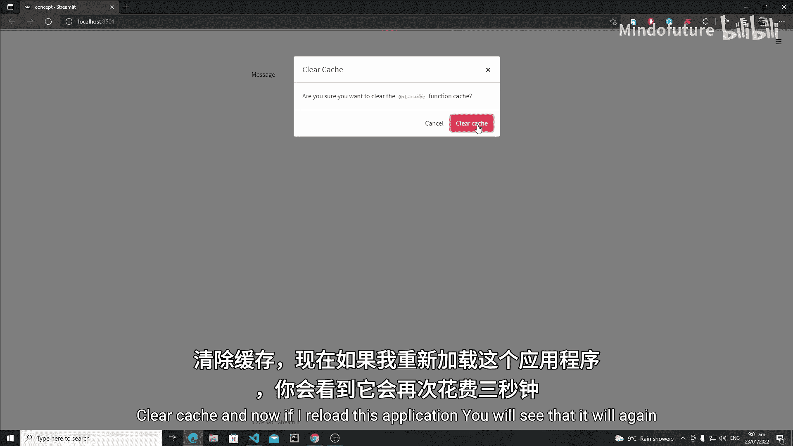

1.  **验证缓存**：运行上述带缓存的代码。第一次运行会等待3秒。刷新页面后，消息应立即显示，没有延迟，这证明缓存起了作用。
2.  **清除缓存**：在运行的Streamlit应用页面，点击右上角的汉堡菜单（☰），你会找到“Clear cache”选项。点击它，然后刷新页面，你会发现应用又需要等待3秒才能显示结果，因为缓存已被清空。

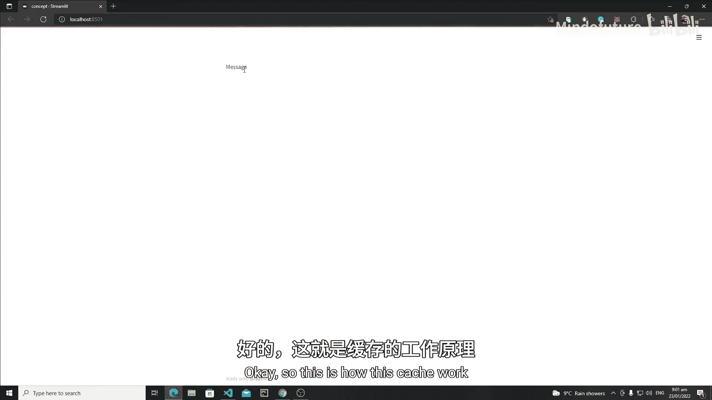

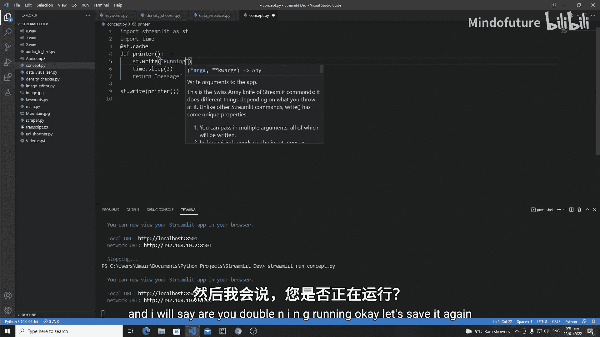

## 处理缓存警告

有时，在缓存函数内部使用`st.write`等Streamlit命令可能会触发警告。为了解决这个问题，`@st.cache`装饰器提供了一个`suppress_st_warning`参数。

以下是一个会产生警告的例子：

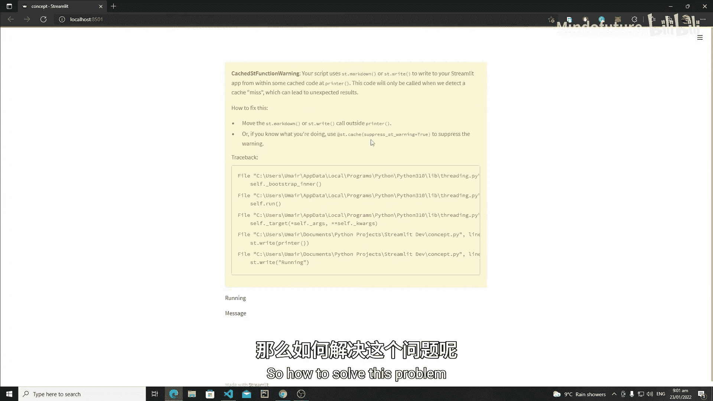

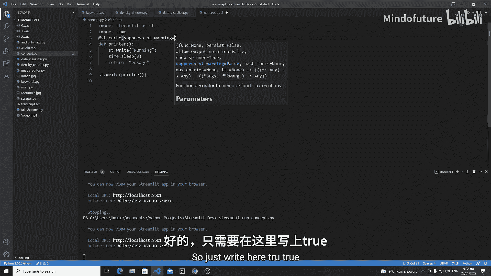

```python
@st.cache
def printer(message):
    st.write(“Function is running...”)
    time.sleep(3)
    return message
```

为了避免警告，可以将`suppress_st_warning`参数设置为`True`：

```python
@st.cache(suppress_st_warning=True)
def printer(message):
    st.write(“Function is running...”)
    time.sleep(3)
    return message
```

设置之后，警告信息将不再显示。请注意，**在缓存函数内部使用`st.write`等命令时，它们只在函数首次执行（即缓存未命中）时运行**。当从缓存中读取结果时，这些命令不会被执行。因此，上例中的“Function is running...”信息只会在第一次调用时出现。

## 缓存的应用场景

Streamlit缓存机制在以下场景中尤为重要：
*   **数据加载**：从数据库或大型CSV文件加载数据。
*   **复杂计算**：进行数据预处理或特征工程。
*   **机器学习**：加载训练好的模型或进行预测。例如，使用Scikit-learn、TensorFlow或PyTorch时，模型加载和初始化可能很耗时，缓存可以避免每次交互都重复这个过程。
*   **API调用**：调用外部API获取数据，可以缓存结果以避免频繁请求并节省时间。

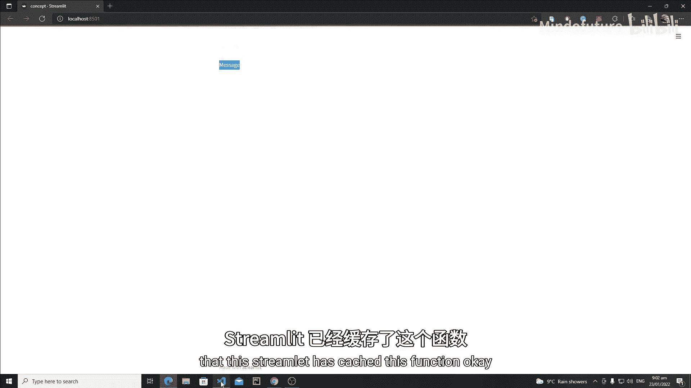

## 总结

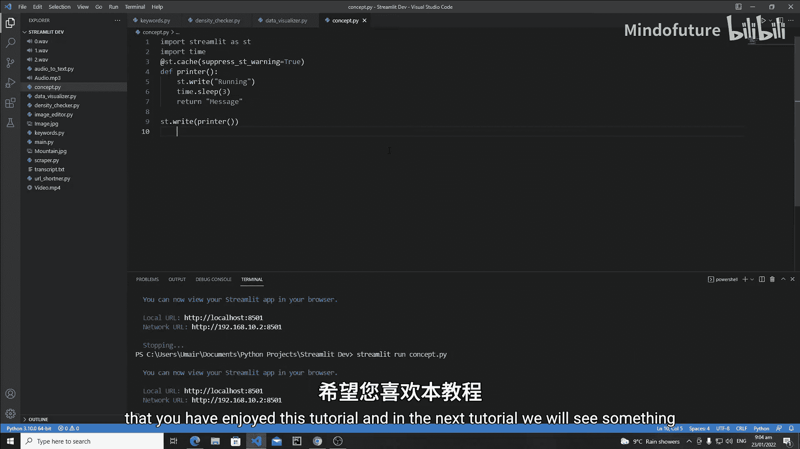

本节课中我们一起学习了Streamlit的核心功能——缓存机制。我们了解了缓存的基本概念，即存储计算结果以加速后续相同的请求。通过`@st.cache`装饰器，我们可以轻松地为任何函数添加缓存能力，从而优化应用性能。我们还学习了如何管理缓存（清除缓存）以及如何处理与Streamlit命令相关的缓存警告。掌握缓存是构建高效、响应迅速的Streamlit应用的关键一步。在接下来的教程中，我们将探索Streamlit的其他功能。