# 043：在Streamlit中使用自定义HTML 🎨

在本节课中，我们将学习如何在Streamlit Web应用中嵌入自定义HTML代码。我们将介绍两种主要方法，并详细讲解如何使用`components.html`函数来添加样式和交互性。

## 概述

Streamlit提供了两种添加自定义HTML的方式。一种是通过`st.markdown`函数，这是一种非官方的方法。另一种是使用`streamlit.components.v1.html`函数，这是官方推荐的方式。本节课我们将重点学习后者的使用方法。

## 导入必要模块

首先，我们需要导入Streamlit及其组件模块。以下是导入代码：

```python
import streamlit as st
from streamlit.components.v1 import html as components_html
```

## 使用`components.html`函数

`components.html`函数与`st.markdown`函数的一个主要区别在于，它提供了三个额外的属性来控制HTML内容的显示。这些属性是：
*   `width`： 定义HTML内容的宽度。
*   `height`： 定义HTML内容的高度。
*   `scrolling`： 启用或禁用滚动功能。

以下是该函数的基本用法：

```python
components_html(html_code, width=None, height=None, scrolling=False)
```

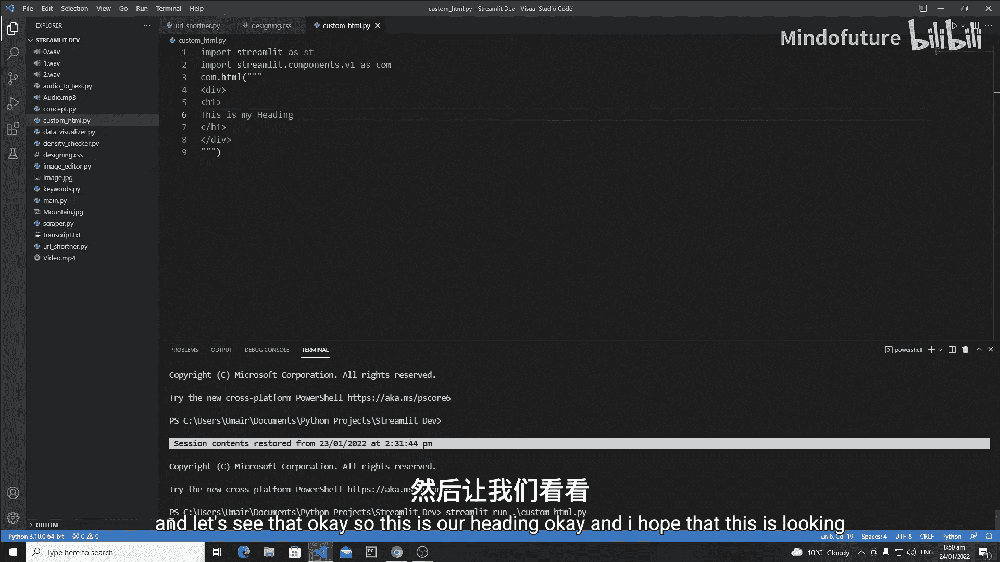

## 编写基础HTML

我们可以将HTML代码作为字符串传递给`components.html`函数。对于简短的代码，可以使用双引号；对于较长的代码，建议使用三引号以便在多行中编写。

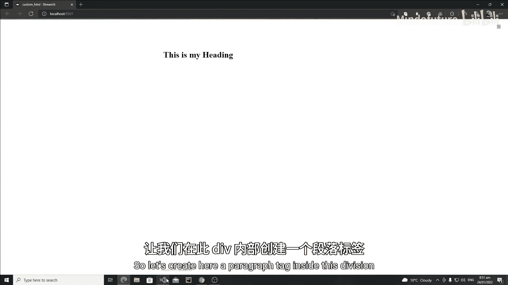

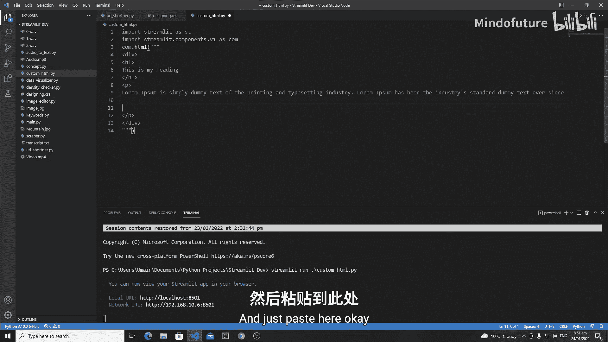

以下是一个创建标题和段落的示例：

```python
html_content = """
<div>
    <h1>这是标题</h1>
    <p>这是一段示例文本。Lorem ipsum dolor sit amet, consectetur adipiscing elit.</p>
</div>
"""

components_html(html_content, height=400)
```

## 为HTML添加CSS样式

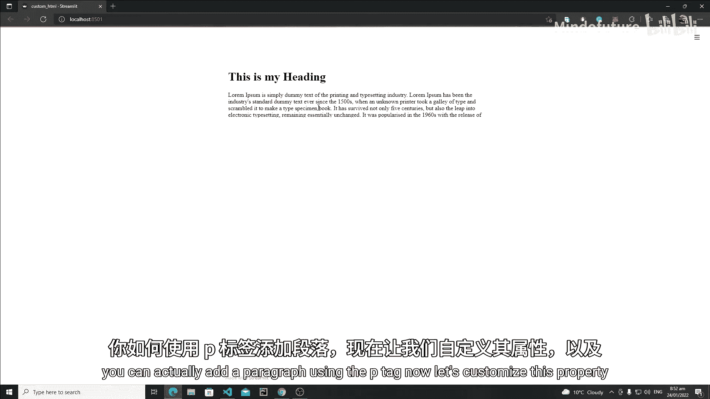

我们可以通过三种方式为嵌入的HTML添加CSS样式：内联样式、内部样式表和外部样式表。本节将介绍内部和外部样式表的方法。

### 使用内部样式表

内部样式表将CSS规则直接写在HTML文档的`<style>`标签内。以下是如何为标题添加样式的示例：

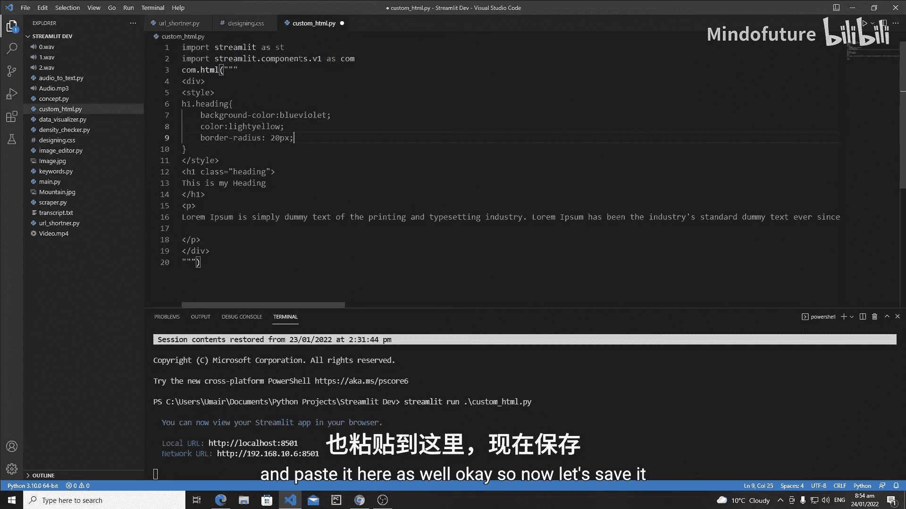

```python
styled_html = """
<style>
    .my-heading {
        background-color: lightblue;
        color: darkblue;
        text-align: center;
        padding: 10px;
        border-radius: 5px;
    }
</style>
<div>
    <h1 class="my-heading">这是带样式的标题</h1>
    <p>这是一段示例文本。</p>
</div>
"""

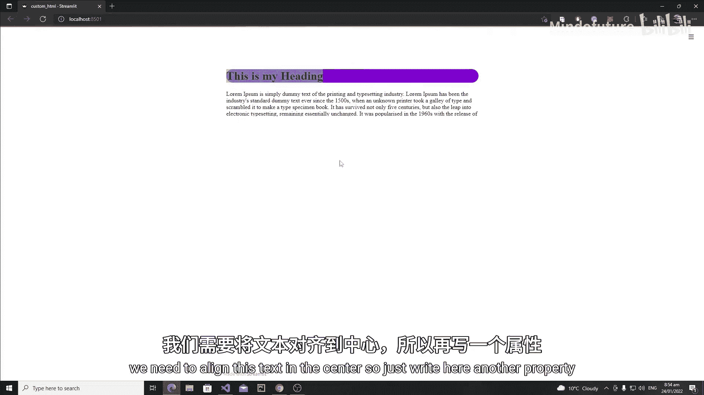

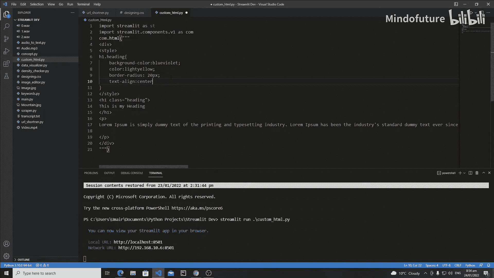

components_html(styled_html, height=400)
```

### 使用外部样式表

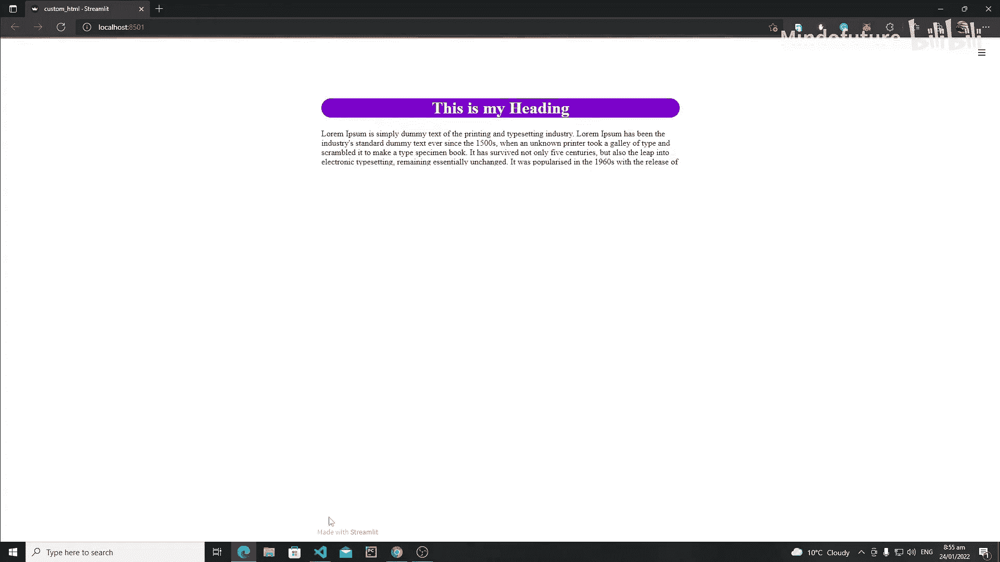

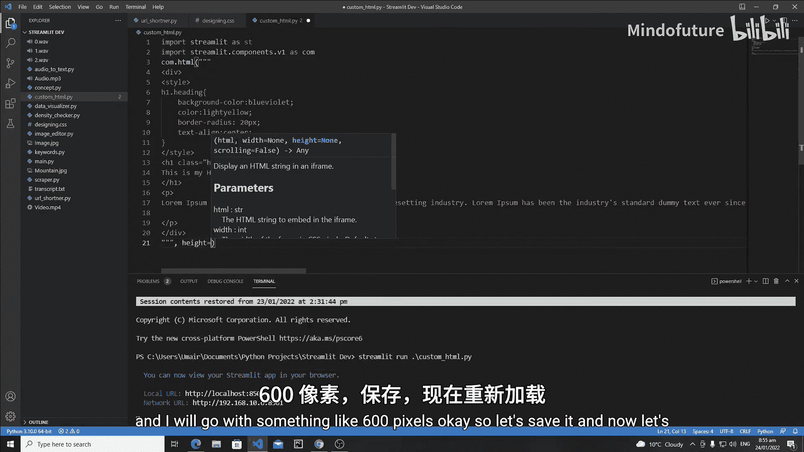

当CSS样式非常复杂时，最好将其保存在单独的文件中。以下是加载外部CSS文件的步骤：

1.  创建一个CSS文件（例如`style.css`）并定义样式规则。
2.  在Python代码中读取该文件。
3.  将读取的CSS内容嵌入到HTML的`<style>`标签中。

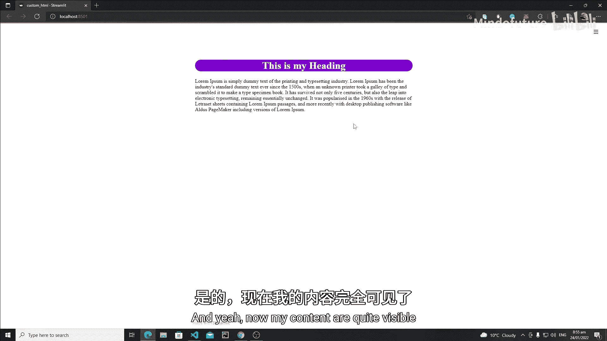

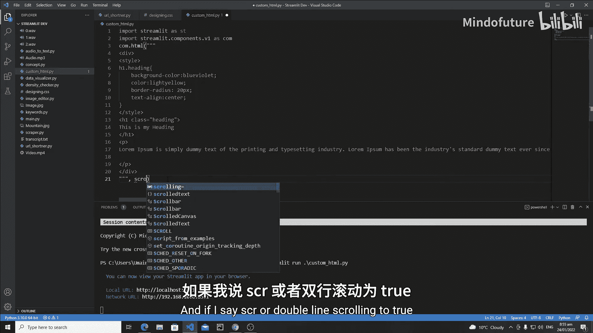

**style.css 文件内容：**
```css
.my-heading {
    background-color: lightgreen;
    color: darkgreen;
    text-align: center;
    padding: 15px;
    border-radius: 8px;
}
```

**Python 代码：**
```python
# 读取外部CSS文件
with open('style.css', 'r') as file:
    css_content = file.read()

# 将CSS内容嵌入到HTML中
external_styled_html = f"""
<style>
{css_content}
</style>
<div>
    <h1 class="my-heading">使用外部样式的标题</h1>
    <p>这段文字的样式来自外部CSS文件。</p>
</div>
"""

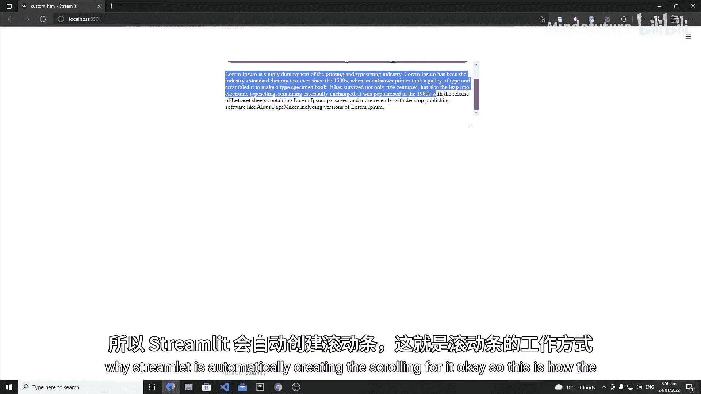

components_html(external_styled_html, height=400)
```

## 控制显示区域：宽度、高度与滚动

`components.html`函数的`width`、`height`和`scrolling`参数非常有用，可以精确控制HTML内容在应用中的显示方式。

*   **设置固定高度**： 当内容超出设定高度时，如果未启用滚动，超出的部分将被隐藏。
*   **启用滚动**： 将`scrolling`参数设置为`True`，可以在内容超出设定高度时显示滚动条。

```python
# 示例：创建一个带滚动条的长内容区域
long_html = """
<div>
    <h2>长内容示例</h2>
    <p>很多行文本...</p>
    <!-- 此处有很多行文本 -->
</div>
"""

# 高度设置为300像素，并启用滚动
components_html(long_html, height=300, scrolling=True)
```

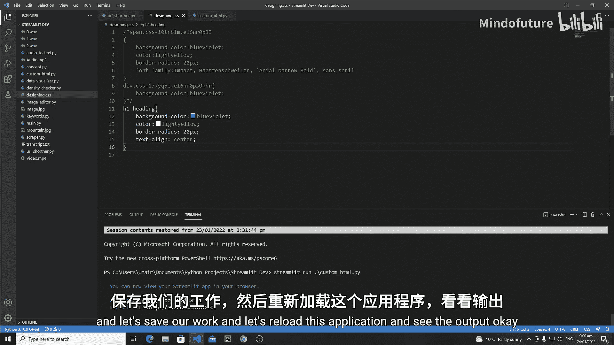

## 总结

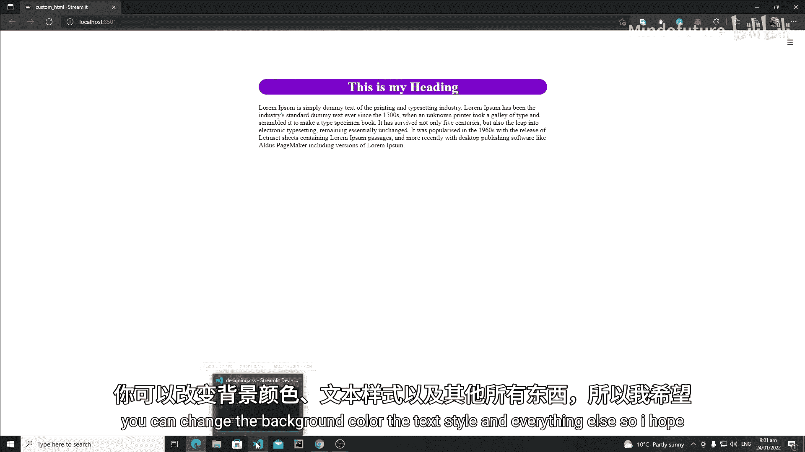

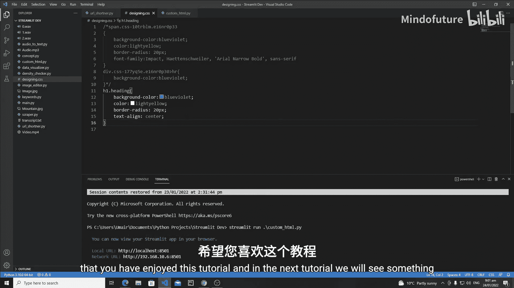

本节课我们一起学习了在Streamlit中嵌入自定义HTML的官方方法。我们了解了如何使用`streamlit.components.v1.html`函数，掌握了编写基础HTML结构、通过内部和外部样式表添加CSS样式，以及利用`width`、`height`、`scrolling`参数控制内容显示区域的核心技能。通过结合HTML和CSS，你可以在Streamlit应用中创建高度定制化的视觉组件。