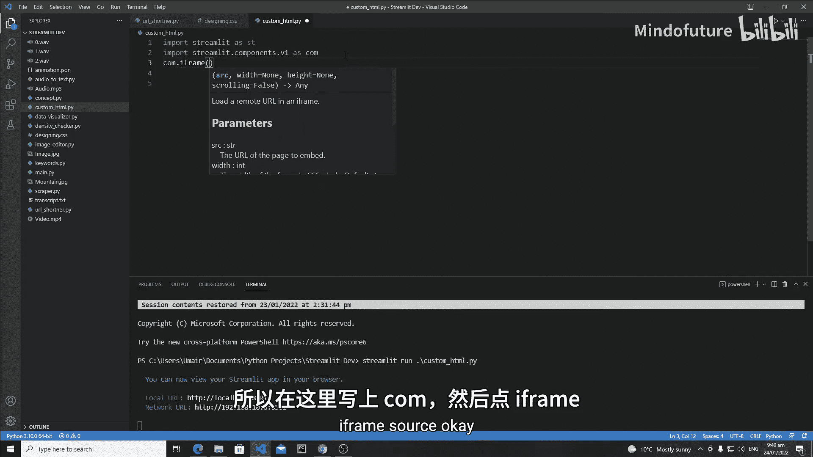
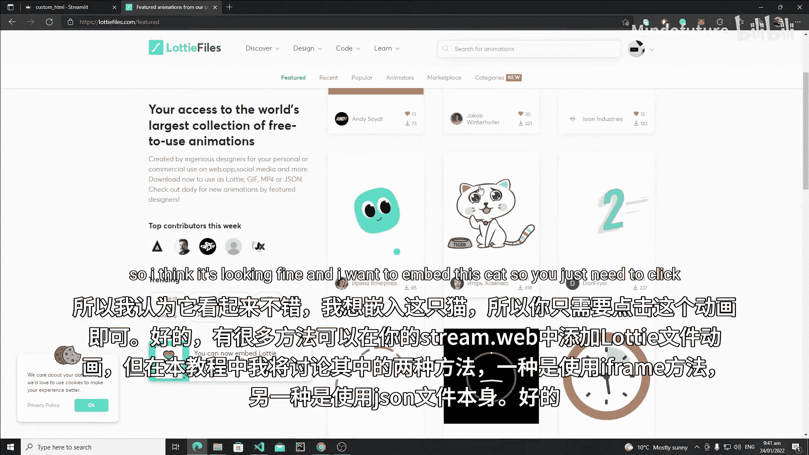
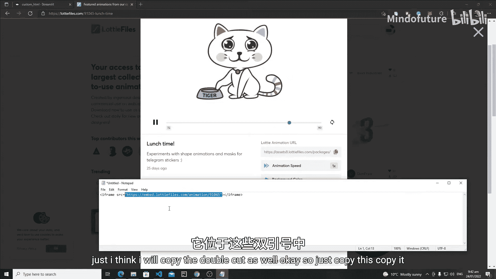
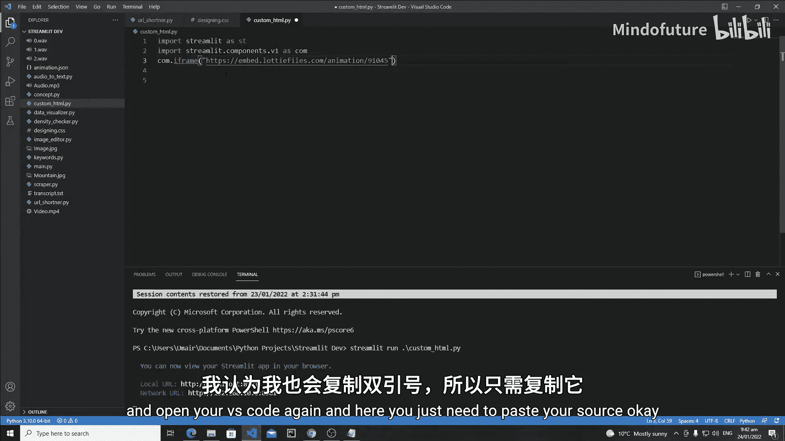
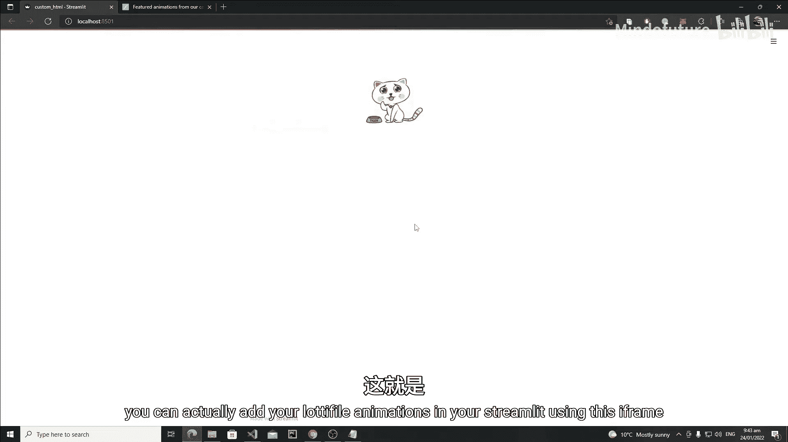
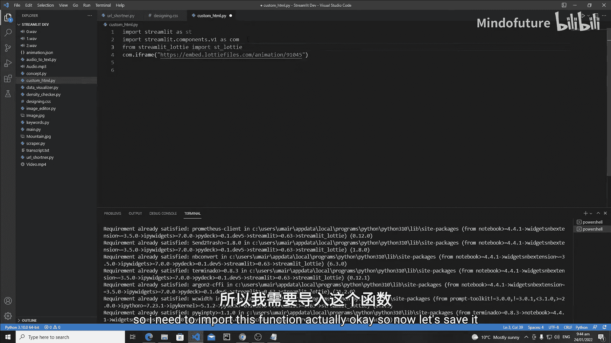
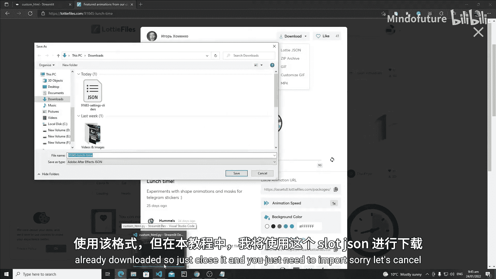
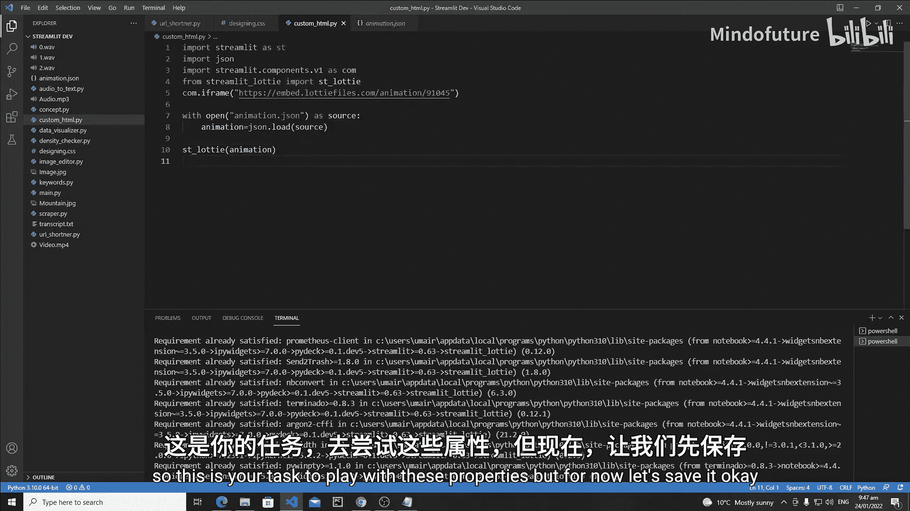
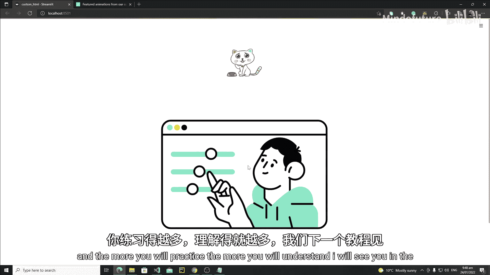

# 045：在 Streamlit 中添加动画 🎬

在本教程中，我们将学习如何在 Streamlit 网页应用中添加动画。我们将介绍两种主要方法：使用 `iframe` 函数嵌入外部动画，以及使用 `streamlit-lottie` 库加载本地 JSON 动画文件。通过本课，你将能够为你的应用增添生动的视觉效果。

## 准备工作 🛠️



首先，我们需要清理之前的代码，并导入必要的组件。我们将从 `streamlit.components.v1` 导入 `iframe` 功能。

```python
import streamlit as st
import json
from streamlit.components.v1 import iframe
from streamlit_lottie import st_lottie
```

上一节我们介绍了导入组件，本节中我们来看看如何具体使用它们来添加动画。



## 方法一：使用 iframe 嵌入动画 🌐

`iframe` 函数允许我们在 Streamlit 应用中嵌入外部的 HTML 和 CSS 文件。这是一种快速集成网络动画的简便方法。

以下是使用 `iframe` 的步骤：





1.  访问提供免费动画的网站，例如 [LottieFiles](https://lottiefiles.com/)。
2.  注册并登录后，在“发现”选项卡中找到“免费动画”部分。
3.  选择一个你喜欢的动画（例如，一只猫的动画）。
4.  点击该动画，进入详情页，找到“嵌入”选项下的 `iframe` 代码。
5.  复制 `iframe` 标签中的 `src` 属性值（即网址链接）。
6.  在你的 Streamlit 代码中，使用 `iframe` 函数并传入该链接。

```python
# 示例：嵌入一个猫的动画
cat_animation_url = "https://assets9.lottiefiles.com/packages/lf20_ktwnwv5m.json"
iframe(cat_animation_url, height=400)
```

保存并运行应用，你将看到嵌入的动画在页面中播放。



## 方法二：使用 streamlit-lottie 加载 JSON 动画 📄

第二种方法需要安装 `streamlit-lottie` 库，并直接使用动画的 JSON 文件。这种方法提供了更多控制选项。

以下是具体操作流程：





1.  首先，通过终端安装 `streamlit-lottie` 库。
    ```bash
    pip install streamlit-lottie
    ```
2.  在 LottieFiles 网站上，找到想要的动画并点击下载按钮，选择“Lottie JSON”格式进行下载。
3.  将下载的 `.json` 文件放入你的项目目录中。
4.  在代码中导入 `st_lottie` 函数，并使用 Python 的 `json` 库读取动画文件。
5.  将读取的 JSON 数据传递给 `st_lottie` 函数以显示动画。

```python
# 1. 读取本地的 JSON 动画文件
with open(‘animation.json‘, ‘r‘) as f:
    animation_data = json.load(f)

# 2. 使用 st_lottie 显示动画
st_lottie(animation_data, speed=1, reverse=False, loop=True, quality=‘high‘, height=400, key=‘cat‘)
```

`st_lottie` 函数提供了丰富的参数来控制动画，例如播放速度 (`speed`)、是否循环 (`loop`)、画质 (`quality`) 以及高度宽度等。你可以根据需要调整这些参数。

## 总结与回顾 📝



本节课中我们一起学习了在 Streamlit 中添加动画的两种有效方法。

*   **使用 `iframe`**：适合快速嵌入来自网络的现成动画，操作简单直接。
*   **使用 `streamlit-lottie`**：通过加载本地 JSON 文件，提供了对动画属性（如速度、循环、尺寸）更精细的控制。



你可以根据项目需求选择合适的方法。尝试将动画放入不同的布局（如列 `st.columns` 中），调整其属性，并组合其他 Streamlit 组件来创建更复杂、更具交互性的应用。多加练习是掌握这些技能的关键。