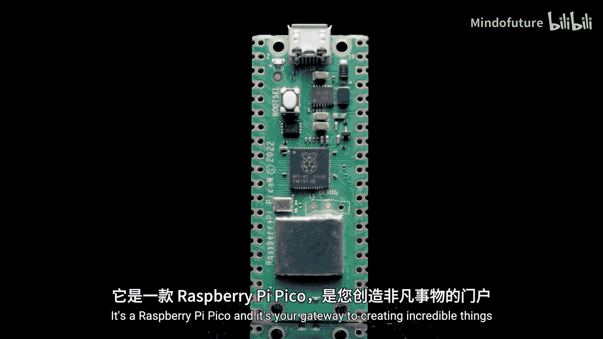
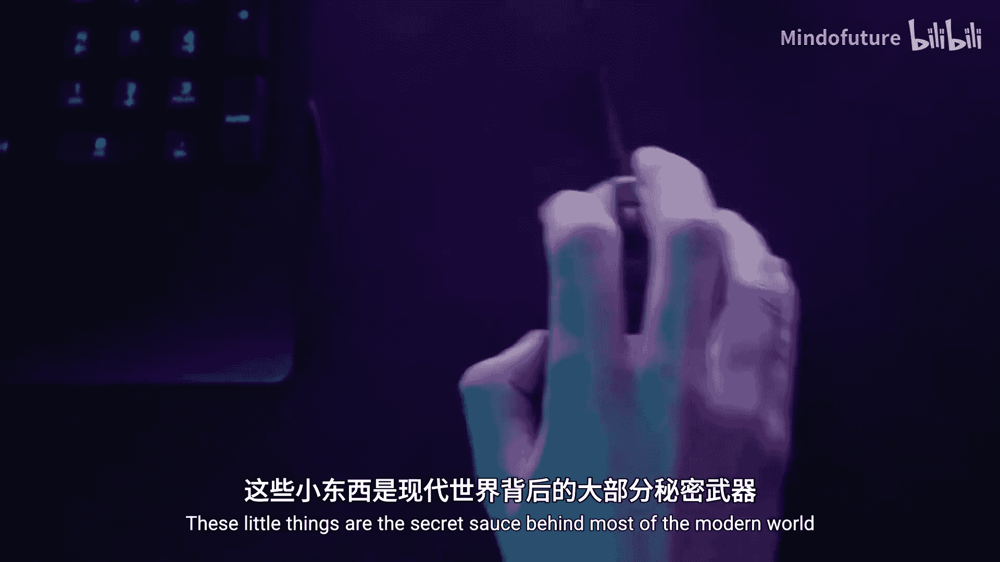
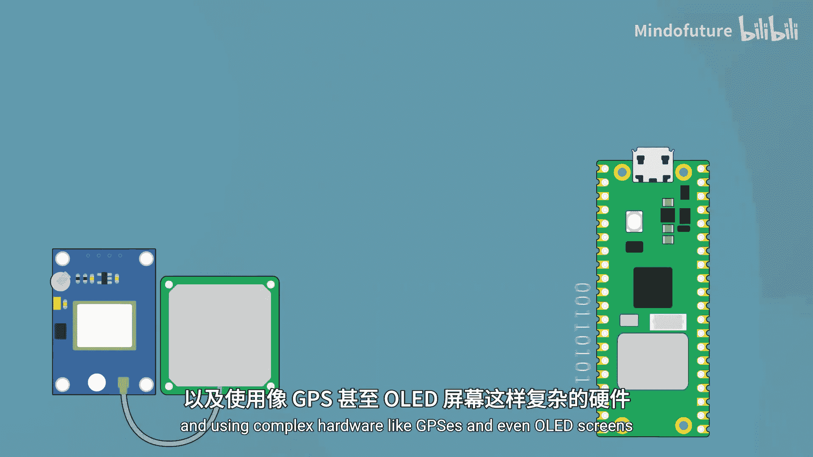
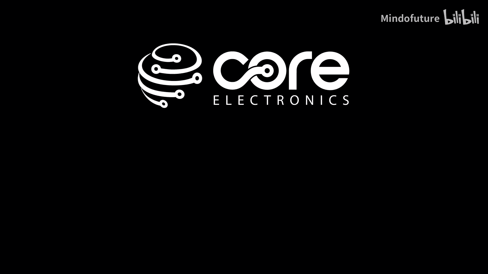

树莓派Pico初学者入门：p01：从这里开始学习微控制器

在本节课中，我们将要学习什么是微控制器，以及如何利用树莓派Pico开启你的创造之旅。树莓派Pico是一个微控制器，它是构建各种智能设备和项目的核心。

微控制器就像一个微型大脑，能让日常物品变得更智能。你可以用它来创造自主机器人、自动植物浇水系统、各种小工具，甚至是自己的智能家居设备。这些小小的芯片是现代世界大多数设备背后的秘密源泉。本教程旨在带领完全的新手入门，让你掌握足够的知识，能够走出去开始制作一些非常酷的东西。

本课程内容全面，但我们力求用最少的时间教授最多的知识。在学习过程中，我们会确保使用的示例是实用的，能够解决你在现实世界中会遇到的问题。最重要的是，本课程完全免费，所有内容都不会隐藏在付费墙后。我们已尽量减少你需要准备的物品，所需材料清单、所有代码及其他信息都可以在课程页面找到。

接下来，我们将初步涉足编程基础，学习如何控制LED灯、传感器和电机等。之后，我们会为项目添加更智能的思考能力。最后，我们将提升难度，进入更高级的主题，例如通过WiFi用这块板子托管网站，以及使用GPS和OLED屏幕等复杂硬件。

如果你想学习一项可能改变你人生轨迹的技能，请跟随我们一起开始。

---

本节课中我们一起学习了微控制器的基本概念、树莓派Pico的潜力以及本课程的大致路线图。从下一节开始，我们将动手实践，点亮第一个LED。