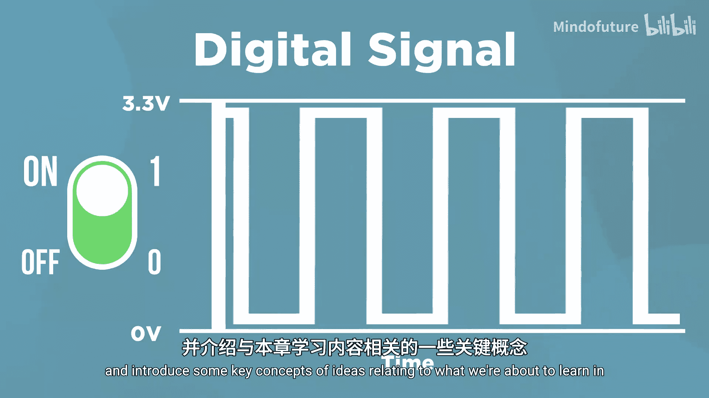
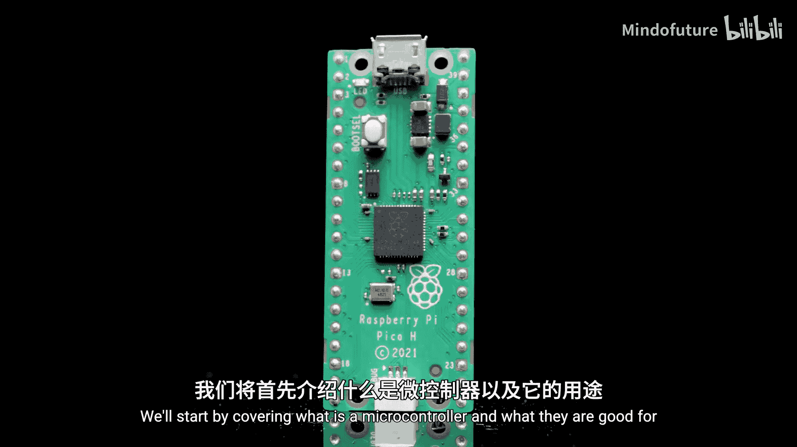
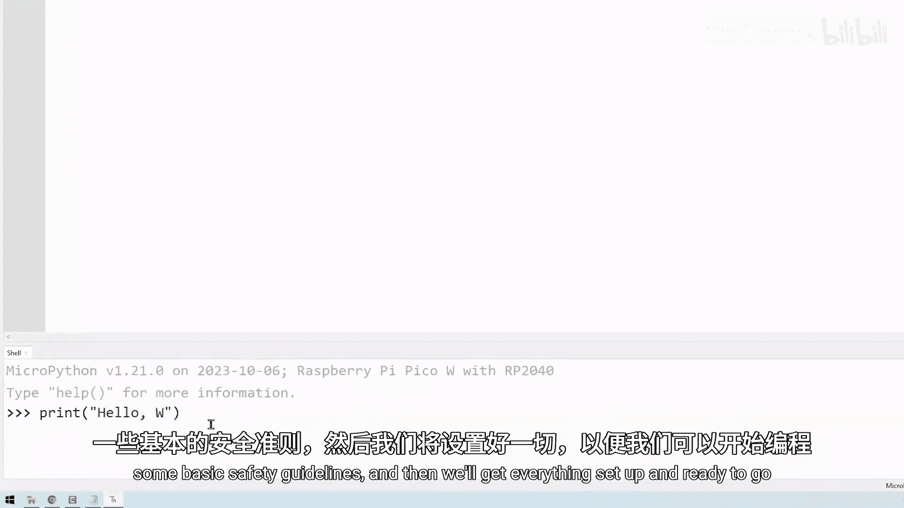
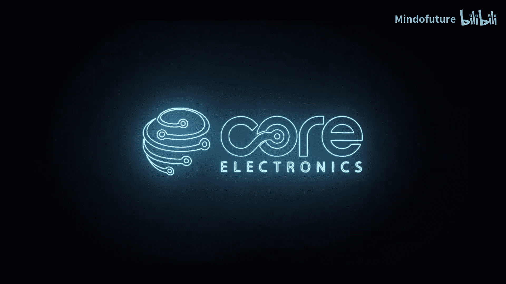
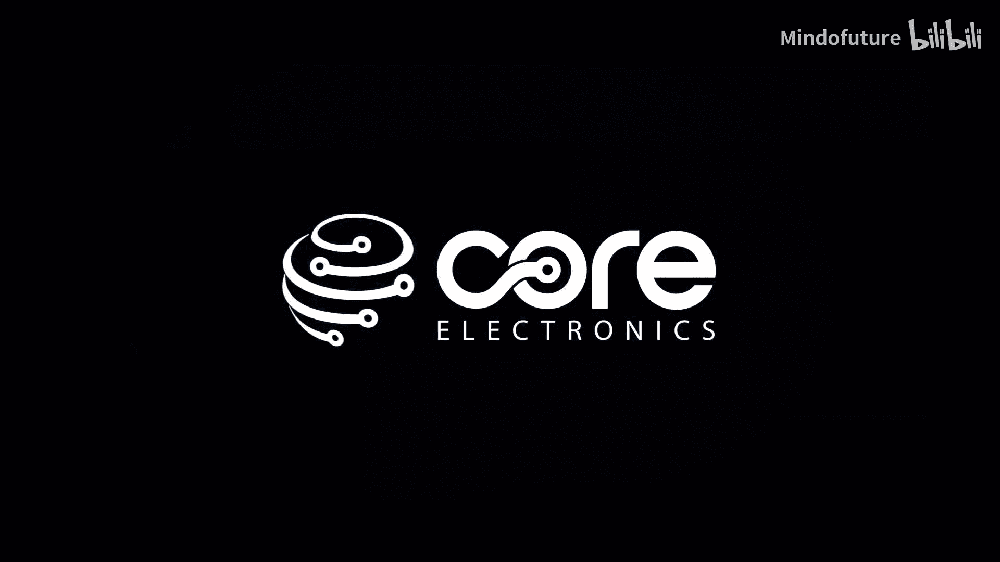

# 002：课程概述与第一章简介

在本节课中，我们将要学习整个课程的框架，并预览第一章“入门准备”的核心内容。第一章旨在帮助你理解微控制器的基础知识，并完成树莓派Pico的初始设置。

## 课程开篇

让我们开始这门课程。每一章的第一个视频都将概述该章内容，并介绍一些与我们即将学习的主题相关的关键概念。

第一章内容简洁明了，它可能是所有章节中最短的一章。

## 第一章内容预览

以下是第一章我们将要涵盖的主要内容：

*   **微控制器介绍**：我们将首先讲解什么是微控制器，以及它们擅长做什么。
*   **认识Pico**：我们将了解树莓派Pico及其一些不同的型号变体。
*   **安全指南**：我们会学习一些基本的安全操作准则。
*   **环境设置**：我们将完成所有设置，为编程Pico做好准备。
*   **学习建议**：最后，我们会分享一些技巧和建议，帮助你从本课程中获得最大收益。

本章除了设置Pico并准备编程环境外，没有太多需要动手操作的内容。因此，你可以放松心情，让我们正式开始。

---

本节课中我们一起学习了课程的总体结构以及第一章“入门准备”的具体学习目标。接下来，我们将深入探讨什么是微控制器，并开始动手设置你的树莓派Pico。