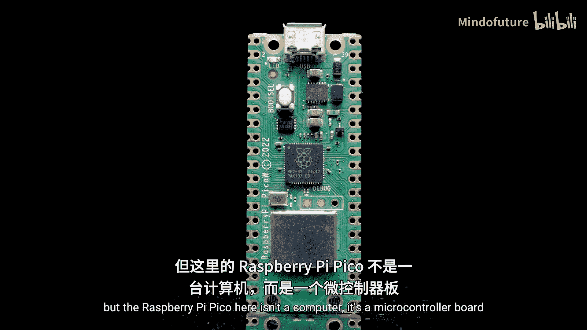
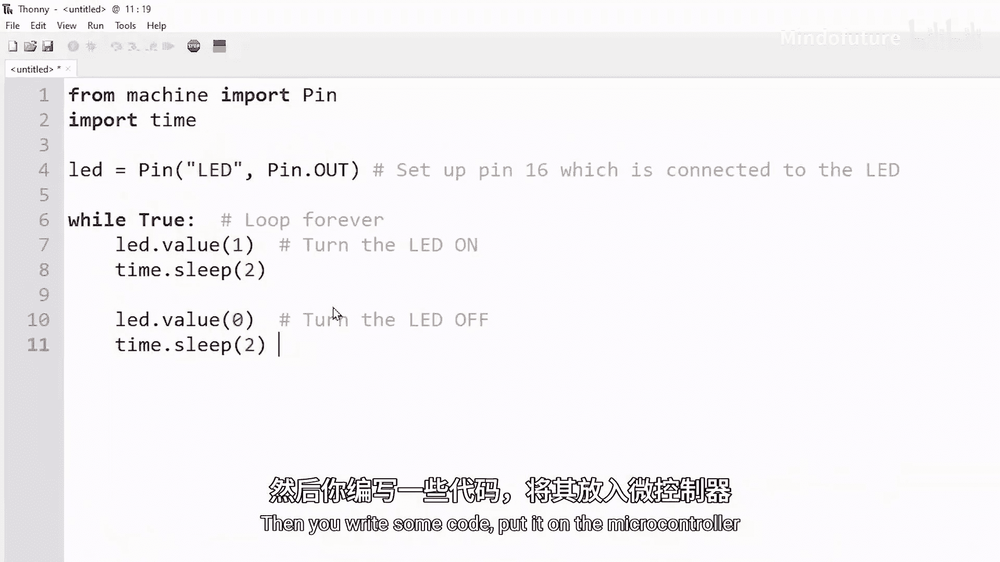

# 003：什么是微控制器

在本节课中，我们将要学习微控制器的核心概念，了解它与普通计算机的区别，并探索它在现实世界中的广泛应用。

你可能通过出色的单板计算机系列了解树莓派。但这里的树莓派Pico不是一台计算机，它是一块微控制器板，这完全是另一回事。

微控制器仍然拥有与普通计算机相似的硬件类型，比如**处理器**、**RAM内存**，它都具备。那么两者的区别是什么？

你的笔记本电脑或台式机等计算机，设计用于执行广泛的任务，例如浏览互联网、玩游戏或撰写报告。而像我们这里的Pico这样的微控制器板，是一个我们可以编程来完成非常特定任务的微型处理器。

计算机运行像Windows或MacOS这样功能齐全的操作系统。微控制器通常没有你可以用键盘或鼠标交互的用户界面。相反，它们允许你轻松地将硬件接入其中，例如温度传感器、光传感器、电机等。然后你编写一些代码，将其放入微控制器，这些代码会告诉微控制器如何处理你刚刚接入的硬件。

## 🛠️ 微控制器应用实例

以下是几个具体的应用示例，展示了微控制器如何执行特定任务。

*   **智能植物浇水系统**：在这个项目中，我们将一个土壤湿度传感器和一个水泵接入Pico。我们为Pico编写了一些代码，告诉它使用传感器检查土壤的湿度。在代码中，我们还告诉Pico：如果土壤湿润，什么也不做；如果干燥，则打开水泵给植物浇水。Pico会一遍又一遍地循环执行这个相同的任务。
*   **智能车库门**：这是一个自动车库门，接入了一个Pico，使Pico能够发送信号来开关车库门。随后编写了一些代码，利用Pico的Wi-Fi功能，允许通过手机无线控制车库门，取代了那个老旧的遥控器。
*   **野生动物保护项目**：一个非常酷的例子是肯尼亚的Mara大象项目。他们将一个微控制器（比如这个Pico）与GPS追踪器和运动传感器连接，然后安装到大象身上。接着编写代码，使其能无线报告这些大象的位置。这使得研究人员能够收集数据并研究大象，也让当地护林员能够追踪它们的位置，以帮助保护它们免受偷猎者的伤害。

## 🔌 无处不在的微控制器

微控制器也存在于一切事物中。你会在洗衣机、电脑鼠标、微波炉、相机、无人机、电动牙刷中找到它们。你会发现它们存在于如此多的电器中，这毫不夸张。它们在这些设备内部就像一个微小的指挥家，控制着设备，但它们只能演奏它们被编程好的“曲目”。

对于所有这些应用场景，微控制器都比普通计算机更理想，原因如下：

*   **功耗更低**
*   **发热更少**
*   **尺寸更小**
*   **价格便宜得多**
*   因为这些应用需要**特定且简单**的任务，意味着需要一遍又一遍地重复执行，所以微控制器是完美的选择。

我认为最重要的一点是，理解如何使用像这个Pico这样的微控制器，能让你有能力为特定问题构建自己的定制解决方案。范围从拯救一个物种，到简化和自动化家中的任务，再到设计和构建你自己的产品。而这正是我们想要做的——我们想为你配备一套技能工具箱，让你能够创造很棒的东西。但如何使用它，完全取决于你。

---

本节课中我们一起学习了微控制器的定义、它与通用计算机的关键区别，并通过几个生动的实例看到了微控制器如何通过编程与硬件结合，完成自动化、数据收集等特定任务。理解微控制器是开启硬件编程和物联网项目创作的第一步。