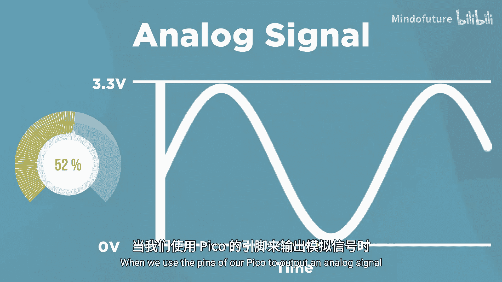

**树莓派Pico入门教程：2.1：基础输入输出简介**

在本章中，我们将学习如何使用基础输入输出（基础IO）让树莓派Pico开始观察和与周围世界互动。

当我们提到基础IO时，指的是通过Pico的GPIO引脚输入和输出数字与模拟信号。

首先，数字信号只有两种可能的状态：开或关。当我们使用Pico的引脚输出数字信号时，它类似于一个普通的电灯开关，只能打开或关闭电源，没有中间状态。

另一方面，模拟信号则是一个可以在开与关之间，或者说最大值与最小值之间取任意值的信号。它与数字输出不同，因为它可以取两者之间的任何值。当我们使用Pico的引脚输出模拟信号时，它类似于一个可调光开关，你可以在完全打开和完全关闭之间设置任何亮度级别。

我们现在只是介绍这些概念，一旦我们通过一些示例深入探讨，所有这些都会变得更加清晰。

除了编写代码来使用Pico的引脚进行基础IO操作，我们还将穿插一些电路搭建、关于电源的理论知识以及Pico的通用知识。因此，在本章结束时，你应该具备连接一些基本硬件并让你的Pico开始与周围世界互动的技能。

---

上一节我们介绍了基础IO的概念，本节中我们来看看数字信号与模拟信号的具体区别。

以下是两种信号的核心特征：

*   **数字信号**
    *   状态：只有两种，通常表示为 **高电平（1/ON）** 或 **低电平（0/OFF）**。
    *   类比：普通电灯开关。
    *   在代码中，通常用布尔值 `True`/`False` 或数字 `1`/`0` 表示。

*   **模拟信号**
    *   状态：在最小值和最大值之间**连续变化**，可以取无限个值。
    *   类比：可调光开关或音量旋钮。
    *   在微控制器中，通常通过**脉宽调制（PWM）** 来模拟，或用**模数转换器（ADC）** 读取。

---

通过本章的学习，我们一起了解了树莓派Pico基础输入输出的核心概念，区分了数字信号与模拟信号的根本不同，并明确了本章的学习目标是为后续的实际硬件交互打下基础。