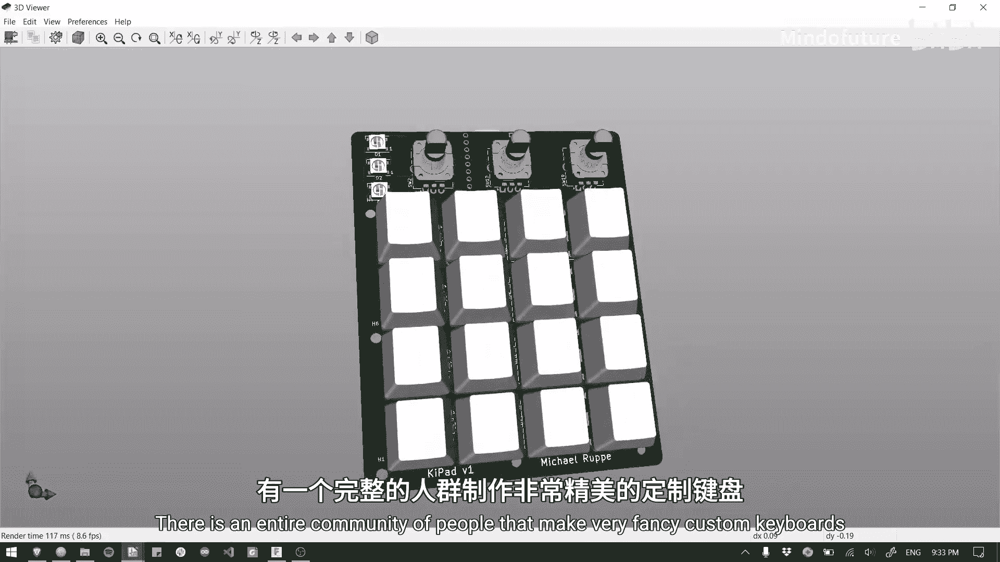
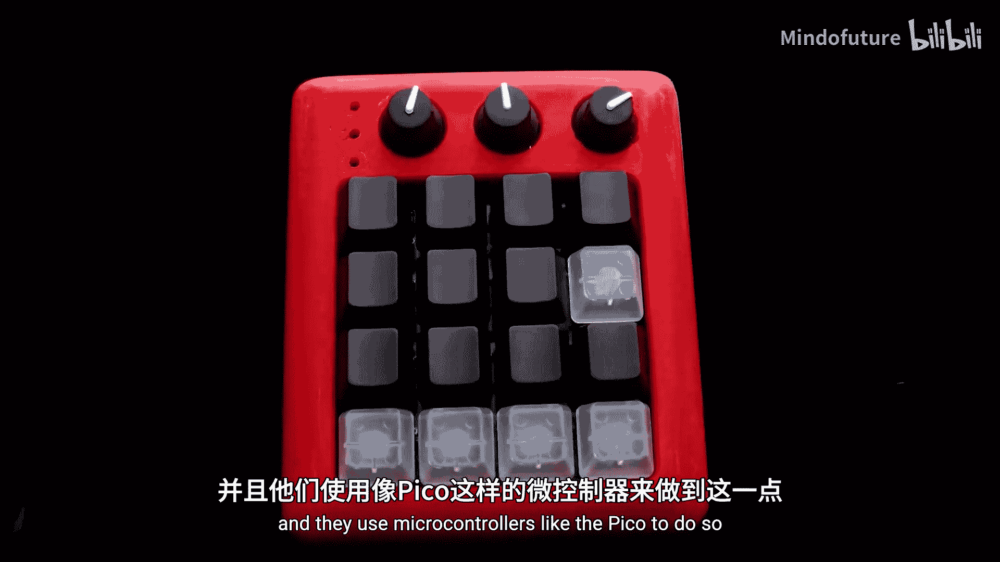
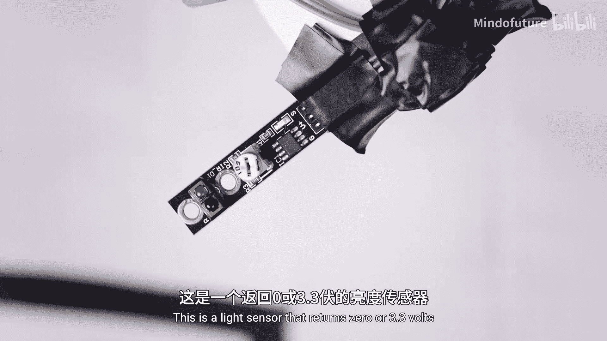

# 012：读取数字输入

在本节课中，我们将学习如何读取数字输入。树莓派Pico的26个GPIO引脚都可以用作数字输入。我们将通过一个按钮的例子来理解其工作原理，并学习如何编写代码来读取引脚的状态。

## 数字输入原理

上一节我们介绍了如何设置数字输出，本节中我们来看看如何读取数字输入。

数字输入与数字输出的逻辑相反。当我们设置数字输出时，使用 `pin.value(1)` 将引脚设置为3.3伏，使用 `pin.value(0)` 将其设置为0伏。对于数字输入，当引脚接收到约3.3伏电压时，代码会读取到值 **1**；当接收到约0伏电压时，会读取到值 **0**。本质上，它是在测量引脚上的电压是接近3.3伏还是0伏，并相应地返回1或0。

## 实践：读取按钮状态

学习的最佳方式是通过实例。让我们直接看一个使用按钮的例子，按钮是数字输入设备的完美示例。

如果你还没有连接上一视频中的电路，请确保至少按以下方式连接好电路。

创建一个新文件并粘贴演示代码。以下是我们的代码，它非常简洁，以便我们专注于数字读取。

```python
from machine import Pin
import time

button = Pin(15, Pin.IN, Pin.PULL_DOWN)

while True:
    print(button.value())
    time.sleep(0.1)
```

以下是代码的详细解释：

1.  **导入库和模块**：通过导入 `Pin`，我们可以使用 `.value()` 和引脚设置函数。导入 `time` 允许我们使用 `sleep` 函数。
2.  **初始化输入引脚**：我们将引脚15初始化为输入，并将其存储在名为 `button` 的变量中。第三个设置 `Pin.PULL_DOWN` 是可选的，用于启用下拉电阻，我们稍后会讨论。
3.  **注意大小写**：代码对大小写敏感。例如，将 `Pin` 写成 `pin` 会导致语法错误。
4.  **读取引脚值**：使用 `.value()` 命令读取我们设置为输入的引脚状态，并将其打印到Shell中。
5.  **无限循环与延时**：代码位于 `while True` 循环中，会不断重复。`time.sleep(0.1)` 将读取速度减慢到每秒10次，这足以满足我们的需求，并避免一些问题。

电路的连接方式是：按下按钮时，将Pico的引脚15连接到我们设置的电源轨的3.3伏；不按下时，则不提供任何电压。这完全符合数字输入读取的3.3伏逻辑电平。

确保你的Pico已连接，运行代码。如果一切连接正确，你将看到Pico打印按钮的当前状态：**0** 表示未按下，**1** 表示按下并提供3.3伏。

你还可以点击“视图”然后选择“绘图仪”，以图表形式查看状态变化。按下按钮，图表线应上升到1。

## 电压容差与下拉电阻

有时会提出一个问题：如果向引脚提供2伏或1伏电压，而不是精确的3.3伏，它会读取到什么？

实际上，数字输入不需要精确的3.3伏或0伏，两端都有一定的容差空间。但是，这仅适用于数字输入。对于上一节学习的数字输出，引脚输出会非常接近3.3伏或0伏。

现在，让我们看看禁用下拉电阻会发生什么。在引脚设置中删除 `Pin.PULL_DOWN` 参数。

```python
button = Pin(15, Pin.IN)  # 移除了下拉电阻
```

重新运行代码后，你会发现即使没有按下按钮，引脚电压也会漂浮不定，读数混乱。这是因为当按钮未按下时，引脚没有连接到任何明确的电压源（0伏或3.3伏），处于“悬空”状态，容易受到环境噪声干扰。

下拉电阻的作用就是微弱地将该电压拉低至0伏。当没有3.3伏电压供应时，它能确保引脚稳定在0伏，而不是漂浮不定。Pico内部集成了微小的下拉电阻，可以通过代码启用，这非常方便。

## 综合应用：用按钮控制LED

最后一个例子，我们将刚学的数字输入与之前学的数字输出结合起来。你可以用已连接的电路跟着操作。

复制第二段演示代码并粘贴到新文件中。

```python
from machine import Pin
import time

button = Pin(15, Pin.IN, Pin.PULL_DOWN)
led = Pin(16, Pin.OUT)

while True:
    if button.value() == 1:
        led.value(1)  # 打开LED
    else:
        led.value(0)  # 关闭LED
```

在这段代码中，我们像之前一样设置输入，同时将引脚16设置为输出并连接到LED。

在 `while True` 循环中，我们引入了一个 `if-else` 语句（我们将在下一章深入学习此类逻辑）。它的工作原理很简单：检查按钮引脚的值，如果等于 **1**，则运行其内部的代码（打开LED）；否则（即不等于1），运行 `else` 部分的代码（关闭LED）。注意，`if` 和 `else` 下面的代码需要缩进（4个空格或1个制表符）。

运行这段代码，当你按下按钮时，LED应该会亮起。这段代码完美展示了微控制器最基本的应用：读取某种数据（本例中为按钮状态），然后通过`if`语句进行决策或计算，最后输出信号来控制某些设备（本例中的LED）。



## 数字输入的应用场景



那么，数字输入还能做什么呢？

*   **安全开关**：这个按钮可以是机器人或任何项目上的大型红色紧急停止开关。如果按下按钮，则关闭一切以确保安全。
*   **键盘**：你可以将许多按钮串联起来制作一个键盘。有一个完整的社区专门制作非常精美的定制键盘，他们使用像Pico这样的微控制器来实现。
*   **传感器**：如果你不想用按钮，还有很多传感器可用：
    *   **声音传感器**：如果环境安静则返回0伏，如果声音大则返回3.3伏。你可以制作一套能用掌声开关的灯。
    *   **光线传感器**：返回0或3.3伏。你可以将其指向地面，用于制作循线机器人，这是一个非常常见的入门项目。
    *   **超声波距离传感器**：它 technically 使用数字输出和输入。它的工作原理是发出一束我们听不到的声波，当声波反弹回来时返回3.3伏。通过一些数学计算，你可以算出声音传播的时间，从而用声音计算距离。

## 总结



本节课中我们一起学习了：


1.  我们需要导入模块和库（如 `machine.Pin` 和 `time`）来使用有用的函数。
2.  26个GPIO引脚中的任何一个都可以读取数字输入，**0伏返回0，3.3伏返回1**。
3.  使用按钮等组件时，需要使用**下拉电阻**来防止电压漂浮不定。