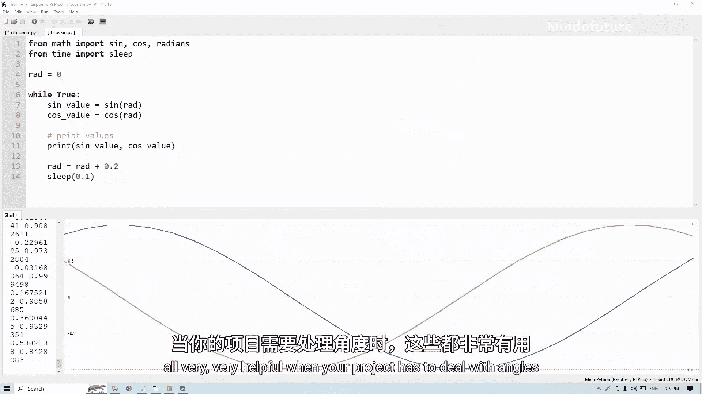

# 013：变量

## 概述
在本节课中，我们将要学习编程中的一个核心概念——变量。变量是存储数据和信息的方式，理解它们对于编写任何程序都至关重要。我们将通过简单的比喻和实际的代码示例来学习如何创建和使用变量，并了解其基本规则和类型。

## 什么是变量？📦
变量是编程的基石。我们可以将变量想象成一个盒子，用于存储数字、文字或任何类型的信息。例如，如果我们想记录一只狗的年龄，可以创建一个名为 `age` 的“盒子”。今年狗3岁，我们就把数字 `3` 存入这个盒子。每年生日，我们只需将盒子里的数字加1，而无需记住具体的数字。任何时候，我们都可以通过查看盒子里的数字来知道狗的年龄，无需进行额外计算或记忆。

虽然这个例子很简单，但在微控制器编程中，你可能需要同时跟踪几十个变量、数字、状态和倒计时，而微控制器每秒能执行数百万次计算。此时，变量就成为一种极其重要且简便的数据管理和使用方式。

## 变量的实际应用 💡
我们已经在前面的课程中不知不觉地使用了变量。例如，当我们设置引脚15为输入时，我们将这个引脚实例存储在一个名为 `button` 的“盒子”里。之后，当我们想读取这个引脚的值时，实际上就是读取了装有引脚实例的 `button` 盒子。

学习变量的最佳方式是通过实例。接下来，我们将通过两个代码示例来深入理解。

## 示例一：按钮计时器 ⏱️
以下是第一个示例。我们将计算按钮被按下的秒数。

首先，将示例代码复制并粘贴到一个新文件中并保存。示例代码可在课程网站页面找到，YouTube视频描述中也附有链接。

这段代码与之前提到的“狗的年龄”例子非常相似。我们导入必要的库，在引脚15上设置一个按钮，然后创建一个名为 `timer` 的变量。创建变量非常简单：只需输入变量名，加上等号，然后赋予它数据即可。

```python
import machine
import utime

button = machine.Pin(15, machine.Pin.IN, machine.Pin.PULL_DOWN)
timer = 0

while True:
    utime.sleep(1)
    if button.value() == 1:
        timer = timer + 1
    print(timer)
```

在 `while True` 循环中，我们先延迟一秒。之后每秒检查一次按钮状态。如果按钮被按下（值为1），就将变量 `timer` 的值增加1。最后，打印出 `timer` 变量中存储的当前数值。

运行代码，Pico每秒会打印一次 `timer` 的当前值。如果不按按钮，数值不会增加。如果按住按钮，它将计算按钮被按下的秒数。松开按钮后，计数停止。

## 示例二：优化按钮与LED代码 💡
现在，让我们修改上一个视频中的按钮和LED代码，来展示使用变量的优势。假设我们除了控制LED，还想在Shell中打印按钮的状态。

初始代码可能如下所示：
```python
import machine
import utime

button = machine.Pin(15, machine.Pin.IN, machine.Pin.PULL_DOWN)
led = machine.Pin(25, machine.Pin.OUT)

while True:
    utime.sleep(0.1)
    if button.value() == 1:
        led.value(1)
    else:
        led.value(0)
    print(button.value())
```

这段代码可以正常工作，但效率不高。为了解释原因，想象一下Pico不是读取按钮，而是你在检查天空是否有云。第一行指令是：“如果天上有云，就打开LED。” 你需要起身，到外面查看，然后回来。紧接着，`print` 函数又命令你：“起身，到外面查看是否有云，然后打印结果。” 但你刚刚才查看过，已经知道结果了。这种方式效率低下。

对于运行速度极快的Pico来说，`if` 语句和 `print` 语句中两次读取按钮状态的时间间隔极短（可能只有百万分之一秒），按钮状态在这段时间内几乎不可能改变。因此，反复读取是不必要的。

以下是使用变量优化的更好方式：
```python
import machine
import utime

button = machine.Pin(15, machine.Pin.IN, machine.Pin.PULL_DOWN)
led = machine.Pin(25, machine.Pin.OUT)

while True:
    utime.sleep(0.1)
    b_state = button.value()  # 读取一次并存入变量
    if b_state == 1:
        led.value(1)
    else:
        led.value(0)
    print(b_state)  # 使用存储的变量值
```

现在，循环开始时只读取一次按钮状态，并将其存储在变量 `b_state` 中。随后的 `if` 语句和 `print` 语句都使用这个变量值。这就像你只出门查看一次天气，然后在心里记住（存储）这个结果，并基于这个记忆（变量）进行后续操作。

在简单代码中，两种方式效果相同。但在更复杂、冗长的代码中，每次都让Pico检查引脚状态会显著降低效率。因此，使用变量的方式是更优的编程实践，也使代码更易读。

## 变量的重要特性：临时性 ⚠️
需要特别注意的一点是：**变量是临时的**。如果你关闭Pico的电源，所有存储在变量中的数据都会完全丢失。重新启动Pico后，一切将从零开始。

## 变量的类型 🔢
MicroPython 让使用变量变得非常容易，以至于你有时可以忽略变量类型。但理解类型仍然很重要。变量有不同的类型，最常见的三种是：**整数**、**浮点数** 和 **字符串**。

*   **字符串**：可以将其视为只存储单词、句子或任何键盘可输入内容的盒子。创建时需用引号括起来。
    ```python
    x = "这是一个字符串"
    print(x)
    ```
*   **整数**：存储整数，如 1, 3, 5。
*   **浮点数**：存储带小数点的数字，如 2.33, 4.1。

对于初学者，选择正确的变量类型可能令人困惑。但幸运的是，在 MicroPython 中创建变量时，它会根据我们想要存储的数据**自动选择正确的变量类型**。

例如：
```python
x = 2.5  # MicroPython 会自动将其分配为浮点数
```

我们也可以手动覆盖并设置变量类型：
```python
x = int(2.5)  # 尝试将2.5作为整数存储
print(x)      # 输出将是 2，因为小数部分被截断了
```

所以，字符串存储文本，整数存储整数，浮点数存储小数。MicroPython 的自动类型管理是其易于使用的原因之一。

## 变量的命名规则 📝
之前我说过可以随意命名变量，但这并不完全准确。命名变量有一些规则：

1.  变量名**不能包含空格**。
2.  只能使用**字母、数字和下划线**。例如，我们使用了 `b_state`，其中的下划线就是为了替代空格。
3.  变量名**不能以数字开头**。必须以字母或下划线开头。
4.  变量名是**大小写敏感**的。`b_state` 和 `B_state` 是两个不同的变量。
5.  不能使用 Python 的**关键字**作为变量名。例如，不能将变量命名为 `import`，因为 MicroPython 无法区分你是指一个叫 `import` 的变量，还是想导入一个库。

## 变量与数学运算 ➕➖✖️➗
在第一个计时器示例中，我们使用了 `+` 运算符来增加 `timer` 变量的值。MicroPython 提供了多种数学运算符供你使用。

你可以回到那个例子，尝试将 `+` 改为 `-`、`*`（乘）、`/`（除）等。如果导入 `math` 库，你还可以使用三角函数（如 `sin`, `cos`, `tan`）等，这在处理角度相关的项目时非常有用。

你不需要现在就掌握所有数学函数，只需知道：当需要在 Pico 上处理数据并进行数学计算时，一定有相应的数学函数可以完成。变量和数学运算常常携手并进。

## 总结 🎯
本节课中我们一起学习了变量的核心知识：



1.  **变量是代码中存储和跟踪数据的便捷方式**。它们就像贴有标签的盒子，让数据管理变得清晰有序。
2.  **变量类型很重要，但 MicroPython 能很好地自动管理它们**。我们了解了字符串、整数和浮点数这三种基本类型。
3.  **变量命名有特定规则**：只能包含字母、数字和下划线；不能以数字开头；大小写敏感；不能使用Python关键字。


掌握变量是迈向有效编程的关键一步。在接下来的项目中，你会越来越频繁地使用它们来构建更复杂、更强大的程序。