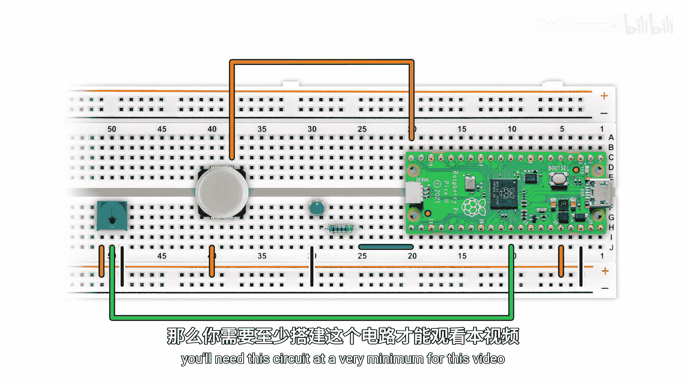
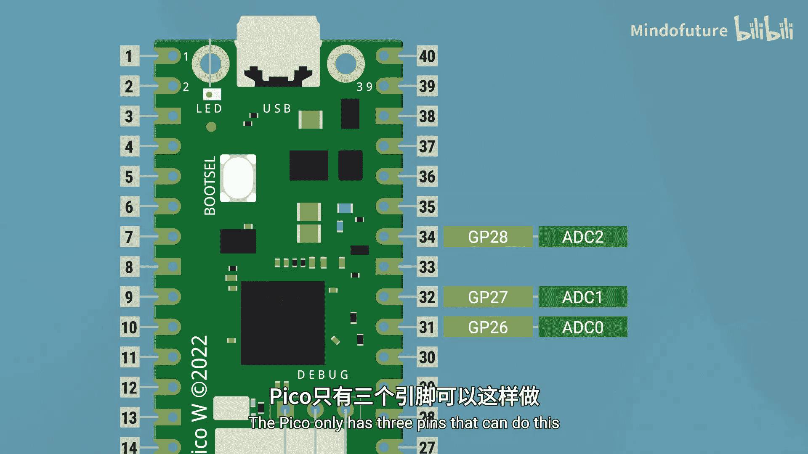
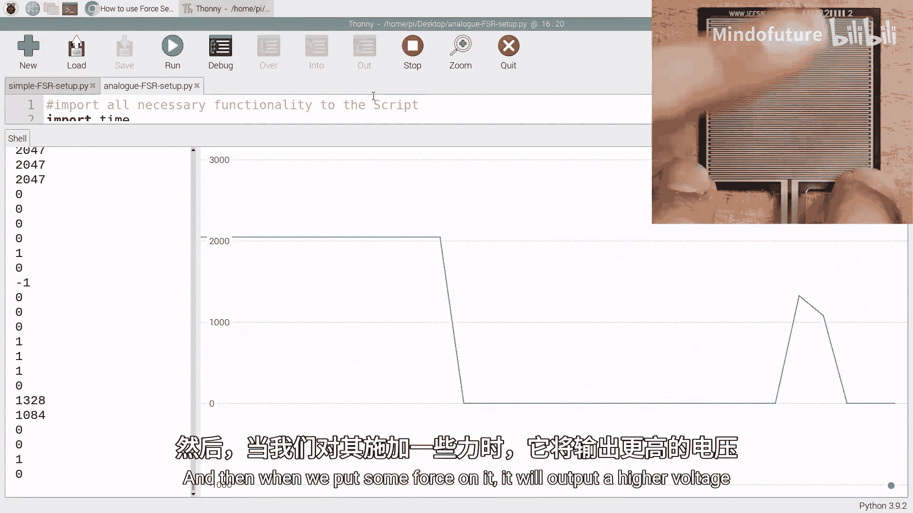
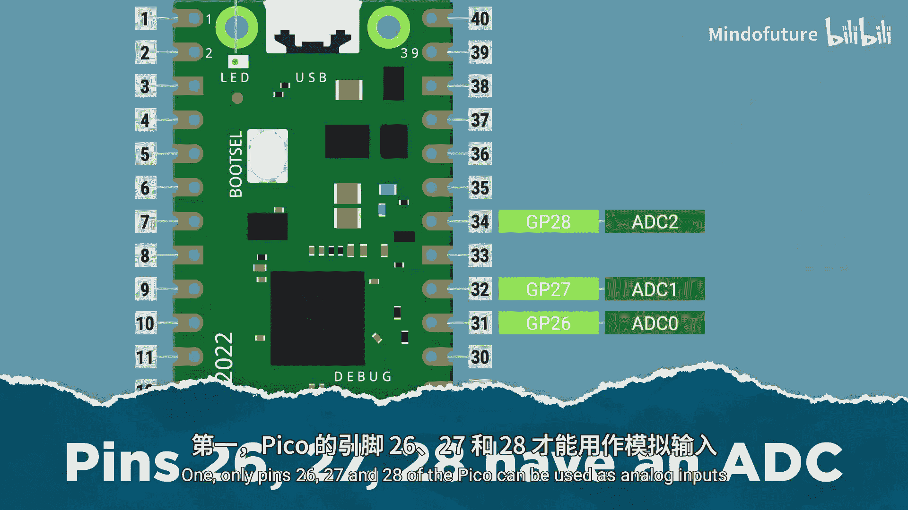
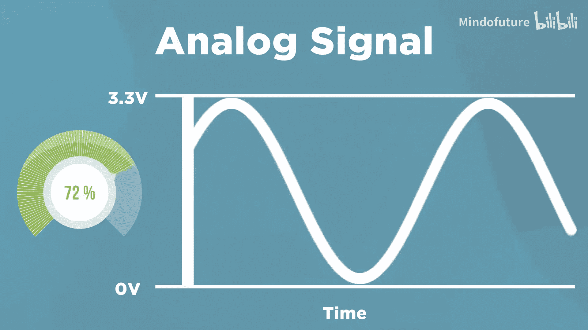

树莓派Pico初学者入门：2.6：读取模拟输入

在本节课中，我们将要学习如何让树莓派Pico读取模拟信号。这是进入更酷项目的关键一步，因为许多现实世界中的传感器都输出模拟信号。

---

### 概述：模拟信号与数字信号

模拟信号和数字信号是完全不同的。我们可以用天空中的云来举例。

*   **数字信号**就像问：“天上有云吗？”这个问题只有一组二进制答案。换句话说，答案要么是“是”，要么是“否”，你可以用 **1** 或 **0** 来表示。
*   **模拟信号**则像问：“天空被云覆盖的百分比是多少？”这个问题的答案远不止一个，范围在 **0%** 到 **100%** 之间。答案可以是 **42.371%**，也可以是 **99.2%**，可以是 **0** 到 **100%** 之间的任何数字。

对于树莓派Pico来说，这意味着当我们把一个引脚设置为模拟输入时，我们可以读取该引脚上 **0V** 到 **3.3V** 之间的精确电压值。

如果你还记得之前视频中的例子，我手动调整引脚上的电压，橙色线是读取该电压**数字输入**的结果，只能返回 **1** 或 **0**；而蓝色线实际上就是该电压的**模拟读数**，我们得到了从 **0** 到 **3.3V** 的连续值。它只是读取我提供给引脚的任意电压。

---

### 硬件连接与代码准备

要开始实践，你需要搭建本章节对应的电路。至少，你需要一个连接到Pico的电位器。

示例代码可以在我们的课程页面找到。我们从导入必要的模块开始。



```python
from machine import ADC, Pin
import time
```

这次我们导入了 **ADC**，它代表模数转换器，这将允许我们设置模拟输入。

---

### 设置模拟输入引脚

接下来，我们将Pico的引脚26设置为模拟输入，并连接到面包板上的电位器。

```python
pot = ADC(Pin(26))
```

这里有一个非常重要的点：**只有引脚 26、27 和 28 可以用作模拟输入**。Pico只有这三个引脚可以做到这一点。这是因为将模拟信号转换为数字信号需要一块特殊的硬件，称为模数转换器，而只有这三个引脚可以访问Pico上的这块硬件。如果你尝试在其他引脚上使用，它将无法工作。



我们还定义了一个变量，暂时先忽略它，我们稍后会详细解释。

```python
conversion_factor = 3.3 / 65535
```

---

### 读取并处理模拟值

在我们的主循环中，我们读取电位器的值。

```python
while True:
    reading = pot.read_u16()
```

**`read_u16()`** 是实际读取模拟输入的地方。它会返回一个值。

现在，我们进行一点数学运算，将读数乘以转换因子，然后存储在一个变量中。

```python
    pot_voltage = reading * conversion_factor
    print(pot_voltage)
    time.sleep(0.2)
```

插入你的Pico，运行代码。当你旋转电位器时，Shell中显示的电压读数应该会变化，报告该引脚上当前设置的电压。你也可以启用绘图器，这非常酷，当你旋转电位器时，可以看到一条线在你的电脑上移动。

---

### 理解原始数据与转换

我们的电位器工作原理是：它的一端接地，另一端接3.3V。当我们转动中间的旋钮时，它实际上是在混合这两种电压。

但这里我们“取巧”了。Pico上的模拟输入并不能完美地读取0到3.3V。我们使用的 **`conversion_factor`** 在打印之前将其修改到了这个理想的电压范围。这也展示了使用变量的另一种好方法：将它们用作永远不会改变的**常量**。

现在，让我们移除乘以转换因子的步骤，看看原始数据输入是什么。

```python
while True:
    reading = pot.read_u16()
    print(reading)
    time.sleep(0.2)
```

你会发现它的行为类似，但打印的范围是 **0 到 65535**，而不是 0 到 3.3。这是因为ADC和MicroPython的工作方式。


---

### 模数转换器的工作原理

Pico是一个数字设备，而我们周围的世界（例如电压）是非常模拟的。为了让像Pico这样的数字设备读取其引脚上的模拟信号（如电压），它需要使用一个**ADC**。

ADC做的事情正如其名：它将Pico引脚上的模拟电压转换成数字Pico可以使用的东西。但它的实现方式是：将那个电压转换成一个漂亮的整数。这有点奇怪，但这就是数字设备的工作方式。

在我们的Pico上：
*   **0V** 的读数将返回数字 **0**。
*   **3.3V** 的读数将返回数字 **65535**。
*   **0V 和 3.3V 中间**的电压将返回 **0 和 65535 中间**的数字。
*   四分之一处的电压将给出四分之一处的数字。

它在两个范围之间完美映射。通过一点数学计算，你可以发现，如果乘以我们存储在 `conversion_factor` 变量中的数字，它会变回 **0 到 3.3** 的范围。你并不总是需要这样做，但我们的目标是读取引脚上的电压，这样做使其更易于人类阅读。你应该根据项目需求或自己的习惯来选择是否转换。

---

### 模拟传感器的应用世界

现在我们可以读取引脚上的电压了（只要它在0到3.3V之间），我们能用它做什么呢？我们可以**读取传感器**。

我们周围的世界是非常模拟的，这意味着你遇到的许多传感器都会为你提供模拟信号。它们通常比数字传感器更有趣，提供的信息也更多。

以下是几个例子：

*   **麦克风传感器模块**：它有两个输出。数字输出在安静时返回0，响亮时返回1。但**模拟输出**返回一个与房间响度相对应的电压，因此你可以获得比“安静或响亮”更多的数据，你可以知道房间有多响。
*   **温度传感器**：它也有一个模拟输出。在 **-50°C** 时，它输出 **0V**；在 **125°C** 时，输出 **1.7V**。你可以将其插入Pico，进行模拟读数，然后通过一点数学计算将读取的电压转换为实际温度。
*   **土壤湿度传感器**：它根据检测到的土壤中的水分输出一个电压。你可以将其放入干燥的土壤中查看读数，然后放入刚浇过水的土壤中，看到电压读数升高。然后，你可以使用Pico监测传感器输出的电压水平，当土壤变得太干时打开水泵。我们在一个很酷的自动浇水植物套件中正是这样做的。
*   **压敏电阻**：我们可以将其接线，使其在无压力时读取0V，当我们施加一些力时，它会输出更高的电压。然后我们可以将其放在垫子下，使用Pico测量人们踩上去时的电压峰值。你甚至可能能够检测到是宠物还是人：猫或狗施加的压力较小，导致的电压变化较小，而一个重的人会产生更大的信号。



我想说的是，一旦我们可以使用模拟传感器，一个不可思议的世界就打开了。

---

### 总结




本节课中我们一起学习了如何让树莓派Pico读取模拟输入。让我们回顾三个关键要点：




1.  **引脚限制**：只有Pico的引脚 **26、27 和 28** 可以用作模拟输入。
2.  **读取步骤**：要读取模拟信号，你需要导入 **`ADC`**，然后使用 **`ADC(Pin(pin_number))`** 设置引脚，并使用 **`.read_u16()`** 方法读取它。
3.  **读数范围**：模拟读数将输入一个从 **0 到 65535** 的数字，该数字代表引脚上从 **0V 到 3.3V** 的电压。你可以通过数学计算将其转换回电压值。