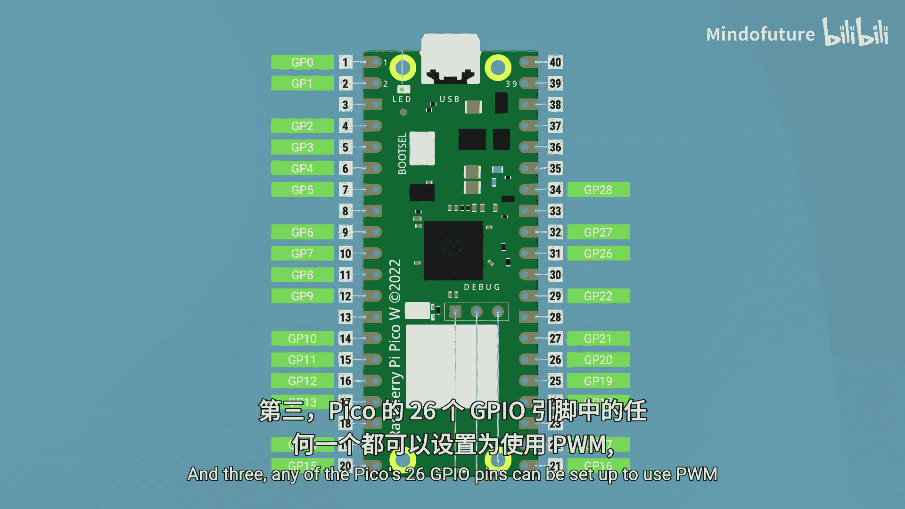

树莓派Pico初学者入门：2.7：PWM输出

在本节课中，我们将要学习如何使用脉冲宽度调制（PWM）来模拟模拟信号输出。我们将了解PWM的工作原理，如何在树莓派Pico上配置PWM，并通过控制LED亮度的实例来掌握其应用。

---

上一节我们介绍了模拟输入，本节中我们来看看模拟输出。从模拟信号转换为数字信号并不困难，但从数字信号转换为真正的模拟信号则要复杂得多，以至于大多数微控制器无法原生输出一个在0到3.3伏特之间连续变化的电压。

然而，我们可以使用一种称为**脉冲宽度调制（PWM）**的技巧来创建模拟信号的复制品或模仿品。Pico的引脚只能输出3.3伏特或0伏特，没有中间值。但我们可以让一个引脚以极快的速度（例如每秒数千次）反复开关，从而在0到3.3伏特之间产生一个平均电压。

例如，如果一个引脚开启1毫秒，然后关闭1毫秒，并不断重复这个模式，由于引脚有50%的时间处于开启状态，我们就能产生一个1.65伏特的平均电压（即3.3伏特的50%）。在这个开关周期中，引脚开启时间的百分比被称为**占空比**。

*   100%的占空比意味着引脚一直开启，输出3.3伏特。
*   10%的占空比意味着引脚有10%的时间开启，输出0.33伏特。
*   20%的占空比输出0.66伏特，以此类推。

通过计算任何百分比占空比对应的电压（介于0到3.3伏特之间），我们就可以创建出模拟输出的效果。虽然这不是完美的替代方案，但通常足够好，许多数字设备无法区分PWM信号和真正的模拟信号。

---

让我们通过示例代码来实践一下。代码可以在我们的课程页面找到（YouTube观众请查看描述中的链接）。

以下是设置Pico在引脚16（我们连接了一个LED和电阻）上输出PWM信号的基础代码。

要使用PWM，我们需要从`machine`模块导入它，然后初始化我们希望设置为输出的引脚。其语法与设置ADC引脚非常相似。但有一点不同：Pico的26个GPIO引脚中的任何一个都可以输出PWM信号，这对于微控制器来说相当多。

```python
from machine import Pin, PWM

pwm_pin = PWM(Pin(16))
```

在这行代码中，我们设置PWM信号的频率。这不是占空比，而是引脚每秒开关的次数。设置频率是可选的，你可以移除这行代码，PWM仍将正常工作，只是会使用默认频率。在某些情况下你需要手动设置频率，所以我们包含了它。但请再次注意，这不是占空比。你可以尝试调整它，频率最低可至8赫兹，但通常应保持在1000赫兹左右。

```python
pwm_pin.freq(1000)
```

然后，我们使用`duty_u16`方法在引脚上设置占空比。这里我们遇到了与模拟输入相同的问题：我们不能直接输入0到100的占空比值，而必须输入一个介于0到65535之间的数字，它线性地代表0%到100%的占空比。这就是为什么我这里有一个名为`max`的变量，它对应100%占空比（或3.3伏特）的最大值。这样设置可以方便地设定占空比。

```python
max_duty = 65535
desired_duty_cycle = 0.5  # 代表50%
pwm_pin.duty_u16(int(max_duty * desired_duty_cycle))
```

在这个例子中，我设置了50%的占空比。运行这段代码，LED应该会亮起，但亮度低于全亮。用万用表测量，可以看到读数约为1.65伏特。如果将PWM占空比改为20%，则可以在万用表上测量到大约0.66伏特。

---

最后，我们来看第二段示例代码。这段代码将读取电位器的电压值，并将其输出到Pico的16号引脚。这是一个简洁的交互式示例，很好地演示了模拟输入和PWM输出的结合。

在这里，我们只是读取ADC的原始模拟输入值（一个介于0到65535之间的数字），将其存储在名为`pot_value`的变量中，然后将这个精确的值输出到我们的PWM引脚。我们同时将值打印到Shell，以便观察。

```python
from machine import Pin, PWM, ADC
from time import sleep

adc_pin = ADC(Pin(26))
pwm_pin = PWM(Pin(16))
pwm_pin.freq(1000)

while True:
    pot_value = adc_pin.read_u16()  # 读取0-65535之间的值
    pwm_pin.duty_u16(pot_value)     # 将该值直接设置为PWM占空比
    print(pot_value)
    sleep(0.1)
```

运行代码，你现在应该可以看到LED的亮度正通过电位器进行控制。这是我们通过结合模拟输入和PWM输出解锁的一项非常酷的能力。

---

现在我们知道如何使用PWM在Pico的引脚上设置0到3.3伏特之间的平均电压了。那么我们可以用它来做什么呢？我们可以做大多数数字输出能做的事情，但现在有了更多的控制和精细度。

以下是PWM的一些常见应用：

*   **控制LED亮度**：这比简单的开关提供了更多的可能性。
*   **驱动RGB LED**：RGB LED非常有趣，它们可以使用3个PWM输出来控制内部红、绿、蓝LED的亮度，从而混合出任何你想要的颜色。
*   **控制MOSFET和晶体管**：PWM也可用于控制MOSFET和晶体管。例如，我们可以用Pico的PWM来控制汽车前灯的亮度。
*   **控制电机**：我认为PWM最强大的功能之一是能够控制电机。例如遥控车、飞机和无人机，它们需要通过PWM精确控制电机速度。风扇内部也有电机，现在你可以使用模拟温度传感器并编写代码，让风扇转速随着温度升高而增加。
*   **驱动各类电机执行器**：例如用于推拉物体的线性执行器、用于精确旋转的步进电机，以及伺服电机——这种神奇的设备可以让你以非常精确的角度控制物体。所有这些都可以通过来自Pico的PWM信号进行控制。

---

本节课中我们一起学习了以下三个关键要点：

1.  **脉冲宽度调制（PWM）** 可用于通过快速开关数字引脚来模拟模拟输出。
2.  我们使用术语 **占空比** 来描述信号开启时间的百分比，这是我们控制引脚平均电压的方式。
3.  Pico的26个GPIO引脚中的任何一个都可以设置为使用PWM，它使用一个介于 **0到65535** 之间的值来代表0%到100%的占空比。




通过掌握PWM，你为你的树莓派Pico项目打开了控制亮度、速度和位置的大门。