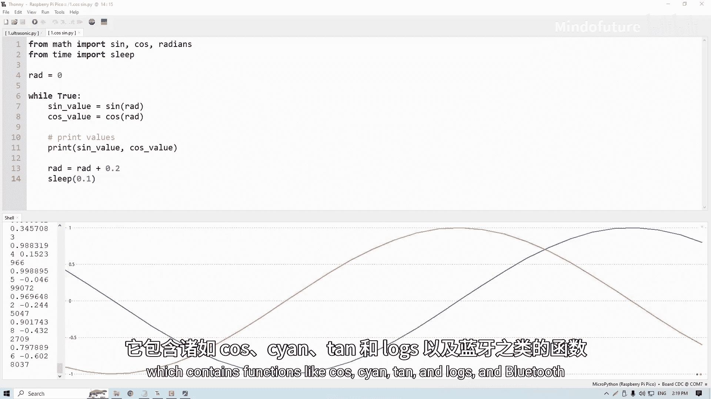

# 016：导入库

在本节课中，我们将学习如何使用库来简化编程工作。库是预先编写好的代码集合，可以帮助我们完成复杂任务，而无需自己从头编写所有代码。

## 什么是库？

库是一种极其强大的工具，可以极大地简化编程工作。它们本质上是预先编写好的代码片段，能够完成大量繁重的工作，从而减轻我们的负担。实际上，我们已经使用了一些库，主要是用于延时和引脚设置。当我们使用 `time.sleep()` 时，我们不需要了解其背后的实现细节，但为了让Pico进入休眠状态，硬件层面发生了大量复杂且涉及广泛的操作。幸运的是，你只需导入时间库，一行代码 `time.sleep()` 就能为你完成所有工作。库让我们能够使用预先编写的代码，使生活更轻松。

## 库的类型

上一节我们介绍了库的基本概念，本节中我们来看看库的两种主要类型。

### 标准库

MicroPython 拥有所谓的标准库。当你将 MicroPython 安装到 Pico 上时，这些库也随之内置。要使用它们，你只需要 `import` 后跟库的名称即可。

以下是几个标准库的例子：
*   **machine** 库：允许我们使用 ADC、PWM 和 Pin 功能，用于设置 Pico 的引脚。
*   **time** 库：我们一直在使用它的 `sleep` 函数。
*   **math** 库：包含 `cos`、`tan`、`log` 等数学函数。
*   **bluetooth** 库：允许你在 Pico 上使用蓝牙功能。

标准库有很多，一次快速的谷歌搜索就能让你知道可以使用哪些。

### 外部库

除了标准库，还存在一个庞大的外部库世界，其数量之多令人难以置信，通常用于非常具体和特定的应用场景。很多时候，当你购买一个模块时（比如这个非常酷的 OLED 显示屏），你会找到指向外部库的链接来帮助你使用它。或者，如果它是一个常见的模块，通过快速谷歌搜索也能找到。当你开始使用更复杂的模块时，比如那个交互起来相当困难的 OLED 模块，你将会大量使用库，你的很多工作都将围绕库展开。

但这些外部库需要下载并安装到你的 Pico 上，它们并不随 MicroPython 标准安装。

## 安装和使用外部库：以舵机库为例

现在，让我们通过一个你可能常用的库——舵机库，来演示一个简单的例子。我们将完整地走一遍寻找库、将其整合到代码中并学会使用的实际过程。

舵机是一种可以让你通过 PWM 精确控制其臂角度的设备，但它们有点复杂，因为它们不是直接用占空比控制的，而是控制每个脉冲之间的间隔时间。这并不太难，但需要一些计算来确定以什么频率发送什么样的 PWM 信号给舵机。因此，通常使用库来处理会简单得多。

### 步骤一：下载和安装库

首先，我们需要将库下载并安装到 Pico 上，这在 Thonny 中非常简单。

1.  确保你的 Pico 已连接，并且选择了正确的 COM 端口。
2.  转到“工具”菜单，点击“管理包”。
3.  在弹出的窗口中，我们可以从 Python 包索引（PyPI）搜索和安装库。这是最大的 Python 和 MicroPython 库集合。
4.  我们将搜索 MicroPython 舵机库。输入“servo”，如果不行，再试试“micropython servo”。最后，我们输入了“micropython-servo”，找到了它。
5.  点击它，然后点击“安装”。这将为你安装该库。

值得注意的是，与 MicroPython 本身一样，这个库只安装到了这个特定的 Pico 上。如果你使用另一个 Pico，需要重新安装所有库。

从这里我们可以看到它确实安装到了我们的 Pico 上。如果我们返回，进入“文件”，然后进入库文件夹，可以看到它现在就在我们 Pico 的库文件夹里了。

### 步骤二：了解库的用法

库已经安装好了，但我们怎么知道这个库有哪些函数？怎么使用它？这时，我们需要依赖库的创建者提供的文档。

一个好的检查方法是回到包管理器，点击已安装的库。稍等片刻加载，然后我们就能打开 PyPI 页面，希望那里有一些文档，就像这个库一样。有时你可能有一个特定的网页或指南已经提供了文档。快速谷歌搜索一下这个库名也可能找到。无论有什么可用的，最好都用上。

在这里，我们可以看到这个库的创建者已经提供了一些示例工作代码，这非常有帮助。同时，我们还看到了所谓的 API（应用程序编程接口），这实际上是关于如何使用它的说明。对于初学者来说，阅读 API 有时可能有点技术性和复杂。所以，如果你能找到可以复制、粘贴和改编的工作示例代码，通常会更容易一些。

有些库的文档可能非常糟糕，你可能很难弄清楚如何使用它；有些则可能有非常棒的文档，使用起来轻而易举。我通常会选择文档良好的库，这样会让一切变得更简单、更愉快。

### 步骤三：应用和修改代码

这里的示例代码看起来非常直接。我将把它复制粘贴到 Thonny 中，作为一个起点，看看会发生什么。

现在，让我们插上我们的 9 克舵机，看看情况如何。舵机末端的三根线有两种常见的颜色方案，我们将介绍这两种。

对于电源线，会有一根红色的，可能还有一根黑色或棕色的线。将地线（GND）插入 GND 引脚。这次我们将使用 VBUS（右上角那个引脚）为其供电，因为这个舵机工作在 5 伏特而不是 3.3 伏特，并且可能消耗高达 600 毫安的电流。我们将在后面的视频中讨论这一点。

然后，我们拿起信号线（橙色或白色），将其插入顶部的 GP0 引脚。这只是我们的示例，任何能产生 PWM 的引脚都可以用于舵机。

现在回到我们的代码。首先，我可以清楚地看到他们是如何设置引脚的。所以我们将它设置为引脚 0（我们插入了那里）。然后导入时间，导入我们刚刚安装的舵机库（`from servo import Servo`）。如果我们运行那个示例代码，可以看到舵机转动了。

从这里开始，我可以随意修改这段代码。例如，我把它放在一个 `while True` 循环里，然后把睡眠时间改成 1 秒，接着我可以把角度改成 0 度、90 度和 180 度。如果我运行它，现在可以看到它每次摆动 90 度。

在这里，我找到了最重要的东西：实际设置舵机角度的命令，以及达到那一步所需的实际设置。根据你使用的库，这可能需要进行更多的研究，但这是一个你经常会经历的过程，并且每次体验都可能不同。

## 另一种导入库的方式

有时，你可能会直接得到一个 `.py` 文件形式的库。你可能正在跟随一个教程，然后它直接以文件形式把库扔给你。要将其上传到开发板，显然需要先连接开发板，然后在 Thonny 中打开文件浏览器。在你的电脑文件下，需要导航到库文件的位置。然后，在你的 Pico 上，打开库文件夹，简单地右键点击并选择“上传到 /lib”，这样它就会被放到开发板上供你使用。

这不仅适用于库，也适用于任何 MicroPython 代码。如果你写了一些很酷的东西，可以把它从你的开发板上取下来放到网上，然后别人可以从网上拿下来放到他们的开发板上，就像我们在这里做的一样。

## 导入库的两种方式

这里还有一个值得提及的重要点：我们可能已经看到了两种导入库的方式。一种是 `import`，就像我们在这里做的；另一种是 `from ... import ...`。它们都是在导入库，但方式略有不同。

让我们以 `time` 为例。当我说 `import time` 时，我是在告诉它导入整个时间库及其包含的所有函数。如果我想使用 `sleep` 函数，我必须在代码中说 `time.sleep()`，即使用时间库的 `sleep` 函数。

另一种方式是，我可以说 `from time import sleep`。这样做只从时间库中导入 `sleep` 函数。当我这样做时，必须改变在代码中使用 `sleep` 的方式，因为不再需要 `time.` 前缀了，我可以直接使用 `sleep()`。

这也意味着，如果我导入了整个 `machine` 库（它导入了 Pin、ADC、PWM 以及 machine 下的所有其他东西），当我在这里调用 `Pin` 时，我必须指定 `machine.Pin` 并加上前缀。如果我到处复制粘贴，代码会变得非常冗长。

所以，如果你导入整个库，调用函数时需要加上 `time.` 或 `machine.` 这样的前缀。如果你只从库中导入特定的函数，则不需要。导入库的方式没有绝对的对错，你应该根据个人习惯和项目需求来选择。

## 手动上传库文件

有时，你可能会直接得到一个 `.py` 文件形式的库。你可能正在跟随一个教程，然后它直接以文件形式把库扔给你，就像这样。

要将其上传到开发板，你需要：
1.  连接你的 Pico。
2.  在 Thonny 中打开文件浏览器。
3.  在你的电脑文件部分，导航到库文件所在的位置。
4.  在你的 Pico 文件部分，打开库文件夹（通常是 `/lib`）。
5.  右键点击电脑上的库文件，选择“上传到 /lib”。

这样它就会被放到开发板上供你使用。这不仅适用于库，也适用于任何 MicroPython 代码。如果你写了一些很酷的东西，可以把它从你的开发板上取下来放到网上，然后别人可以从网上拿下来放到他们的开发板上，就像我们在这里做的一样。

## 总结

本节课中我们一起学习了关于库的知识。三个关键要点是：
1.  库是预先编写的代码片段，可以使我们的工作轻松很多。
2.  存在随 MicroPython 附带的标准库，以及你可以去寻找并安装到 Pico 上的外部库。
3.  使用外部库时，你需要查找文档以弄清楚如何使用它，并且通常需要依赖该库的创建者提供良好的文档。