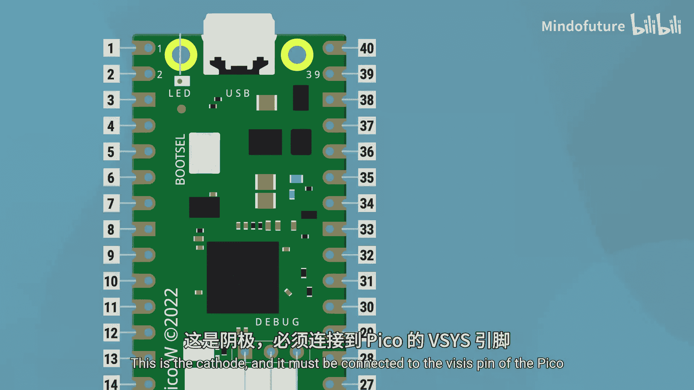

树莓派Pico入门：2.9：脱离电脑运行Pico 🔌

在本节课中，我们将要学习如何让树莓派Pico脱离电脑独立运行。我们将了解如何将代码存储在Pico上，以及如何通过不同的方式为Pico供电。

---

### 在Pico上存储和运行代码

上一节我们介绍了如何通过电脑为Pico编程。本节中我们来看看如何让代码存储在Pico自身并自动运行。

当Pico通过USB连接到电脑时，你可以在Thonny IDE中查看其文件系统。在Thonny中点击“视图”，然后选择“文件”，你将看到两个面板：上方显示电脑的文件，下方显示存储在Pico上的文件。

你的Pico最初可能几乎是空的。下方面板中存储的`.py`文件就是MicroPython代码文件，你可以像在电脑上一样打开和编辑它们，然后将文件保存回Pico，就像操作一个U盘。

如果你在Pico上保存了一个名为 **`main.py`** 的文件，那么Pico在每次上电时都会自动运行这个文件。例如，将Pico插入一个移动电源（而非电脑），如果`main.py`文件中包含了控制LED的代码，那么LED就会亮起。

这就是脱离电脑运行代码的方法：将所有代码写入文件，将其保存为 **`main.py`** 并存储在Pico上。当需要修改代码时，只需将Pico重新连接到电脑，在Thonny中打开`main.py`文件进行编辑并保存即可。

---

### 为Pico供电

现在我们已经知道如何让代码自动运行，接下来需要了解如何为Pico供电。有两种常见的方法。

#### 1. 通过Micro USB供电

这是最简单直接的方法。

*   将Micro USB线一端插入Pico。
*   另一端插入任何5V的USB电源，例如手机充电器、插墙上的电源适配器或移动电源。

任何能为手机充电的5V USB电源，通常都能为Pico供电。

> **注意**：Pico功耗极低，而许多移动电源具有省电功能，当检测到输出电流过小时会自动关闭。这可能导致Pico供电中断。并非所有移动电源都如此，如果你的项目（例如点亮一个RGB LED）功耗稍大，可能就能满足移动电源的持续供电要求。最好实际测试一下。

另一种很好的供电方式是使用专用的3.7V锂电池升压模块，它通常带有Micro USB接口，可以稳定输出约5V电压给Pico。

#### 2. 通过VSYS引脚供电

除了USB，我们还可以通过Pico上的 **`VSYS`** 引脚直接供电。

你需要一个能提供 **1.8V 至 5.5V** 的电源，例如：
*   几节AA电池
*   太阳能电池板
*   锂聚合物电池
*   台式实验室电源

只要电压在1.8V至5.5V之间，将电源的负极（GND）连接到Pico的GND，正极连接到 **`VSYS`** 引脚，Pico就能正常启动。

> **⚠️ 极其重要的警告**：**切勿同时连接USB电源和VSYS电源！** 这很可能因为电压不匹配或电流倒灌而损坏Pico或电源设备。

因此，我们建议在使用VSYS供电时，添加一个二极管以提供额外保护。将二极管串联在电源正极和VSYS引脚之间，电流就只能单向流动（从电源流向Pico）。

以下是关键点：
*   二极管有极性，带标记线的一端为阴极，必须连接到Pico的 **`VSYS`** 引脚。
*   可以使用肖特基二极管或普通整流二极管，只要其正向电流能达到1A即可。
*   如果不使用二极管，则必须极其小心，确保永远不会同时接入两种电源。例如，在用VSYS供电时想更新代码，务必先断开VSYS电源，再连接USB到电脑。

---

### 总结

本节课中我们一起学习了如何让树莓派Pico脱离电脑独立工作：

1.  可以将代码文件存储在Pico上，命名为 **`main.py`** 的文件会在Pico上电时自动运行。
2.  Pico可以通过**Micro USB**接口或**VSYS**引脚供电。
3.  在没有二极管保护的情况下，**绝对不能**同时使用这两种方式为Pico供电。

通过掌握这些知识，你的Pico项目就可以摆脱电脑的束缚，在任何地方运行了。