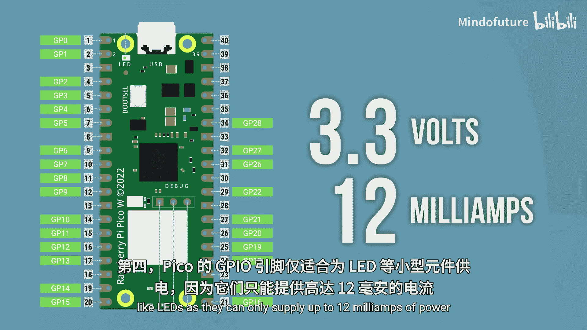

# 018：从Pico获取电源 🔌

在本节课中，我们将学习如何安全地从树莓派Pico获取电源，为连接的外部设备供电。理解电压和电流的概念至关重要，错误的连接方式很容易损坏你的Pico。

上一节我们讨论了如何为Pico本身供电，本节中我们来看看如何为连接到Pico的设备供电，即如何从Pico获取电源。为设备供电时，最重要的两个因素是**电压**和**电流**。你可以将电压理解为电的“水压”，而电流则是电的“流速”。

首先，我们来介绍Pico上三个主要的电源输出点，然后分析为不同组件供电的一些场景。

## Pico的电源输出点

以下是Pico上三个主要的电源来源：

1.  **3V3输出引脚**：这是最简单的一个。我们在本章前面将其连接到电源轨，并一直从中获取电源。该引脚输出 **3.3伏特** 电压，最大可提供 **300毫安** 的电流。虽然不算强大，但对于大多数3.3伏设备来说已经足够。

2.  **VBUS引脚**：这是另一个电源来源，但比3V3更复杂。VBUS“劫持”来自USB的电源。**只有当Pico通过USB连接时，VBUS引脚才有电**。它能提供的电流量取决于USB连接的对象。例如，一个标有5V输出的手机充电器，VBUS最多可提供1安培电流；如果连接到一个移动电源，VBUS最多可提供2安培电流。但请注意，无论连接什么，VBUS都有一个总电流上限，大约为 **2安培**。VBUS在连接USB时提供 **5伏特** 电压，电流则取决于USB源，但连续最大电流不超过2安培。

3.  **GPIO引脚本身**：我们一直在使用它们。这些并非典型的电源，通常不选择用它们来供电。但当我们连接LED和电阻等元件时，技术上就是从GPIO引脚本身获取电源。我们知道可以通过数字和模拟输出提供特定电压，但**每个GPIO引脚本身最多只能输出12毫安的电流**。1安培等于1000毫安，所以12毫安仅为0.012安培，与VBUS能提供的电流相比微乎其微。因此，GPIO引脚只应用于驱动简单的LED、蜂鸣器等**功耗极低**的组件。

对于上述所有电源，需要记住的关键点是**电压**和**最大电流**。

## 供电基本原则

如果我想从这些电源之一为某个设备供电，必须确保（这是一个经验法则）：**电压匹配**，并且**设备消耗的电流小于电源能提供的最大电流**。

信息量很大，让我们逐一分析几个组件，看看应该从Pico的哪个位置为其获取电源。

## 为不同组件供电的实例分析

以下是几个常见组件及其供电方案：

*   **显示模块**：这个显示模块可以插到Pico上。它有两个信号引脚（我们将在后续视频学习使用），还有一个接地（GND）和一个电源（VCC）引脚用于供电。查阅文档可知，它需要 **3.3伏特** 电压，因此**3V3输出引脚**是很好的选择，因为电压匹配。同时，文档指出其最大电流消耗为 **20毫安**。3V3引脚能提供高达300毫安的电流，所以我们有充足的余量，用它为显示器供电是完全安全的。

*   **LED点阵**：这是一个彩虹色的LED阵列。该设备可以使用 **3.3伏到5伏** 之间的任何电压供电。你会发现很多组件的供电电压是一个范围，而非固定值。3.3伏意味着我们同样可以使用**3V3输出引脚**，因为电压匹配。但是，这个LED点阵在全亮度时可能消耗高达 **400到500毫安** 的电流。而3V3引脚的最大输出电流是 **300毫安**。如果我们尝试用3V3引脚为其供电，很可能会损坏Pico。更好的选择是使用**VBUS**，它可以提供高达 **5伏特** 和 **2安培（2000毫安）** 的电流。电压范围匹配，且我们未超过VBUS的最大电流。

*   **舵机**：这个舵机有三根线，其中两根为舵机供电，另一根接收PWM信号来控制它。信号线不提供电力，所以我们可以将其连接到任意GPIO引脚。该舵机的工作电压范围是 **4.8到6伏特**。假设Pico通过USB连接，那么来自VBUS的 **5伏特** 电压就适合为其供电。将舵机的地线（GND）连接到Pico的GND，正极连接到VBUS即可。这个舵机最多消耗 **600毫安（0.6安培）** 电流。如果Pico连接的是一个1安培的USB电源，那么VBUS能提供1安培电流，我们还有0.4安培的余量。但如果我想连接第二个舵机，电压需求仍是5伏，但电流需求会翻倍，两个舵机共需 **1.2安培**。由于我们的USB电源只有1安培，VBUS无法提供足够的电力。要解决这个问题，我可以将Pico连接到一个更强大的USB电源上，例如这个2安培的移动电源，或者找一个能提供2安培电流的USB壁式充电器。

*   **LED和电阻**：我们一直通过GPIO引脚为LED和电阻供电。它们可以在 **3.3伏特** 下正常工作，并且按照我们的接线方式，最多消耗 **5毫安** 电流。GPIO引脚可以提供3.3伏特电压，以及最高 **12毫安** 的电流。所以我们大约有7毫安的余量，一切正常。对于LED或蜂鸣器这类组件，直接使用GPIO引脚供电是完全可以的，因为它们功耗极低。但始终值得再次确认它们消耗的电流是否小于12毫安，你肯定不想损坏Pico的引脚。

*   **电磁阀或电机**：GPIO引脚不适合为这类设备供电，即使是图中这个非常小的电机。两者都可以在3.3伏下运行，但它们消耗的电流远大于12毫安。这个电磁阀消耗高达 **500毫安**，而这个很小的电机也消耗高达 **800毫安** 的电流。那么如何为它们供电呢？两者都需要5伏电压，可以像这样用**VBUS**愉快地供电（电机在旋转，请相信我）。然而，它只是持续旋转，我们无法控制它。问题在于，我想控制它的速度，但我们只能通过GPIO引脚用代码控制设备，而我们想控制的设备功耗对这些引脚来说太大了。这时我们该怎么办？

## 使用驱动板或控制板

我们需要使用**驱动板**或**控制板**。这些板子允许你使用来自其他电源（如VBUS）的电力，同时也允许你将Pico的一个GPIO引脚连接到板上。这样，你就可以通过那个GPIO引脚编写代码来控制电机，但电机所需的电力则由另一个能提供足够电流的电源供应。

本课程不会展示如何使用这些驱动板，因为市面上有成千上万种选择，每种都有略微不同的设置。我们只是希望确保你了解它们的存在以及为何要使用它们。不过别担心，它们通常非常容易使用，你可以找到许多关于如何使用其中一些流行型号的教程和指南。你可能首先会为了控制电机制作一个小车或循线机器人而使用它们。

## 连接线与电流承载能力

视频信息量很大，但我们还有最后一点，而且非常简单：你需要确保组件之间的**连接线能够支持你通过它们的电流**。

这是一个更大的舵机，最多可消耗约 **2安培** 电流。我通过USB电源将其连接到VBUS，一切正常。但是，这些跳线最多只能支持约 **1安培** 电流（这些线比较细，可以买到能支持2安培的粗线）。如果让这个舵机满负荷运行，持续消耗2安培电流，这些电线可能会开始发热、熔化，如果长时间（比如五分钟甚至更短）消耗这么大电流，甚至可能引发火灾。因此，我需要确保舵机的地线和正极端子使用**额定电流达到2安培**的导线连接。信号线则没问题，因为它是信号线，不消耗太多电力。

另一件需要注意的事情是**面包板本身也有电流限制**，大约也是2安培。这有点像链条中最薄弱的一环，从电源到组件，整个链条中的所有环节都必须达到该电流的额定值。

## 总结

本节课内容非常丰富，而且市面上有数量惊人的组件，各自需要不同的电压和电流。你通常需要查阅数据手册或网站列表来找到这些信息。如果你不确定，最好咨询懂行的人，或者在我们的网站上发帖提出与电源相关的问题，我们很乐意提供帮助。

最后，关于从Pico为组件供电，有四个关键要点：

1.  必须确保**电压匹配**，并且**组件消耗的电流小于电源的最大输出电流**。
2.  **3V3输出引脚**提供 **3.3伏特** 电压和最高 **300毫安** 电流。
3.  当Pico通过USB连接时，**VBUS**提供 **5伏特** 电压，电流取决于USB源，但**硬性上限为2安培**。
4.  Pico的**GPIO引脚**仅适用于为LED等小型组件供电，因为它们最多只能提供 **12毫安** 的电流。

