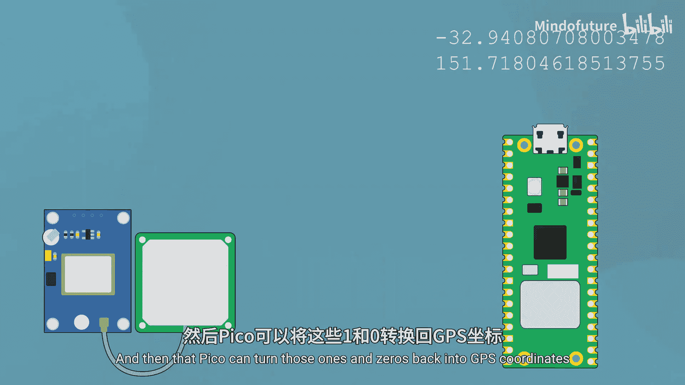

# 025：高级IO简介

在本节课中，我们将要学习如何使用树莓派Pico与更复杂的传感器和模块进行通信。我们将了解通信协议的基本概念，以及它们如何让微控制器轻松获取和处理数据。

我们已经学会了如何读取数字和模拟信号，这些方法非常实用。但是，如果我们想使用更高级的传感器，比如一个GPS模块，该怎么办呢？我们显然无法直接用数字或模拟输入来读取GPS坐标。这正是我们需要使用**通信协议**的地方。

通信协议使用二进制中的1和0（即比特）在设备之间传递信息。我们的Pico通过设置其引脚上的电压来实现这一点：0伏特代表0，3.3伏特代表1。Pico可以非常快速地切换这两种电压，从而将一串1和0的比特发送给另一个设备。这样，我们就可以将像GPS坐标这样的信息转换成1和0，通过一根导线发送给Pico，然后Pico再将这些1和0转换回有意义的GPS坐标。本质上，这是一个将数据转换为电压，再由接收设备将电压转换回数据的过程。

为了实现这种通信，两个设备必须使用相同的“二进制语言”，并且必须就连接方式和数据传输规则达成一致。这套双方共同遵守的规则系统就叫做**通信协议**。在本课程中，我们将介绍三种最常见的协议：UART、SPI和I²C。它们各有特点，适用于不同的应用场景，我们稍后会详细讨论。

接下来，我们将学习如何在Pico上使用模块。例如，这是一个带有板载温度传感器的大气传感器模块。你只需要连接3.3伏电源和地线为其供电，然后将另外两根线接回Pico。通过这两根线，它就能将精确的温度读数发送回Pico。

回想一下，如果我们通过Pico的模拟输入来使用一个温度传感器，我们只能得到一个电压值，然后需要查阅数据手册，并通过一些公式来计算传感器测得的电压所对应的温度。在某些情况下这样做没问题，但你也可以直接使用这样的传感器模块，它会为你完成所有工作，直接报告最终的温度值。这就是使用模块的巨大优势：它们接线简单，使用方便，并且大多数时候能为你节省大量时间。基本上，你可以为任何功能找到对应的模块。

以下是一些常见的模块示例：
*   你或许已经见过或用过的OLED屏幕。
*   可以连接四个舵机并通过仅两根线控制的舵机控制器。
*   超声波距离传感器。
*   颜色传感器。
*   大气压力传感器。
*   电子罗盘。

有很多不同的传感器和外设都以模块的形式存在。

最后需要说明的是，UART、SPI和I²C的世界非常深奥，可以很快变得非常复杂。这些通信协议的完整细节远远超出了本课程的范围，并且对初学者极不友好。但幸运的是，借助**库**的帮助，在Pico上使用这些模块实际上极其简单。事实上，你99%的时间可能都会通过库来使用它们。它们的使用难度可能与基础IO一样简单，因为库在幕后处理了所有复杂的魔法，留给我们的是一个相对即插即用的模块使用体验。

本节课中我们一起学习了通信协议的基本概念，了解了它们如何使Pico能够与复杂的传感器模块进行对话。我们还看到了使用模块化传感器的便利性，并认识到库在简化这一过程中的关键作用。在接下来的章节中，我们将具体探索UART、I²C等协议的实际应用。