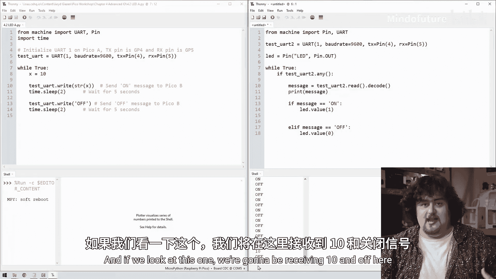
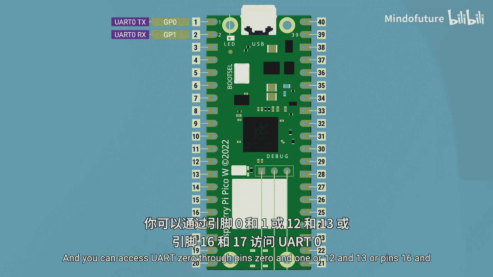
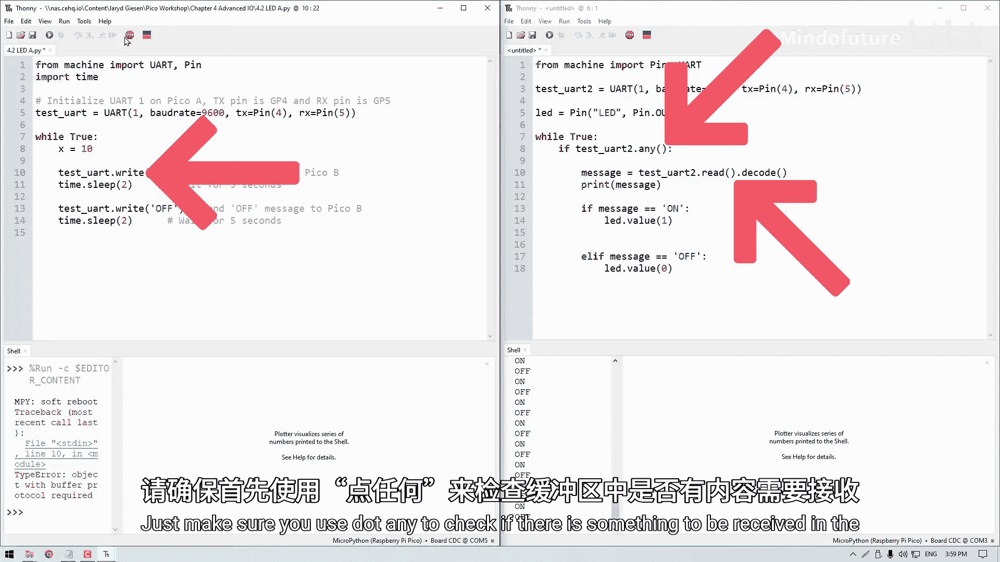

# 026：UART通信 🚀

在本节课中，我们将要学习UART通信协议。UART是一种非常常用的设备间通信方式，它能让两个设备相互“对话”，协同工作，完成单个设备无法独立完成的任务。

## 什么是UART？

UART，全称通用异步收发传输器，是一种最常见的设备间通信协议。它允许两个设备通过简单的连线进行数据交换。

## UART的工作原理

上一节我们介绍了UART的基本概念，本节中我们来看看它是如何工作的。

要让两个设备通过UART通信，每个设备都需要两个连接：一根线用于发送数据（TX引脚），另一根线用于接收数据（RX引脚）。UART是一种**全双工**系统，这意味着两个设备可以同时发送和接收数据。

两个设备必须就通信速度达成一致，这个速度被称为**波特率**。在设置设备时，必须确保它们使用相同的波特率。常见的标准波特率有9600和115200。

## 硬件连接：让两个Pico“对话”

以下是连接两个树莓派Pico进行UART通信所需的步骤。

1.  **交叉连接TX和RX引脚**：将一个Pico的TX引脚连接到另一个Pico的RX引脚，反之亦然。这是因为一个设备发送（TX）的数据需要被另一个设备接收（RX）。
2.  **连接共地**：将一个Pico的GND（接地）引脚连接到另一个Pico的GND引脚。这确保了它们有共同的电压参考点。例如，当一个Pico发出一个3.3伏的信号时，另一个Pico能正确测量到3.3伏。

## 软件编程：发送端代码

我们将编写代码，让一个Pico（发送端）向另一个Pico（接收端）发送指令，以控制接收端Pico的LED灯。

首先，我们需要导入必要的库并初始化UART。

```python
from machine import Pin, UART
import time

# 初始化UART1，设置波特率为9600，使用GP4作为TX，GP5作为RX
uart = UART(1, baudrate=9600, tx=Pin(4), rx=Pin(5))

while True:
    uart.write(‘on’)   # 发送字符串“on”
    time.sleep(2)       # 等待2秒
    uart.write(‘off’)  # 发送字符串“off”
    time.sleep(2)       # 等待2秒
```

## 软件编程：接收端代码

现在，我们来编写接收端的代码。它将监听UART数据，并根据接收到的字符串控制LED灯的亮灭。

```python
from machine import Pin, UART

# 初始化UART1，波特率必须与发送端一致
uart = UART(1, baudrate=9600, tx=Pin(4), rx=Pin(5))
# 设置板载LED
led = Pin(‘LED’, Pin.OUT)

while True:
    # 检查缓冲区是否有数据
    if uart.any():
        # 读取数据并解码（UART传输的是字节串，需要解码为字符串）
        message = uart.read().decode()
        print(message)  # 在Shell中打印接收到的消息

        # 根据消息控制LED
        if message == ‘on’:
            led.value(1)
        elif message == ‘off’:
            led.value(0)
```

运行这两段代码后，你将看到接收端Pico的LED灯按照发送端的指令闪烁，同时在接收端的Shell中会打印出“on”和“off”信息。

## 数据是如何传输的？

我们刚刚实现了用文字控制另一个设备，这是如何做到的呢？其核心过程是**编码与解码**。

当发送端使用 `uart.write()` 发送一个字符串（如“on”）时，这个字符串会通过 **ASCII编码** 规则被转换成由1和0组成的**字节**。一个字节由8个比特（bit）组成。然后，Pico通过快速改变TX引脚上的电压，将这些比特序列发送出去。

接收端通过RX引脚检测这些电压变化，得到比特序列，然后使用相同的ASCII规则，通过 `uart.read().decode()` 将字节**解码**回原始的字符串。

## UART通道与引脚复用



树莓派Pico有两个UART硬件通道，称为UART0和UART1。每个通道一次只能连接一个设备，但可以通过多组引脚来访问同一个UART通道。

例如，UART1可以通过GP4/GP5访问，也可以通过GP8/GP9访问。它们连接的是同一个硬件。在初始化UART时，你需要指定使用哪个UART通道以及通过哪组引脚访问它。

```python
# 使用UART0，并通过GP12(TX)和GP13(RX)访问
uart = UART(0, baudrate=9600, tx=Pin(12), rx=Pin(13))
```



你可以查阅引脚图来了解哪些引脚对应哪个UART通道。

## UART的广泛应用

掌握了UART连接后，你可以做很多事情：
*   连接Pico与其他微控制器（如Arduino Uno）。
*   连接Pico与更强大的计算机（如树莓派），让计算机处理复杂计算，然后通过UART指挥Pico控制电机等外设。
    *   **注意**：需注意逻辑电平匹配。例如Arduino使用5V逻辑，而Pico使用3.3V逻辑，这需要一个**电平转换器**。
*   连接Pico与各种支持UART的模块和传感器（如GPS模块）。模块内部处理数据，Pico只需通过UART读取最终结果。

## 总结 🎯

本节课中我们一起学习了UART通信。让我们回顾三个关键要点：
1.  **UART** 是一种允许两个设备同时相互通信的协议。
2.  它只需要两根线：**TX** 和 **RX**，连接时需要交叉（TX接RX，RX接TX），并且必须连接**共地**。
3.  在MicroPython中，我们可以使用 **`uart.write()`** 发送字符串，使用 **`uart.read().decode()`** 接收字符串。在读取前，最好先用 **`uart.any()`** 检查缓冲区是否有数据。




现在，你已经掌握了让设备彼此交谈的基本技能，可以尝试将你的Pico连接到更广阔的世界了！