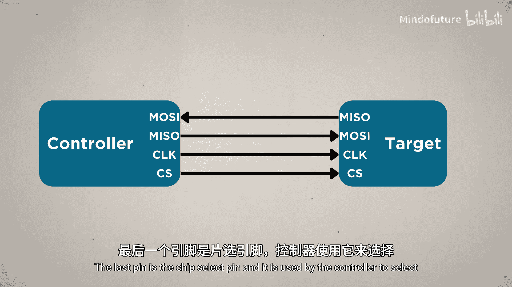

# 027：SPI通信协议

在本节课中，我们将要学习SPI通信协议。SPI比UART更复杂一些，因为它涉及四根线，并且允许多个设备通过这四根线相互通信。这是SPI的主要优势之一，但其最大的优势在于，它是本章介绍的三种协议中速度最快的一种。这使得它非常适合需要高速数据传输的设备，例如本视频中将设置的MicroSD卡读卡器。

上一节我们介绍了UART，本节中我们来看看SPI如何工作。

## SPI的工作原理

SPI的多设备同时通信并非完全无序。它通过一种称为**控制器-目标**的架构进行有序管理。你可能也听说过主从术语，但这些术语正在被逐步淘汰，你可能会听到一些替代术语，如主-从、控制器-工作者、发起者-响应者等，它们描述的都是同一概念。

在我们的例子中，Pico将作为**控制器**，我们插入的任何模块或其他设备将作为**目标**。这意味着控制器（我们的Pico）将负责发起和管理所有设备间的通信，就像机场控制塔管理所有飞机一样。

## 连接SPI设备：以SD卡读卡器为例

让我们深入一个具体的例子：连接并使用这个SD卡读卡器，将Pico的一些数据记录到SD卡上。

UART的优点是我们可以仅使用标准的MicroPython库编写所有必需的代码。但对于像SD卡读卡器这样的SPI设备，你很可能需要使用一个专门的库，并且每个设备可能需要不同的库。如果你有同款SD卡读卡器，可以完全跟随我们的操作。如果你有不同的设备，则需要使用不同的库和完全不同的代码集，但你仍然可以学习本视频的重要部分：如何连接SPI设备以及SPI的工作原理。

### 硬件连接

与UART类似，Pico有两个可用的SPI外设：SPI0和SPI1。同时，有多个GPIO引脚可以用来访问Pico上的这些硬件。为此，你可能需要查看Pico的引脚图，因为几乎每个GPIO引脚都可以充当SPI外设所需的四根引脚之一。

在本例中，我们将使用连接到SPI1的引脚12至15。

以下是连接步骤：

**1. 连接时钟线**
SPI是一种同步协议，意味着所有连接在一起的设备需要同步交互。使用SPI时，Pico会产生一个称为**时钟信号**的数字节奏，所有设备都使用它来同步。我们需要将读卡器的串行时钟引脚连接到Pico的串行时钟引脚，即引脚14。

**2. 连接两条数据线**
这两条数据线就像是单向街道。一条将信息从Pico传输到目标设备，另一条则将信息从目标设备传输回Pico（控制器）。但这里我们遇到了一个命名不统一的问题。

在我的SD卡读卡器上，这些引脚标记为MOSI和MISO。这是这些引脚最常见的名称，但它们也因使用旧术语而正在被淘汰，并且目前还没有真正标准化的替代名称。你可能会发现设备上这些引脚被标记为DIN和DOUT、SDI和SDO、PICO和POCI等，会遇到很多不同的名称。

关键是要检查你的设备使用什么命名方案，并知道其中一条用于向控制器发送数据，另一条用于从控制器接收数据。不过，有一件事是一致的：我们的Pico将这些引脚称为Tx（发送）和Rx（接收）引脚，就像UART一样。

*   Pico的引脚15是**发送引脚**，我将把它连接到读卡器的**MOSI**引脚。
*   对于使用MISO和MOSI标记的目标设备，你可以看最后一个字母来判断它是输入（I）还是输出（O）。
*   因此，这根线从Pico的Tx（发送数据）连接到读卡器的MOSI（输入数据）引脚。
*   然后，从读卡器的**MISO**引脚（输出数据），我们希望Pico接收这些数据，所以我们将它连接到Pico的引脚12，即**Rx**引脚。

**3. 连接片选引脚**
最后一个引脚是**片选引脚**。控制器用它来选择正在与哪个目标设备通信。因为如果我们有另一个目标设备连接在这里，并且Pico要发送一些信息，由于这两个设备都通过相同的线路连接，它们如何知道哪个设备应该接收该消息？这就是片选引脚的作用。

我们将读卡器的CS引脚连接到Pico的引脚13。当Pico发送或接收数据时，它将使用引脚13上的数字输出来告诉SD卡它应该接收该信息。你不需要担心如何编码这个，库会处理这一切。如果我们有另一个目标设备，我们需要将其CS引脚连接到一个不同的GPIO引脚，任何GPIO引脚都可以用于片选，因为它只是使用一个数字输出。

**4. 供电**
与任何模块一样，我们需要为其供电。这是一个5伏设备，所以我将把它连接到Pico的VBUS引脚来供电。

至此，我们完成了所有的SPI连接。

## 编写代码与使用库



从这里开始，每个设备的操作就不同了。我正根据这个SD卡读卡器的兼容文档页面进行操作。如果你有另一个设备，你需要去寻找一个兼容的库并了解如何使用它。

我将在这里寻找要下载的库，保存它。然后，我插入Pico，继续将该库上传到Pico。

在示例代码部分，有一些我们可以使用的示例代码。我将直接复制粘贴过来，并以此作为起点。这段代码看起来是进行模拟读取，然后连同时间戳一起存储到SD卡。我打算快速修改一下。

我们将导入`random`库，生成一些随机数，然后将其存储在SD卡上。你可以在上面存储任何你想要的数据。

以下是修改后的核心代码示例：

```python
import machine
import sdcard
import uos
import random

# 初始化SPI对象，使用外设1（SPI1），并设置引脚
spi = machine.SPI(1,
                  baudrate=1000000,
                  polarity=0,
                  phase=0,
                  bits=8,
                  firstbit=machine.SPI.MSB,
                  sck=machine.Pin(14),
                  mosi=machine.Pin(15),
                  miso=machine.Pin(12))

# 初始化SD卡对象，指定片选引脚（可以是任何GPIO）
cs = machine.Pin(13, machine.Pin.OUT)
sd = sdcard.SDCard(spi, cs)

# 挂载文件系统
uos.mount(sd, '/sd')

# 打开（或创建）一个文件进行写入
with open('/sd/data.txt', 'w') as f:
    for i in range(100):  # 生成100个随机数
        random_number = random.randint(0, 100)
        f.write(str(random_number) + '\n')  # 写入数字并换行

# 卸载文件系统
uos.umount('/sd')
print("数据已写入SD卡。")
```

库使用中的重要事项：在上面的代码中，我们初始化了SPI对象，指定了时钟引脚、MOSI引脚和MISO引脚。我们还在这里指定了片选引脚（可以是任何其他GPIO），然后将其传递给我们的库，库会为我们完成所有设置。

我将格式化为FAT32的SD卡插入读卡器，然后运行代码。可以看到我们开始生成一些随机数。运行完成后，我快速拔出SD卡，在电脑上打开它。打开那个文件，可以看到我们随机生成的数字都在里面，并且文件名也是在这里创建的。

## SPI的应用场景

现在我们知道如何将SPI设备连接到Pico了。我们可以用它做什么呢？

SPI有点小众。如果我们只想连接两个设备，可能会因为其简单性和与众多设备的兼容性而选择UART。如果我们想像下一个视频中将看到的那样连接许多设备（如多个传感器），I²C通常是更好、更容易的选择。

因此，SPI的优势在于其高速特性。SD卡读卡器希望尽可能快地传输数据，所以它们通常使用SPI。高分辨率显示器也常用SPI，OLED屏幕和TFT显示屏需要更快的速度来更新所有像素。你还会发现SPI模块用于像摄像头模块这样的设备。这个摄像头模块插在另一个SPI外设上，Pico拍摄照片然后将其传输到SD卡。

这并不是说你不能将SPI用于传感器，因为有时你可能别无选择，必须使用SPI传感器。但更常见的是，你会在这些高性能应用中找到它们。

## 总结

本节课中我们一起学习了SPI通信协议。以下是三个关键要点：

1.  **SPI**是一种更复杂的协议，可以连接多个设备，并使用**控制器-目标**架构。
2.  使用SPI需要四根线：一根**时钟线**、两根**数据传输线**和一根**片选线**。
3.  SPI比UART和I²C快得多，常用于**高性能应用**。


