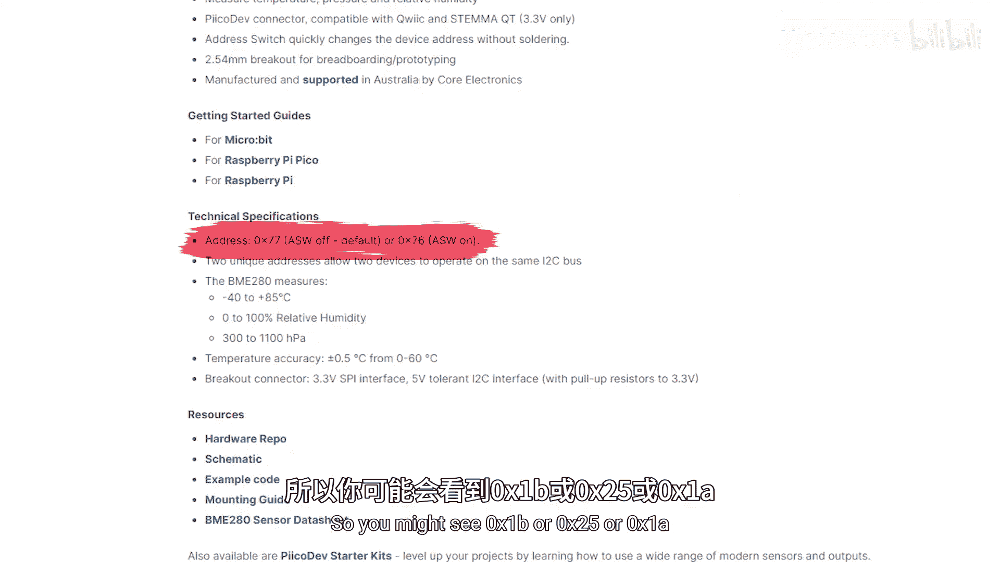

# 028：I²C通信协议

## 概述
在本节课中，我们将要学习I²C通信协议。这是一种仅使用两根线就能连接大量设备的通信方式，在微控制器项目中非常常用。我们将了解其工作原理，并通过一个实际项目——连接OLED显示屏和大气传感器来构建一个小型气象站——来掌握其使用方法。

---

## 🎼 什么是I²C？

I²C，或称集成电路总线，是我们介绍的最后一个但绝非不重要的通信协议。

它只使用两根线：一根是时钟信号线（SCL），用于保持所有设备同步；另一根是数据线（SDA），用于在设备间传输数据。仅凭这两根线，你就可以连接数量惊人的设备。使用SPI时，你可能只会连接两到八个设备，通常是个位数。但I²C仅用两根线就能连接超过100个设备。虽然你可能永远不会连接那么多设备，但如果你需要连接六个左右的设备，I²C会比SPI容易得多。

与SPI类似，I²C也使用控制器和目标设备的术语。你的树莓派Pico很可能是控制器，而你插入的模块将是目标设备。

你可能会在通信协议中听到“总线”这个词，尤其是在I²C中。总线只是一个数据发送所经过的连接或路径。因此我可能会说，在我的I²C总线上，有一个Pico作为控制器连接，一些传感器作为目标设备连接。了解这个术语很有帮助，因为你可能会随机遇到它。

I²C的一个缺点是它是半双工的。这意味着在总线上，一次只能有一个设备“说话”。两个设备不能同时发送和接收数据。这有点像对讲机，一次只能一个人说话。如果两个人同时说话，他们的声音会混在一起，你什么也听不清。这只是意味着设备必须轮流相互通信。这些都由库来处理，你无需担心。而且I²C中的很多数据传输速度非常快，基本上看起来像是它们在同时交谈。

---

## 🔌 连接I²C设备：OLED显示屏

让我们通过一个演示来连接一些I²C模块。我们再次遇到了一个问题，即很多内容非常依赖具体设备，而且很多I²C设置都隐藏在库的背后。为了向你展示使用I²C设备的过程，我们将制作一个小项目：连接一些传感器和显示屏，并在屏幕上显示传感器数据。

我们将首先将这个非常通用的OLED显示屏连接到我们的Pico。这些是微小的黑白屏幕，功耗非常低，是任何项目的绝佳补充。

我们的显示屏有四个引脚：左边是电源引脚，然后是串行时钟（SCL）和串行数据（SDA）引脚，这些就是我们的I²C线。你需要将设备的SDA连接到Pico的SDA，SCL连接到Pico的SCL，非常简单。

与SPI类似，Pico有两个我们可以使用的I²C外设：I²C0和I²C1。有很多方法和不同的引脚可以用来访问它们。事实上，Pico上几乎每一个GPIO引脚都可以访问其中一个I²C外设。在这个例子中，我们将使用引脚8和9，因为我们将要使用的库需要这样。如果你的库不允许你选择引脚，你需要检查它默认使用哪些引脚。

我们将把SDA插入Pico的SDA引脚（P8），把SCL插入Pico的SCL引脚（P9）。然后我们还需要将它连接到地（GND）和3.3V输出，因为这是一个3.3V设备。就这样，连接一个I²C设备就是这么简单。

我们使用的这个OLED显示屏是一个非常通用的型号，叫做SSD1306，非常常见。首先，我们需要找到一个驱动它的库和一些示例代码。我已经提前在产品页面上找到了示例代码和GitHub上库的链接。看起来要安装这个，我们需要`ssd1306.py`文件。我下载了这个文件。

我们需要先插上Pico。然后我将进入我们的库文件夹，把这个文件上传到我们板子上的库中。

作为起点，我将把文档中的示例代码复制到我们的Thonny脚本中，然后运行它。我们可以看到“Hello World”打印在了我们的显示屏上。我快速浏览了一下代码：看起来我们在那里设置了库，然后导入了`time`和`Pin`以及`I2C`，我们在下面用它们来设置I²C行为。这个演示代码在这里将引脚声明为变量，然后传入，但我不太喜欢这种方式（这只是个人偏好）。我打算把它改成在一行内完成所有设置。我们可以删除它们，如果我把它复制到这里，我基本上只是直接放入数字，而不是先声明变量再传入变量。我就是喜欢这种方式，都在一行里，整洁美观。

这些OLED的工作原理是：首先我们需要用`oled.fill(0)`完全清空屏幕（用黑色像素填充），然后`oled.text`会在上面写入文本。看起来我们有一个X和Y坐标来指定在屏幕上的位置。然后当我们调用`oled.show`时，我们推送这个更改，用我们写的内容更新显示屏。

我们在这里要预先做一件事：我将添加一个`while True`循环，并把所有内容放进去。如果我运行它，我们可以看到它仍然在打印“Hello World”。

---

## 🌡️ 连接更多设备：大气传感器

接下来，我们将连接这个大气传感器模块，它可以让我们读取温度、湿度和气压。我们可以像连接OLED一样焊上一些引脚来连接它，但这个模块为我们提供了一个选项，可以使用一个方便的连接器来插入。

这个连接器为我们提供了电源引脚和I²C引脚来插入。过程完全一样。我们将把SDA插入Pico的SDA，SCL插入Pico的SCL，然后插入GND和3.3V。这样就应该能上电了。看，那里有个小LED状态灯。

现在，假设我们想再连接一个传感器。我们的面包板空间有点不够了。但这个传感器和这个传感器属于同一个Pico开发板生态系统，它们共享相同的连接器。这将允许我们像这样将它们串联在一起。

所以这个传感器连接到同一个I²C总线，这个LED模块、这个传感器和那个传感器，它们都共享同一条总线。这两个传感器都是Pico开发板生态系统的一部分，这只是我们内部制作的一系列I²C设备。如果你有像这样的Pico开发板适配器，你可以更方便一步，像这样把你的Pico放进去，然后只需将它们串联插入，像这样全部串联起来，而无需插任何线。

像Adafruit、Seeed Studio和SparkFun这样的大品牌，都有它们自己的连接器生态系统，可以像这样使用，真正方便地把所有东西组装起来。所以对于I²C设备，你可能有几种不同的接线方式，但只要它们都连接在一起，你使用哪种方式并不重要。

---

## 💻 编写传感器代码

现在让我们让这个大气传感器工作起来。基本上过程是一样的：找一个库，找一些示例代码，然后根据你的需要调整示例代码。

我已经提前到了文档页面，看到我需要下载这两个库。然后我将把它们上传到我们Pico上的库文件夹中。接着我将在这里寻找示例代码。看这个，看起来这个导入库的部分非常重要。

然后这里看起来他们从`unified`库导入了`sleep_ms`，而不是我们通常使用的`time`库。我认为我们不需要`sleep_ms`，所以先不管它。

然后我们用那个初始化了我们的传感器，这看起来非常重要。这里看起来他们为了某个我们不用的功能获取了一个初始海拔读数，所以我们将跳过它。

这里看起来是我们代码的核心部分，即实际读取传感器数据。我们将把它粘贴到我们的`while True`循环里面。这里看起来他们只是转换了我们的压力值然后打印出来。其余的，我认为我们不需要。回到我们的代码，我们运行它以确保一切正常，看起来没问题。

现在我们将修改它，开始打印那些数据。首先，我将把这个稍微移动一下，我只是想在这里布局一切，让它在屏幕上整齐地排列。

然后在这里我将打印我们的第一个值，即`temp_c`。我把它在屏幕上移动一点。在这之前，我们只是打印“Temp:”。如果我们运行它，我们可以看到我们需要先把它转换成字符串，因为这不能接受浮点数。运行它。

现在我们可以看到我们正在OLED显示屏上打印出温度。这里我们有了第一个字符串“Temp:”和第二个字符串，它只是打印出那个变量，但先转换成了字符串。其余的看起来很简单。我要做的就是复制粘贴几次。然后这个我会说“Pressure:”，这个我会说“Humidity:”。我将改变这些文本的位置，把这个向下移动几个像素，然后把这个再向下移动几个像素。哦，我差点忘了，我们实际上需要更新我们的变量。所以在这里我将打印压力值，在这里我将打印湿度值。

如果我们运行它，现在我们可以看到我们正在OLED屏幕上打印出我们的数值，我们相当轻松地完成了相当多的工作。想想看，几行复制粘贴的代码，我们就读取了一堆传感器数据并打印在OLED显示屏上。我们在这里构建了一个不错的小型气象站。

如果你想更进一步，你可以画一些线，做一个漂亮的UI设计，或者重复这个过程，添加更多I²C设备。你可以控制一些RGB LED，或者添加一个超声波传感器，或者控制一些舵机，甚至用加速度计添加运动检测，或者我不知道，甚至添加一个指南针。你可以找到大量使用I²C的东西。而且像我们在这里做的一样，将它们串联在一起真的很容易，尤其是当它们来自同一个生态系统时。

---

## 🔢 I²C地址的重要性

让我们通过讨论I²C地址来结束这个视频，因为它非常重要。我们连接到I²C总线的每一个目标设备都必须有一个唯一的标识符，称为地址。当你购买一个模块时，它会附带一个已经分配好的地址。地址只是一个十六进制格式的数字。所以你可能会看到`0x1B`、`0x25`或`0x1A`，例如。我们不会深入讲解十六进制，它只是一种不同的计数方式。你只需要知道这些是设备的地址。

所以当我们的Pico在这里发送信息时，它会把信息发送给总线上的每一个设备。所以显示屏和传感器都收到了这条消息。这就是I²C真正聪明的地方：在那条消息中，它也包含了它实际想要发送消息的目标设备的地址。所以如果传感器收到一条消息，但地址是发给显示屏的，它就会忽略它。这就是我们如何能让这么多设备只用两根线进行通信，它们使用这个寻址系统来选择与谁通信。

但这意味着地址不能重复。两个设备不能共享同一个地址，否则这个系统就无法工作。现在，如果我买了另一个这样的显示屏，很可能它会和另一个显示屏有相同的地址，那样就无法工作。问题是这些地址在某种程度上是硬件绑定的，你不能只是进入软件就改变它们的地址。

不过，如果你幸运的话，你的设备背面可能会有这些焊盘。如果你拆下这个电阻并把它移到另一边，你就可以改变这个设备的地址。所以在这个设备上，你可以有两个独立的地址，并在同一个I²C总线上拥有两个设备。

如果你更幸运，你的设备可能像这个伺服驱动器一样有一些开关。这个允许我们根据开关的位置来改变地址，这比拆焊和重焊一个小电阻方便得多。

如果这些选项之后你还是不走运，你可以找一个I²C多路复用器（我们不会在本视频中介绍），它可以让你使用多个具有相同地址的设备，以防你真的陷入困境。

所有这些都引出了一个重要的事情：在你为项目购买模块之前，检查I²C地址，确保你不会有任何地址冲突，或者你至少可以改变一些设备的地址来避免冲突。

---

## 📝 总结

本节课中我们一起学习了I²C通信协议。以下是三个关键要点：

1.  **I²C是一种通信协议**，允许你仅用两根线连接许多设备。
2.  **当使用设备时**，你总是将SCL连接到SCL，SDA连接到SDA，并且你可能需要使用一个库来与之交互。
3.  **I²C总线上的每个设备**都必须有一个唯一的地址，并且可能有办法改变设备的地址。