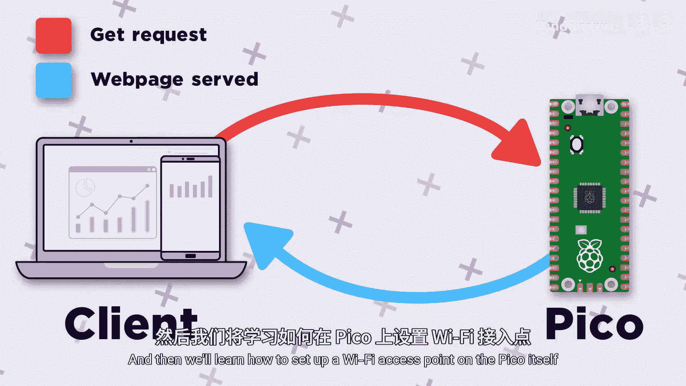

树莓派Pico初学者入门：5.1：无线连接简介

在本章中，我们将学习如何利用树莓派Pico W的无线功能，实现一些有趣的应用，例如将Pico连接到互联网，或通过Wi-Fi用电脑控制它。

到目前为止，我们所有的数据都只能通过物理有线连接进行发送和接收。但在本章中，我们将探索如何使用Pico W的无线能力来完成一些非常酷的事情。

这个微控制器和无线连接的世界可能与你预期的有所不同。我们无法在Pico上观看YouTube视频，甚至完全不可能，因为硬件本身不支持。相反，我们可以利用无线网络和互联网来发送或接收基于文本的数据。更具体的应用场景包括：用Pico制作一个智能Wi-Fi控制灯、无线邮箱传感器，或者将Pico连接到互联网以获取国际空间站的实时坐标。

这听起来可能有点难度，我们确实从初级技能过渡到了更中级的内容。但得益于库的使用，即使这些非常酷且复杂的任务，在我们的Pico上实现起来也非常简单。再次感叹，用如此精简的代码就能实现这么多功能，实在令人惊叹。

本章内容是一个大主题，我们将其拆分成了多个小视频。每个视频都建立在前一个的基础上，如同踏脚石，最终达成一个目标。我们将从将Pico连接到本地无线网络开始，然后利用互联网连接特定网站并获取有用数据。接着，我们将学习如何在Pico本身上托管一个网页，从而可以通过手机或电脑与之交互以控制Pico。最后，我们将学习如何在Pico本身上设置一个Wi-Fi接入点，用于托管那个页面。

要跟随本章学习，你只需要一块Pico W以及一个可以连接的Wi-Fi网络（可以是家庭网络，甚至是手机的热点）。

让我们开始吧。

---

在本节课中，我们一起学习了树莓派Pico W无线连接章节的概述，明确了我们将要探索的方向、可实现的应用以及学习路径。从下一节开始，我们将动手将Pico连接到Wi-Fi网络。