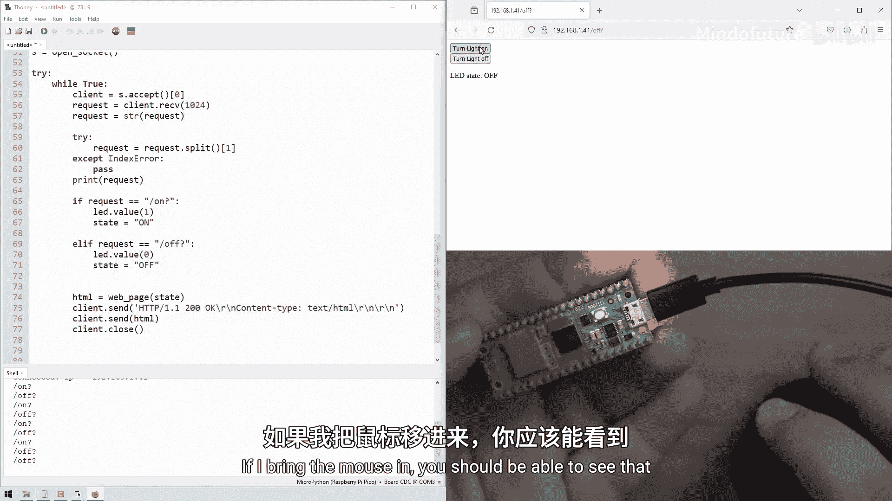
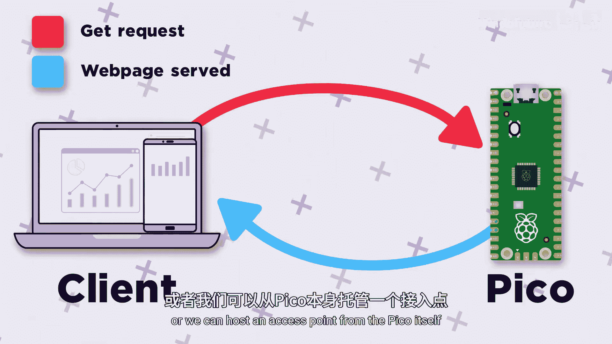

# 031：在Pico上托管一个HTTP网页

在本节课中，我们将学习如何在树莓派Pico上托管一个简单的Web服务器。我们将通过两种方式实现：一是将Pico连接到现有的Wi-Fi网络，二是让Pico自身创建一个Wi-Fi接入点。这将允许我们通过手机或电脑的浏览器访问Pico托管的网页，并通过该网页与Pico进行交互。

## 概述与准备工作

上一节我们学习了如何将Pico连接到互联网。本节中，我们将在此基础上，让Pico成为一个能够提供网页服务的微型服务器。

首先，我们需要导入必要的库。

```python
import network
import socket
import time
from machine import Pin
```

## 连接到现有Wi-Fi网络

我们将从连接到一个现有的无线网络开始。以下是连接函数，它与我们之前课程中使用的类似。

```python
ssid = ‘你的Wi-Fi名称’
password = ‘你的Wi-Fi密码’

def connect():
    wlan = network.WLAN(network.STA_IF)
    wlan.active(True)
    wlan.connect(ssid, password)
    while wlan.isconnected() == False:
        print(‘正在连接…’)
        time.sleep(1)
    print(‘连接成功’)
    print(wlan.ifconfig())
```

在代码主体部分调用此函数，Pico将连接到指定的网络。

```python
connect()
```

## 创建并打开Socket

Socket是Pico用来与其他客户端设备交换信息的网络接口。以下是创建和打开Socket的函数。

```python
def open_socket():
    address = (socket.getaddrinfo(‘0.0.0.0’, 80))[0][-1]
    s = socket.socket()
    s.bind(address)
    s.listen(3)
    return s
```

我们在主代码中调用此函数来打开Socket。

```python
s = open_socket()
```

## 处理客户端连接与请求

现在，我们需要处理设备连接到Pico并发送请求的过程。我们将使用一个`try-except`结构来处理可能出现的错误。

以下是处理连接的核心循环：

```python
state = ‘OFF’
led = Pin(‘LED’, Pin.OUT)

while True:
    try:
        client, addr = s.accept()
        print(‘来自 %s 的连接’ % str(addr))
        request = client.recv(1024)
        request = str(request)
        print(request)
        
        # 响应头，部分浏览器需要
        client.send(‘HTTP/1.1 200 OK\n’)
        client.send(‘Content-Type: text/html\n’)
        client.send(‘Connection: close\n\n’)
        
        # 生成并发送网页
        response = webpage(state)
        client.send(response)
        client.close()
        
    except Exception as e:
        client.close()
        print(e)
```

## 生成网页HTML代码

我们需要一个函数来生成包含按钮的简单网页HTML代码。这个网页将显示LED的当前状态，并提供开关按钮。

```python
def webpage(state):
    html = “””
    <!DOCTYPE html>
    <html>
    <head>
    <title>Pico Web Server</title>
    </head>
    <body>
    <h1>LED 控制</h1>
    <p>LED 状态: <strong>“”” + state + “””</strong></p>
    <p><a href=”/?on”><button>开</button></a></p>
    <p><a href=”/?off”><button>关</button></a></p>
    </body>
    </html>
    “””
    return html
```

## 解析请求并控制硬件

当用户点击网页按钮时，浏览器会向Pico发送一个包含`/?on`或`/?off`的请求。我们需要从请求字符串中提取这个信息。

以下是解析请求并控制LED的代码：



```python
        # 在打印request之后，发送响应之前添加
        try:
            request = request.split()[1]
        except:
            request = request
        print(‘解析后的请求:’, request)
        
        if request == ‘/?on’:
            led.on()
            state = ‘ON’
        elif request == ‘/?off’:
            led.off()
            state = ‘OFF’
```

`request.split()`方法默认按空格分割字符串，`/?on`或`/?off`通常位于分割后列表的第二个元素（索引1）。


## 让Pico自身成为Wi-Fi接入点

除了连接现有网络，我们还可以让Pico自己创建一个Wi-Fi网络。这非常方便，尤其在没有现成网络的环境中。

以下是设置接入点的函数：

```python
def setup_ap():
    ap = network.WLAN(network.AP_IF)
    ap.config(essid=’PicoAP’, password=’password123’) # 设置网络名和密码
    ap.active(True)
    while ap.active() == False:
        print(‘正在启动接入点…’)
        time.sleep(1)
    print(‘接入点已启动’)
    print(ap.ifconfig())
```

要使用此模式，只需在主代码中将`connect()`调用替换为`setup_ap()`即可。连接到此网络的设备（如手机）可以访问Pico的IP地址（通常是`192.168.4.1`）来打开控制网页。

## 总结

本节课中我们一起学习了如何在树莓派Pico上托管一个Web服务器。我们掌握了三个核心要点：

1.  **利用Socket通信**：我们使用`socket`库在Pico上创建网络接口，实现了与客户端（如浏览器）的信息收发。
2.  **提供交互式网页**：我们编写了HTML代码，让Pico能够向客户端提供包含按钮的网页，并通过解析浏览器发回的请求（如`/?on`）来控制Pico的硬件（如LED）。
3.  **两种网络模式**：我们可以选择将Pico连接到现有Wi-Fi网络，也可以将其配置为独立的Wi-Fi接入点，两种方式都能实现网页控制功能。




这为我们构建基于Web的物联网项目奠定了重要基础。在下一节中，我们将为网页添加更高级的功能，例如滑块控件，以调节PWM信号来控制电机或灯光亮度。