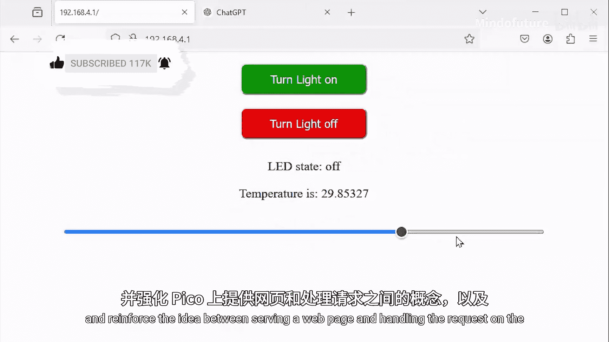
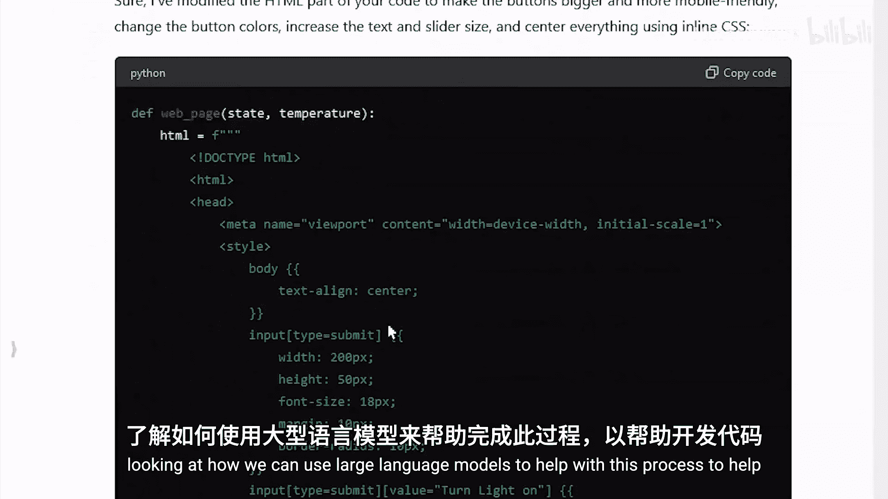
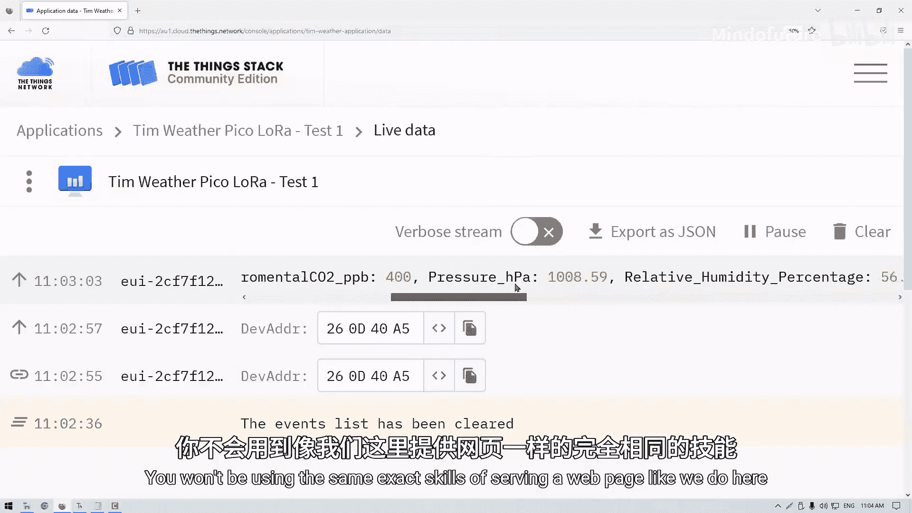
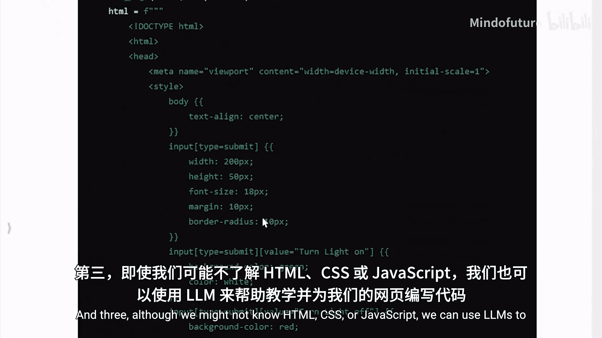
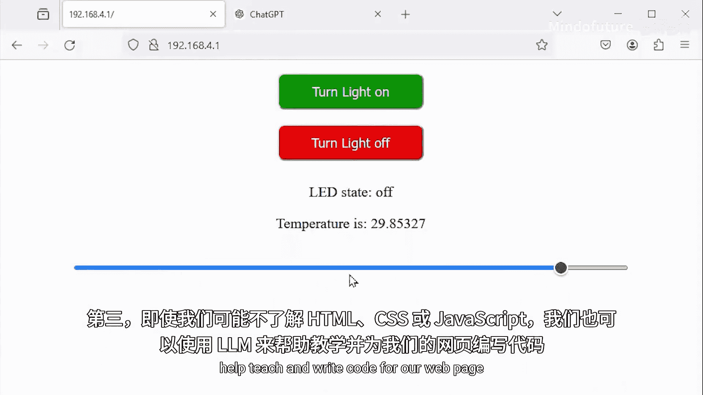

# 032：增强网页功能 🚀

在本节课中，我们将学习如何为树莓派Pico托管的网页添加更复杂的功能。我们将探讨如何从Pico读取传感器数据并显示在网页上，以及如何通过网页向Pico发送控制指令。同时，我们也会了解如何利用大型语言模型来辅助编写网页代码。

---

## 更新网页以显示传感器数据

上一节我们构建了一个网页模板。本节中，我们来看看如何将Pico的传感器数据发送到网页上。





我们将使用Pico内置的温度传感器（ADC4通道）。首先，需要导入必要的库并设置传感器。

```python
from machine import ADC

# 设置温度传感器（ADC4）
temperature_sensor = ADC(4)
```

接着，我们需要一个函数将ADC读数转换为摄氏度。以下是转换函数：

```python
def read_temperature():
    reading = temperature_sensor.read_u16()
    voltage = reading * 3.3 / 65535
    temperature_c = 27 - (voltage - 0.706) / 0.001721
    return round(temperature_c, 2)
```

现在，我们需要更新两个部分：网页内容和主循环。

1.  **更新网页内容**：在生成网页的`web_page`函数中，添加一个段落来显示温度值。
2.  **更新主循环**：在`while True`循环中，读取当前温度，并将其作为参数传递给`web_page`函数。

以下是更新后的`web_page`函数部分代码示例：

```python
def web_page(temperature, state):
    html = f"""
    <html>
        ...
        <p>Temperature is: {temperature} °C</p>
        ...
    </html>
    """
    return html
```

在主循环中，调用函数并传入温度值：

```python
while True:
    ...
    temperature = read_temperature()
    response = web_page(temperature, led_state)
    ...
```

运行代码并连接到Pico的IP地址后，网页上就会显示当前的温度读数。对着Pico吹气，温度显示会下降，这证明了功能的成功。

**请注意**：目前温度数据只在每次与网页交互（如点击按钮或刷新页面）时才会更新，因为网页是在每次客户端请求时动态生成的。

---

## 向网页添加输入控件

了解了如何发送数据到网页后，我们来看看如何从网页接收数据。我们将添加一个滑块控件，用于控制Pico上某个引脚的PWM输出。

首先，我们需要在网页的HTML代码中添加一个滑块元素。以下是该元素的代码：

```html
<input type="range" min="0" max="100" value="50" onchange="location.href='/slider1?'+this.value">
```

这个滑块的范围是0到100，默认值为50。当滑块值改变时，浏览器会向Pico发送一个形如`/slider1?75`的请求。

将这段代码添加到`web_page`函数的HTML字符串中。运行后，网页上会出现滑块。移动滑块，可以在浏览器地址栏或Pico的串口输出中看到请求的变化。

---

## 处理网页发送的请求

现在，Pico收到了来自滑块的请求，我们需要在主循环中处理它。直接为每个可能的值（0-100）写`if`语句是不现实的。

我们需要将请求字符串分解为两部分：
*   **路径**：问号`?`之前的部分（例如 `/slider1`）。
*   **参数**：问号`?`之后的部分（例如 `75`）。

以下是处理请求的代码逻辑：

```python
while True:
    ...
    try:
        # 将请求按问号分割成路径和参数
        request_split = request.split('?')
        path = request_split[0]
        # 如果没有参数，则设为空字符串
        params = request_split[1] if len(request_split) > 1 else ''
    except Exception as e:
        path = ''
        params = ''
        print("Error parsing request:", e)

    print("Path:", path, "Params:", params)
    ...
```

通过这种方式，我们可以轻松地检查`path`是否为`/slider1`，然后使用`params`中的值。

---

## 根据滑块值控制PWM

获取到滑块值后，我们就可以用它来控制Pico的PWM输出了。首先设置PWM引脚。

```python
from machine import Pin, PWM

# 设置PWM引脚（例如GP16）
pwm_pin = PWM(Pin(16))
pwm_pin.freq(1000) # 设置频率为1000Hz
```

然后，在主循环中添加处理`/slider1`路径的逻辑：

```python
while True:
    ...
    if path == '/slider1':
        # 将0-100的范围映射到0-65535（Pico的PWM范围）
        duty = int((int(params) / 100) * 65535)
        pwm_pin.duty_u16(duty)
        print("Set PWM duty to:", duty)
    ...
```

现在，将LED连接到GP16引脚。当在网页上移动滑块时，LED的亮度会随之改变，实现了远程调光功能。

为了使代码更统一，我们也可以将之前处理按钮的代码从检查整个`request`改为检查`path`（例如`path == '/on'` 和 `path == '/off'`）。

---

## 使用LLM辅助优化网页

我们可能希望网页看起来更美观、更易用，但这需要HTML、CSS和JavaScript知识。作为MicroPython课程，我们可以利用大型语言模型来帮助我们生成这些前端代码。

例如，我们可以向ChatGPT等LLM提供当前的网页代码，并给出提示：
> “这是Pico托管网页的代码。请修改HTML，使按钮更大、更适合移动设备；将‘打开’按钮设为绿色，‘关闭’按钮设为红色；放大文本和滑块；将所有内容居中。**请使用内联CSS**。”

LLM会生成一长段包含样式的新HTML代码。我们只需用其输出替换原有的`web_page`函数中的HTML字符串即可。运行后，网页的外观和体验会得到显著改善。

我们还可以请LLM帮助解决一些交互问题，例如：“滑块每次改变后都会回到中间位置，能否让它保持住设置的位置？” LLM通常会通过修改HTML元素属性（如移除或固定`value`属性）来提供解决方案。

---

## 项目应用与扩展

掌握了这些技能后，你可以做很多事情：

*   **远程控制小车**：添加两个滑块分别控制左右电机，就能制作一个简单的网页遥控车。
*   **无线传感器监控**：将Pico连接到各种传感器（如邮箱传感器、温湿度传感器），即可通过网页随时随地查看数据。
*   **智能家居控制**：通过网页控制家中的灯光、插座等设备。

此外，你还可以进一步探索：
*   **物联网平台**：学习使用MQTT等协议，可以将Pico的数据或控制接口发布到互联网上，实现真正的远程访问。
*   **异步更新**：研究如何使用JavaScript实现网页数据的自动刷新，而无需手动点击按钮。

---



## 本节总结

本节课中我们一起学习了如何增强树莓派Pico的网页功能。

1.  **核心模板**：我们拥有一个可在Pico上托管本地网页的模板，它能连接现有Wi-Fi或创建自己的接入点。
2.  **开发模式**：要使用此模板添加功能，需要更新两个关键部分：`web_page`函数中的网页内容，以及`while True`循环中的请求处理与数据准备逻辑。
3.  **辅助工具**：即使不熟悉前端技术，我们也可以利用大型语言模型来帮助编写和优化网页代码。






通过结合传感器数据读取、PWM输出控制以及网页交互，你已经能够为Pico项目添加强大的无线网络接口，其可能性几乎是无限的。