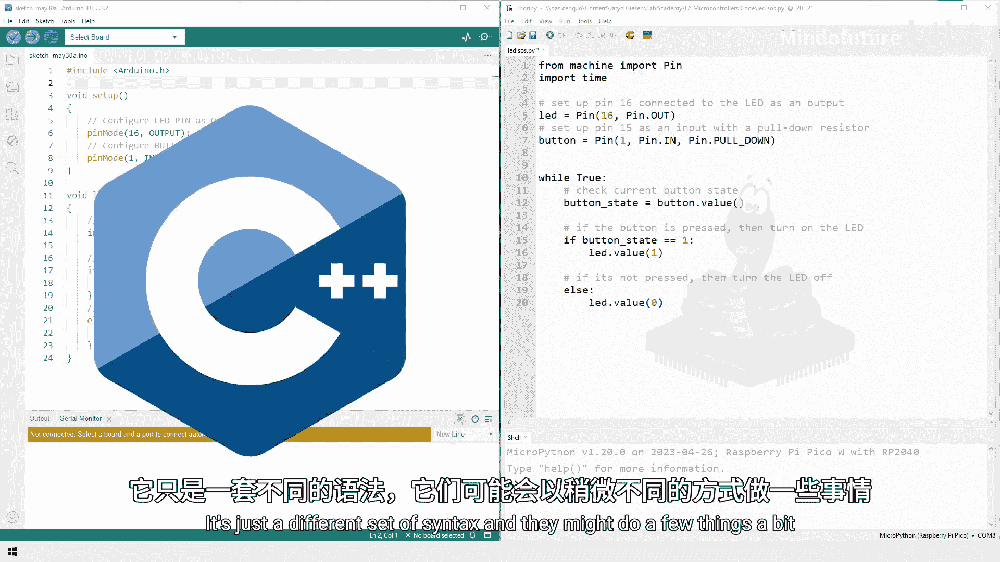

# 033：你应该知道的MicroPython工具 🧰

在本章节中，我们将学习一系列有用的MicroPython功能和概念。这些工具可能不会在每个项目中都用到，但它们是你作为创客工具箱中的重要组成部分，能在特定场景下提供巨大帮助。

---

## 有用的MicroPython功能

上一节我们介绍了本章的学习目标，本节中我们来看看一些实用的MicroPython功能。我们将通过简单的示例代码进行演示。

### 使用 `time` 模块计时

`time` 模块中的 `ticks_ms()` 函数可以测量自Pico启动以来经过的毫秒数。它为你提供了一个参考点，用于测量两个事件之间的时间间隔。

以下是使用 `ticks_ms()` 计时的示例：

```python
import time
import random

start = time.ticks_ms()
time.sleep(random.random())
elapsed = time.ticks_ms() - start
print(f"休眠了 {elapsed} 毫秒")
```

这段代码测量了 `random.random()` 产生的随机休眠时间。通过计算 `start` 时间点和结束时间点的差值，我们就能得到事件A和事件B之间经过的精确时间。

---

## 中断：高效响应事件

在之前的课程中，我们使用循环和 `sleep` 来检查按钮状态，这就像每分钟去门口查看一次包裹是否送达，效率很低。中断则像等待快递员敲门，只在事件发生时才去处理。

中断允许你在事件（如按钮按下）发生时，立即暂停主程序并运行一个特定的处理函数。

以下是如何设置一个按钮中断的示例：

```python
from machine import Pin
import time

led = Pin(25, Pin.OUT)
button = Pin(14, Pin.IN, Pin.PULL_DOWN)

def button_handler(pin):
    led.toggle()

button.irq(trigger=Pin.IRQ_RISING, handler=button_handler)

while True:
    print("Hello")
    time.sleep(2)
```

在这个例子中，主循环每2秒打印一次“Hello”。同时，我们为引脚14上的按钮设置了一个中断请求。当按钮被按下（引脚电平从低变高）时，它会立即调用 `button_handler` 函数来切换LED的状态，而无需等待主循环检查。

**注意**：机械按钮在按下时可能会产生多次触发（抖动）。为了解决这个问题，可以使用去抖技术，`ticks_ms()` 可以帮助实现这一点。

---

## 定时器中断：精确的时间控制

定时器中断是另一种形式的中断，但它不是由GPIO引脚触发，而是由时间触发。它允许你以精确的时间间隔执行代码。

以下是使用定时器中断的示例：

```python
from machine import Pin, Timer
import time

led = Pin(25, Pin.OUT)
timer = Timer()

def toggle_led(timer):
    led.toggle()

# 创建一个周期为1000毫秒（1秒）的定时器
timer.init(period=1000, mode=Timer.PERIODIC, callback=toggle_led)

while True:
    print("Hello")
    time.sleep(2)
```

这段代码创建了一个周期性定时器，每1000毫秒调用一次 `toggle_led` 函数来切换LED。同时，主循环每2秒打印一次“Hello”。这样，两段代码可以并行运行。

定时器也可以是“一次性”的：

```python
def five_seconds(timer):
    print("5秒已过")

timer_one_shot = Timer()
timer_one_shot.init(period=5000, mode=Timer.ONE_SHOT, callback=five_seconds)
```

这个一次性定时器在初始化5秒后触发一次，然后停止。定时器中断非常精确，适用于需要固定时间间隔读取传感器等场景。

---

## Asyncio：同时运行多个循环

`asyncio` 是MicroPython中一个强大的库，它允许你同时运行多个 `while True` 循环，实现类似多任务的效果。

以下是使用 `asyncio` 的示例：

```python
import asyncio
from machine import Pin
import time

led = Pin(25, Pin.OUT)

async def print_hello():
    while True:
        print("Hello")
        await asyncio.sleep(2)

async def blink_led():
    while True:
        led.toggle()
        await asyncio.sleep(1)

async def main():
    task1 = asyncio.create_task(print_hello())
    task2 = asyncio.create_task(blink_led())
    await asyncio.gather(task1, task2)

asyncio.run(main())
```

在这段代码中，我们定义了两个异步函数，每个都包含一个 `while True` 循环。`asyncio.create_task()` 将它们创建为任务，`asyncio.gather()` 让它们同时运行。关键点是使用 `await asyncio.sleep()` 而不是 `time.sleep()`，这样在休眠时不会阻塞其他任务。

---

## PIO（可编程IO）：高级硬件控制

PIO是RP2040芯片独有的一个高级功能。它拥有独立的处理器，专门用于处理输入/输出交互。其主要用途是创建自定义的通信协议。

例如，Pico本身只有2个UART外设，但如果你需要4个，就可以用PIO来模拟另外2个。对于现代创客来说，PIO最常见的应用是驱动WS2812B（NeoPixel）LED灯带，因为它们需要非常精确的时序信号。

以下是一个使用PIO以10Hz频率闪烁LED的简化示例，展示了其工作原理：

```python
import rp2
from machine import Pin
import time

@rp2.asm_pio(set_init=rp2.PIO.OUT_LOW)
def blink_10hz():
    wrap_target()
    set(pins, 1)   [31]
    nop()          [31]
    set(pins, 0)   [31]
    nop()          [31]
    wrap()

sm = rp2.StateMachine(0, blink_10hz, freq=2560, set_base=Pin(25))
sm.active(1)
time.sleep(5)
sm.active(0)
```

这段代码定义了一个PIO程序。`set(pins, 1)` 和 `set(pins, 0)` 指令用于控制引脚电平。方括号 `[31]` 内的数字是延迟周期（不是秒）。整个循环包含256个周期。我们将状态机的频率设置为2560 Hz，因此循环每秒执行10次（2560 / 256 = 10 Hz），从而实现了10Hz的闪烁。

PIO的学习曲线较陡，但它为与特殊硬件接口或生成精确定时信号打开了新世界的大门。

---

## 扩展你的知识

MicroPython是一个不断发展的语言，总有新东西可以学习。

### 官方文档

MicroPython官方文档（micropython.org）是终极参考资料。它包含了本课程所涵盖的所有内容以及更多功能的详细说明、选项和示例。

例如，在 `asyncio` 的文档中，你可以找到 `loop.stop()` 这样的方法，用于立即停止异步循环。网站还提供了RP2的快速参考手册，将所有Pico相关的代码片段集中在一处。

### 其他语言与开发板

MicroPython并非编程Pico的唯一选择。你还可以使用C++。学会MicroPython后，再学其他语言会更容易，主要是语法和一些细节的差异。在某些情况下，比如需要极致的能效或利用特定低级功能时，C++可能是更好的选择。

此外，除了标准的树莓派Pico，还有许多其他基于RP2040芯片的开发板，它们也可以用MicroPython编程。例如，带有以太网口的Pico、集成圆形显示屏的“智能手表”板，或者只有面包屑夹大小的微型板。了解这些选项有助于你为特定项目选择最合适的硬件。



---

## 总结

本节课中我们一起学习了多个有用的MicroPython工具和概念：使用 `ticks_ms()` 进行精确计时、利用中断高效响应外部事件、通过定时器中断执行周期性任务、使用 `asyncio` 实现多任务并发、以及了解了高级的PIO硬件控制功能。我们还探讨了如何通过官方文档持续学习，并知道了除了MicroPython和标准Pico之外的其他可能性。


你不需要立即掌握所有这些内容，但请将它们视为你创客工具箱中的备用工具，在未来的项目中，它们可能会派上大用场。