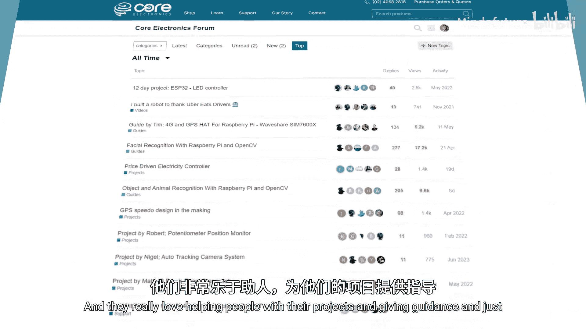

树莓派Pico入门教程：6.2：未来之路

在本节课中，我们将对课程进行总结，并探讨在掌握基础技能后，如何继续你的创造者之旅。

我们已经抵达课程的终点。如果你已经完成了本课程的学习，那么恭喜你。互联网上充满了像这样的免费在线课程和教育资源，但真正坚持学习并完成的人并不多。所以，再次恭喜你。

那么，完成课程后，我们该何去何从？我想再次强调，本课程只是为你提供了一系列可以放入“创客工具箱”的工具和技能。如何使用它们，完全取决于你。所以，走出去，动手做点什么。

换句话说，开始一个项目，开始制作一些东西，开始制作有用的东西，或者仅仅是开始动手制作。你现在已经具备了相应的技能。

*   想制作一个邮箱监控系统吗？你已经掌握了使用按钮或某种传感器，并通过无线方式报告信息的技能。
*   想制作一个机械臂吗？你知道如何使用伺服电机和逻辑来控制它。
*   或者制作一个气象站？你可以连接一些I²C或UART设备，将数据显示在OLED屏幕上，或者再次通过无线方式传输数据。

现在，你已经掌握了进行一些真正令人惊叹的创作所需的技能。在整个课程中，你可能已经产生了一些想要制作的东西的想法。走出去，把它们实现出来。

如果你需要一些灵感，我们有一个核心社区项目页面，以及涵盖各种主题和创意的完整指南，旨在帮助你激发创作灵感。课程页面中提供了这些资源的链接。

进行这类项目实践非常重要，因为从此刻起，仅仅观看课程视频会变得越来越难以深入学习。你将通过实践来学习大部分MicroPython和Pico相关的技能。你会学到那些在课堂环境中无法传授的细微之处。

另外需要记住的是，我们只学习了一套特定的创客技能。在你的创客工具箱中，还有其他非常有价值的工具。例如，如果你学习如何使用CAD进行3D建模和3D打印，你就可以为你的项目制作外壳、支架和定制零件。

如果你对此感兴趣，我们也有一个完整的速成课程，专门介绍这些基础的创客技能，以充实你的工具箱。同样，课程页面中提供了链接。

还有一件事，如果你在任何时候遇到困难或需要指导，请访问我们的社区论坛。那里有一个非常棒的社区，成员们正在进行各种各样奇妙而精彩的项目，他们非常乐于帮助他人解决问题、提供指导。无论你接下来打算做什么，我们Core Electronics团队都祝贺你完成了本课程，并祝你在未来的探索中一切顺利。

现在，走出去，创造点什么吧。