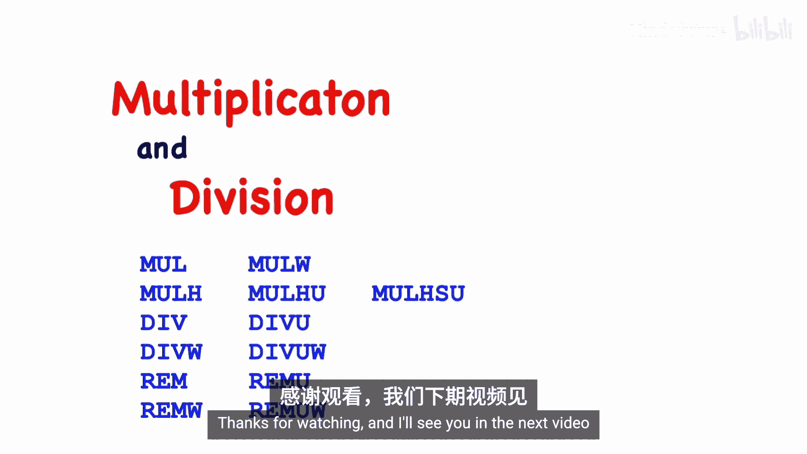

# 006：乘除指令 🧮

在本节课中，我们将要学习RISC-V架构中用于整数乘法和除法的指令，以及计算除法余数的指令。这些指令属于可选的“M”扩展集。

## 概述

RISC-V处理器规范可以被视为一系列设计选项和潜在扩展的“菜单”，硬件设计者可以选择实现哪些功能。RISC-V项目使用一组字母代码来指示特定处理器核心实际实现了哪些选项和扩展。作为程序员，你需要了解这个代码系统，以便知道你的核心能做什么。

首先，我们有RV32或RV64来表示寄存器大小，后面可以跟额外的字母来提供更多细节。字母“I”表示实现了基本指令集，这是最低要求。后面可以跟其他字母来表示实现了哪些可选功能。许多非常有用的指令实际上是可选的。例如，用字母“C”表示的压缩指令集就是完全可选的。

在本视频中，我将讨论乘法和除法指令，它们由代码字母“M”表示。“M”既包括乘法指令，也包括除法指令。还有许多其他选项，我计划在未来的视频中介绍。

如果你的核心没有实现“M”选项，那么乘法和除法指令将导致非法指令陷阱。我将在其他视频中讨论陷阱处理，但总结来说，要么操作系统会终止程序，要么操作系统内核会在软件中模拟该指令，然后返回到你的程序，而你的程序永远不会知道该操作不是在硬件中执行的。

需要补充的是，以当今的微电路技术，最简单的乘除法硬件实现几乎可以适配所有核心，除了极微型的核心。因此，我预计你实际购买和运行的任何核心都将在硬件中实现乘法和除法指令。

## 乘法指令

我想从讨论操作数和结果的大小开始讲解乘法。基本上，结果可能需要两倍于操作数的空间。

以下是一个用十进制表示的示意性例子。这是一个用二进制表示的例子。我们的机器可能是64位机器，但为了示例更简洁，我将使用8位数字，同样的原理也适用于其他大小。这里我们有两个8位数，将它们相乘，当我们将它们解释为有符号数时，得到这个结果。这里我展示了有符号解释。

现在，如果我们将这两个操作数解释为无符号值，那么会得到一个略有不同的结果。这里我展示了这两个值的十进制解释。尽管我们有相同的操作数，但结果的高位部分不同。这不仅仅是这些特定数字和这个特定示例的产物，而是普遍成立的。因此，无论是有符号还是无符号解释，结果的低半部分总是相同的。但对于结果的高半部分，高位比特可能不同，如本例所示。

我还想展示这个例子，我们将两个最大的无符号数相乘。这正好表明，结果所需的比特数恰好是操作数比特数的两倍。

所以，对于乘法，结果所需的比特数是操作数比特数的两倍。例如，如果我们将两个32位数相乘，会得到一个64位的结果，这无法放入一个寄存器中。同样，如果我们在RV64机器上，所有寄存器都包含64位，而结果是128位。因此，我们必须使用几条不同的指令来获取整个结果。

我们要看的第一条指令，将计算结果的低半部分。它将两个数相乘，产生一个结果，并将结果的低半部分存储到目标寄存器中。例如，如果我们在RV32机器上相乘两个32位数，我们得到结果的低32位，并将其移入目标寄存器。

为了获得结果的高半部分，我们根据是有符号乘法还是无符号乘法，使用不同的指令。

以下是计算结果高半部分的指令：
*   **`mulh`**： 用于计算有符号乘法结果的高半部分。假设两个操作数都是有符号数，这将把结果的高半部分（例如，在32位机器上是高32位）移入目标寄存器。
*   **`mulhu`**： 用于计算无符号乘法结果的高半部分。这将把结果的高半部分移入目标寄存器。
*   **`mulhsu`**： 用于计算一个有符号数乘以一个无符号数的结果的高半部分。其中一个操作数被视为有符号数，另一个则被解释为无符号数。

这些指令在RV32机器上（所有操作都是32位，结果是64位）或RV64机器上（所有操作数都是64位，我们计算128位结果）都有效。

如果我们有一台RV64机器，那么所有这些值都是64位，结果是128位。但我们还有一条额外的指令用于执行32位乘法，那就是`mulw`（字乘法）指令。它将执行32位乘法，具体操作是：取这些寄存器中的值（这些是64位寄存器），忽略寄存器的高半部分，只使用寄存器的低32位。然后将它们相乘，产生结果的低半部分，并将其放入你的目标寄存器，然后进行符号扩展。将寄存器的低32位进行符号扩展，并用符号扩展填充寄存器的高32位。如果你确实想要在RV64上获得完整的64位结果，你可以直接使用乘法指令来获取，但`mulw`对于实现需要执行32位乘法而非64位乘法的语言会很有用。

## 除法指令

RISC-V的“M”选项代码包括除法和余数指令。如果它存在，那么除法和余数将在硬件中实现。

至于表示结果所需的比特数，它总是与操作数的比特数大小相同。这里有一些十进制例子，可以直观地说明为什么这是正确的。

然而，当我们仔细查看二进制时，有一个例外情况，那就是当我们处理有符号数，并且用最大负数除以-1时。例如，如果我们有8位，范围是从-128到+127。如果我们取最负的数除以-1，会得到一个刚好超出有符号值可表示范围的数。这将是一个错误条件或我们需要处理的情况。

我们还有除以0的问题，我假设如果你已经学到了这一步，你应该听说过除以0是不允许的，所以我们需要讨论在这两种情况下会发生什么。

现在让我们来看看除法操作。以下是除法和余数操作。

`div`指令将寄存器`rs1`中的值除以`rs2`中的值，并将结果放入目标寄存器。如果结果不是整数，它将向下取整。

`rem`指令将在这样的除法之后产生余数。对于32位机器，所有值（包括操作数和结果）大小相同，都是32位。而对于RV64，操作数和结果都是64位。

接下来，我们需要讨论有符号数和无符号数之间的区别。这里有一个例子：我们用5除以一个所有位都是1的值。如果我们将该值解释为有符号数，它是-1，结果是-1。如果我们将其解释为无符号数，那么它是一个非常大的无符号值，非常大的正数。结果不同，正如你所见。因此，我们需要不同的指令来处理有符号和无符号数。

所以，默认情况下，`div`和`rem`作为有符号操作运行。如果操作数是无符号的，则可以使用`divu`（无符号除法）和`remu`（无符号余数）。

如果你有一台RV64机器，我们还有四条额外的指令。这些指令将根据寄存器大小进行操作。对于RV64，这些指令接受64位操作数并产生64位结果。

我们还有这些额外的字大小操作，操作码相同，只是后面附加了“W”。这些指令将使用32位执行操作。也就是说，它们将忽略操作数的高半部分或高32位，只查看低32位。它们将产生一个32位结果，然后进行符号扩展并放入目标寄存器。

我们还需要讨论一些与负操作数相关的细节。

以下是除法的定义：a除以b产生商q和余数r，使得这个等式成立。如果操作数是正数，没有问题。只有一个解满足这个等式。但如果我们有负操作数，那么可能有多个解。这里有一个例子表明，多个值将满足这个定义。-7除以-3，在两种情况下，可以产生商为2余数为-1，或者商为3余数为2，这两种情况都满足这里的定义。因此，如果你要使用负值，或者如果你的除法可能涉及负操作数，你需要知道会发生什么。一些架构将其留作实现定义，但在RISC-V的情况下，规范强制要求使用截断除法。

所以，如果你的操作数可能是负数，那么你可能需要更仔细地考虑这个问题，但我只想指出，RISC-V没有将其留作实现依赖，而是强制要求截断除法，这通常更容易实现。

那么，我们之前提到的错误条件呢？那些是除以0和溢出条件。事实证明，RISC-V规范规定了结果应该是什么。例如，当你用一个被除数（如a）除以0时，除法指令应产生一个所有位都设置为1的结果，而余数指令应直接产生被除数本身a。在有符号的世界里，将所有位设置为1的结果解释为-1。作为无符号值，它是最大的正数。

至于溢出，只有当操作数是有符号数，并且我们用最负数除以-1时才会发生。除法指令应产生结果，即最负数本身，而余数指令将产生0。

现在，可以说对于任何指令集架构，确实有两种选择。它可以强制规定错误条件的结果，或者可以将这些留作实现依赖。RISC-V强制规定了结果，我认为这是一个好主意，而不是将这些事情留作实现依赖。理想情况下，没有程序会出现这些错误条件。但实际上，有些程序会。这些程序可能会受到这些错误条件下指令实际操作的影响。根据错误条件的处理方式，它们可能会有不同的结果。因此，为了确保一个可能确实出现这些错误条件的程序在所有RISC-V机器上都能以相同的方式运行，他们强制规定了结果。正如我所说，我认为这是最好的做法。

## 总结

本节课中我们一起学习了乘法和除法指令。在本视频中，我涵盖了许多乘法指令：我们有产生结果低半部分的基本指令。然后我们有三种不同的指令来产生结果的高半部分，具体取决于我们将操作数视为有符号、无符号还是各一个。对于64位机器，我们还有一条只执行32位乘法的指令。

对于除法，我们既有除法指令也有余数指令，并且对于除法和余数都有有符号和无符号版本。然后对于64位机器，我们还有一个变体，它仅使用32位执行除法操作，产生32位结果，包括有符号值和无符号值。

好了，本视频到此结束，感谢观看，我们下个视频再见。