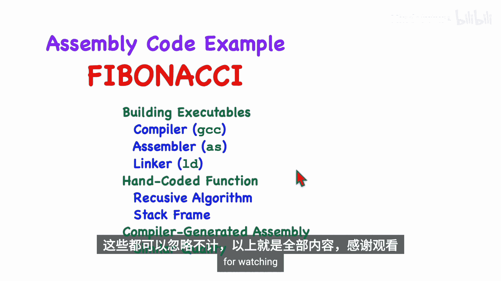

# 007：示例程序


在本节课中，我们将学习如何构建一个完整的RISC-V汇编语言程序。我们将以计算斐波那契数列为例，编写一个递归函数，并了解从编译、汇编到链接的完整构建过程。最后，我们还会对比手写汇编代码与编译器生成的代码，分析其中的异同。

## 概述与准备工作

上一节我们介绍了RISC-V汇编的基础知识，本节中我们来看看如何实际编写一个完整的程序。

我们选择斐波那契数列作为示例。斐波那契数列的定义是：`F(0) = 0`, `F(1) = 1`, 对于 `n > 1`，`F(n) = F(n-1) + F(n-2)`。我们将编写一个名为 `Fib` 的函数，它接收一个参数 `N`，并返回第 `N` 个斐波那契数。例如，`Fib(8)` 应返回 `21`。

我们将使用递归算法来实现，这有助于演示函数调用、返回、递归以及栈帧的使用。我们还将创建一个 `main` 函数（用C语言编写）来调用我们的汇编函数，这可以展示C代码与汇编代码如何链接，并用于测试。

在开始编码前，必须彻底理解算法。我们可以先用C语言描述算法并进行测试。

```c
// C语言描述的斐波那契函数
int fib(int n) {
    if (n <= 1) return n;
    return fib(n-1) + fib(n-2);
}
```

为了执行RISC-V汇编代码，需要相应的工具链（编译器、汇编器、链接器）和一个执行环境（如QEMU模拟器）。

## 程序的构建过程

当我们使用 `gcc` 这样的命令编译程序时，背后实际上发生了多个步骤。

`gcc` 是一个包装脚本，它依次调用三个程序：
1.  **编译器**：将C源代码（`.c`）编译成汇编代码（`.S`）。
2.  **汇编器**：将汇编代码（`.S`）汇编成目标文件（`.o`），其中包含机器码，但地址尚未确定。
3.  **链接器**：将一个或多个目标文件（`.o`）链接成最终的可执行文件，解析所有符号地址。

我们可以使用特定选项来控制这个过程：
*   `-S`：只进行编译，生成汇编文件。
*   `-c`：编译并汇编，生成目标文件，但不链接。
*   也可以直接调用汇编器（如 `riscv64-unknown-elf-as`）和链接器（如 `riscv64-unknown-elf-ld`）。

大型项目通常由多个源文件组成。以下是构建此类项目的一般步骤：

以下是构建多文件项目的步骤：
1.  分别编译每个C源文件（`.c`）为目标文件（`.o`）。
2.  分别汇编每个汇编源文件（`.S`）为目标文件（`.o`）。
3.  使用链接器将所有目标文件链接成一个可执行文件。

在本例中，我们将创建两个文件：`main.c`（C代码）和 `fib.S`（汇编代码）。我们将分别编译/汇编它们，然后链接。

## 编写汇编函数：Fib

现在，我们开始动手编写 `Fib` 函数。每个函数开头都应有一个块注释，说明其功能。

我们首先处理递归调用。根据算法 `F(n) = F(n-1) + F(n-2)`，我们需要进行两次递归调用。

```assembly
# 第一次递归调用：计算 F(n-1)
addi a0, a0, -1       # 参数 n-1
call fib              # 调用 fib(n-1)
mv s1, a0             # 将结果 F(n-1) 保存到 s1

# 第二次递归调用：计算 F(n-2)
addi a0, a0, -2       # 计算 n-2 (注意：此时a0已被第一次调用改变，需要提前计算)
# 我们需要提前计算 n-2 并保存
addi t0, a0, -2       # 假设原始n在a0，计算 n-2
mv a0, t0             # 设置参数
call fib              # 调用 fib(n-2)
# 此时 a0 中是 F(n-2)

# 相加得到结果
add a0, s1, a0        # F(n) = F(n-1) + F(n-2)
```

接下来，我们需要添加终止条件：当 `n <= 1` 时，直接返回 `n`。

```assembly
# 终止条件检查
li a1, 1              # 将立即数1加载到寄存器a1
ble a0, a1, base_case # 如果 n <= 1，跳转到基础情况处理
# 否则，继续执行上述递归代码
...
base_case:
    # 对于 n=0 或 n=1，返回值就是 n 本身，已经在 a0 中
    ret               # 返回
```

根据RISC-V调用约定，函数如果使用了保存寄存器（如 `s1`），必须在函数开头保存其原始值，并在返回前恢复。同时，`call` 指令会改变返回地址寄存器 `ra`，我们也需要保存它。这些数据通常保存在栈上。

我们需要在栈上分配空间（栈帧）来保存这些寄存器。栈从高地址向低地址增长。

```assembly
# 函数序言：设置栈帧
addi sp, sp, -24      # 为3个双字（s1, s2, ra）分配栈空间
sd ra, 16(sp)         # 保存返回地址 ra
sd s1, 8(sp)          # 保存寄存器 s1
sd s2, 0(sp)          # 保存寄存器 s2 (我们之后会用s2)

# ... (函数主体代码)

# 函数尾声：恢复寄存器并销毁栈帧
ld s2, 0(sp)          # 恢复 s2
ld s1, 8(sp)          # 恢复 s1
ld ra, 16(sp)         # 恢复返回地址 ra
addi sp, sp, 24       # 释放栈空间
ret                   # 返回
```

将以上所有部分组合起来，并添加详细的注释，就构成了完整的 `fib.S` 文件。详细的注释对于理解和维护汇编代码至关重要。

## 对比编译器生成的代码

我们可以让C编译器为相同的 `fib` 函数生成汇编代码，使用 `gcc -S` 选项。将手写代码与编译器生成代码对比，可以发现一些有趣的区别。

编译器生成的代码通常包含大量汇编器指令（以`.`开头），如 `.cfi_*`（调用帧信息），用于调试器。其代码结构与手写代码大体相似，但有一些关键差异：

1.  **栈帧管理**：编译器生成的代码总是在函数开头分配栈帧并保存寄存器，即使可能立即返回（基础情况）。而手写代码先进行条件判断，仅在需要递归时才设置栈帧。对于斐波那契这种递归深度很大的算法，手写代码在基础情况下的效率更高。
2.  **栈对齐**：RISC-V调用约定要求栈指针 `sp` 必须保持16字节（四字）对齐。编译器生成的代码分配了32字节（16的倍数）的栈帧来满足这一点。手写代码分配了24字节，在仅调用自身的情况下可以工作，但严格来说不符合规范。
3.  **寄存器使用与指令顺序**：编译器可能使用不同的寄存器（如用 `s2` 代替 `s1`），或调整计算与保存的顺序，但最终逻辑等价。
4.  **冗余代码**：编译器有时会生成一些当前函数未使用的设置代码（例如设置帧指针 `s0`），这是其通用代码生成策略的结果。

## 总结

本节课中我们一起学习了如何构建一个完整的RISC-V汇编程序。我们以斐波那契数列计算为例，详细介绍了从算法设计、编写汇编函数、管理栈帧和寄存器，到最终编译、汇编和链接的完整流程。

我们特别探讨了递归函数的实现，以及栈帧在支持函数调用和保存上下文中的作用。通过对比手写汇编代码与编译器生成的代码，我们看到了两者在实现细节上的差异，例如栈帧管理策略和对齐要求的处理，这加深了我们对RISC-V调用约定和代码优化的理解。

记住，编写清晰、注释完整的汇编代码，并充分理解底层机制（如栈的操作），是进行高效汇编编程的关键。



