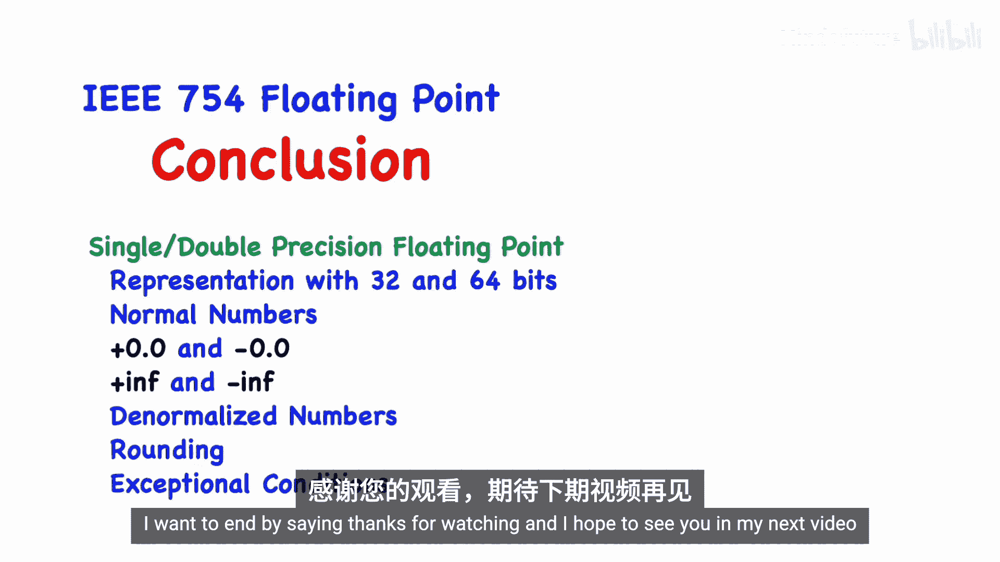

# 008：IEEE 754浮点数标准

在本节课中，我们将要学习计算机中浮点数的表示方法，即IEEE 754标准。无论您是否学习RISC-V，这都是理解现代处理器如何处理小数和极大/极小数值的基础知识。我们将从科学记数法开始，逐步深入到单精度、双精度浮点数的二进制表示，并了解特殊值（如无穷大、NaN）以及舍入和错误处理机制。

## 科学记数法与二进制浮点数

上一节我们介绍了课程概述，本节中我们来看看浮点数的基本思想。科学记数法用于表示非常大或非常小的数字。在十进制中，一个数可以表示为：
**公式：±M × 10^E**
其中，`M`是尾数（有效数字），`E`是指数。

在二进制浮点数中，我们采用相同的思路，但基数变为2：
**公式：±M × 2^E**
这里，`M`是二进制尾数，`E`是二进制指数。在标准科学记数法中，我们习惯将小数点放在第一个有效数字之后。在二进制中，我们同样将“二进制点”放在第一个`1`之后。

## 单精度与双精度浮点数的表示

理解了基本公式后，我们来看看计算机中如何具体存储这两种精度的浮点数。

单精度浮点数使用32位（4字节）存储。其位域划分如下：
*   **1位** 用于符号位（s）。
*   **8位** 用于指数（E）。
*   **23位** 用于尾数（M）。注意，在规范化数中，尾数最高位的`1`是隐含的，并不实际存储在这23位中。

双精度浮点数使用64位（8字节）存储。其位域划分如下：
*   **1位** 用于符号位（s）。
*   **11位** 用于指数（E）。
*   **52位** 用于尾数（M）。同样，最高位的`1`是隐含的。

双精度提供了比单精度更大的表示范围和更高的精度。

## 精度与数值间隙

浮点数的“精度”是一个需要理解的重要概念。由于尾数的位数是固定的，浮点数只能精确表示有限个有理数，数值之间存在“间隙”。

以下是理解精度和间隙的两个例子：

对于一个非常大的单精度数（例如指数为35），其值约为790亿。此时，相邻两个可表示数值之间的间隙是4096（2^12）。尽管如此，这两个数的十进制表示前7位数字是相同的。因此，通常说**单精度浮点数约有7位十进制有效数字**。

对于一个非常小的单精度数（例如指数为-16），其值约为0.000015。此时，相邻两个可表示数值之间的间隙极小（约2^-39）。同样，它们的十进制表示前7位数字也相同。

对于双精度浮点数，**约有16位十进制有效数字**。关键在于，数值越大，间隙越大；数值越接近0，间隙越小。

## 特殊值的表示

IEEE 754标准不仅定义了常规数字，还定义了几种特殊值的表示方式，它们通过指数字段的特定模式来区分。

以下是主要的特殊值类型及其含义：
*   **零**：有+0和-0两种表示。指数字段全为0，尾数字段全为0。
*   **无穷大**：有+∞和-∞。指数字段全为1，尾数字段全为0。
*   **非数**：表示无效操作的结果（如0/0）。指数字段全为1，尾数字段**不全为0**。
*   **非规范数**：用于表示非常接近0的数，精度低于规范数。指数字段全为0，尾数字段不全为0，且隐含位为0。

对于单精度浮点数，指数8位字段的编码偏移值为127。因此，规范数的指数实际范围是**-126 到 +127**。全0和全1的指数模式用于表示上述特殊值。

## NaN：静默NaN与信号NaN

在非数（NaN）中，标准进一步区分了静默NaN和信号NaN，但这在RISC-V中通常不是重点。

两者的核心区别在于：
*   **静默NaN**：作为操作数参与运算时，结果会安静地传播另一个静默NaN，**不会**触发“无效操作”异常标志。
*   **信号NaN**：作为操作数参与运算时，结果同样传播NaN，但**会**触发“无效操作”异常标志。

信号NaN可用于标记数据流中的缺失值。然而，在RISC-V架构中，通常所有NaN都被视为静默NaN。无效操作标志仅在确实发生非法运算（如对负数开平方根）时才会被设置。

## 舍入模式与异常条件

由于浮点数表示能力有限，运算结果经常无法精确表示，此时必须进行舍入。同时，运算中也可能出现各种异常情况。

IEEE标准定义了多种舍入模式，由处理器的浮点控制状态寄存器中的字段控制：
*   向最接近的值舍入（默认且最常用，遇到中间值时向偶数舍入）。
*   向零舍入。
*   向正无穷大舍入。
*   向负无穷大舍入。

在浮点运算过程中，可能会发生以下异常（错误）条件，相应的状态标志位会被置位，且这些标志位是“粘性的”：
*   **不精确**：结果被舍入，非精确值。
*   **上溢**：结果幅值超出最大可表示范围，返回无穷大。
*   **下溢**：结果幅值小于最小可表示规范数，返回0或非规范数。
*   **除零**：非零数除以零，返回无穷大。
*   **无效操作**：进行了未定义的运算（如0/0，∞-∞），返回NaN。

## 使用浮点数的注意事项

最后，我们必须警惕，计算机中的浮点数与数学中的实数并不完全相同。

以下是几个重要的注意事项：
*   **存在两个零**（+0和-0），它们在比较相等时通常被视为相等，但在某些运算（如1/+0和1/-0）中会产生不同结果（+∞和-∞）。
*   **缺乏结合律**：由于舍入误差，`(a + b) + c` 的结果不一定等于 `a + (b + c)`。
*   **存在舍入误差**：许多十进制小数无法用有限二进制精确表示，运算结果也可能需要舍入。
*   **存在表示范围限制**：可能发生上溢和下溢。

一个有用的知识点是：**任何32位整数（无论有无符号）都可以用64位双精度浮点数精确表示**。

本节课中我们一起学习了IEEE 754浮点数标准的核心内容。我们了解了单精度和双精度浮点数在二进制中的表示方式，包括规范数、零、无穷大、NaN和非规范数。我们还探讨了舍入的必要性、各种舍入模式以及运算中可能出现的异常条件。理解这些概念是安全、正确进行浮点计算的基础。在下一节中，我们将具体学习RISC-V架构中如何通过指令集来操作这些浮点数。