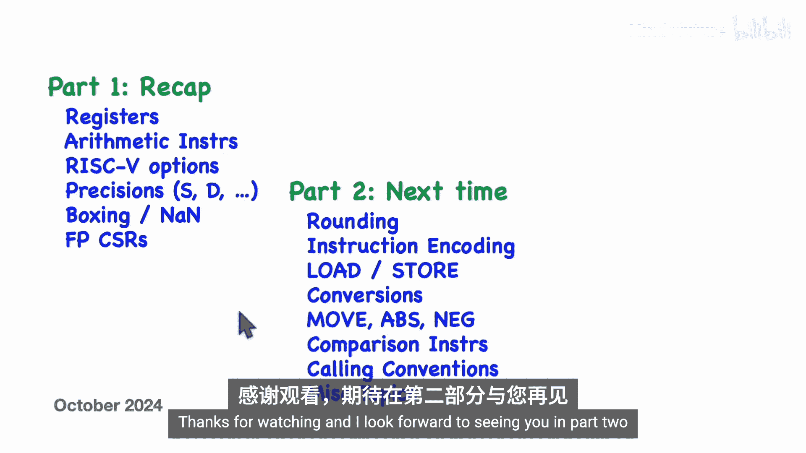

# 009：P09-RISC-V-Assembly-Code-#9---Floating-Point-Instructions-(pt.-1)


## 📋 概述

在本节课中，我们将学习RISC-V处理器架构中的浮点运算指令。这是关于RISC-V浮点指令的第一部分。我们将介绍浮点寄存器、基本的算术运算指令、不同的浮点精度选项，以及浮点控制与状态寄存器。本教程旨在让初学者能够理解这些核心概念。

## 🧮 浮点寄存器与精度选项

上一节我们介绍了RISC-V的整数寄存器。本节中我们来看看浮点运算专用的寄存器。

如果处理器核心实现了浮点运算扩展，那么除了32个通用整数寄存器外，还会有32个额外的浮点寄存器，命名为 `F0` 到 `F31`。与整数寄存器不同，`F0` 寄存器没有特殊含义。

这些寄存器的大小取决于处理器核心实现了哪些可选扩展。以下是主要的浮点精度选项：

*   **F 扩展**：单精度浮点数，需要32位。
*   **D 扩展**：双精度浮点数，需要64位。它依赖于F扩展。
*   **Q 扩展**：四精度浮点数，需要128位。它依赖于D扩展。
*   **Zfh 扩展**：半精度浮点数，需要16位。它依赖于F扩展。

无论实现了哪些扩展，都只有一套浮点寄存器，其大小足以容纳所支持的最大精度值。例如，如果实现了F和D扩展，寄存器大小就是64位，可以存放单精度或双精度值。

## ➕ 基本浮点算术指令

了解了寄存器后，我们来看看如何对它们进行运算。以下是基本的浮点算术指令格式。

浮点指令通常以字母 `F` 开头，并使用后缀（如 `.S`， `.D`， `.H`， `.Q`）来指明操作数的精度。例如，单精度加法指令的格式如下：

```
FADD.S fd, fs1, fs2
```

这条指令将浮点寄存器 `fs1` 和 `fs2` 中的单精度值相加，结果存入目标浮点寄存器 `fd`。

浮点指令的编码与整数指令非常相似，只是操作码不同，处理器据此识别操作的是浮点寄存器。

以下是按精度分类的基本算术指令示例：

*   **单精度（.S）**：`FADD.S`, `FSUB.S`, `FMUL.S`, `FDIV.S`, `FSQRT.S`, `FMIN.S`, `FMAX.S`
*   **双精度（.D）**：`FADD.D`, `FSUB.D`, `FMUL.D`, `FDIV.D`, `FSQRT.D`, `FMIN.D`, `FMAX.D`
*   **四精度（.Q）**：`FADD.Q`, `FSUB.Q`, `FMUL.Q`, `FDIV.Q`, `FSQRT.Q`, `FMIN.Q`, `FMAX.Q`
*   **半精度（.H）**：`FADD.H`, `FSUB.H`, `FMUL.H`, `FDIV.H`, `FSQRT.H`, `FMIN.H`, `FMAX.H`

需要注意的是，只有处理器核心实现了相应的扩展，对应的指令才能执行，否则会触发非法指令异常。

## 📦 浮点数的“装箱”与NaN

在混合使用不同精度时，RISC-V采用了一种称为“装箱”的技术。这涉及到“非数”这个概念。

NaN（Not a Number）是一种特殊的浮点数值，其指数位全为1，且尾数部分至少有一个1。NaN通常用于表示无效操作的结果，例如 `0.0 / 0.0`。

“装箱”是指将一个较低精度的浮点数（如单精度）嵌入到一个较高精度的NaN值中。具体做法是，将低精度数放在高精度寄存器的低有效位，而将高精度数的高位设置为NaN的位模式。

例如，在一个实现了双精度（64位寄存器）的核心上执行单精度（32位）运算时：
*   对于源操作数，只使用寄存器低32位，高32位被忽略。
*   对于目标操作数，运算结果放在寄存器的低32位，高32位则被设置为全1（即一个NaN的位模式）。

这样，这个64位的值整体上是一个NaN，但其低32位包含了有效的单精度数值。这种方法允许在统一的64位寄存器中安全地传递和处理单精度值。

## 🎛️ 浮点控制与状态寄存器

浮点运算的行为由浮点控制与状态寄存器控制。最重要的两个字段是舍入模式字段和异常标志位字段。

**舍入模式** 决定了当运算结果无法精确表示时该如何处理。RISC-V定义了5种舍入模式，由 `FRM` 寄存器中的3位编码控制：

*   **000 - RNE (Round to Nearest, ties to Even)**：向最接近的值舍入，如果恰好居中，则向偶数舍入。
*   **001 - RTZ (Round towards Zero)**：向零舍入（截断）。
*   **010 - RDN (Round Down / -∞)**：向下舍入（朝向负无穷）。
*   **011 - RUP (Round Up / +∞)**：向上舍入（朝向正无穷）。
*   **100 - RMM (Round to Nearest, ties to Max Magnitude)**：向最接近的值舍入，如果恰好居中，则向绝对值较大的方向舍入。

**异常标志位** 位于 `FFLAGS` 寄存器中，用于记录运算过程中发生的异常情况。共有5个标志位：

*   **NV**：无效操作（如 `∞ + (-∞)`）。
*   **DZ**：除零操作。
*   **OF**：上溢。
*   **UF**：下溢。
*   **NX**：结果不精确（需要舍入）。

`FCSR` 寄存器包含了完整的 `FRM` 和 `FFLAGS` 字段。为了方便，也可以单独访问 `FRM` 和 `FFLAGS` 寄存器。

以下是用于读写这些寄存器的指令（它们是伪指令，汇编器会将其转换为实际的CSR指令）：

*   `FRCSR rd`：将 `FCSR` 的值读入整数寄存器 `rd`。
*   `FSCSR rd, rs` / `FSCSR rs`：将整数寄存器 `rs` 的值写入 `FCSR`。`rd` 可选，用于保存旧值。
*   `FRRM rd`：将舍入模式寄存器 `FRM` 的值读入 `rd`。
*   `FSRM rd, rs` / `FSRM rs`：设置舍入模式寄存器。
*   `FRFLAGS rd`：将标志位寄存器 `FFLAGS` 的值读入 `rd`。
*   `FSFLAGS rd, rs` / `FSFLAGS rs`：设置标志位寄存器。

## 🔍 浮点数分类指令

最后，我们介绍一个有用的诊断指令：`FCLASS`。这条指令可以检查一个浮点数的类型。

`FCLASS` 指令将一个浮点寄存器中的值进行分类，并将一个表示其类别的编码存入一个整数寄存器。编码含义如下：

*   **位0**：值为 `-∞`。
*   **位1**：值为负规约数。
*   **位2**：值为负非规约数（次正规数）。
*   **位3**：值为 `-0`。
*   **位4**：值为 `+0`。
*   **位5**：值为正非规约数（次正规数）。
*   **位6**：值为正规约数。
*   **位7**：值为 `+∞`。
*   **位8**：值为发信NaN。
*   **位9**：值为静默NaN。

指令格式为 `FCLASS.<size> rd, fs1`，例如 `FCLASS.S rd, fs1`。

## 📝 总结

本节课中我们一起学习了RISC-V浮点指令的第一部分内容。我们介绍了32个浮点寄存器，以及支持不同精度（半、单、双、四精度）的选项。我们学习了基本的浮点算术指令，并了解了“装箱”技术如何允许在小精度寄存器缺失时处理小精度数值。我们还探讨了浮点控制与状态寄存器，特别是舍入模式和异常标志位。最后，我们介绍了用于判断浮点数类型的 `FCLASS` 指令。



在下一部分，我们将深入探讨舍入模式的细节、浮点指令的二进制编码、加载/存储指令、精度转换指令、比较指令以及浮点调用约定等内容。