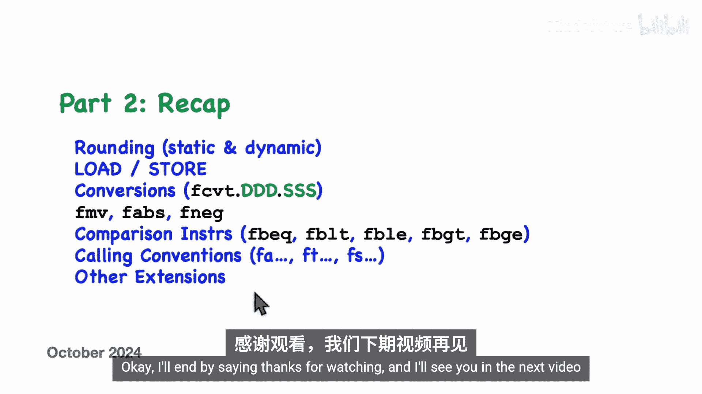

# 010：浮点指令（第二部分）

在本节课中，我们将继续学习RISC-V架构中的浮点指令。上一节我们介绍了浮点寄存器、算术指令、不同精度以及浮点控制与状态寄存器。本节中，我们将深入探讨舍入模式、浮点指令的二进制编码、加载/存储指令、类型转换指令、比较指令以及浮点调用约定等核心内容。

## 舍入模式：动态与静态

上一节我们介绍了浮点运算，本节中我们来看看如何指定舍入模式。RISC-V提供了两种指定舍入模式的方法：动态舍入和静态舍入。

*   **动态舍入**：使用浮点控制与状态寄存器中的舍入模式位来决定如何对无法精确表示的结果进行舍入。
*   **静态舍入**：直接在指令中指定舍入模式。

以下是汇编语言中指定舍入模式的示例：

*   若要使用控制与状态寄存器中的舍入模式位，无需在指令中做任何额外操作。
*   若要在指令中显式指定舍入模式，需添加一个类似第四个操作数的符号。

这些符号即我们之前见过的舍入模式符号：`rne`（就近舍入）、`rtz`（向零舍入）、`rdn`（向下舍入）、`rup`（向上舍入）和`rmm`（就近舍入，平局时取最大幅度值）。

舍入模式适用于算术指令以及部分转换指令，并且适用于各种不同的数据大小。对于某些结果总是精确的指令（例如最小值`fmin`、最大值`fmax`指令，或将单精度转换为双精度），如果尝试为其指定静态舍入模式，汇编器会报错。

## 浮点指令编码

了解浮点指令如何编码为二进制机器码涉及许多细节，但我们可以通过一个例子来感受一下。以下是一条浮点减法指令，每条指令都会被编码为一个32位的完整指令。

浮点指令包含多个字段：
*   棕色字段是操作码位，包括一个主操作码字段和一个更具体的操作码字段（用于确定是加法、减法、乘法等）。
*   一个2位字段用于确定是单精度、双精度、四精度等。
*   用于目标寄存器和源寄存器的字段。
*   一个3位字段用于指定舍入模式。

以这条指令为例，其编码如下。具体来说，舍入模式值`001`代表向零舍入。我们可以使用任何一种舍入模式。如果不指定任何舍入模式（即使用动态舍入模式），则使用代码`111`，此时舍入模式将由浮点控制与状态寄存器决定。

## 加载与存储指令

对于通用寄存器，我们有一系列加载和存储指令，可以在内存和寄存器之间移动字、双字或四字（即4、8或16字节）的数据。

浮点加载和存储指令的概念相同，区别在于我们还有半字版本。因此，我们可以在内存和目标寄存器之间移动2、4、8或16字节的数据。对于加载指令，目标寄存器是浮点寄存器之一；对于存储指令，源寄存器是浮点寄存器之一。地址计算仍然是通过将指令中包含的偏移量与基址寄存器`rs1`中的值相加来完成，`rs1`仍然是通用整数寄存器。

需要注意的是，可以使用哪些指令取决于你的核心具体实现了哪些扩展。例如，如果你的核心没有实现四字浮点值，就不能使用加载四字指令。

对于加载到通用整数寄存器的整数加载指令，较小的值会进行符号扩展以填充较大的寄存器。对于浮点加载指令，当数据大小小于寄存器本身时，值会被“装箱”，即作为非数字值的有效载荷被封装起来。

## 类型转换指令

有一系列转换指令，用于将值从一个源寄存器复制到目标寄存器，并在过程中从一种格式转换为另一种格式。源和目标可以是浮点值或整数值。浮点值使用浮点寄存器指定，整数值使用通用寄存器指定。

以下是转换指令的一般格式。它有一个后缀，用于指明源格式和目标格式，以及源寄存器和目标寄存器。例如，`fcvt.s.w` 表示从32位整数（源寄存器必须是通用寄存器）转换为单精度浮点值（目标寄存器必须是浮点寄存器）。

关于源和目标格式说明符：
*   我们可以指定 `S`、`D`、`Q` 或 `H` 来表示单精度、双精度、四精度或半精度浮点值，此时对应的寄存器必须是浮点寄存器。
*   或者我们可以指定 `W`、`WU`、`L` 或 `LU` 来表示32位或64位有符号或无符号整数，此时对应的寄存器应该是通用整数寄存器。

因此，有许多可用的转换指令，具体哪些指令在特定的RISC-V核心上可用，取决于该核心实际实现了哪些可选扩展。

## 数据移动、绝对值与取反指令

我们还有几条称为浮点移动的指令，可以在通用整数寄存器和浮点寄存器之间直接复制位模式，而不进行任何转换。当我们在通用整数寄存器中有一个位模式时，它会被解释为某个特定的整数。当我们不加任何转换地将这些相同的位移动到浮点寄存器时，它们会被解释为一个单精度浮点数，并具有完全不同的、无关的值。

对于这些移动指令，我们使用格式代码 `X` 来指示这两个寄存器中哪个是通用整数寄存器。指令 `fmv.x.w` 和 `fmv.w.x` 在两者之间移动32位数据。

如果是在RV64机器上并且实现了双精度浮点，我们还有另外两条指令 `fmv.x.d` 和 `fmv.d.x`，用于在通用寄存器和双精度浮点寄存器之间移动64位数据。

以下是另外三条有用的浮点指令：
1.  `fabs.s`：通过清除源浮点寄存器中的符号位来计算绝对值，并将结果移动到目标寄存器。
2.  `fneg.s`：对一个浮点寄存器中的值取反，并将结果移动到另一个寄存器。
3.  `fmv.s`：将一个值从一个浮点寄存器移动到另一个浮点寄存器。

值得一提的是，上述三条指令实际上是伪指令，它们由以下三条底层机器码指令实现：`fsgnjx.s`、`fsgnjn.s` 和 `fsgnj.s`。如果你关心这些指令的具体作用，可以暂停视频查看，否则我们继续。

## 浮点比较指令

测试很重要，让我们看看如何比较浮点值。所有比较指令都遵循这种通用方法：检查两个浮点寄存器中的值并进行比较，然后将结果（1或0）移动到目标寄存器（该寄存器是通用整数寄存器之一）。

以下是一个单精度浮点相等性测试的例子，我们也有针对不同大小的变体。执行此指令后，你需要执行一条分支指令来测试该值是否为0。因此，如果两个值相等，这条指令会导致分支；如果你希望在不相等时分支，则使用相反的分支指令。

此时需要指出，由于舍入的存在，浮点数的相等性测试有些棘手。你认为相等的两个值，可能由于舍入而不完全相等。此外，在存在非数字量的情况下，使用关系运算符进行测试也可能有些棘手。

其他关系比较类似。例如，我们有浮点小于测试 `flt.s`、浮点小于等于测试 `fle.s`、浮点大于测试 `fgt.s` 和浮点大于等于测试 `fge.s`，具体取决于你的核心实现了哪些扩展，它们有各种大小的变体。这些测试都以相同的方式进行：小于、小于等于、大于、大于等于。

值得一提的是，实际上只有小于和小于等于操作是在硬件中实现的。大于和大于等于测试实际上是伪指令，通过交换所涉及的两个寄存器，用小于和小于等于指令来实现。

如前所述，由于舍入问题，用浮点数测试相等性有一定风险。你处理的数字可能并非你想象的那样精确。更好的方法是计算差值，然后与某个阈值（某个epsilon值）进行小于比较。对于非数字量要小心，与非数字值进行小于、小于等于、大于、大于等于的比较被认为是无效操作，控制与状态寄存器中的无效操作位将被设置。但奇怪的是，对于相等比较，这被认为是正常的，无效操作位不会被设置。此外，任何与非数字值的比较都将返回假。这导致了一个反直觉的结果：当你将一个非数字与另一个非数字比较时，结果总是假。所以，如果你取一个代表非数字的位模式，它将与自身（完全相同的位模式）比较为不相等，这并非你所期望的。另外，我们有一个正零和一个负零，这导致了一些不寻常的行为。这两者是相等的，所以它们测试为相等。然而，如果用1除以正零，会得到正无穷大；如果用1除以负零，会得到完全不同的结果——负无穷大。在我看来，这确实挑战了“相等”本身的含义。

## 融合乘加指令

现在我想谈谈一组称为融合乘加的指令。以下是一个例子，你可以看到这条指令有三个操作数，而大多数RISC-V指令只有一或两个操作数。此外，它执行两个操作：先进行浮点乘法，然后进行浮点加法。

这条特定的指令在许多应用中非常有用，包括数字信号处理等领域。你可能会问，为什么不直接编码两条指令？为什么不使用浮点乘法指令后跟浮点加法指令？一个答案可能是出于性能原因，但我怀疑浮点乘法和加法占据了大部分时间，而指令取指所需的时间并不是这里的关键瓶颈。

还有一个更重要的原因，那就是舍入只在两个操作都执行完成后才进行。通常，舍入是在每个浮点操作之后进行的。但在这里，你延迟了舍入。这将产生更准确的结果，如果你多次重复此操作，这可能至关重要。

融合乘加指令有许多不同的变体，包括针对各种不同精度的变体。我们还有这些变体：融合乘减指令（改变这里的符号）、取反版本（改变这里和这里的符号），最后是结合这两者的版本。

对于三个操作数，很自然会问：我们如何将这个东西编码成二进制机器码？答案如下。你可以看到第三个操作数编码在这里。我们还有两位用于精度，三位用于舍入模式。请记住，每个完整大小的指令在低两位都有两个1，我们需要额外的两位来编码它是哪种融合乘加指令，这为有效操作码只留下了三位。如果你对指令集架构最初是如何设计的以及指令编码是如何选择的感兴趣，你可能会注意到，这意味着所有完整大小的RISC-V指令中有八分之一是融合乘加指令。

## 浮点寄存器命名与调用约定

到目前为止，我使用诸如 `f0` 到 `f31` 这样的名称来指代浮点寄存器。但与通用寄存器一样，浮点寄存器也有备用名称或昵称。我们有用于参数寄存器的特殊名称 `fa0` 到 `fa7`，用于临时寄存器的 `ft0` 到 `ft11`，以及用于被调用者保存的浮点寄存器的 `fs0` 到 `fs11`。

以下是这些备用名称与其他名称的对应关系。你不需要记住这些对应关系，因为汇编器会处理这些。你可以直接使用备用名称，而且很可能应该这样做。

这些寄存器以与通用寄存器相同的方式用于相同的目的。如果函数有浮点参数，它们会通过 `fa0` 到 `fa7` 寄存器传递。在函数内部，我们可以使用这些寄存器以及临时寄存器，而无需保存先前的值。但我们也有一些被调用者保存的寄存器，因此在使用被调用者保存的寄存器之前，我们需要保存其先前的值，并在返回前恢复该值。

## 其他可选扩展

在本视频的剩余部分，我想提几个可能不太常见的可选RISC-V扩展。虽然你可能永远不会遇到或需要这些东西，但我想提一下，以防万一。

`Zfa` 扩展增加了几条新指令，包括这条：浮点加载立即数指令 `fli.s`。这里的立即数是32个可能的常量值之一，这些值以某种方式编码到指令本身的5位字段中，并将该值移动到目标浮点寄存器。该扩展还包括各种大小的浮点舍入到整数指令 `fround`，它根据当前舍入模式对浮点寄存器中的值进行舍入，并将结果放入浮点寄存器。如果你必须这样做，可以通过执行转换将其移动到整数通用寄存器，然后再移回浮点寄存器来获得几乎相同的结果。该扩展还包括其他几条更晦涩的指令。

通常，实现浮点的RISC-V处理器会有一组单独的寄存器来保存这些浮点值，这些寄存器就是我们称为 `f0` 到 `f31` 的寄存器。但为什么不直接使用通用寄存器（X寄存器）呢？这里的想法是，所有浮点指令的工作方式相同，它们只是对通用X寄存器而不是浮点寄存器进行操作或运算。另一种说法是，浮点寄存器只是X寄存器的别名或其他名称。

那么，为什么为浮点数设置单独的寄存器文件是一个好主意呢？有几个原因。首先，浮点寄存器只能包含浮点数，但没有要求它们必须以IEEE 754规范指定的格式存储这些浮点数。硬件实际上可能使用比IEEE规范更多的位，以使各种操作更快或可能减少硬件需求。例如，指数可能以二进制补码形式存储，而不是IEEE规范中存储的带偏置的奇特方式；此外，指数可能被赋予更多位，从而无需特殊表示非规格化数。另外，我们可能会使通常隐含的前导位变得显式。

尽管如此，我们确实有这里列出的选项。在 `FinX` 选项中，单精度浮点值存储在通用寄存器中。在 `DinX` 选项中，双精度浮点值存储在通用寄存器中。最后，在 `HinX` 选项中，半精度浮点值直接存储在通用寄存器中。

最后，我想提一下 `HinXmin` 选项，它只为半精度浮点提供非常最小的支持。它只提供几条额外的指令，这些指令可以在半精度和单精度浮点之间进行转换，以及（如果实现了的话）在半精度和双精度浮点之间进行转换。这些指令的理念是，你可以将半精度数转换为更大的精度，对其进行一些算术运算，完成后将其转换回半精度。

## 总结

本节课中我们一起学习了RISC-V浮点指令的更多细节。

在本视频中，我讨论了舍入的工作原理。我谈到了静态舍入（舍入模式直接包含在指令中）和动态舍入（舍入模式由控制与状态寄存器中的位决定）。我讨论了各种加载和存储指令，用于在内存和浮点寄存器之间移动数据。我讨论了所有形式的转换指令，用于在源精度和目标精度之间进行转换，包括当我们使用 `X` 时直接复制位而不进行任何转换。我讨论了移动、绝对值和取反指令。我讨论了用于比较两个浮点寄存器的指令，包括相等、小于、小于等于、大于和大于等于。这些指令将通用寄存器设置为真或假以指示结果。我讨论了浮点调用约定，并提到了浮点寄存器的备用名称：以 `FA` 开头的名称用于参数，以 `FT` 开头的名称用于临时寄存器，以 `FS` 开头的名称用于被调用者保存的浮点寄存器。我还谈到了其他一些不太常用的扩展。