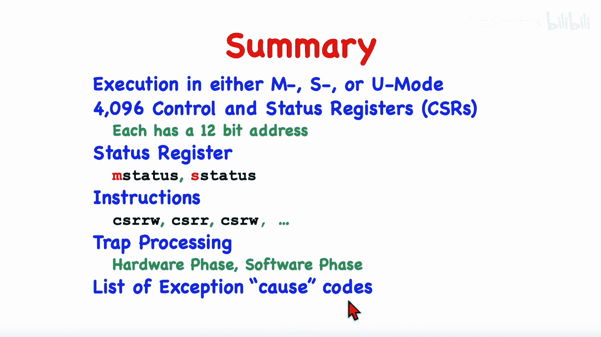

# 011：特权模式与异常处理入门

在本节课中，我们将开始学习RISC-V的特权系统和安全机制。我们将从机器模式、监督者模式和用户模式的介绍开始，讨论控制和状态寄存器，描述直接访问它们的指令，并重点关注状态寄存器。最后，我们将描述陷阱发生时的情况，以及硬件在调用陷阱处理程序代码之前会采取的步骤。

## 执行模式

在任何时刻，处理器核心都恰好运行在以下三种模式之一。执行模式也被称为特权级别。

*   **机器模式**：拥有最高特权，基本上没有安全检查。
*   **监督者模式**：拥有中等特权。
*   **用户模式**：拥有最低特权级别，许多操作在用户模式下不被允许。

没有任何控制或状态寄存器中的位来指示当前模式。当前特权级别是隐式的。软件被设计为在特定的特权级别下运行，因此当前模式是隐含的。

### 模式详解

**机器模式**：这是最高特权级别，允许所有操作和指令。上电或复位线触发时，处理器进入机器模式。对于仅实现机器模式的核心，将始终在此模式下运行。对于更复杂的核心，可以认为运行在机器模式下的代码负责处理陷阱和启动初始化。陷阱包括中断和异常。启动代码在机器模式下运行，执行初始化、设置中断系统，然后通常会跳转到在监督者模式下运行的内核代码。

**监督者模式**：此模式增加了使用页表实现虚拟内存的能力。任何支持虚拟内存的RISC-V核心都会实现监督者模式。操作系统的内核通常运行在此模式下。内核初始化后，会在用户模式下运行用户代码。

**用户模式**：这是最低特权级别。在具有操作系统的系统中，所有应用程序和用户级代码都在此模式下运行。在用户模式下，某些操作不被允许。任何执行特权指令的尝试都会导致非法指令异常。当用户模式下发生陷阱时，代码会被中断，陷阱处理程序通常会运行在监督者模式下。

### 模式组合

一个特定的RISC-V核心可能不会实现所有三种保护级别。以下是允许的组合：

*   **仅机器模式**：最简单的RISC-V核心只实现机器模式，完全没有安全性或保护。
*   **机器、监督者、用户模式**：更复杂的系统，能够实现操作系统。
*   **机器和用户模式**：具有某种程度安全性的系统，但无法实现虚拟内存系统。

## 控制与状态寄存器

为了管理执行模式和特权机制，RISC-V有许多所谓的控制与状态寄存器。每个CSR都有一个唯一的名称和一个12位的整数编号。用于读写CSR的指令包含一个12位的立即数字段，用于标识要操作的寄存器。

### 访问控制

CSR的访问受到管制，分为三类：

1.  **仅机器模式**：名称通常以`M`开头。
2.  **监督者或机器模式**：名称通常以`S`开头。
3.  **无限制**：通常不以`U`开头。

### 寄存器大小

对于32位核心，CSR是32位；对于64位核心，CSR是64位。对于某些需要更大位宽的功能（如周期计数器），在32位核心上使用一对寄存器，例如`cycle`（低32位）和`cycleh`（高32位）。

## CSR访问指令

以下是访问控制与状态寄存器的机器指令。

### 基本指令

*   **CSR读写指令**：`csrrw rd, csr, rs1`
    *   功能：将CSR的旧值读入目标寄存器`rd`，同时用源寄存器`rs1`的值更新CSR。这是一个原子操作。如果`rd`和`rs1`是同一个寄存器，则执行交换操作。
*   **CSR读置位指令**：`csrrs rd, csr, rs1`
    *   功能：将CSR的旧值读入`rd`，然后将`rs1`中为1的位对应的CSR位置1。
*   **CSR读清零指令**：`csrrc rd, csr, rs1`
    *   功能：将CSR的旧值读入`rd`，然后将`rs1`中为1的位对应的CSR位清零。

### 立即数变体

上述三条指令都有立即数变体（指令名后加`i`），使用5位立即数字段代替源寄存器，便于访问CSR的低5位。

### 伪指令

汇编器提供了一些伪指令以简化编程：

*   **CSR读**：`csrr rd, csr` -> 转换为 `csrrs rd, csr, x0`
*   **CSR写**：`csrw csr, rs1` -> 转换为 `csrrw x0, csr, rs1`
*   **访问特定CSR**：如`rdcycle rd`, `rdinstret rd`, `rdtime rd`用于读取`cycle`, `instret`, `time`寄存器。在32位机器上，还有`rdcycleh rd`等指令读取高32位。
*   **浮点CSR访问**：如`frrm rd`, `fsrm rd, rs1`用于浮点舍入模式寄存器。

## 状态寄存器

最重要的控制与状态寄存器是`mstatus`。它是一个复杂的寄存器，支持陷阱处理和启动配置。

### 布局与访问

`mstatus`寄存器包含多个字段。在机器模式下可以完全访问。在监督者模式下，可以通过`sstatus`寄存器访问其部分字段（某些字段被屏蔽）。在用户模式下，尝试访问`mstatus`或`sstatus`都会导致非法指令异常。

### 关键字段

在陷阱处理中，我们主要关注三个位：

*   **中断使能位**：控制是否处理异步中断。
*   **先前中断使能位**：保存陷阱发生时中断使能位的值。
*   **先前特权位**：保存陷阱发生时的执行模式。

## 陷阱处理

当程序执行时，可能发生异常或中断，它们统称为陷阱。陷阱发生时，当前程序被暂时挂起，调用陷阱处理程序来处理。

### 异常与中断的区别

*   **异常**：与特定指令相关，通常是指令导致的问题（如非法指令、地址违规、对齐问题、页错误）。系统调用指令`ecall`也会触发异常。
*   **中断**：来自外部源，如设备请求、定时器、软件中断或计数器溢出。

### 陷阱处理流程

陷阱处理分为硬件阶段和软件阶段。

**硬件阶段**（以用户模式执行`ecall`指令，由监督者模式内核处理为例）：
1.  禁用中断（将`sstatus`中的中断使能位置0）。
2.  保存先前的中断使能状态和执行模式。
3.  将陷阱原因代码（例如，用户模式`ecall`的代码是8）写入`scause`寄存器。
4.  将发生陷阱的指令地址（`ecall`的地址）保存到`sepc`寄存器。
5.  将程序计数器设置为`stvec`寄存器中的值（陷阱处理程序的入口地址）。
6.  开始执行陷阱处理程序的第一条指令。

**软件阶段**（陷阱处理程序）：
1.  保存通用寄存器（可使用`sscratch`寄存器辅助）。
2.  检查`scause`以确定陷阱原因并处理。
3.  处理完成后，准备返回：将`sepc`的值加4（指向`ecall`之后的下一条指令）。
4.  恢复通用寄存器。
5.  执行`sret`指令。该指令会恢复先前保存的中断使能位和执行模式，并跳转到`sepc`指向的地址继续执行。

### 异常原因代码

硬件会将一个代码编号存储在`scause`（监督者模式）或`mcause`（机器模式）寄存器中，指示刚刚发生的陷阱类型。以下是一些主要的异常代码示例：

*   **指令地址未对齐**
*   **指令访问故障**
*   **指令页错误**
*   **加载/存储地址未对齐**
*   **加载/存储访问故障**
*   **加载/存储页错误**
*   **断点**
*   **环境调用**（`ecall`，根据执行模式不同代码不同）
*   **非法指令**

## 总结

本节课我们一起学习了RISC-V的特权模式与异常处理基础。我们了解到：

1.  RISC-V核心在任何时刻都运行在机器、监督者或用户三种模式之一，复位后从机器模式开始。
2.  存在许多控制和状态寄存器，每个都有12位地址和特定功能，其访问权限取决于当前特权级别。
3.  状态寄存器`mstatus`是关键寄存器，其部分内容可通过`sstatus`在监督者模式下访问。我们重点学习了其中与中断使能和模式保存相关的位。
4.  我们学习了读写CSR的指令，如`csrrw`、`csrrs`、`csrrc`及其伪指令。
5.  任何违反特权级别的CSR访问尝试都会导致非法指令异常。
6.  我们详细分析了陷阱处理的流程，包括硬件自动完成的步骤和陷阱处理程序软件需要完成的工作。
7.  最后，我们列举了RISC-V中定义的各种异常原因代码。

理解这些概念是构建或编写RISC-V系统软件（如操作系统内核）的基础。