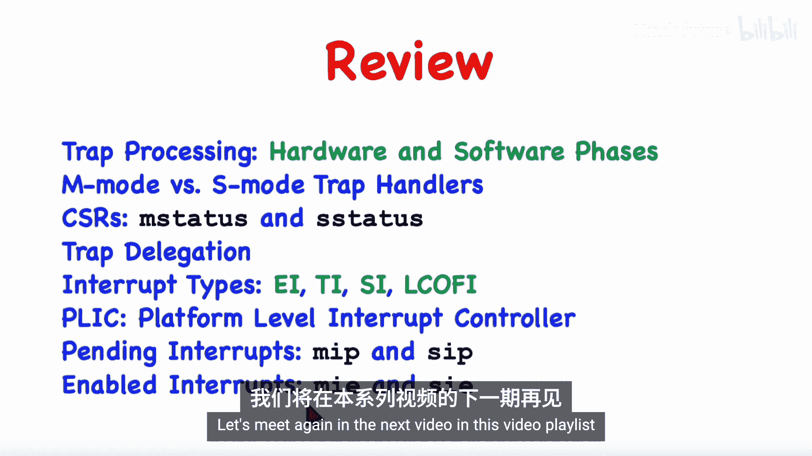

# 012：异常、中断与PLIC

在本节课中，我们将深入学习RISC-V架构中的陷阱处理机制。我们将详细探讨异常与中断的区别，介绍平台级中断控制器，并解释如何将中断和异常从机器模式委托给监管者模式处理。同时，我们也会讲解如何全局或单独地启用或禁用中断。

## 陷阱处理回顾

上一节我们介绍了不同的特权级别以及陷阱处理的基本流程。本节中，我们将更深入地探讨陷阱处理，并区分机器模式与监管者模式下的陷阱处理。

当陷阱发生时，正在执行的代码会被挂起，并调用陷阱处理程序。每个陷阱处理程序要么在监管者模式下运行，要么在机器模式下运行。

## 机器模式与监管者模式陷阱处理

之前我们主要关注异常，但本节将更多地讨论中断。我们将概述平台级中断控制器，并讨论中断和异常如何从机器模式委托给监管者模式。

陷阱处理程序在监管者模式下运行时，只能访问监管者模式的控制和状态寄存器，无法访问机器模式的CSR。这些寄存器对监管者模式是不可见的。运行在监管者模式下的陷阱处理程序只能处理发生在用户模式或监管者模式下的中断和异常。

在陷阱发生的瞬间，硬件会执行几个动作。首先，硬件会保存先前的处理器状态，包括程序计数器、特权模式和中断启用位。接着，模式会切换到监管者模式。最后，会跳转到陷阱处理软件例程的开头。陷阱处理程序最终通过执行 `SRET` 指令结束，该特权指令会恢复先前的特权级别并返回到被挂起的代码。

本节将同时讨论机器模式和监管者模式。虽然之前讨论了监管者模式陷阱，但有些陷阱将由运行在机器模式下的陷阱处理程序处理。机器模式陷阱的处理方式与监管者模式陷阱基本相同。

那么，是什么决定了一个特定的中断或异常是由监管者模式还是机器模式陷阱处理程序处理呢？我们将在本节后面讨论这个问题，但有一点可以明确：在机器模式下运行时发生的陷阱，总是由机器模式陷阱处理程序处理。

实际的陷阱处理过程非常相似。同样，当陷阱发生时，硬件首先保存处理器状态，然后从当前模式切换到机器模式，并跳转到机器模式陷阱处理程序。在处理程序中，代码可以访问机器模式和监管者模式的控制和状态寄存器。处理程序最终通过执行 `MRET` 指令结束，该指令与 `SRET` 指令非常相似。

## 控制与状态寄存器

RISC-V最多支持4096个控制和状态寄存器，因此使用12位地址来寻址各个CSR。有些寄存器是只读的，而其他寄存器也可以被更新。寄存器的模式也很重要。例如，用户CSR可以在任何当前特权级别下访问，而监管者CSR只能在监管者或机器模式下访问。最后，机器模式CSR只能由运行在机器模式下的代码访问。

RISC-V还有几条用于访问控制和状态寄存器的指令。例如，我们有 `CSRRS`（CSR读置位）和 `CSRRC`（CSR读清零）指令来分别读取和修改CSR。当前模式决定了给定操作是否被允许。在机器模式下，我们拥有最高特权，可以访问任何类型的寄存器；而在用户模式下，只能访问用户模式CSR。例如，在监管者模式下运行时，如果代码试图读取机器模式的控制和状态寄存器，或试图更新只读寄存器，则会触发非法指令异常。

## MSTATUS与SSTATUS寄存器

这是 `MSTATUS` 寄存器，它包含许多位字段。该寄存器及其字段只能在机器模式下访问。然而，其中一些字段也需要在监管者模式下可访问。为了满足这一点，有一个单独的寄存器叫做 `SSTATUS`。因此，有些位是共享的，它们同时存在于两个寄存器中。我们可以说这些位是镜像的，底层只有一个副本。该字段可以通过访问 `MSTATUS` 寄存器或 `SSTATUS` 寄存器来读取或修改。

以下是镜像并在监管者模式下可访问的位。其他位在读取 `SSTATUS` 时是不可见的，它们会显示为零，任何修改它们的尝试都会被硬件忽略。

之前，当我们描述监管者模式下如何处理陷阱时，我们看了这三个位：中断启用位、先前中断启用位和先前特权模式。这些位在发生需要由监管者模式处理的陷阱时使用。

但是，当陷阱需要由运行在机器模式下的陷阱处理程序处理时，我们有三个不同但相似的字段：中断启用位、先前中断启用位和先前特权模式，但这些都针对机器模式。请注意，先前特权字段现在是2位而不是1位，因为当我们用机器模式陷阱处理程序处理陷阱时，先前的特权级别可能是用户、监管者或机器模式。

## 陷阱处理流程详解

陷阱处理包括硬件阶段和软件阶段。这里展示的是当发生监管者级别陷阱且陷阱处理程序在监管者模式下运行时的情况。下一张幻灯片将展示机器级别陷阱且处理程序在机器模式下运行的情况。两者非常相似。

当异常或中断发生时，硬件首先保存当前状态。具体来说，它保存特权级别和中断启用位的先前值，然后通过将中断启用位改为0来禁用中断。这些都是监管者级别的操作。它还将原因寄存器设置为一个代码编号，以指示发生了何种陷阱，并将程序计数器保存在 `SEPC` 中。最后，它将程序计数器设置为先前存储在 `STVEC` 控制和状态寄存器中的值。这通常是监管者级别陷阱处理程序第一条指令的地址。

因此，监管者级别陷阱处理程序将开始运行，它首先保存寄存器，然后处理陷阱，查看原因代码寄存器以确定陷阱类型及需要采取的措施。处理完陷阱后，它将通过恢复寄存器并最终执行 `SRET` 指令返回。`SRET` 指令会将中断启用位恢复为保存的值，将操作模式恢复为先前的特权级别，并将程序计数器设置为保存在 `SEPC` 寄存器中的值。

当我们查看机器模式下发生的情况时，会发现它非常相似。唯一的区别在于使用了哪些位和哪些寄存器。当发生机器级别陷阱时，即需要由运行在机器模式下的陷阱处理程序处理时，会发生完全相同的事情。唯一的区别是使用了 `MSTATUS` 寄存器，以及我们有 `MCAUSE`、`MEPC`、`MTVEC` 和 `MSCRATCH` 寄存器。同样，我们保存状态，但这次是将状态保存在 `MSTATUS` 寄存器中，并将机器模式下的中断启用位改为零。我们设置原因寄存器、EPC寄存器，然后跳转到机器模式陷阱处理程序。`MTVEC` 指向机器模式陷阱的处理程序。同样，它保存寄存器，根据原因代码寄存器的当前值处理陷阱，恢复寄存器，最后执行 `MRET` 指令。同样，这几乎与 `SRET` 指令相同，只是它使用 `MSTATUS` 寄存器中的值，并将PC恢复为保存在 `MEPC` 寄存器中的值。

## 陷阱处理模式的决定因素

接下来的问题是，究竟是什么决定了陷阱是在监管者模式还是机器模式下处理？如果核心甚至没有实现监管者模式，那么所有陷阱显然都将在机器模式特权级别处理。否则，决定权在于机器模式代码。我们说机器模式可以将部分或全部陷阱委托或卸载给监管者模式。接下来，我们将讨论这种委托是如何工作的。

首先，正如我们所看到的，监管者模式和机器模式都有自己私有的寄存器集，用于陷阱处理。监管者模式陷阱将使用第一行中的寄存器，而机器模式陷阱将使用名称以M开头的寄存器。此外，还有几个机器模式控制和状态寄存器，一个用于异常委托，一个用于中断委托。这些是名为 `MEDELEG` 和 `MIDEL` 的机器模式控制和状态寄存器。通常，它们由启动时运行的机器代码初始化，并且在初始化后通常永远不会更改。

当陷阱发生时，硬件会查询这些委托寄存器，以确定该陷阱是应该调用监管者模式还是机器模式陷阱处理程序。

总结一下，如果陷阱发生在核心在监管者模式或用户模式下执行时，默认情况下，它将由运行在机器模式下的陷阱处理程序处理。但是，陷阱可以被选择性地委托，如果被委托，则该陷阱将由运行在监管者模式级别的陷阱处理程序处理。另一方面，在机器模式下运行时发生的所有陷阱都将由机器模式级别的陷阱处理程序处理。

## 异常委托寄存器

这是异常委托寄存器 `MEDELEG` 的布局。我们有多种不同类型的异常。例如，可能有非法指令异常或加载页错误异常等。对于每种不同的异常类型，该寄存器中都有一个对应的位。

如前所述，如果异常发生在机器模式下执行时，那么它总是由运行在机器模式下的陷阱处理程序处理。但是，如果异常发生在用户或监管者模式下执行时，硬件将查询该寄存器，并查看与实际发生的异常对应的位。如果该位为0，则硬件将调用运行在机器模式下的陷阱处理程序；但如果为1，则异常将被委托，硬件将调用运行在监管者模式下的陷阱处理程序。

这些位位置正好对应于异常代码编号。这里列出了所有异常及其对应的代码编号，这是异常发生时将存储在原因寄存器中的代码。

当执行 `ECALL` 指令时，它可能引发这三种异常中的任何一种。如果在用户模式下执行，它引发此异常；在监管者模式下执行，引发此异常；如果在机器模式下执行，则是代码11。然而，如果在机器模式下执行 `ECALL`，那么陷阱处理程序将在机器模式下执行，它永远不能被委托。所以在之前的图中，这就是为什么这个位是绿色的，这个位在 `MEDELEG` 寄存器中不使用。

## 委托机制的使用场景

以下是我对运行Linux等操作系统的RISC-V系统如何使用异常委托机制的最佳猜测。

Linux内核将在监管者模式下运行，而机器模式仅用于初始化和可能的安全启动。用户模式下可能发生的所有类型的异常都需要委托给监管者模式，以便操作系统内核能够处理它们。这将包括加载、存储和指令获取的问题。

来自用户空间的系统调用需要调用内核例程，因此在用户模式下遇到的 `ECALL` 将被委托给监管者模式。为了支持使用断点指令调试用户程序，该异常也将被委托。

正如我们所说，来自机器模式的 `ECALL` 不能被委托。我的猜测是，运行在机器模式下的代码首先根本不需要执行 `ECALL` 指令。

至于硬件错误，我认为调用机器模式代码是合理的，例如，可能只是重新启动操作系统。来自监管者模式的 `ECALL` 可能不会被委托。这将允许运行在监管者级别的内核向机器模式代码发出请求。例如，内核可能通过执行 `ECALL` 指令请求机器模式代码重新启动。

## 中断委托

中断也可以以类似于异常的方式委托。这是中断委托寄存器 `MIDEL`。有几种中断源，例如，设备可以发出称为外部中断的信号。对于每种来源，都有一个对应的位来指示是否要委托。

如果中断发生在机器模式，当然不能被委托，并且总是调用机器模式陷阱处理。否则，当中断发生时，硬件将检查该寄存器以确定是调用监管者模式还是机器模式陷阱处理程序。如果该位为1，则中断被委托给将在监管者模式下运行的代码。

基本上有四种类型的中断。每当I/O设备需要关注时，它就会引发或发出外部中断。定时器中断更偏向于核心内部。定时器中断被操作系统内核用于实现时间片。我们还有所谓的软件中断。软件中断可以直接由代码引发，而不是由I/O设备引发，它可能被一个核心用来唤醒另一个核心，或者在该核心需要引起注意时发出信号。最后，核心可能实现许多硬件性能监控计数器。如果其中一个溢出，则会发生本地计数器溢出中断。

## 中断类型与编号

现在，让我解释一些缩写并介绍中断的编号系统。

这里有四种潜在的中断源：软件中断、定时器中断、外部中断和本地计数器溢出中断。这三种类型的中断实际上各有两种形式，称为监管者模式和机器模式。据我理解，这种监管者模式与机器模式的区别，与中断发生时的特权级别或中断处理程序将运行的模式关系不大。每种中断都可以根据需要在机器模式下处理或委托给监管者模式。

监管者模式软件中断可以由运行在监管者模式或机器模式下的代码引发，而机器模式软件中断只能由运行在机器模式下的代码引发。我们有两个不同的定时器。一个将引发监管者模式定时器中断，另一个将引发机器模式定时器中断。机器模式定时器是不可见的，运行在监管者级别的代码无法看到。

至于设备引发哪种类型的外部中断，这取决于布线方式，我稍后会讨论。

现在让我们看看缩写和相应的代码编号。这些正是我之前展示的 `MIDEL` 寄存器中的位编号。实际上，更像是这样。我猜在一个典型的RISC-V系统中，所有监管者模式中断都将被委托，而机器模式中断都不会被委托。

## 平台级中断控制器

接下来，我想介绍并简要描述平台级中断控制器。假设我们有许多核心和许多I/O设备。PLIC本身也是一个硬件设备，其目的是仲裁中断，因此它将是实际在各个核心引发外部中断的设备。

PLIC是一个设备，像每个设备一样，它是内存映射的。这意味着核心可以通过使用内存地址来更新和与设备通信。例如，PLIC必须在启动时初始化，以便它知道如何处理各种中断。

因此，当设备想要中断时，它不直接中断核心。相反，它与PLIC通信，然后PLIC将决定需要通知哪个或哪些核心，并通过在这些核心中引发外部中断来通知它们。这些核心将运行中断处理程序。中断处理程序做的第一件事就是与PLIC通信以认领中断。它基本上是对PLIC说：“我来处理这个中断。”其他核心可能同时尝试认领该中断，但只有一个会成功，其他核心将放弃并返回它们正在做的事情。

因此，认领了中断的核心将运行中断处理程序直至完成，直接通过内存映射地址与I/O设备通信。完成后，它将通知PLIC该中断已完成，我们说该中断已退休。因此，中断处理程序将通过通知PLIC中断现已退休而结束。此时，来自同一设备的新中断可以被重新处理，循环可以重新开始。

## PLIC操作流程

当平台级中断控制器在某个核心引发外部中断时会发生什么？这由几个控制和状态寄存器控制。对于每种中断类型，例如外部中断，有两个位：一个是挂起位，一个是启用位。为了发出中断信号，硬件强制挂起位为1。但陷阱处理程序可能不会立即被调用。相反，中断可以被屏蔽。换句话说，中断要么被启用，要么被禁用。如果它们被启用，陷阱处理程序会立即被调用；如果被禁用，中断变为挂起状态，导致陷阱处理程序延迟到以后。

中断是被处理还是变为挂起状态，由全局中断启用位和中断特定的启用位共同控制。全局中断启用位就是状态寄存器中的中断启用位。每种中断类型都有自己的启用位。当陷阱被发出信号时，要么清除挂起位并发生陷阱处理，要么如果这两个位中的任何一个被禁用，则陷阱保持挂起状态。中断将保持挂起状态，直到调用处理程序或挂起位被外部降低，例如当其他核心已认领中断且在此核心上调用陷阱处理程序的需要不再存在时，由PLIC本身降低。

让我用这张图来描述平台级中断控制器的操作。

我们有几个核心、主内存、几个设备，包括PLIC本身。我们假设核心使用内存映射I/O与设备和PLIC通信。因此，这里有某种共享总线，核心可以通过直接使用内存地址读取和修改寄存器来与设备和PLIC通信。这些虚线表示从设备到PLIC的中断请求线。因此，当设备需要关注时，它会拉高这条线。这边的线表示PLIC使外部中断在各个核心挂起的能力，即引发外部中断并使其变为挂起状态。

因此，初始化期间需要做的第一件事是初始化PLIC。PLIC将包含一些配置寄存器等，它会告诉哪些设备应该中断哪些核心以及优先级等。因此，在某个核心使用内存映射I/O初始化PLIC之后，我们开始执行。

假设在某个时间点，某个设备需要关注，因此它拉高中断请求线并通知PLIC。PLIC将查询其配置寄存器等，并确定需要中断哪些核心。有些核心可能能够处理此设备，因此需要中断它们，而其他核心可能无法处理此设备，或者由于其他原因，PLIC可能被配置为当此设备请求中断时不应通知那些核心。

因此，PLIC将向其中一些核心发出外部中断信号，如图所示。实际上，我只显示了一条线，但PLIC可能发出监管者级别外部中断或机器级别外部中断，发出哪种信号可能由启动时在PLIC内初始化的配置参数决定。

但无论如何，其中一个核心将被中断。因此，假设这里的核心是第一个运行其陷阱处理程序的，它将使用内存映射I/O联系PLIC，声明它认领此中断。然后，PLIC很可能会降低到其他核心的外部中断线，即虽然它最初使外部中断在此核心挂起，但它会降低该挂起线并使挂起位为零，这意味着尚未有机会服务中断的核心将根本不会被中断，它可以继续做它正在做的其他事情。

好的，这个核心现在已经认领了中断，所以现在它需要处理设备，它将使用内存映射I/O来做到这一点，因此它将读取和修改I/O设备中的寄存器并执行任何必要的操作。

假设当所有这些发生时，其他设备也在请求中断。PLIC是一种多任务硬件，因此它可以处理这些，并且可能同时通知其他核心。因此，这些可以独立认领，也许它可能通知这个核心，这两个其他设备正在请求关注。但无论如何，这与我们感兴趣的设备和中断大致同时并发进行。

因此，在未来的某个时间，这个核心将完全处理完中断，然后它将停止与设备的通信，并且还将通过内存映射I/O通知PLIC此中断现已退休，因此我们回到起始情况。

## 中断挂起与启用寄存器

最后，我们可以展示挂起位和启用位。指示中断是否挂起的位位于名为 `MIP` 的机器模式控制和状态寄存器中。指示中断是否启用的位位于名为 `MIE` 的寄存器中。正如您所见，位布局与名为 `MIDEL` 的中断委托寄存器完全相同。每种中断类型都有一个位，因此我们有软件中断、定时器中断和外部中断。我们既有机器模式中断的位，也有监管者模式中断的位，还有一个用于本地计数器溢出中断的位。

挂起位的字段名称都以P结尾，启用位的字段名称都以E结尾。这两个寄存器只能由运行在机器模式下的代码访问。

可以通过将挂起位之一设置为1来发出中断信号。这可以直接由软件完成，也可能由硬件完成。例如，平台级中断控制器可以设置外部中断的挂起位，定时器将设置定时器中断位。这些寄存器中的一些位也可以由运行在监管者模式下的代码读取和更新。

`MIP` 和 `MIE` 是机器模式寄存器。为了便于这一点，还有两个额外的控制和状态寄存器在监管者模式下可访问。这些寄存器名为 `SIP` 和 `SIE`。可以在监管者模式下读取或写入的位是监管者模式中断，以及本地计数器溢出中断。这些位是镜像的，换句话说，对于同时出现在两个寄存器中的字段只有一个位，并且该位可以通过任一方式访问。

现在我的假设是，通常一个RISC-V系统会在启动时将所有监管者模式中断委托给监管者模式处理。机器模式中断通常不会被委托，并且总是由运行在机器模式下的陷阱处理程序处理。然而，委托寄存器中存在允许委托机器模式中断的位表明，通用的RISC-V设计具有一定的灵活性，可以以我们可能意想不到的方式使用。

## 中断屏蔽

我想再谈一点关于中断屏蔽的内容。我们已经在刚刚描述的 `MIE` 和 `SIE` 寄存器中有了位，可以选择性地启用和禁用个别类型的中断，但现在我想关注全局中断启用位，这里我指的是 `MSTATUS` 寄存器中的 `MIE` 位和 `SSTATUS` 寄存器中的 `SIE` 位。

顺便说一下，这些位的名称在这里是大写的，但具有相似名称的寄存器 `MIE` 和 `SIE` 是用小写名称书写的。

当核心在用户模式下执行时，这些全局位被忽略。中断不能被禁用，陷阱处理总是会发生。陷阱处理程序将在监管者模式或机器模式下运行，取决于它是否被委托。

当核心在监管者模式下执行时，取决于陷阱发生在监管者模式还是机器模式，即陷阱处理程序将在监管者模式还是机器模式下运行。机器模式陷阱永远不会被屏蔽，这些陷阱总是会被处理。监管者模式代码将被挂起，陷阱处理程序将在机器模式下运行。然而，监管者模式陷阱可以被禁用，因此 `SIE` 位控制监管者模式代码是否可以被也将运行在监管者模式下的陷阱处理程序中断。

最后，当核心在机器模式下执行时，所有监管者模式陷阱都被禁用。机器模式代码不会被中断以运行监管者模式代码。然而，机器模式陷阱可能被接受也可能不被接受，这由 `MSTATUS` 寄存器中的 `MIE` 位决定。

## 总结

本节课我们涵盖了许多相当复杂的材料。首先，我们回顾了当中断或异常发生时，硬件和软件阶段的处理过程。我们看到陷阱可以由机器模式陷阱处理程序或监管者模式陷阱处理程序处理。机制非常相似，只是使用不同的寄存器集。

我们查看了 `MSTATUS` 寄存器，发现有些字段在监管者模式下也可访问，这是通过将这些位镜像到 `SSTATUS` 寄存器中实现的。然后，我们看到了异常和中断如何从机器模式委托给运行在监管者模式下的陷阱处理程序处理。我们还讨论了四种不同类型的中断：外部中断、定时器中断、软件中断和本地计数器溢出中断。

我们还介绍了平台级中断控制器，它是核心外部的一个设备，接收来自各种I/O设备的中断，并将其引导到特定核心，在那里它们导致外部中断变为挂起状态。最后，我们讨论了用于指示哪些中断挂起和哪些中断启用的寄存器。

好的，如果您一直跟随到这里，非常感谢您的观看。让我们在下个视频中再见。

