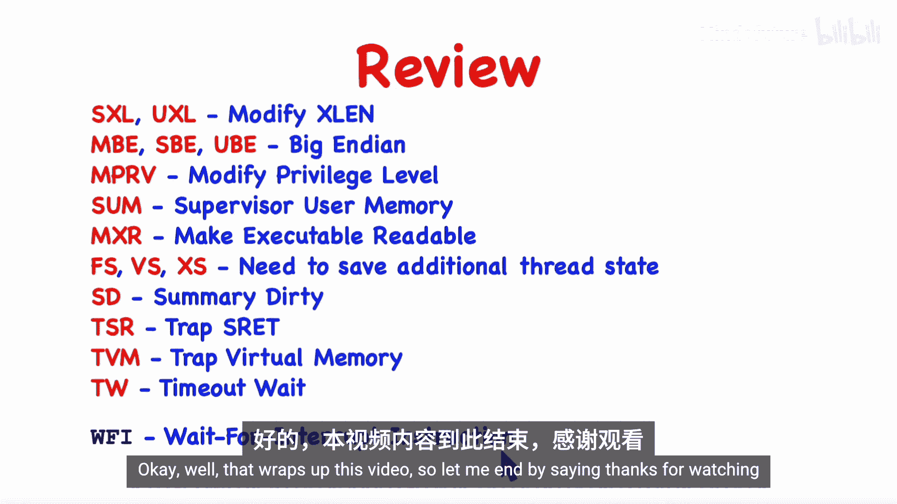

# 013：mstatus与sstatus寄存器详解 🧠

在本节课中，我们将深入学习RISC-V架构中的`mstatus`和`sstatus`状态寄存器。我们将详细探讨除了陷阱处理之外的所有剩余字段，包括控制寄存器大小、字节序、虚拟内存访问以及加速上下文切换的机制。这些知识对于理解处理器如何管理不同特权模式下的状态至关重要。

---

## 寄存器概述

RISC-V架构中存在两个版本的状态寄存器：`mstatus`（机器模式状态）和`sstatus`（监管者模式状态）。`sstatus`包含了监管者模式代码（通常是操作系统内核）所需的字段，并且只能在监管者模式下访问。`mstatus`则包含了所有这些字段以及一些额外的字段，并且只能在机器模式下访问。

在之前的课程中，我们讨论了陷阱处理，并介绍了图中标红的字段。当发生监管者模式陷阱时，硬件会将中断使能位（`SIE`）清零以禁用中断，同时将`SIE`的先前值保存在`SPIE`字段中，并设置`SPP`字段为之前的特权级别。对于机器模式陷阱，则使用`MIE`、`MPIE`和`MPP`字段，其工作原理相同。

---

## 寄存器大小控制字段：SXL与UXL

`mstatus`寄存器中的`SXL`和`UXL`字段用于控制代码在监管者模式和用户模式下看到的寄存器大小。RISC-V规范支持32位（RV32）、64位（RV64）甚至128位（RV128）核心。寄存器实际大小由机器模式决定（`MXLEN`），但可以通过这些字段为运行在更低特权级的代码“缩小”寄存器视图。

*   **`SXL` (Supervisor XLEN)**： 控制监管者模式下代码看到的寄存器大小。只能由机器模式代码修改。
*   **`UXL` (User XLEN)**： 控制用户模式下代码看到的寄存器大小。可以由机器模式或监管者模式代码修改。

寄存器大小只能缩小，不能放大。必须始终满足：**`MXLEN >= SXLEN >= UXLEN`**。

`SXL`和`UXL`字段均为2位，编码如下：
*   `00`: Reserved
*   `01`: 32位 (RV32)
*   `10`: 64位 (RV64)
*   `11`: 128位 (RV128)

此功能允许为32位机器编写的软件无需修改即可在64位机器上运行。但请注意，具体核心可能并未实现此功能。

---

## 字节序控制字段：MBE、SBE与UBE

RISC-V核心默认是小端序（Little-Endian）机器。指令取指始终使用小端序且不可更改。然而，对于加载（Load）和存储（Store）操作，核心可能提供选项。

状态寄存器中的三个位控制加载和存储指令的行为：
*   **`MBE`**： 控制机器模式下执行的加载/存储操作。若为1，则使用大端序（Big-Endian）。
*   **`SBE`**： 控制监管者模式下执行的加载/存储操作。
*   **`UBE`**： 控制用户模式代码的加载/存储操作。

`MBE`和`SBE`仅存在于`mstatus`寄存器中，这意味着机器模式和监管者模式代码的字节序只能由机器模式代码改变。内核（运行在监管者模式）获得机器模式代码赋予的字节序，自身无法更改。但是，内核可以为其运行的应用程序进程设置为大端序模式。

与改变寄存器大小一样，此灵活的字节序功能可能并未在您的核心上实现，这些位可能被硬连线为0，核心始终为纯小端序。

---

## 内存访问权限字段：MPRV、SUM与MXR

上一节我们了解了如何控制数据访问的字节序，本节我们来看看几个用于在特定场景下调整内存访问权限的字段。

以下是这些字段的详细说明：

*   **`MPRV` (Modify Privilege Level)**：
    *   **问题**： 当机器模式陷阱处理程序需要模拟一条（例如，用户模式下发出的）未对齐加载指令时，它需要使用虚拟地址。但机器模式下通常不进行页表转换。
    *   **解决方案**： 设置`MPRV=1`。此后，任何加载/存储指令将按照陷阱发生时保存的先前特权级别（`MPP`字段）来执行，就好像处理器正运行在那个模式一样，从而可以使用虚拟地址和页表。陷阱返回后，此位自动清零。

*   **`SUM` (Supervisor User Memory)**：
    *   **问题**： 页表中的页面被标记为用户（U）页面或监管者页面。默认情况下，运行在监管者模式的内核无法访问用户页面，这增强了安全性。但在系统调用时，内核可能需要读写用户虚拟地址空间中的参数或结果。
    *   **解决方案**： 临时设置`SUM=1`，允许内核（运行在监管者模式）读写标记为用户（U）的页面。这需要内核的地址映射能够同时涵盖内核代码和用户数据区，在32位地址空间受限的情况下可能存在挑战。

*   **`MXR` (Make eXecutable Readable)**：
    *   **问题**： 当内核需要模拟一条用户模式指令时，首先需要读取该指令。但包含该指令的页面可能只标记为可执行（X），而不可读（R）。
    *   **解决方案**： 设置`MXR=1`。此后，内核可以从仅标记为可执行（X）的页面加载数据，而不会引发页面错误异常。内核可能会长期保持此位为1。

---

## 上下文切换加速字段：FS、VS、XS与SD

在多任务操作系统中，内核需要在不同进程（上下文）之间切换。切换时需要保存和恢复进程的状态。为了加速此过程，RISC-V提供了状态跟踪字段，使得内核可以仅保存和恢复实际被修改过的状态。

这些字段的工作原理类似，我们以`FS`字段（跟踪浮点寄存器状态）为例进行说明。`FS`是一个2位字段，其编码定义了四种状态：

1.  **`Off` (00)**： 浮点寄存器未被使用。任何访问尝试将引发异常。
2.  **`Initial` (01)**： 进程已声明将使用浮点寄存器，但尚未使用。寄存器内容为初始值（如零）。内核需要在时间片开始时初始化它们，但结束时无需保存。
3.  **`Clean` (10)**： 寄存器在上一个时间片被修改过（“脏”），但在当前时间片尚未被修改。内核需要在时间片开始时从保存的值中恢复它们，但当前时间片结束时无需再次保存（值未变）。
4.  **`Dirty` (11)**： 寄存器在当前时间片已被修改。内核需要在时间片开始时恢复它们，并在时间片结束时保存它们。

硬件会监控对浮点寄存器的写操作，并据此自动更新`FS`字段的状态。这样，对于大多数不使用浮点寄存器的程序，内核可以完全避免保存/恢复这些寄存器带来的开销。

*   **`VS`字段**： 以相同方式跟踪向量（Vector）寄存器的状态。
*   **`XS`字段**： 用于跟踪任何其他非标准（实现定义）扩展状态的状态。
*   **`SD`字段**： 这是一个只读的摘要位（Summary Dirty）。当`FS`、`VS`或`XS`中任何一个字段表明状态为`Dirty`或`Clean`（即非`Off`且非`Initial`）时，`SD`位被置1。内核可以通过快速检查`SD`位（它位于寄存器的最高位）来判断在上下文切换时是否有任何额外状态需要处理，从而优化常见情况（无需处理）下的性能。

---

## 虚拟机监控程序支持字段：TSR、TVM与TW

RISC-V架构支持虚拟机监控程序（Hypervisor），它是一种运行在机器模式的“超级监督者”，可以托管多个运行在监管者模式的客户操作系统（Guest OS）。为了支持这种虚拟化，需要控制客户操作系统对某些关键操作的访问。

以下是相关的控制位：

*   **`TSR` (Trap SRET)**：
    *   当客户操作系统（监管者模式）执行`SRET`指令准备返回到用户模式时，虚拟机监控程序可能需要介入。
    *   设置`TSR=1`会导致`SRET`指令引发一个机器模式陷阱，从而使虚拟机监控程序获得控制权。

*   **`TVM` (Trap Virtual Memory)**：
    *   客户操作系统拥有自己的页表，但虚拟机监控程序需要管理物理内存的分配和隔离，防止客户操作系统访问不属于它的内存。
    *   设置`TVM=1`会导致任何尝试写入`SATP`寄存器（页表基址寄存器）的操作引发陷阱，让虚拟机监控程序能够检查和批准新的页表配置。

*   **`TW` (Timeout Wait)**：
    *   RISC-V提供了`WFI`（Wait For Interrupt）指令，使硬件线程进入低功耗休眠状态，直到中断发生。
    *   在虚拟化环境中，一个客户操作系统执行`WFI`可能只是因为其当前无任务可做，但其他客户操作系统可能任务繁忙。我们不希望硬件线程因此闲置。
    *   设置`TW=1`会导致在监管者模式执行`WFI`指令时引发一个机器模式陷阱。虚拟机监控程序可以接管并决定是否真的让硬件线程休眠，或是切换到其他客户操作系统。

---

## 低功耗指令：WFI

`WFI`（Wait For Interrupt）指令没有操作数。当执行此指令时，处理器会暂停当前硬件线程的指令执行，并可能进入低功耗状态以节省能耗（例如在移动设备上节省电池）。当中断（如定时器中断、I/O中断）发生时，处理器会唤醒并执行相应的陷阱处理程序。

在多核系统中，`WFI`只暂停执行它的那个特定硬件线程。此指令的具体行为取决于实现，它可能确实使核心进入低功耗状态，也可能被实现为空操作（NOP）。在虚拟化环境中，其行为受上述`TW`位控制。

---

## 总结

本节课我们一起深入学习了RISC-V架构中`mstatus`和`sstatus`状态寄存器的各个字段。我们了解了如何通过`SXL`和`UXL`字段控制监管者和用户模式下的寄存器视图大小。探讨了通过`MBE`、`SBE`和`UBE`字段控制数据访问的字节序。学习了`MPRV`、`SUM`和`MXR`字段如何为陷阱处理程序和内核提供特殊的内存访问权限。掌握了`FS`、`VS`、`XS`和`SD`字段如何通过跟踪状态使用情况来显著加速上下文切换过程。最后，我们简要介绍了为支持虚拟机监控程序而设计的`TSR`、`TVM`和`TW`字段，以及用于降低功耗的`WFI`指令。理解这些状态位对于编写高效的系统软件和深入理解RISC-V处理器管理机制至关重要。