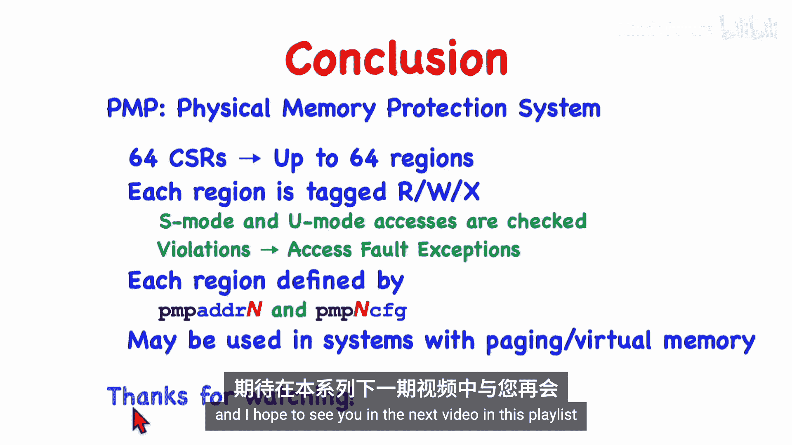

# 015：PMP物理内存保护系统

## 概述

在本节课程中，我们将学习RISC-V架构中的物理内存保护系统。该系统允许运行在机器模式下的代码对地址空间的特定区域施加访问权限和约束，从而保护主内存、只读内存以及内存映射的I/O设备。

## 物理内存保护系统简介

物理内存保护系统通过将地址空间划分为多个区域，并对每个区域施加读、写和/或执行权限来实现保护。运行在监管模式或用户模式下的内核及其他代码的访问会受到检查，任何违规操作都会导致访问错误异常。

上一节我们介绍了特权模式的基本概念，本节中我们来看看如何利用PMP机制实现内存访问控制。

## PMP的应用场景

以下是PMP系统的一些典型应用场景：

*   **托管多个操作系统**：运行在机器模式下的虚拟机监控程序可以同时托管多个运行在监管模式下的客户操作系统。PMP可以限制每个操作系统只能访问特定区域，确保它们互不干扰。
*   **实现安全启动**：PMP可用于保护启动代码和关键配置区域。
*   **构建实时操作系统**：在需要确定性的实时系统中，PMP可以替代或补充虚拟内存分页机制，提供内存隔离。
*   **增强安全基础设施**：保护内核代码和数据区域，防止恶意软件篡改或执行非授权代码。

## PMP与虚拟内存分页的区别

需要明确的是，物理内存保护机制与虚拟内存分页机制是两个不同的概念。一个特定的RISC-V系统可能同时实现两者，也可能只实现其一，而一些简单的系统可能两者都不提供。

分页机制由运行在监管模式下的内核管理，用于实现虚拟内存。而PMP机制由机器模式代码配置，用于在物理地址空间层面施加访问限制。

## PMP的工作原理

为了理解PMP，我们首先需要了解系统的物理地址空间布局。硬件平台会有一个物理地址映射，其中部分地址对应主内存，部分对应只读内存，还有部分映射到各种I/O设备。

PMP系统将整个物理地址空间划分为多个区域。机器模式代码可以为每个区域设置标签，例如标记为不可访问、只读、可读写或可执行等。

例如，机器模式代码可以将其自身所在的区域、只读内存以及某些设备标记为内核不可访问。任何来自内核或用户代码对这些区域的访问尝试都会被禁止并引发异常。

## PMP寄存器组

PMP方案通过一组控制和状态寄存器来实现。每个受保护区域对应一个物理内存保护地址寄存器和一个物理内存保护配置寄存器。

配置寄存器只有8位，其中包含读、写和执行权限位，以及一个锁定位和一个地址匹配模式字段。一个RISC-V系统最多可以容纳64个这样的区域。

寄存器命名需要注意：地址寄存器以数字结尾，而配置寄存器则将数字放在中间。例如，地址寄存器名为 `pmpaddr0`，而对应的配置字节名为 `pmp0cfg`，它被打包在名为 `pmpcfg0` 的CSR寄存器中。

## 区域边界定义

区域的边界由地址寄存器中的值指定。每个区域从前一个区域的结束地址开始，延伸到其自身地址寄存器所包含的地址。

更精确地说，地址寄存器N指向区域N的末尾，即包含该区域之后第一个字的地址。第一个区域从地址0开始，延伸到 `pmpaddr0` 寄存器包含的地址。

对于32位RISC-V核心，PMP地址寄存器是32位大小。但由于支持分页，物理地址最多可达34位。PMP区域必须至少是字对齐的，因此任何地址的最后两位必须为0。这意味着32位的地址寄存器实际上隐含了额外的两位0，从而能够支持34位的物理地址。

## 配置寄存器详解

在32位RISC-V核心上，所有CSR都是32位大小。为了容纳64个区域的配置字节，需要将4个配置字节打包到一个CSR寄存器中。因此，总共需要16个CSR寄存器。

每个配置字节包含以下关键字段：
*   **R（读）**、**W（写）**、**X（执行）**：权限位。
*   **A**：2位的地址匹配模式字段。
*   **L**：锁定位。

当代码在监管模式或用户模式下尝试访问内存（通过加载、存储或取指）时，硬件会检查对应的权限位。如果相应位为0，则操作不会执行，并会触发访问错误异常。

## 地址匹配模式

地址匹配模式字段决定了如何解释对应的地址寄存器来定义区域范围。

*   **`A=0` (OFF)**：该区域被禁用。
*   **`A=1` (TOR)**：顶地址模式。这是我们之前描述的模式，区域N的范围是从 `pmpaddr[N-1]` 到 `pmpaddr[N]`。
*   **`A=2` (NA4)**：自然对齐的4字节区域。区域大小固定为4字节，地址寄存器包含要保护的字地址（最后两位隐含为0）。适用于保护单个I/O设备寄存器。
*   **`A=3` (NAPOT)**：自然对齐的2的幂次方区域。区域大小是2的幂（从8字节开始）。地址寄存器中的值同时编码了区域的起始地址和大小。硬件通过查找从最低位开始的第一个0的位置来确定区域大小，并将该位置及更低位的所有比特置零以得到对齐的起始地址。

## 锁定机制

之前我们忽略了锁定位，假设它为0（未锁定）。当区域未锁定时，监管模式和用户模式的访问会被检查，而机器模式的访问总是被允许，且对应的地址和配置寄存器可以被机器模式代码修改。

一旦锁定位被设置，情况将完全不同：
1.  地址寄存器和配置字节被固定，即使是机器模式代码也无法更改。它们将保持锁定状态直到下一次系统复位。
2.  对于已锁定的区域，**机器模式**下的访问也会像监管模式和用户模式一样受到权限检查。

锁定功能可以用于在需要运行非受信机器模式代码时，保护关键代码或知识产权软件不被读取或修改。

## 粒度大小

到目前为止，我们假设的粒度大小是4字节（一个字），即所有地址必须字对齐，区域大小是4字节的倍数。但有些系统可能不支持如此精细的控制。

系统的粒度可能更大，例如256字节。在这种情况下：
*   所有地址必须对齐在256字节边界上。
*   每个区域的大小必须是256字节的倍数。
*   地址匹配模式 `A=2` (NA4) 将不被允许，因为系统不支持那么小的区域。

可以通过软件方式探测系统的粒度大小：将一个PMP配置字节设置为TOR模式，向对应的地址寄存器写入全1，然后读回该值。硬件会强制将低阶位置零以对齐，通过检查被置零的比特位数，可以推断出粒度大小。

## 访问检查规则

硬件在每次监管模式或用户模式下的加载、存储或取指操作时，都会按顺序检查PMP寄存器。第一个匹配访问地址的区域将决定该访问的权限。

如果访问的地址不在任何已定义的区域内，则该访问被视为违规。

PMP寄存器都是机器模式寄存器，只能由运行在机器模式下的代码读取或修改。

## 总结

本节课我们一起学习了RISC-V的物理内存保护系统。我们了解到：
*   PMP通过一组机器模式CSR将物理地址空间划分为多个区域，并为每个区域设置读、写、执行权限。
*   当监管模式或用户模式代码尝试进行无权限的访问时，会触发访问错误异常。
*   一个核心最多可实现64个保护区域，也可能完全不实现PMP。
*   每个区域由一个地址寄存器和一个配置字节描述，支持多种地址匹配模式（TOR, NA4, NAPOT）。
*   锁定机制可以永久冻结区域的配置，并同时对机器模式访问实施权限检查。
*   PMP可以与虚拟内存分页系统协同工作，从物理层面约束操作系统能访问的地址范围。

PMP系统为构建安全、可靠且支持多租户的RISC-V系统提供了重要的硬件基础。

